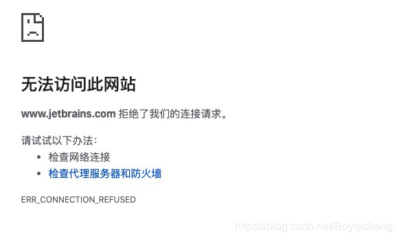
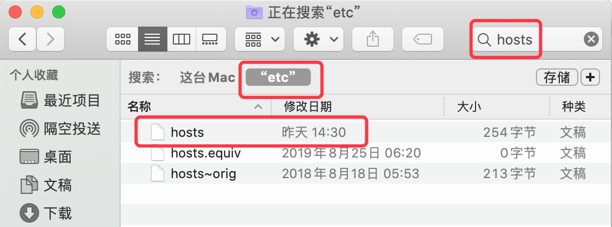

## 1.问题现象

Mac 访问 `www.jetbrains.com` 时无法访问，出现下图中的错误提示：



但是，同一局域网下使用手机或其他电脑可以正常打开该网站。

## 2.解决方案

### 2.2.1 取消代理 

先按照上图中的错误描述，检查网络设置和浏览器中是否有设置代理，如果有代理则关闭后再做尝试。如果没有设置代理，则继续执行 2.2.2 中的内容。

### 2.2.2 修改 hosts 文件

如果关闭相关代理之后依旧无法打开，则可能是 hosts 中做了限制（通常是因为破解 jetbrains 家族的产品时修改的）。接下来就需要取消这些限制，具体步骤如下：
	
* 打开终端，并执行命令 `open /private/etc` （该命令的作用是打开存放 hosts 文件的目录)
* 然后按照下图的方式在该目录下搜索 `hosts` 文件 
* 将该 hosts 文件复制到桌面或其他位置，然后用文本编辑器或其他工具打开该文件，删除其中的如下信息：

```
0.0.0.0 account.jetbrains.com
0.0.0.0 www.jetbrains.com
0.0.0.0 https://account.jetbrains.com:443
```

* 将修改后的 hosts 文件放到 `open /private/etc` 目录下，替换原有的 hosts 文件。（替换时可能会弹窗要求输入系统管理员密码）

按照如上步骤操作完成之后，该网站即可正常打开。

## 3.参考

[Mac www.jetbrains.com 拒绝了我们的连接请求](https://blog.csdn.net/boyqicheng/java/article/details/98172464)
