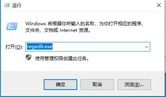

`sc delete` 拒绝访问，原因是当前用户的权限不足，需要做的是在注册表

`
HKEY_LOCAL_MACHINE\Software\Microsoft\Windows\CurrentVersion\Policies\System\EnableLUA` 的值改为 `0`

把这个值改成0，这样在自己的电脑上操作才是真正的 administration

Win10 系统下， 按下 Win + R 快捷键，然后按照下图输入 `regedit.exe`，即可打开注册表编辑器：

