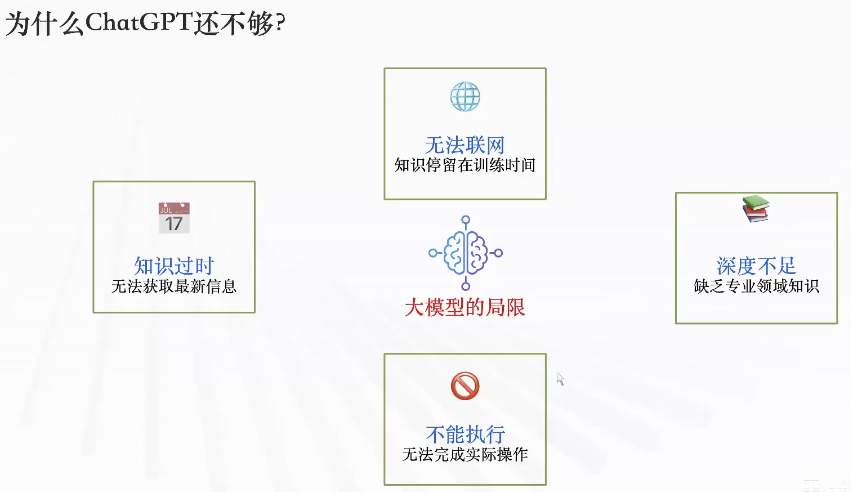
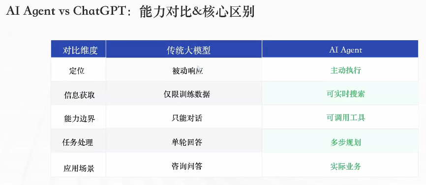
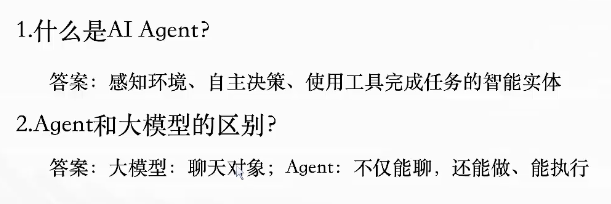
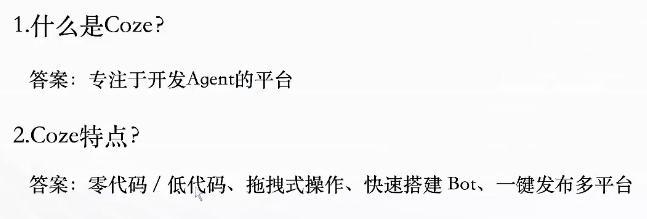
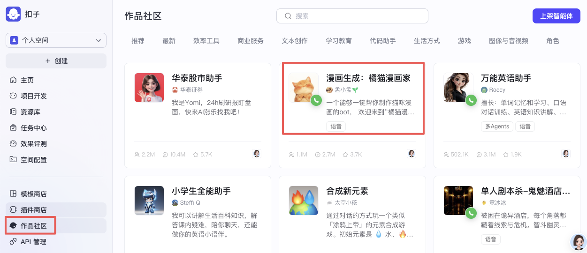
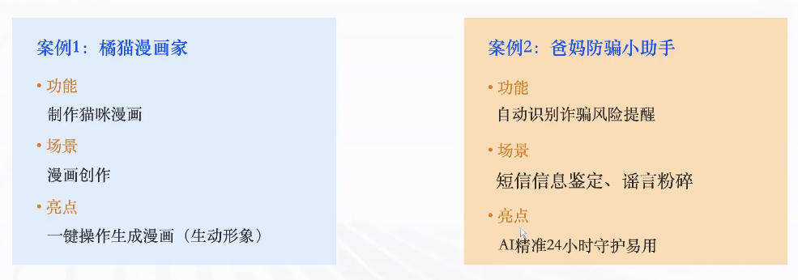
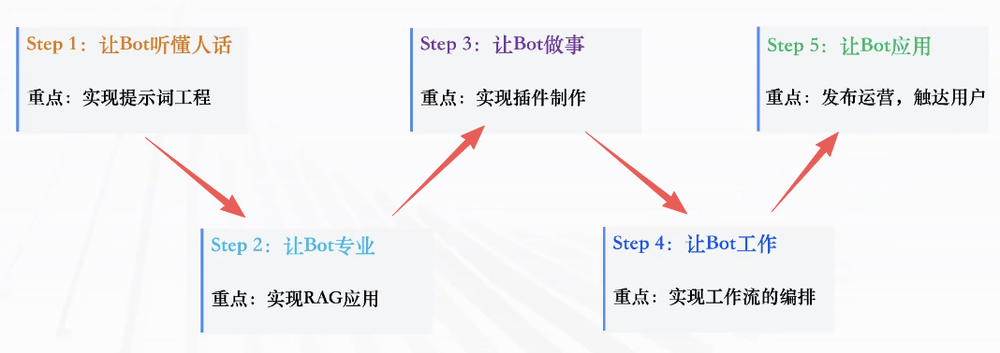

# 1. 01-Agent入门

## 1.1. Agent 入门

[点击查看视频](https://www.bilibili.com/video/BV12omoB4ExF/?p=2)

### 1.1.1. 为什么 ChatGPT 等大模型还不够：

### 1.1.2. Agent 和 传统大模型的能力对比和区别：

### 1.1.3. 总结：

## 1.2. Coze 零代码开发智能体（bot）

[点击查看原视频](https://www.bilibili.com/video/BV12omoB4ExF?vd_source=52532367532c4237b88b472159331d19&p=3)

这里所说的 `智能体` 即 `bot` : 英 `/ bɒt /`  美 `/ bɑːt /`，机器人程序；机器人 。

## 1.3. Agent 案例体验演示

[点击查看原视频](https://www.bilibili.com/video/BV12omoB4ExF?p=4)

### 1.3.1. 案例演示

从 `作品社区` 中选取了两个案例进行试用。

### 1.3.2. 如何构建自己的智能体

