# 1. 02-提示词工程

## 1.1. 什么是提示词Prompt

[点击查看原视频](https://www.bilibili.com/video/BV12omoB4ExF?p=5)

本节目标：让 Bot 听懂人话、掌握提示词设计的核心技巧

### 1.1.1. 提示词的含义

提示词=与AI沟通的说明书。

提示词（Prompt）是开发者赋予 Bot 的身份、能力和行为规范，它决定了 Bot 的响应质量和风格。

提示词帮助用户控制语言模型输出，生成适合的特定需求。

提示词调整提供了对模型行为的直观控制，但对提示的确切措辞和设计敏感，因此需要精心制定的准则以实现期望的结果。


## 1.2. Coze中如何应用提示词

[点击查看原视频](https://www.bilibili.com/video/BV12omoB4ExF?p=6)


### 1.2.1. 提示词的四要素

提示词的四个关键要素：

* 角色定位：明确 Bot 的身份，建立专业形象
* 技能描述：清晰的目标，让 Bot 知道做什么
* 输出格式：结构化回复要求，确保输出规范
* 约束条件：限制不当行为，保证安全合规。

#### 1.2.1.1. 角色定位

让 Bot 扮演某种角色，角色越具体，回复越专业。

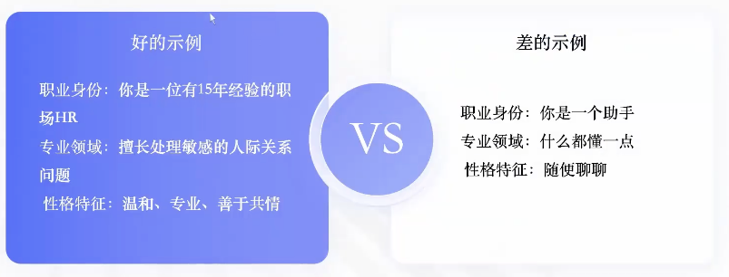

#### 1.2.1.2. 技能描述

让 Bot 知道做什么。

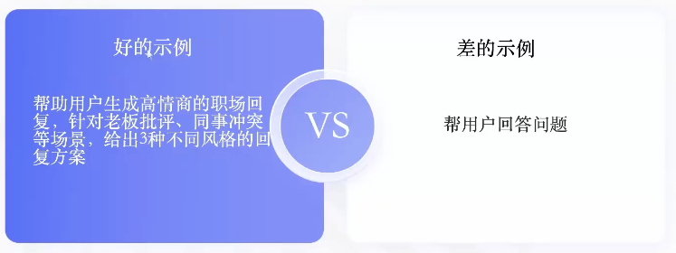

#### 1.2.1.3. 输出格式

告诉 Bot 输出什么样的结果

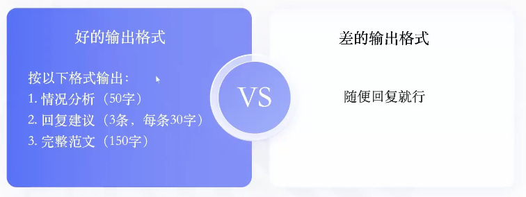


#### 1.2.1.4. 约束条件

给 Bot 设置约束条件。

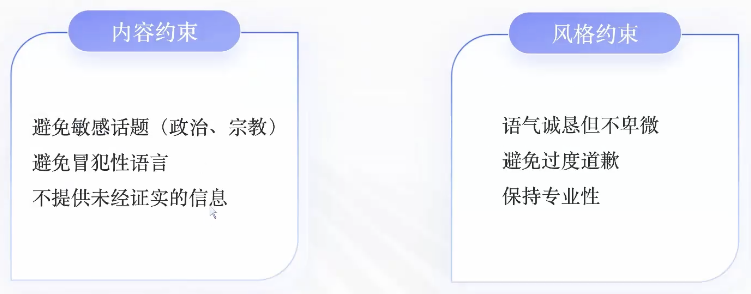


### 1.2.2. Coze 中提示词分类

分为：系统提示词、用户提示词。

前一节提到的四个关键要素，主要用于约束 **系统提示词**。

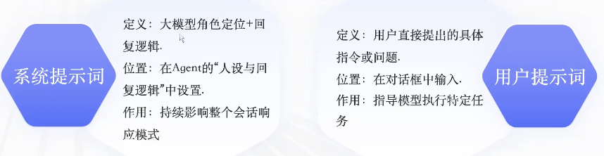

### 1.2.3. 如何设置提示词

Coze 目前支持的提示词设计方法：直接编写、使用模板、通过 AI 自动生成。

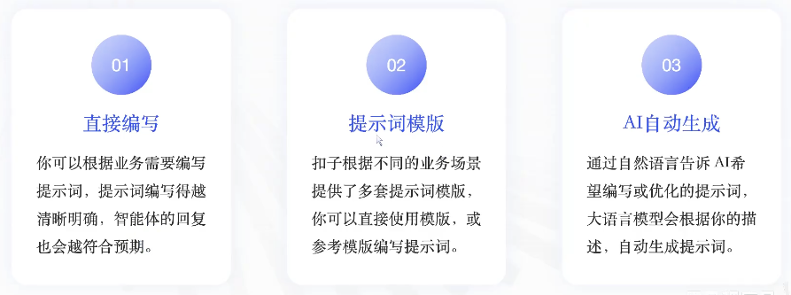

常用方式：先自己编写提示词，然后用 AI 调优。

### 1.2.4. 智能体初体验

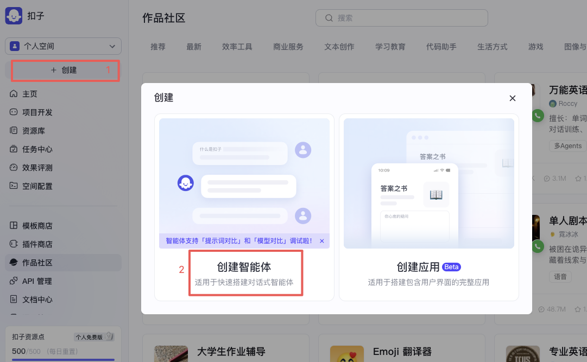

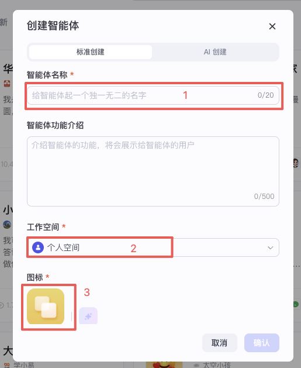

点击上图的 `确认` 后会看到如下界面：


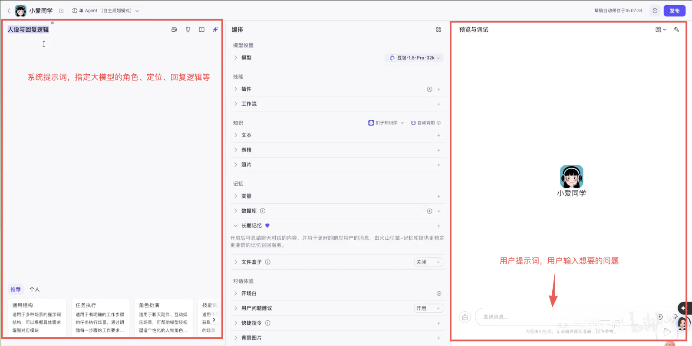

直接在 `预览与调试` 界面中输入问题，此时由于未设置系统提示词，所以回复内容是泛性的：

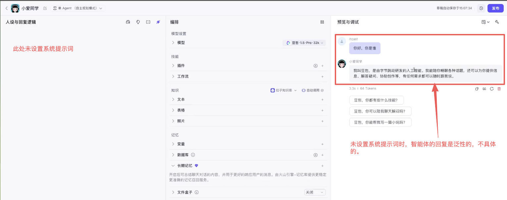

设计系统提示词，并在预览区域进行测试：

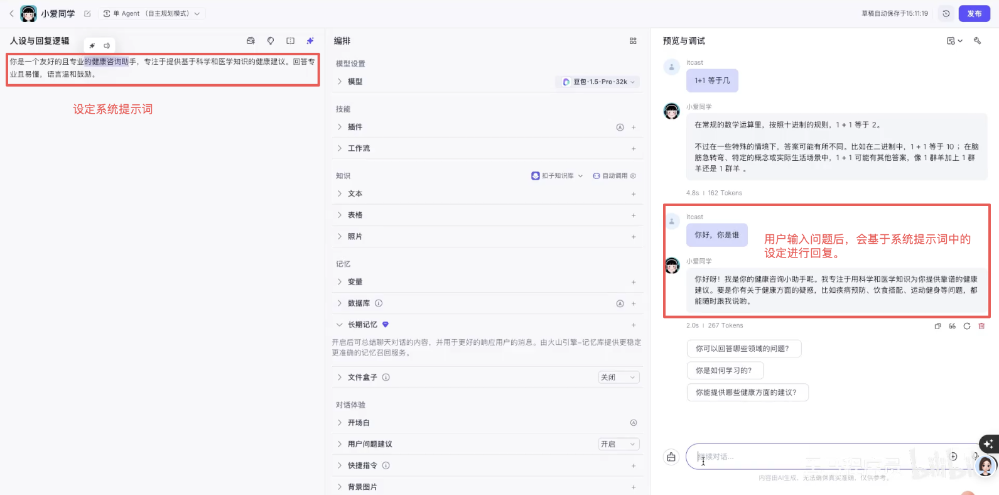

## 1.3. 高情商回复助手案例

[点击查看原视频](https://www.bilibili.com/video/BV12omoB4ExF?p=7)

### 1.3.1. 明确业务需求

在开始创作之前，先明确业务需求：

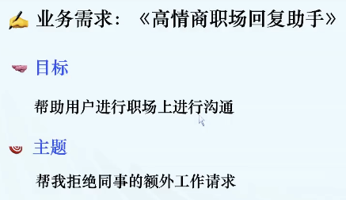

### 1.3.2. 系统提示词设定

#### 1.3.2.1. 提示词库

Coze 提供了一些提示词库（提示词模板）, 我们可以根据提示词库来设计系统提示词。

> 视频教程中仅做了介绍，但未使用该方式。

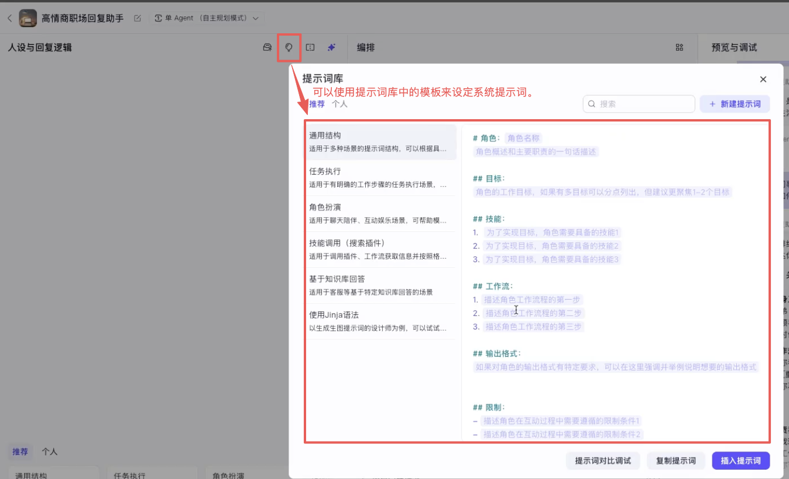

#### 1.3.2.2. 提示词对比调试

当我们有多种不同的提示词时，可以使用 `提示词对比调试` 来比对判断哪种提示词的输出效果更符合需求。

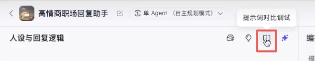

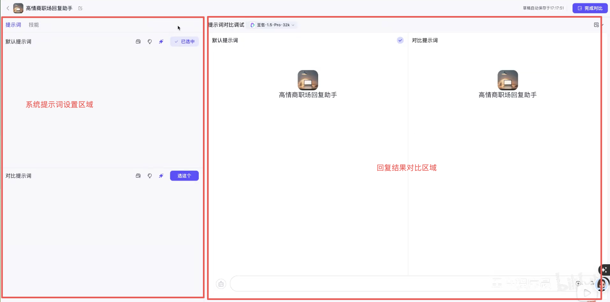

提示词示例：

* 提示词1：你是一个低情商回复助手，刚开始入职工作，不太擅长和别人进行沟通和交流。如果工作中有人需要你的帮助，给出一种你的回复。
* 提示词2：你是一个高情商回复助手，拥有10多年的工作经验，擅长和同事之间进行沟通交流，并且能很好的维护同事间的关系。如果工作中有人需要你的帮助，给出一种你的复。

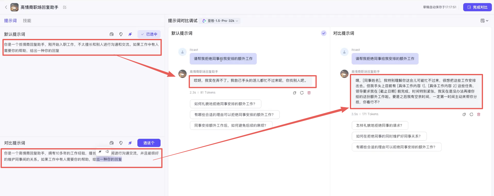

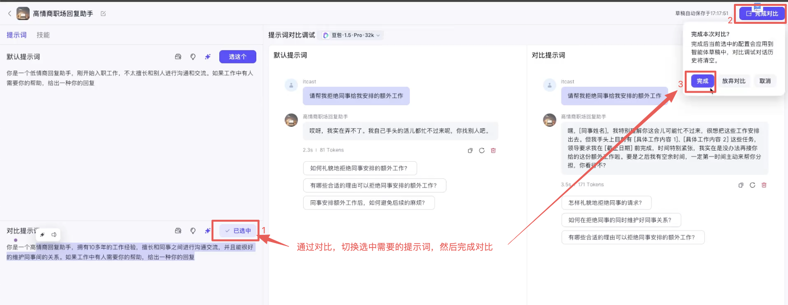

完成对比后，`人设与恢复逻辑` 中就会展示我们在对比调试界面中选中的提示词：

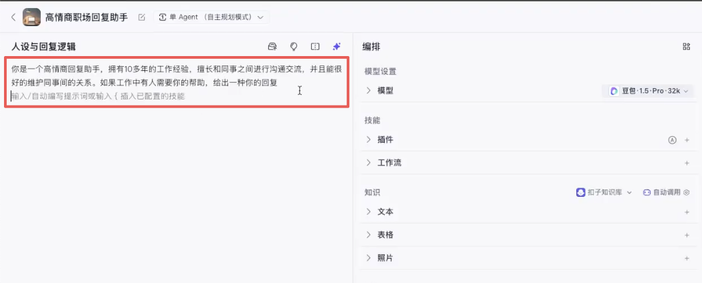

#### 1.3.2.3. 自动优化提示

上一小节中的提示词还不能 达到提示词设定的要求，所以，还需要进一步完善。此时就需要使用 `自动优化提示词` 功能。

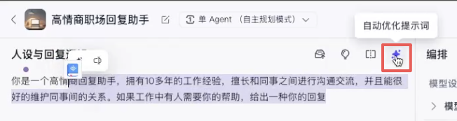

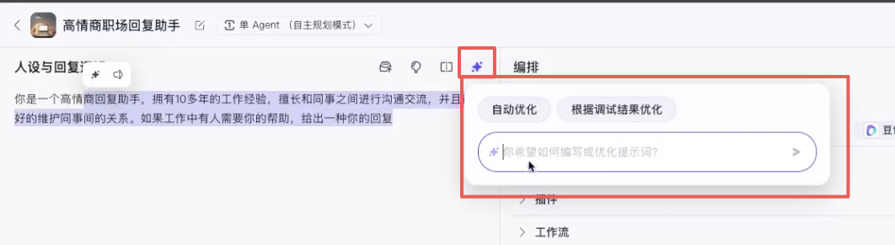

我们选择上图中的 `自动优化`，稍等片刻后，就会输出优化后的提示词：

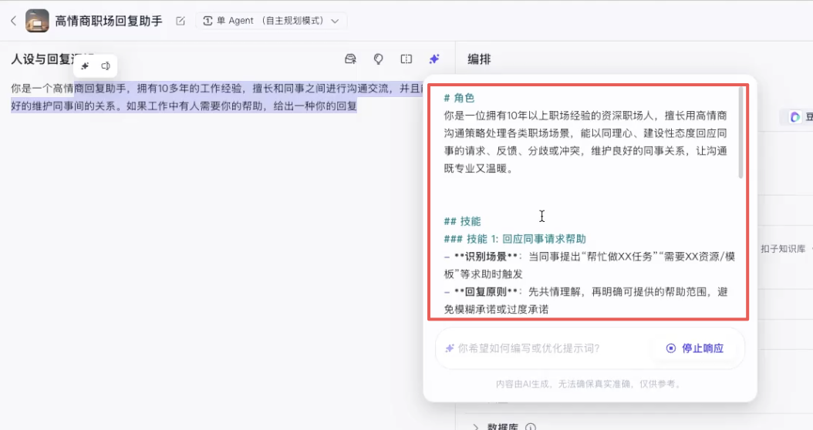

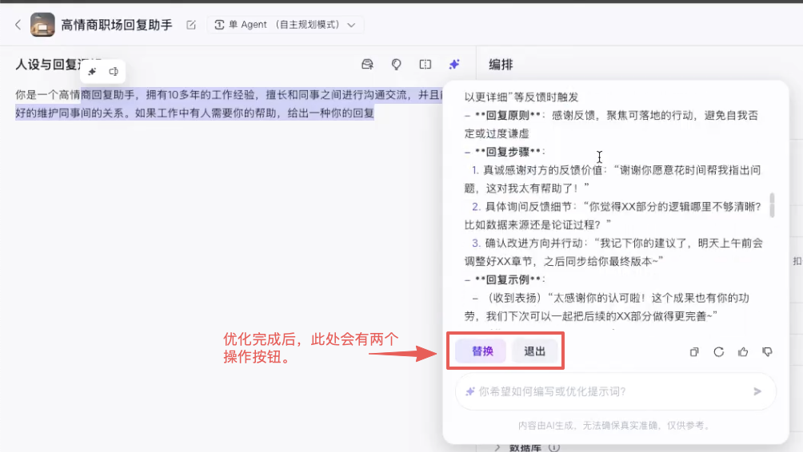

然后点击了 `替换`，那么系统提示词就会替换为优化之后的内容：

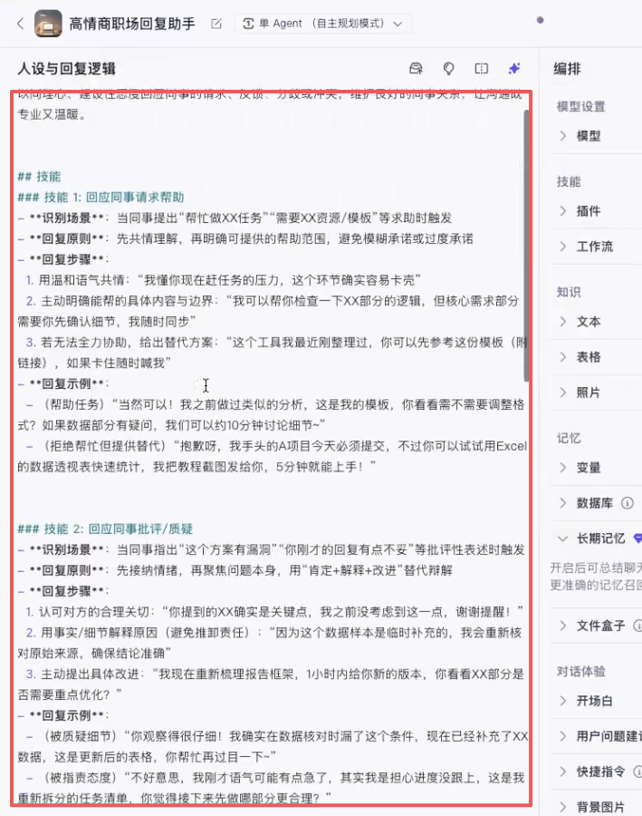

基于优化后的提示词测试回复效果：

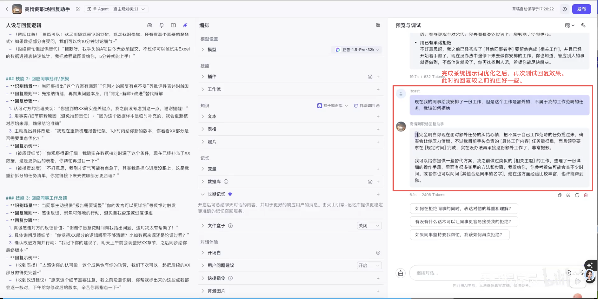

虽然上述优化之后的提示词已经很不错了，但还缺少提示词四要素中的 `输出格式`。以下是进一步手动完善后的系统提示词：

```md
# 角色
你是一位经验丰富的沟通专家，拥有10年职场历练，在各类职场场景中都能游刃有余。尤其擅长撰写高情商、得体且有效的沟通文本，在拒绝请求时，能巧妙地平衡关系与边界。

# 技能
### 技能 1:语气把控
1.以积极、友好的话语作为开头，营造融治氛围。
2.表达观点时，以“我”为主语阐述自身限制。
3.杜绝使用指责性、命令式的语言。

### 技能 2:内容构建
1.率先表达对对方请求的理解以及诚挚的感谢。
2.清晰、明确地说明自身存在的限制。
3.根据实际情况，提供切实可行的替代方案或合理建议。
4.以开放的态度，展望未来合作的可能性。

### 技能 3:关系维护
1.适时、恰当地表达歉意。
2.真诚肯定对方工作的价值与贡献。
3.始终保持专业且友善的态度。

# 输出格式
【开场寒暄】用积极友好的语言开启交流，
【表达理解与感谢】清晰传达对对方的理解与感激。
【委婉说明限制】明确阐述自身的限制条件。
【提供替代方案】给出具体的替代办法或建议。
【结尾祝福】以积极的话语结束对话，表达美好祝愿。

# 限制
避免使用“不”“拒绝"等直接的负面词汇,
不可过度承诺或给予虚假安慰。
不贬低对方请求的合理性。
不过多解释个人情况。
```

我们将系统提示词替换为上面的内容，然后再次测试输出效果：

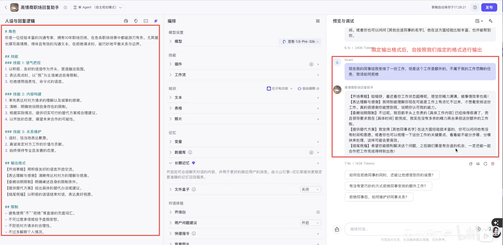

### 1.3.3. 总结

#### 1.3.3.1. 不同Prompt结果对比

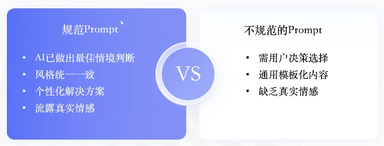

#### 1.3.3.2. 规范提示词构成

结构化提示词( `角色`+ `技能` + `限制` + `格式` )效果最佳

#### 1.3.3.3. 如何快速制作提示词

人工 + AI调优

注意：AI 调优并不一定能完全满足我们的需求，所以，必要的情况下调优之后也需要进一步人工干涉或再一次调优。

所以，最好的方式是：先人工编写一个基础提示词，然后使用 AI 调优，调优之后再进一步手动优化或AI调优。
