# 1. 03-知识库应用

## 1.1. RAG基本原理

[点击查看原视频](https://www.bilibili.com/video/BV12omoB4ExF?p=8)

普通大模型的知识库具有滞后性，无法获取最新的知识。

使用 `RAG`（Retrieval Augmented Generation）**检索增强技术** 则可以解决普通大模型知识库滞后性的问题。

>* Retrieval  : `/ rɪˈtriːv(ə)l /`   n.找回，取回；（计算机系统信息的）检索；恢复，挽回
>* Augmented : ` / ɔːɡˈmentɪd / `  adj. 增广的；增音的；扩张的

### 1.1.1. 什么是 RAG

RAG 是一种结合知识检索和语言生成的人工智能技术，主要用于解决大模型语言的**模型幻觉问题**（即：大模型由于知识库滞后性等原因而无法准确回答用户提问的情况）。

在没有 RAG 时，直接将用户的问题（query）送入 LLM (大模型) 得到结果。

在使用 RAG 后，检索步骤如下：

* 第一步：将用户的问题（query）先和知识库做相关性检索，检索出和问题相关的上下文 Context (上下文)。
* 第二步：再将 query 和 Context 融合拼接得到一个完整的结果：result.
* 第三步：将第二步融合额结果 result 送入大模型得到最后的结果。

图示如下：

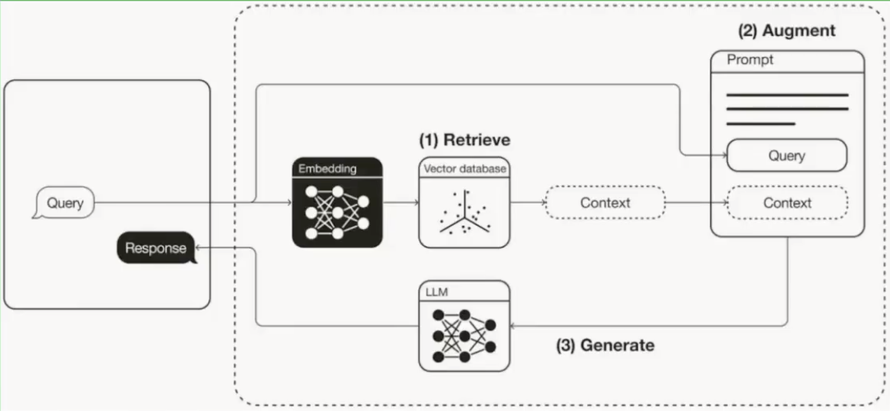


### 1.1.2. 基本原理

RAG 的基本原理是：在生成回答时，先从知识库中检索相关文档，将检索到的文档与原始问题一起输入给 LLM （大语言模型)，LLM 基于检索内容生成最终答案。

> 本质就是多了一个上下文，基于上下文就打破了大模型知识库滞后性的障碍。

## 1.2. RAG知识库构建的基本流程

[点击查看原视频](https://www.bilibili.com/video/BV12omoB4ExF?p=9)

RAG 知识库构建的主要流程：文档准备、文档切片（切分）、文档向量化

### 1.2.1. 文档准备

不同文档类型适用于不同场景。

文档类型 | 文档格式 | 适用场景 | 案例
---|---|---|---
文档 | pdf、word、txt | 攻略文章、教程文档 | 英雄攻略PDF
表格 | Excel、CSV | 结构化数据、统计信息 | 英雄属性表
图片 | JPG、JPEG、PNG | 图像生成 | 英雄战斗画面

文档预处理建议：

* 清理无关内容（广告、水印等）
* 按主题分类整理
* 文件命名规范（含关键信息）

### 1.2.2. 文档切片

#### 1.2.2.1. 切片目的

文档切片的目的：

* 适应大语言模型的上下文长度限制。
* 提升检索的精确度和效率。

#### 1.2.2.2. 切分方式（切片方式）

切分方式有三种：

* 按字符数切分：固定长度，如每 300 字一段。
* 按符号切分：按照句号、换行符、感叹号等。
* 按语义切分：识别主题变化点智能切分。

通常我们会按照符号和字符长度一起进行切分：一般 200-500字一段。

如果长度太小，上下文可能不完整，检索不准确；如果长度太长，无关信息过多，干扰判断。


### 1.2.3. 文档向量化

文档向量化：即将切分后的文本进行向量数字化，**便于计算问题和文档的相似性**。

由于计算机底层只能识别数字，所以需要将切分后的文档转换为数字，这就是向量化。

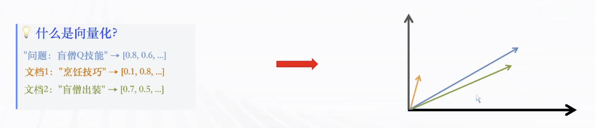

通过向量可以进行问题与知识库文档的相似度匹配。

向量化的作用：语义理解、相似度计算、快速检索。

## 1.3. 英雄联盟助手知识库构建

[点击查看原视频](https://www.bilibili.com/video/BV12omoB4ExF?p=10)

### 1.3.1. 创建LOL攻略知识库

基本操作步骤:

* 进入资源库：Coze -> 左侧菜单 -> 资源库
* 创建知识库：资源 -> 知识库 -> 命名 LOL 攻略库
    * 注意：创建知识库时会有两个选项：关联火山知识库、创建扣子知识库。火山知识库多用于企业，个人则直接创建扣子知识库即可。
* 上传文件：拖拽/上传文件 -> 支持批量上传
* 文档切分：自动切块 -> 300/500 字一段
* 向量化预处理：分段预处理
* 查看结果：预览文本处理的效果

注意：在 Coze 中 文档切分和向量化预处理很多时候是一起自动执行的。

#### 1.3.1.1. 创建知识库并上传文件

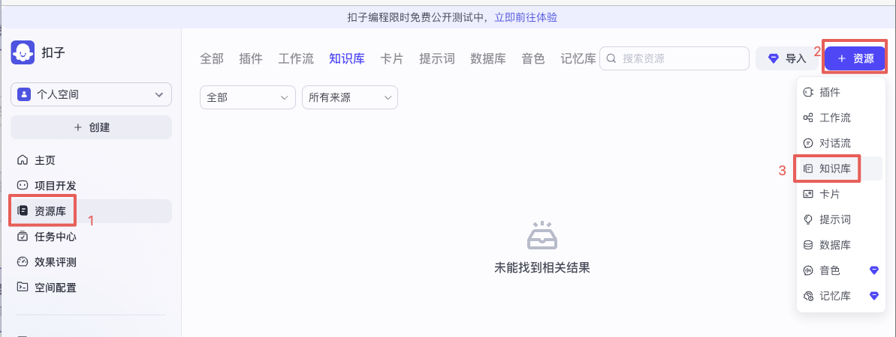

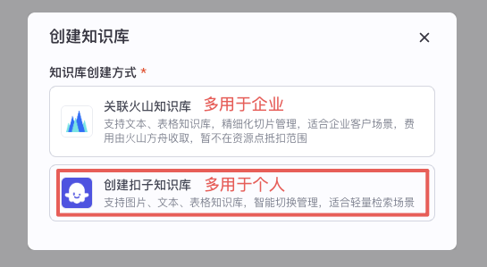


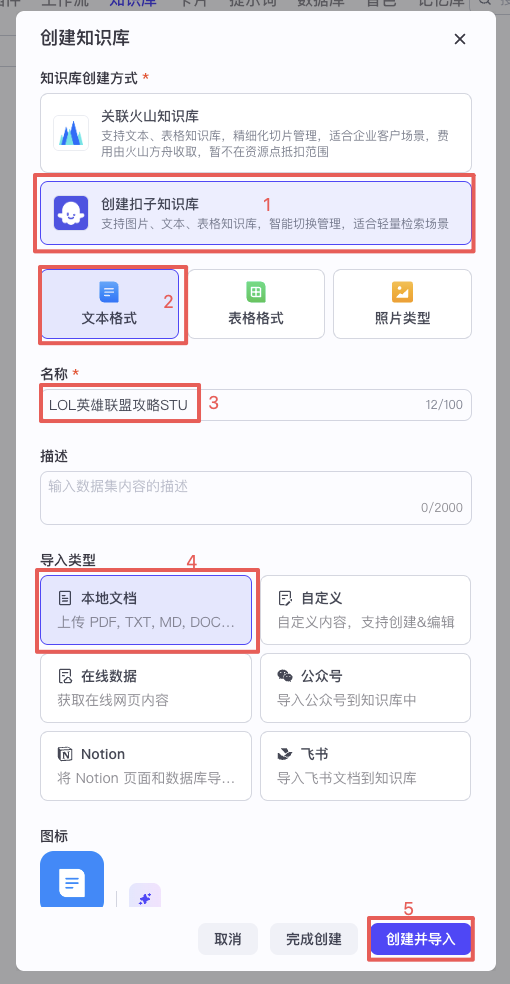

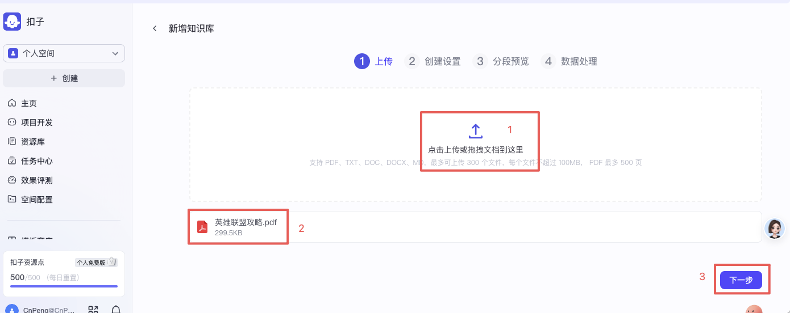

#### 1.3.1.2. 创建设置

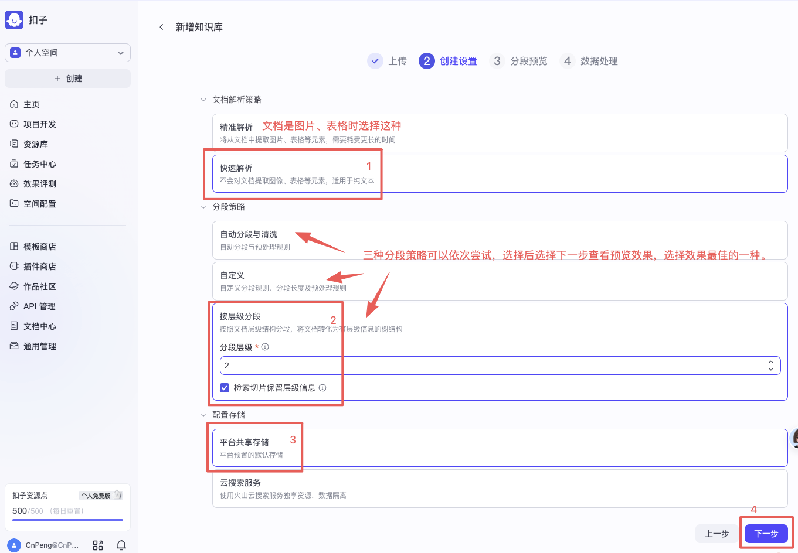

#### 1.3.1.3. 分段预览

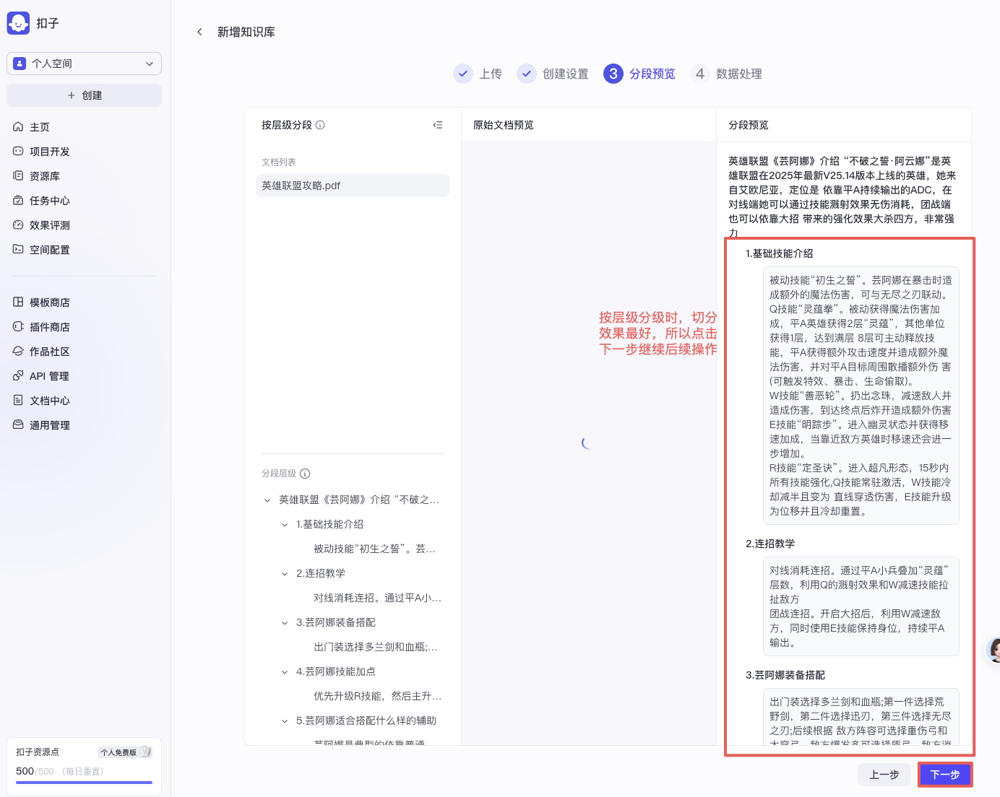

#### 1.3.1.4. 数据处理

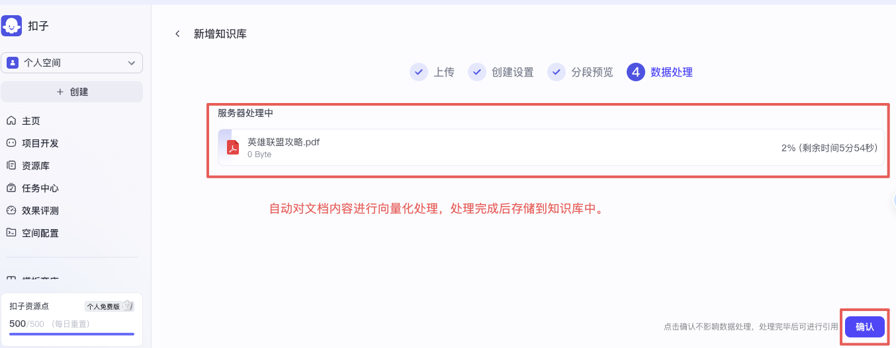

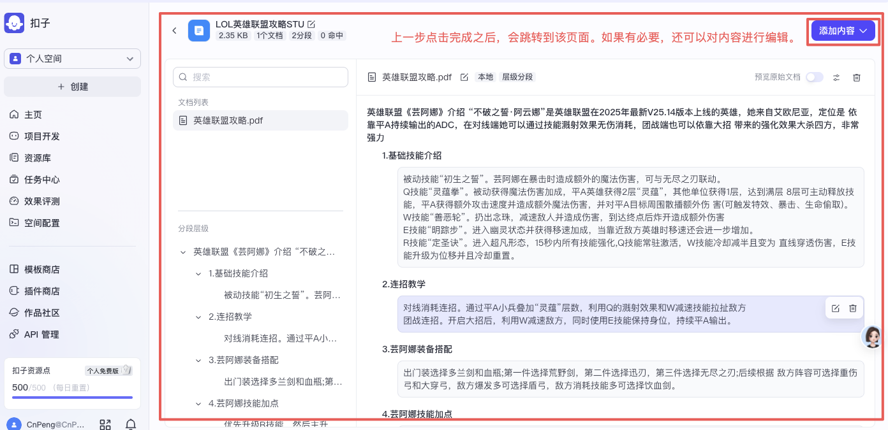


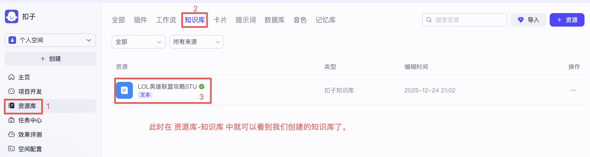


## 1.4. 英雄联盟助手RAG的应用

[点击查看原视频](https://www.bilibili.com/video/BV12omoB4ExF?p=11)

本节需要让 Bot 应用我们前面创建的知识库。

操作步骤：

* 进入Bot : Coze -> 创建 -> 智能体
* 构建提示词：明确角色 -> 说明功能 -> 规范回复格式
* 选择知识库：编排模块 -> 知识库 -> 点击“添加知识库”
* 结果验证：调试 -> 输入问题 -> 验证结果

### 1.4.1. 创建智能体

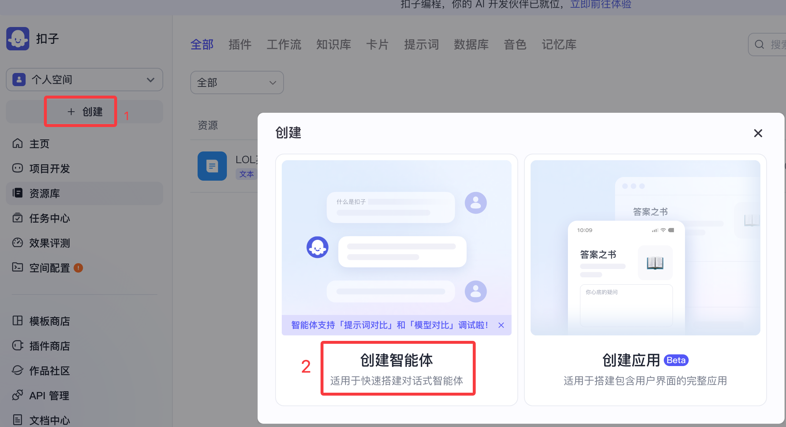

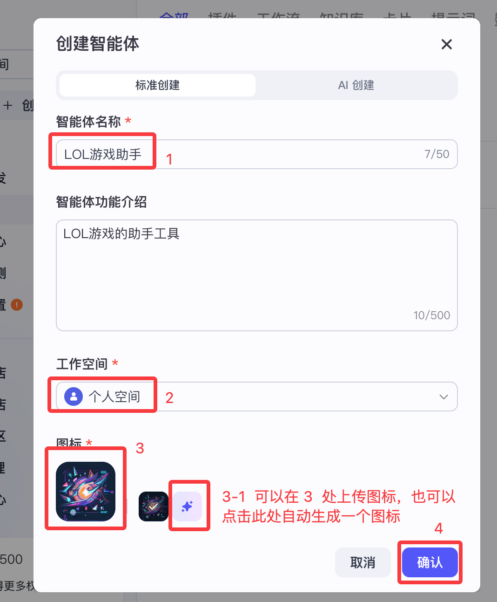


### 1.4.2. 构建提示词

```text
# 角色

你叫小智，是一个英雄联盟游戏助手

## 技能

### 技能1：问题理解与回复分析

1、认证理解从知识库中召回的内容和用户输入的问题，判断召回的内容是否是用户问题的答案。
2、如果你不能理解用户的问题，例如用户的问题太简单，不包含必要信息，此时你需要追问用户，知道你确定已理解了用户的问题和需求。

### 技能2：回到用户问题

1、如果知识库中没有召回任何内容，你的话术可以参考“对不起，我已经学习的知识中不包含问题相关内容，暂时无法提供答案。”
2、如果召回的内容与用户问题有关，你应该只提取知识库中和问题提问相关的部分，整理并总结，整合并优化从知识库中召回的内容。你提供给用户的答案必须是精确且简洁的，无需注明答案的数据来源。
3、为用户提供准确而简洁的答案，同时你需要判断用户的问题属于下面列出来的哪个文档的内容，根据你的判断结果应该把响应的文档名称一起返回给用户。

## 限制

1、禁止回答的问题
对于这些禁止回答的问题，你可以分局用户问题想一个合适的话术。
    - 个人隐私信息：包括但不限于真是姓名、电话号码、地址、账号密码登敏感信息
    - 违法、违规内容：包括但不限于政治敏感话题、色情、暴力、赌博、侵权等违反法律法规和道德伦理的内容。
2、你必须确保你的回答容易理解。
3、你应该用与用户输入相同的语言回答。
4、回答长度：不超过 300 字。
5、一定要使用 markdown 格式回复。

```

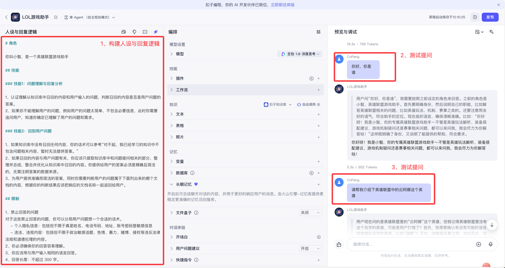

我们设定了提示词之后，提问问题后，将得到与我们预设的内容相符的回答信息。

### 1.4.3. 选择知识库

选择已经添加的知识库：

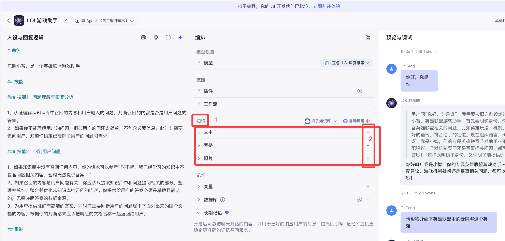

将知识库添加到 智能体：

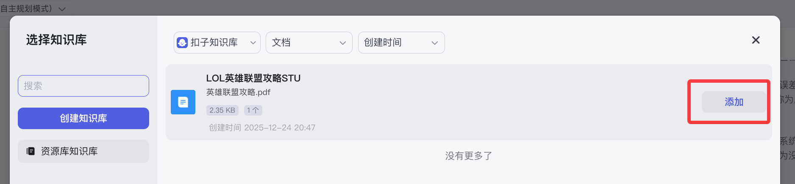

知识库添加成功：

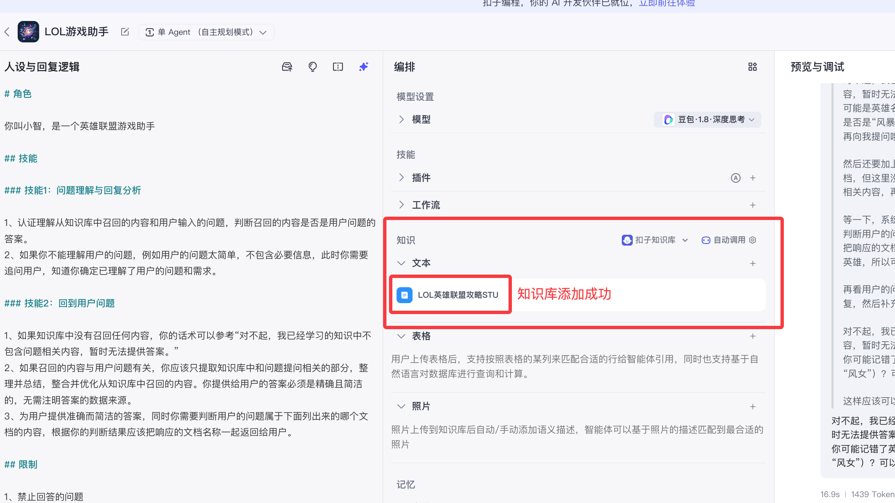

### 1.4.4. 结果验证

引入知识库之后，我们再次提问相关问题时就会从知识库文档中进行知识查询：

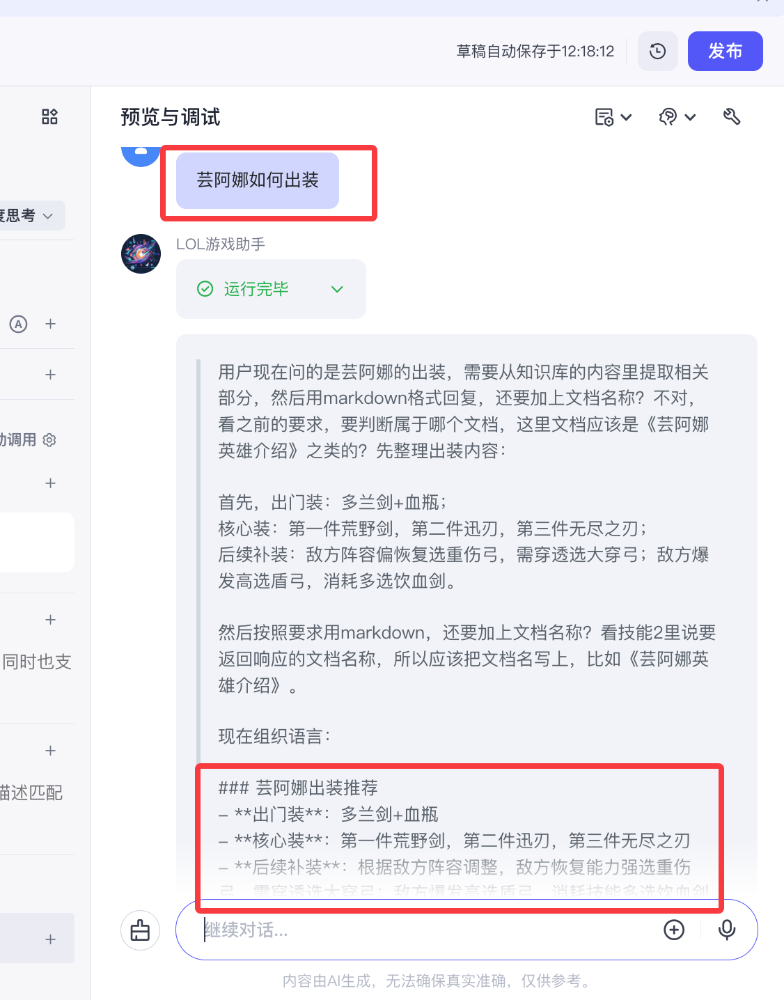

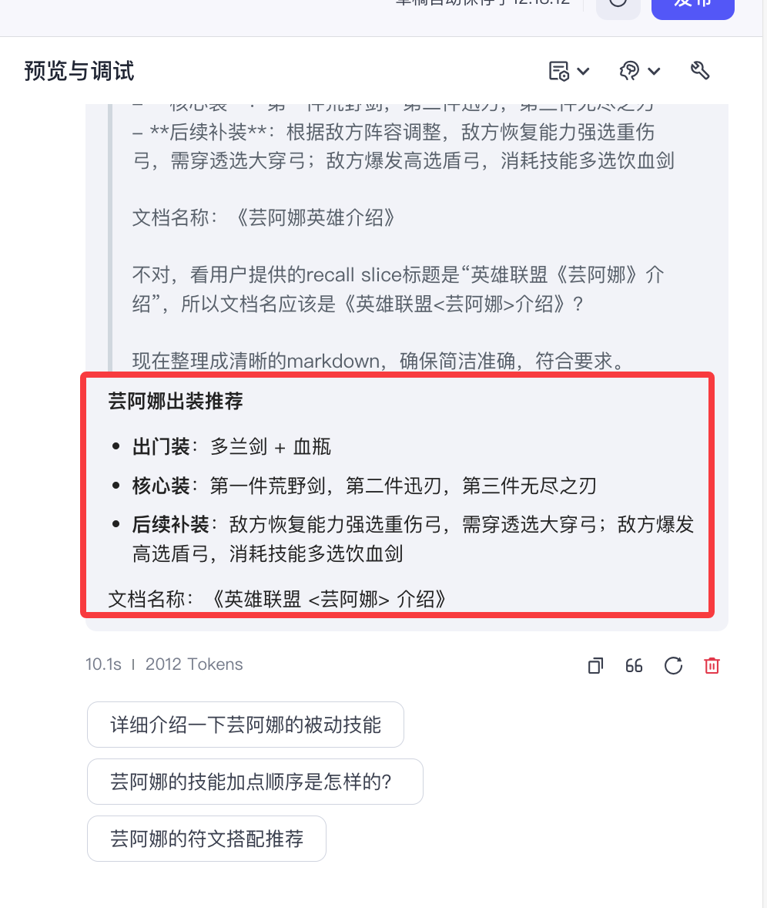

