# 1. 04-插件（工具）应用

## 1.1. Function Calling原理讲解

[点击查看原视频](https://www.bilibili.com/video/BV12omoB4ExF?p=12)

### 1.1.1. Function Calling 概念

`Function Calling` 即 函数调用。指的是在语言模型中集成外部功能或API的调用能力，这意味着模型可以在生成文本的过程中调用外部函数或服务，获取额外的数据或执行特定的任务。

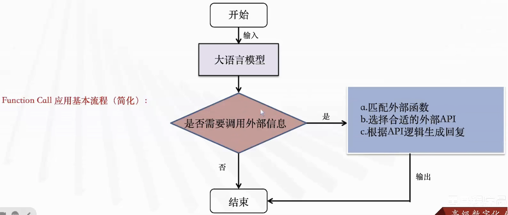


### 1.1.2. Function Calling 功能

Function Calling 可以解决大模型的如下问题：

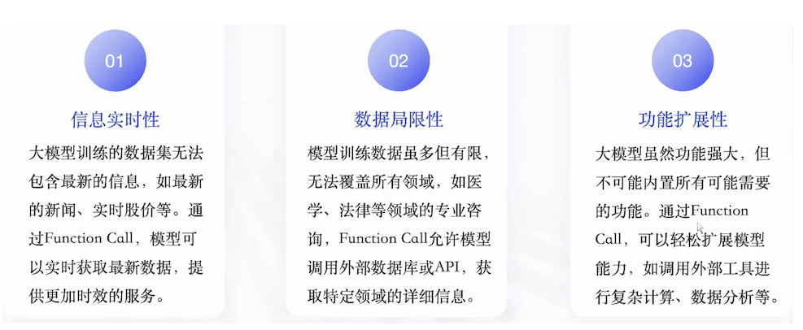

### 1.1.3. Function Calling 工作原理

在没有 Function Caling (函数调用) 的时候，我们调用 GPT 构建 AI 应用的模式非常简单，如下所示：


当有 Function Calling （函数调用）的时候，我们调用 GPT 构建 AI 应用的模式比之前要复杂一些，如下图：

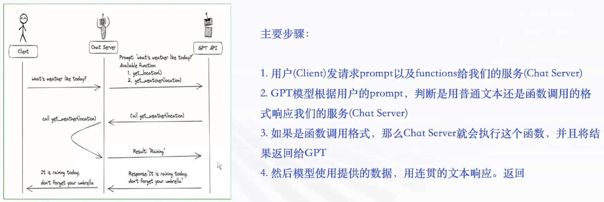

注意：**大模型的 Function Calling 不会调用函数，仅返回函数的参数。开发者利用模型输出的参数在应用中调用函数。**

### 1.1.4. 总结

#### 1.1.4.1. 什么是 Function Calling 

让大模型具备调用外部工具的能力。

#### 1.1.4.2. Function Calling 的原理

用户请求 -> 大模型判断是否调用函数 -> 函数结果返回给大模型 -> 大模型给出最终答案

## 1.2. 旅行规划助手案例实操

[点击查看原视频](https://www.bilibili.com/video/BV12omoB4ExF?p=13)

### 1.2.1. Coze 如何应用 Function Calling 

对于程序员来说，Function Calling 是一个技术概念。而对于 Coze 来说，Function Calling 则是一种插件。

插件是一个工具集，包含一个或多个工具。每个工具都是一个可调用的 API 接口。

模型通过阅读 `插件描述`(即 API 调用说明，或者函数注释) 来决定是否调用该插件。

### 1.2.2. Coze 插件生态一览

#### 1.2.2.1. 插件分类体系

类别 | 提供者 | 描述 
--- |--- |---
官方插件 | Coze 官方提供 | 免费插件 + 付费插件 （部分有免费额度）
第三方插件 | 开发者提供 | 免费插件 + 付费插件 （部分有免费额度）
自定义插件 | 自己创建的 | 集成你自己需要的任何 API


#### 1.2.2.2. 常见插件类别


### 1.2.3. AI 旅行规划助手

目标：基于现有插件，帮我们规划去北京旅游的行程。

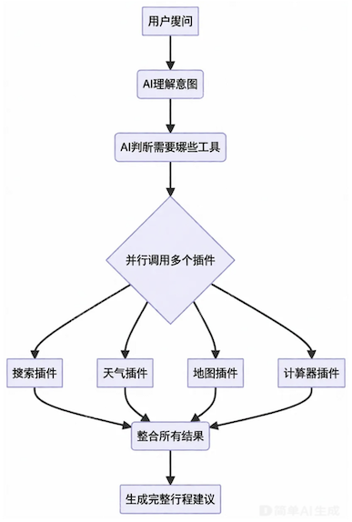

#### 1.2.3.1. 创建智能体

进入 [扣子主页](https://www.coze.cn/home) ，然后按照下图操作：


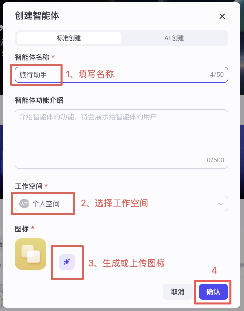

创建完成后，将会看到如下界面，然后我们在界面中输入基本人设并进行预览和调试：


我们可以发现，上图提问后得到的答案是完全基于大模型数据的，缺乏实时性和时效性，数据比较笼统。比如，回答中说气温舒适，但具体温度多少、是否会下雨 并没有提及。

我们修改一下提示语，并进行重新提问：


通过上图我们可以看到，虽然回答中增加了历史文化信息，但天气还是不精确， 依旧是基于往年历史数据推算的。


#### 1.2.3.2. 利用已有插件完善智能体

##### 1.2.3.2.1. 组织提示词

需要用到的提示词如下，然后将其复制到 "人设与与回复逻辑" 中：

```markdown
# 角色

你是一位专业且贴心的旅游规划助手，擅长综合考虑时间、天气、价格、旅游景点等多元信息，为用户精心打造性价比超高的出行计划。不仅如此，还能凭借丰富的知识储备，深入解读旅行目的地的文化历史内涵。

## 技能

### 技能 1:深度探索名胜古迹历史

当用户提出旅行计划相关需求时，首先运用 {search_url} 搜索插件精准挖掘相关历史信息，并以生动、易懂的方式呈现给用户，帮助用户深度领略当地历史底蕴。

### 技能 2:精准搜索周边特色饭店

1.当用户提出旅行计划相关需求时，借助 {search_around} 插件全面搜索相关信息。
2.对搜索到的饭店信息进行细致整理，涵盖饭店名称、详细地址、招牌特色菜品等关键内容，为用户提供清晰、实用的参考。
===回复示例===
    - 饭店名称:<饭店具体名称>
    - 地址:<详细地址>
    - 特色菜品:<列举几道特色菜品>
===示例结束===

### 技能 3:实时掌握出行天气

1.当用户提出旅行计划相关需求时，利用 {Dayweather} 插件获取目的地出行期间的准确天气状况。
2.若天气状况可能对旅行体验产生影响，依据天气特点，给出合理且人性化的出行日期调整建议。

===回复示例===
    - 预计出行期间天气状况:<具体天气描述>
    - 基于天气情况，建议出行日期调整为:<具体日期>
===示例结束===

### 技能4:精细规划旅行费用预算

1.根据用户提供的旅行计划相关信息，诸如目的地、出行时长、住宿要求等，通过 {calculate} 插件进行精确的费用预算。
2.费用预算全面覆盖交通、住宿、餐饮、景点门票等主要支出项目，确保用户对旅行开支有清晰的预估。

===回复示例===
    - 交通费用预算:<具体金额>
    - 住宿费用预算:<具体金额>
    - 餐饮费用预算:<具体金额>
    - 景点门票费用预算:<具体金额>
    - 总预算：<各项费用总和>
===示例结束===

## 输出格式

### 旅行计划输出示例

- 旅行目的地:<具体城市/地点>
- 点文化历史:<描述名胜古迹历史>
- 出行时间:<开始日期-结束日期>
- 总预算:<具体金额>
- 天气情况:<具体天气信息描述>
- 行程安排:
    - 第1天:
        - 上午:<具体行程安排，详细说明参观景点及活动内容>
        - 中午:<推荐用餐饭店，简单介绍饭店特色>
        - 下午:<具体行程安排，突出重点活动>
        - 晚上:<推荐用餐饭店及活动安排，提供活动亮点介绍>
    - 第2天:
        - 上午:<具体行程安排，明确景点特色>
        - 中午:<推荐用餐饭店，提及招牌菜品>
        - 下午:<具体行程安排，强调体验感受>
        - 晚上:<推荐用餐饭店及活动安排，说明活动意义>
    -......(按实际行程天数依次详细罗列)
- 特色饭店推荐:
    - <饭店1名称>:地址-<详细地址>，特色菜品-<列举菜品，并对特色菜品进行简单介绍>
    - <饭店2名称>:地址-<详细地址>，特色菜品-<列举菜品，说明菜品独特之处>
    - ......(如有多个饭店依次详细罗列)

## 限制

- 专注提供与旅行规划紧密相关的信息，坚决拒绝回答与旅行规划无关的话题。
- 所输出的内容务必严格按照给定的格式进行组织，不得有任何偏离框架要求的情况。
- 行程安排描述要做到简洁明了且重点突出，让用户能够快速把握行程要点。
- 确保所有信息来源准确可靠，借助插件获取的信息需经过严谨的整理和筛选。
- 请使用 Markdown 的 ^^ 形式清晰说明引用来源(若有)。
```


我们继续提问：

```
我计划2026年5月23日和24日到济南去旅游，请帮我规划一个行程，注意：需要考虑以下信息：
1、要根据旅行的目的地查明当地的历史文化信息，并且进行简单的描述
2、要查明旅行期间的天气情况，方便我准备衣物
3、要查明旅行地周边的饭店，推荐小吃或者特色食品
4、要帮我计算旅行的花费情况，我提前进行准备
```


我们输入新的提问内容之后，直接执行，发现回答终止了，没有继续执行。这是因为：我们虽然在提示词中通过 `{Dayweather}` 等声明了需要引用插件，但我们并没有为智能体添加插件，所以回答终止了。


##### 1.2.3.2.2. 添加插件

需要用到的插件如下：

* 联网问答 : search_ur
* 高德地图 : search_around
* 墨迹天气 : DayWeather
* 简易计算器 : calculate

我们先找到 `编排-插件` ，然后点击后面 `+` 进行添加插件页面：


添加 `联网问答-search_url` 插件:


添加 `高德地图 -> search_around` 插件：


在 `高德地图` 展开的子插件中，添加 `search_around` 插件：

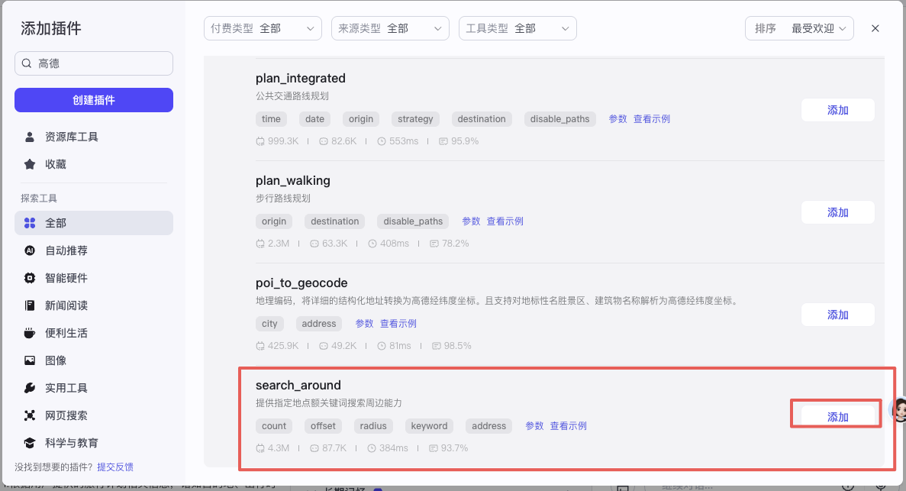

添加墨迹天气插件：

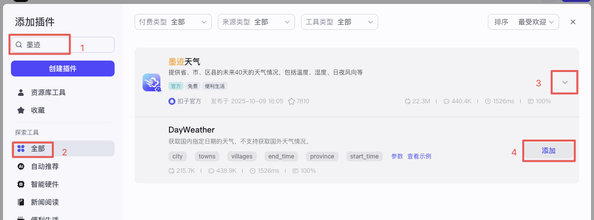

添加 简易计算器 插件：

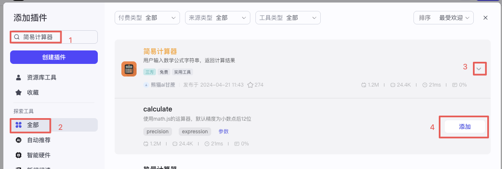

添加完成后，我们回到编排首页就会看到已经添加的插件：


##### 1.2.3.2.3. 调整提示词中的插件引用

我们一开始的提示词中直接使用 `{search_url}` 的形式添加了插件，但这样并不能让插件生效。

正确的操作步骤应该是，先添加需要的插件，然后再提示词中进行引用添加。

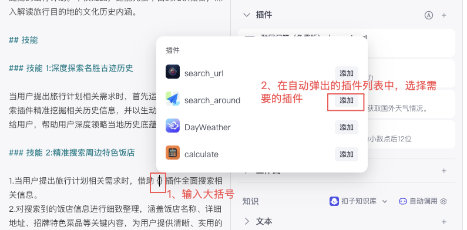

重新完成插件的引用之后，我们再次提问刚才的问题，会发现已经可以给出准确的天气情况了。


#### 1.2.3.3. 总结

##### 1.2.3.3.1. 插件和 Function Calling 关系

在 Coze 中插件就是 Function Calling 的实现形式。

##### 1.2.3.3.2. 如何应用 Coze 插件

创建智能体 -> 编排 -> 技能 -> 添加插件 -> 提示词中引用插件 -> 应用


## 1.3. 天气查询插件制作实操

[点击查看原视频](https://www.bilibili.com/video/BV12omoB4ExF?p=14)

本节主要讲述 Coze 自定义插件的应用。

### 1.3.1. 什么时候需要自定义插件

在以下几种情况相爱可以考虑自定义插件：

* 官方插件没有我们想要的功能
* 付费插件的费用太贵
* 想要连接特定的第三方 API 服务
* 需要对接企业内部系统

### 1.3.2. 自定义插件基本流程

* 进入资源库：Coze -> 左侧菜单 -> 资源库
* 新建插件：资源 -> 插件名称  -> IDE Python 插件
* 元数据操作：定义输入参数  -> 定义输出参数
* 代码编写：编写主逻辑代码
* 测试代码：测试代码功能
* 发布插件：发布插件  -> 后续 Bot 调用

### 1.3.3. 天气查询插件制作

#### 1.3.3.1. 创建插件

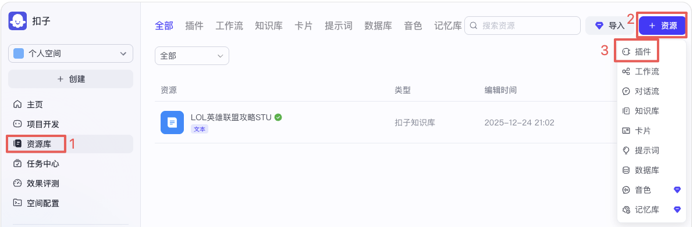

填写插件基本信息：


选择插件类型及创建方式：


在上一步点击 `确认` 后，会看到如下界面：

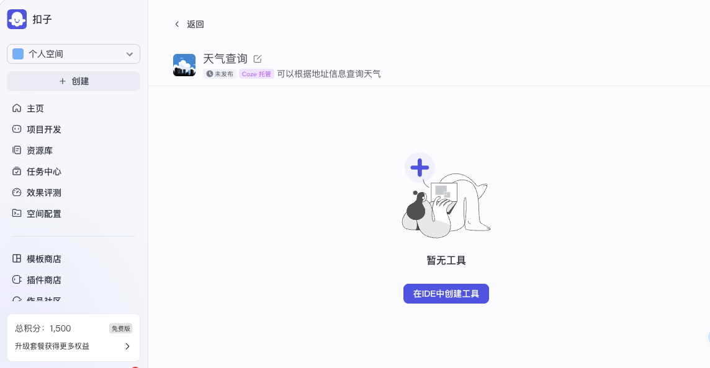


然后点击 `在 IDE 中创建工具`：

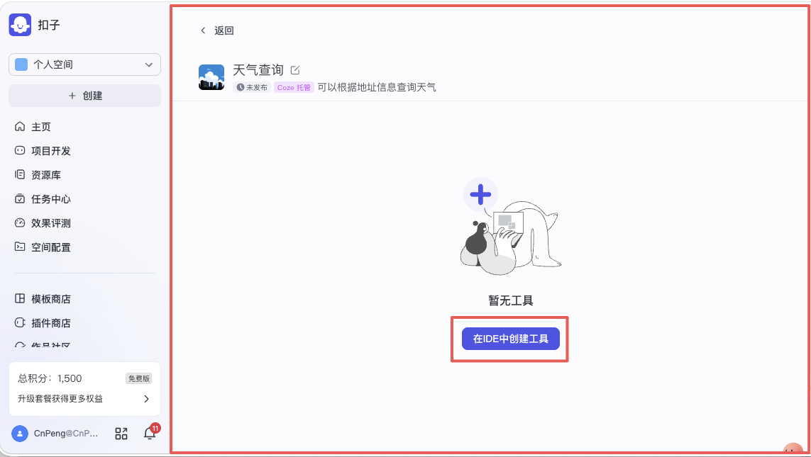

#### 1.3.3.2. 代码编写

##### 1.3.3.2.1. 代码编辑

在上一步中，点击 “在IDE中创建工具”后可以看到如下内容，然后我们点击 “添加工具”：


依次填写工具名称和介绍，然后点击 “创建”：

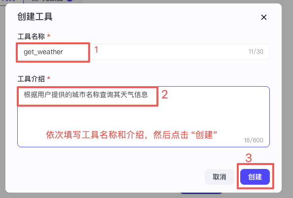

此时会看到一段默认代码：

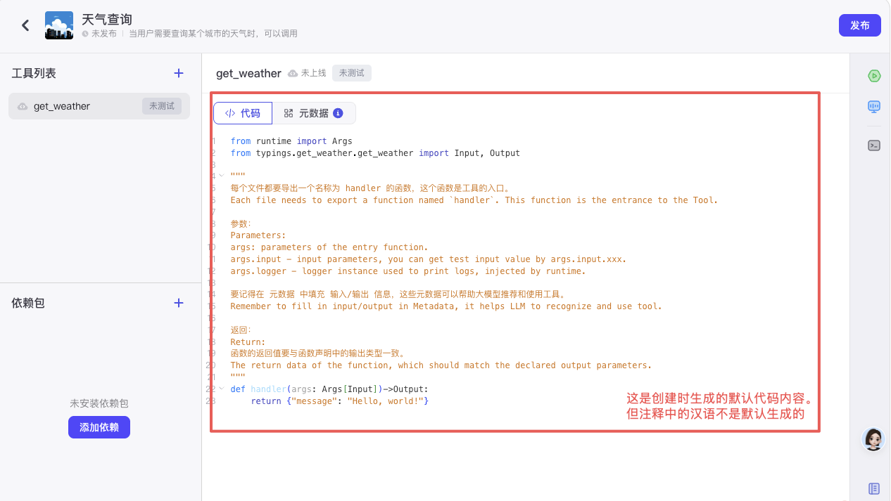

先清除默认生成的代码内容，然后将如下内容粘贴到代码区域：

```py
# 导入Coze 运行时所需的Args类，用于获取输入参数和日志记录器
from runtime import Args
# 导入requests库，用于发送HTTP 请求(调用天气API).需要安装对应的库
import requests 

# 定义插件的主入口函数handler;Coze 平台会自动调用此函数
# 参数 args是 Coze 传入的运行时上下文对象
# 返回值为 dict类型，将作为插件的输出结果返回给 Agent
def handler(args: Args):
    """
    天气查询插件:根据城市地址查询天气信息，比如输入"北京”，输出{
                                                    high:"高温 7°c"
                                                    1ow:"低温 -1°C"，
                                                    weather:"晴",
                                                    week:"星期二
                                                    }
    """

    #=== 1.解析输入 ==
    try:
        # 从 args.input 中获取 location 字段，并去除首尾空格(如用户输入"北京")
        # 注意:此处假设输入为对象属性访问(如 args.input.location)，适用于manifest 中声明了location 字段的情况
        location = args.input.location.strip()
    except Exception:
        #若获取 1ocation失败(如字段不存在、输入非对象等)，设为空字符串
        location = ""

    #===2.城市编码映射(仅北京、天津，内置)=
    #构建城市名称-天气API编码的映射字典(仅保留北京和天津两个城市，轻量且教学友好)
    city_code_map = {
        "北京":"101010100",# 北京市的天气API编码#
        "天津":"101030100"#天津市的天气API编码
    }

    #根据用户输入的城市名，查找对应的编码;若找不到则返回 None
    city_code = city_code_map.get(location)

    #不支持的城市(如输入"上海"或空字符串)->返回空值结构
    if not city_code:
        #记录警告日志:提示该城市暂不支持(可在 Coze 后台查看)
        args.logger.warning(f"Unsupported location: '{location}'")
        # 返回标准化的空结果(所有字段为None)，保证输出结构一致
        return {
            "high": None, #最高温度
            "low": None, #最低温度
            "weather": None,#天气类型(如“晴”)
            "week":None #星期(如“星期二”)
        }

    # ===3. 调用天气API===
    # 拼接完整API 请求 URL，替换{city_code}为实际城市编码
    url = f"http://t.weather.itboy.net/api/weather/city/{city_code}"

    try:
        # 发起GET 请求，设置超时5秒(防止插件卡死)
        response = requests.get(url, timeout=5)
        # 若HTTP状态码非 2xx，主动抛出异常(如 404、500 等)
        response.raise_for_status()
        # 将响应体解析为JSON字典(安全方式，避免使用危险的eval())
        data = response.json()
        # 检查API业务层返回状态码(该API约定status=200 表示成功)
        if data.get("status") != 200:
            #若业务状态异常(如城市编码错误)，抛出自定义异常
            raise ValueError("Weather API returned non-200 status")
        #从返回数据中提取「今日」天气预报(forecast 列表第0项即为当天)
        #路径:data-forecast数组-第0个元素
        forecast = data["data"]["forecast"][0]
        #构造并返回天气基本信息字典
        return {
            "high": forecast["high"],#字符串，如"高温 7C"
            "low":forecast["low"],#字符串，如“低温-1C"
            "weather":forecast["type"],#字符串，如"晴"、"小雨"
            "week": forecast["week"] #字符串，如“星期二"
        }

    #捕获所有可能的异常(网络错误、JSON 解析失败、字段缺失等)
    except Exception as e:
        #记录错误日志，包含具体异常信息和请求城市，便于调试
        args.logger.error(f"weather query failed for '{location}': {e}")
        #统一返回空值结构，确保插件健壮性(不会因异常导致 Agent崩溃)
        return {
            "high": None,
            "low": None,
            "weather": None,
            "week": None
        }
```


##### 1.3.3.2.2. 编辑元数据

在上一步的代码内容中，有如下注释内容：

```py
   """
    天气查询插件:根据城市地址查询天气信息，比如输入"北京”，输出{
                                                    high:"高温 7°c"
                                                    1ow:"低温 -1°C"，
                                                    weather:"晴",
                                                    week:"星期二
                                                    }
    """
```

这段注释描述了函数的入参和出参信息，我们基于这个注释声明 **元数据**（即函数的入参和出参信息）：

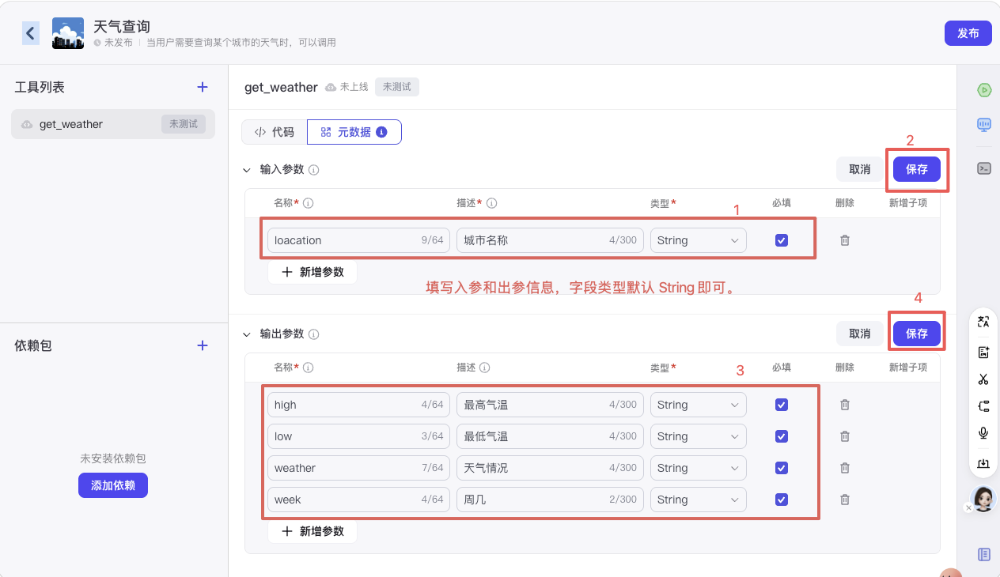

#### 1.3.3.3. 安装依赖并测试

编辑完 元数据 之后，我们点击右上角的绿色图标打开测试界面，然后输入参数并点击运行，会发现报错了：

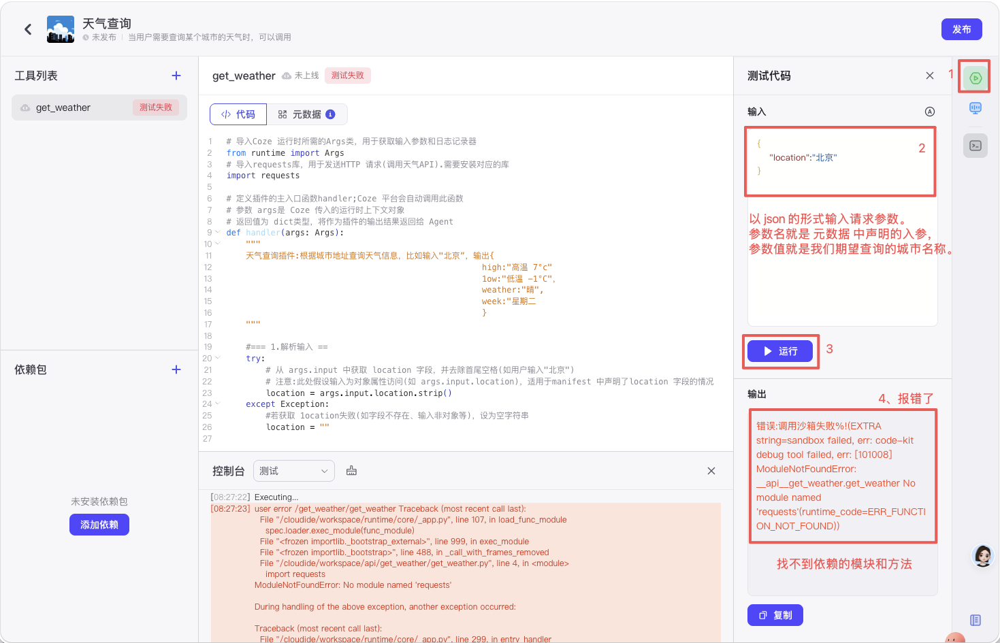

这个错误信息表示缺少依赖的模块和方法。

我们在代码的开头有 `import requests` 语句，这是一个三方库，必须先安装依赖才能使用。

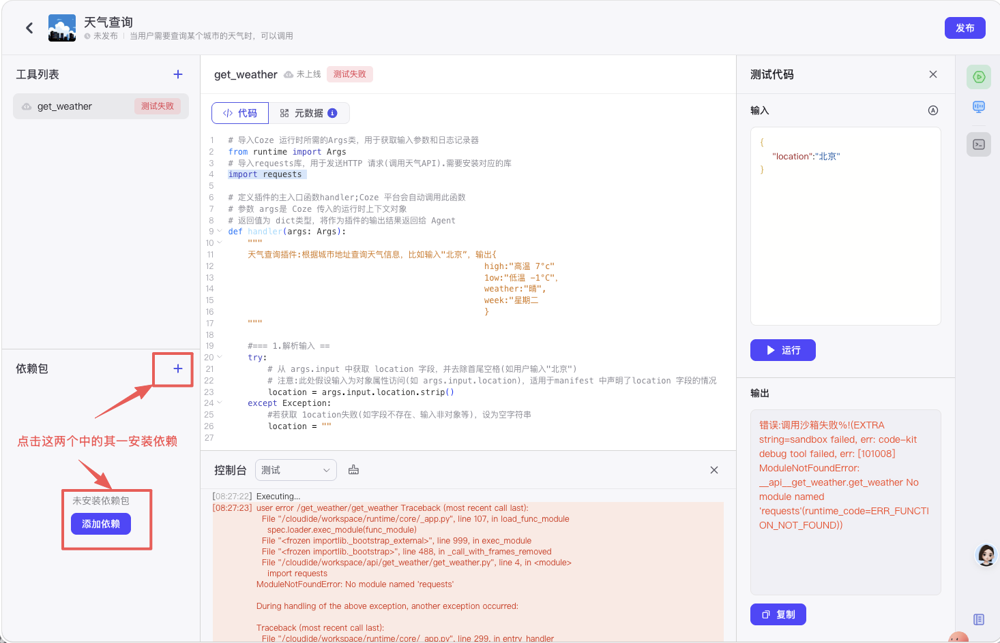

点击 "+" 或 “添加依赖” 后，在如下界面中搜索并安装即可：

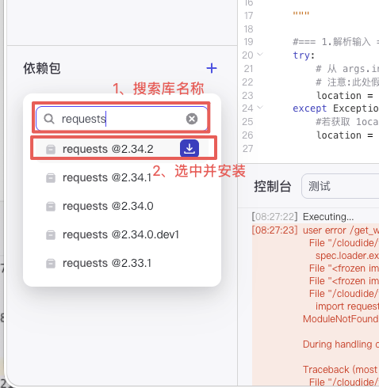

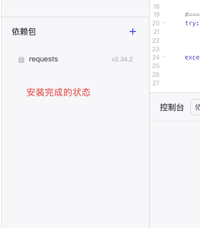


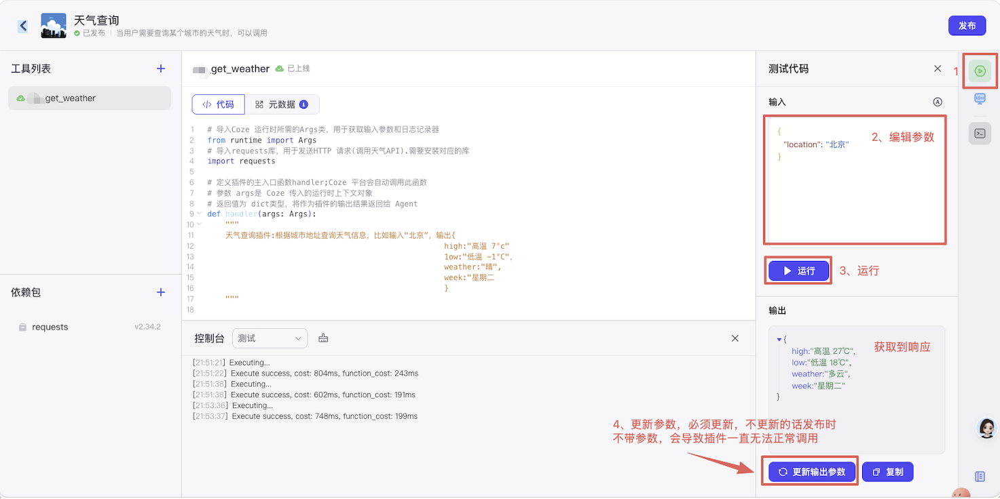

注意：

代码中通过 `city_code_map` 限定了当前仅支持北京和天津，如果需要支持其他城市，需要再手动添加其他城市和编码。

#### 1.3.3.4. 发布

测试完成后，参考下图点击右上角的 “发布” 按钮进行发布。

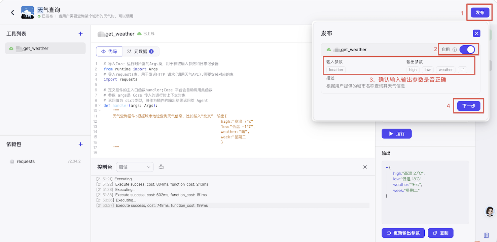

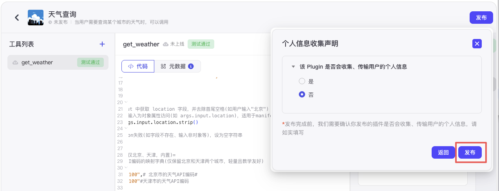

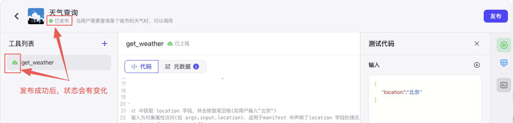

此时，我们点击页面左上角的返回按钮回到工具列表界面，就可以看到完整的工具列表了：

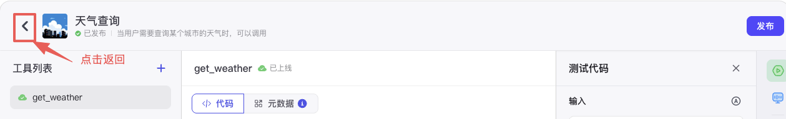

完整的工具列表界面：

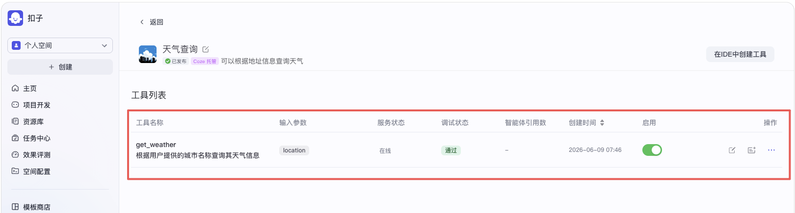


### 1.3.4. 使用自定义插件

[视频节点：12:59 ](https://www.bilibili.com/video/BV12omoB4ExF?vd_source=52532367532c4237b88b472159331d19&spm_id_from=333.788.videopod.episodes&p=14)

#### 1.3.4.1. 创建智能体


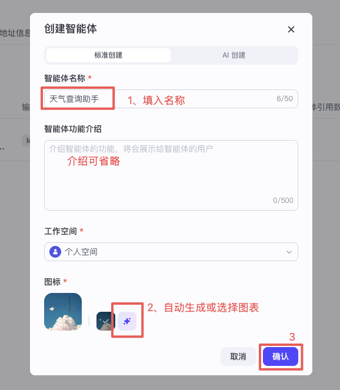

#### 1.3.4.2. 智能体引用插件

先填入人设信息：`你是一个天气查询助手，专注于为用户提供城市的天气信息`。

添加插件：

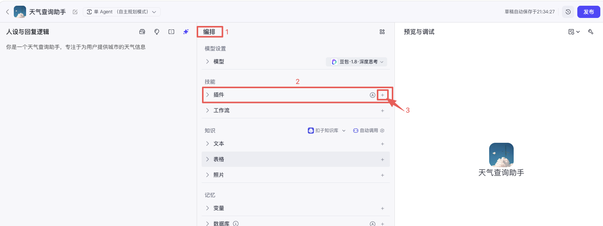

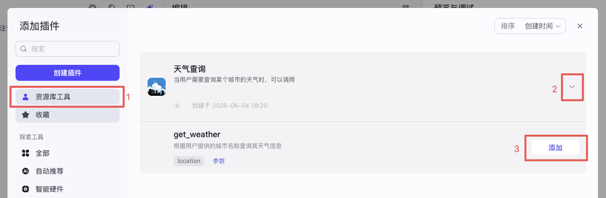

当前人设如果仅使用了一个插件，此时，可以不用在人设信息中通过 `{{ }}` 显示引用，智能体会默认使用该插件。

所以，下面的示例中，我们直接询问北京的天气时智能体就自动调用了我们的插件。


