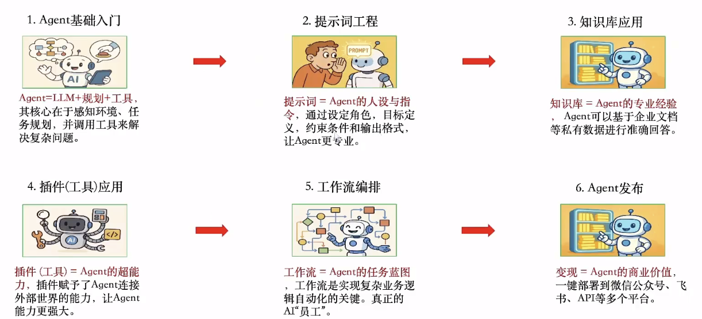
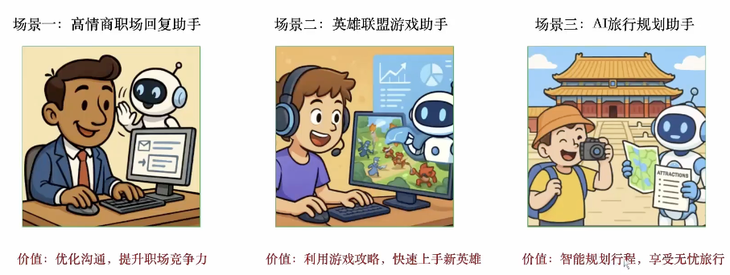
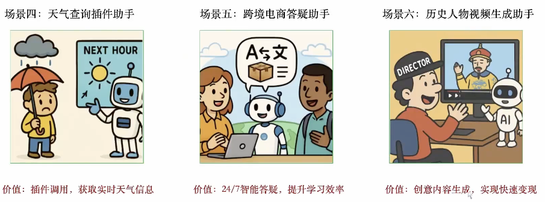

# 1. README

基于 [B站-黑马程序员全网最全Coze智能体入门到项目实战](https://www.bilibili.com/video/BV12omoB4ExF) 整理。

点击进入 [Coze 官网](https://www.coze.cn/home)

## 1.1. 课程大纲

该系列课程共分为 6 大章节：

* Agent 基础入门
* 提示词工程
* 知识库应用
* 插件（工具）应用
* 工作流程编排
* Agent发布

## 1.2. 六个场景实战案例

本套教程中会包含 6 个实战案例。

