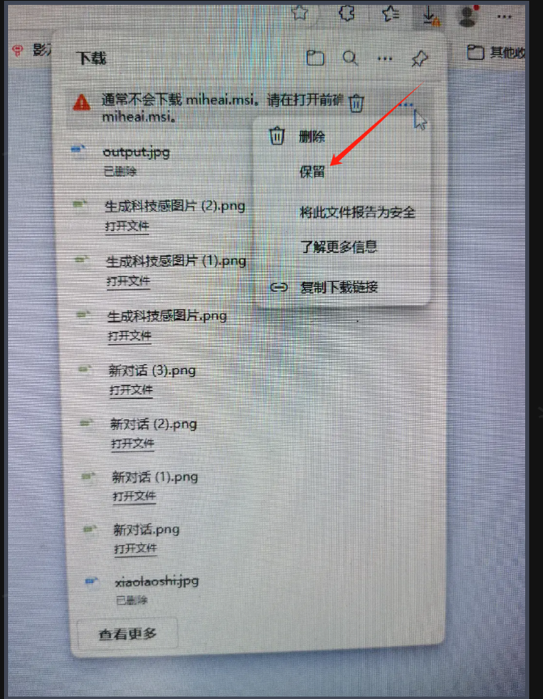
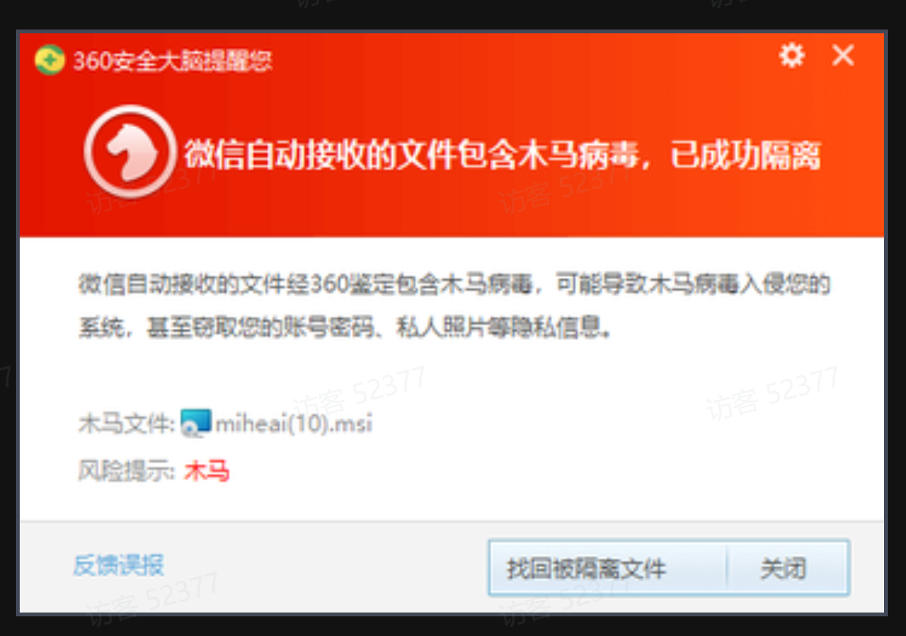
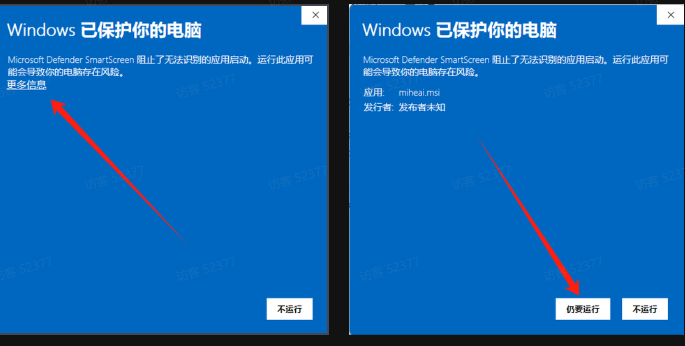
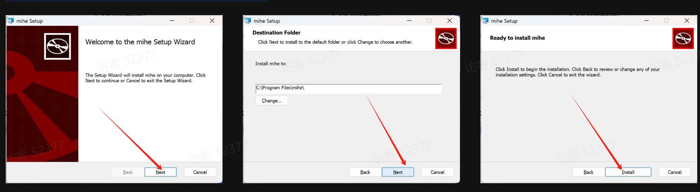
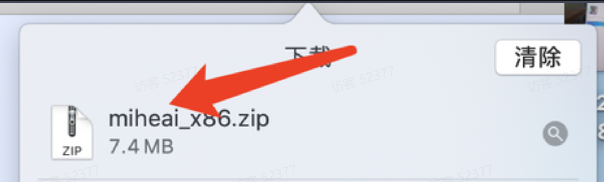
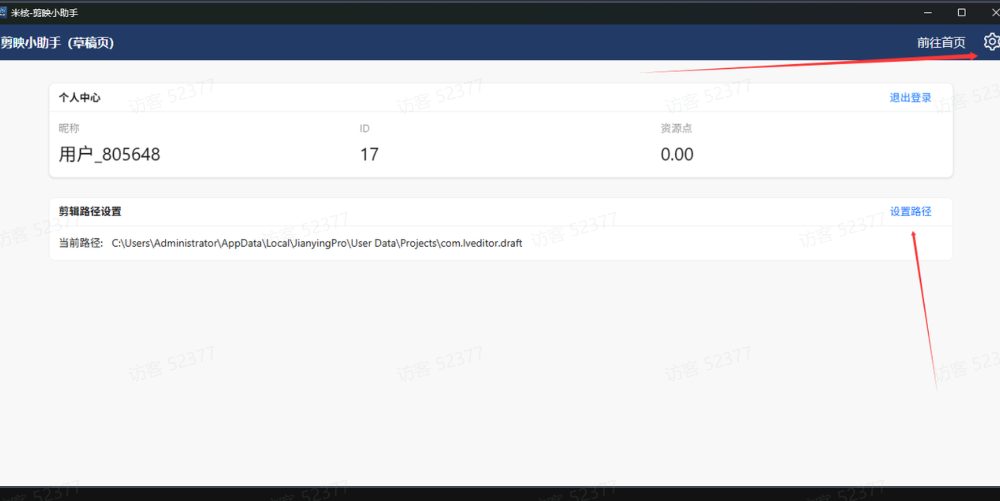
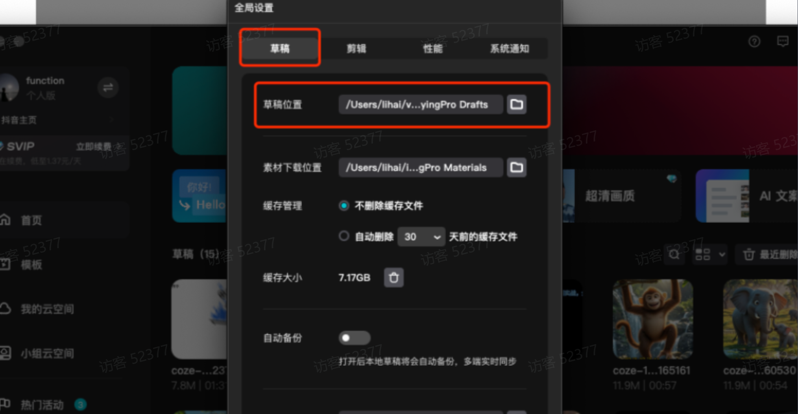
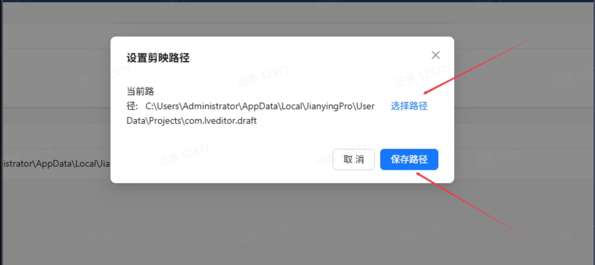
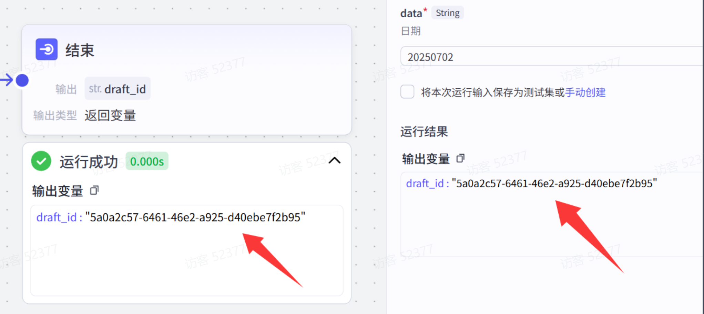
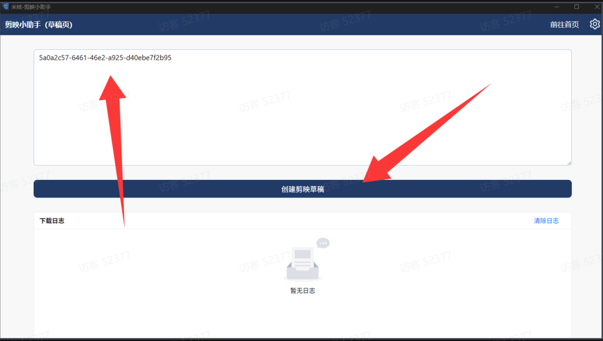

# 米核剪映小助手草稿配置使用和下载

## 1.米核剪映小助手下载

地址：https://www.miheai.com/#/jianying

下载米核小助手时可能会遇见的问题

1.遇见这种情况请直接点击保留。

2.360报病毒 点击找回被隔离文件

因个人开发软件，浏览器、杀毒软件出现误报，如需继续使用请手动选择信任或添加白名单。

·误报说明：因防破解原因个别杀毒软件存在误报，本人开发的程序中不存在任何后门、病毒。

·解决方法：关闭windows杀毒中心、浏览器下载选择允许保留。

3.Windows 已保护你的电脑，请点击更多信息。并且点击仍要运行

会出现如下界面。跟着图片一步步操作就行

4.mac系统点开之后解压就可以用了

## 2.怎么配置剪映路径？

**这里需要选择和剪映专业版草稿一样的文件下，咱们打开剪映专业版，点击右上鱼设置->全局设置，随后找到草稿位置**

**注意：没有下载剪映软件的需要下载—》地址**：https://www.capcut.cn/

**然后打开我们的剪映小助手，把剪映小助手的剪映路径设置跟此草稿路径一模一样即可，最后一定要记得点击保存**

**一定要保证和一模一样****

### 使用场景：

1.用到到剪映小助手的工作流最后结束节点输出都会有一串ID字符，复制双引号里的字符串。

2.复制字符串到剪映小助手工具

3.打开剪映查看草稿点击查看

