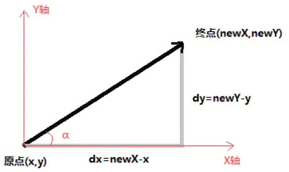

2021-1103面试题

## 1. 在浏览器中输入一个URL，按下回车会发生什么

[参考地址：从输入url到页面加载完成发生了什么？——前端角度](https://www.cnblogs.com/daijinxue/p/6640153.html)

URL：在 WWW 上，每一信息资源都有统一的且在网上唯一的地址，该地址就叫 URL（Uniform Resource Locator,统一资源定位器），它是 WWW 的统一资源定位标志，就是指网络地址

### 1.1. 发生的事情

* 浏览器的地址栏输入 URL 并按下回车。
* 浏览器查找当前 URL 的 DNS（Domain Name Server） 缓存记录。
* DNS 解析 URL 对应的 IP。
* 根据 IP 建立 TCP 连接（三次握手）。
* HTTP 发起请求。
* 服务器处理请求，浏览器接收 HTTP 响应。
* 渲染页面，构建 DOM 树。
* 关闭 TCP 连接（四次挥手）。

### 1.2. 三次握手


### 1.3. 四次挥手


## 2. 为什么说ArrayList是线程不安全的

其实根本原因是，两个线程调传入了同一个 ArrayList 的参数，在这个参数在 jvm 内以地址方式存在栈内，指向堆区的（size和object[]数组），本质上调用`ArrayList add()` 方法时，是通过 `this.size` 获取堆内 size，这时候两个线程操作同一个堆内变量，就会出现读取时的值是对的，但是使用时值已经被修改了，在此 this.size 就是脏数据

ArrayList 的实现主要就是用了一个 `Object `的数组，用来保存所有的元素，以及一个 size 变量用来保存当前数组中已经添加了多少元素


这样也就出现了第一个导致线程不安全的隐患，在多个线程进行 add 操作时可能会导致 elementData 数组越界。具体逻辑如下：

* 列表大小为 9，即 size=9
* 线程 A 开始进入 add 方法，这时它获取到 size 的值为 9，调用 ensureCapacityInternal 方法进行容量判断。
* 线程 B 此时也进入 add 方法，它获取到 size 的值也为 9，也开始调用 ensureCapacityInternal 方法。
* 线程 A 发现需求大小为 10，而 elementData 的大小就为 10，可以容纳。于是它不再扩容，返回。
* 线程 B 也发现需求大小为 10，也可以容纳，返回。
* 线程 A 开始进行设置值操作，`elementData[size++] = e` 操作。此时 size 变为 10。
* 线程 B 也开始进行设置值操作，它尝试设置 `elementData[10] = e`，而 elementData 没有进行过扩容，它的下标最大为 9。于是此时会报出一个数组越界的异常`ArrayIndexOutOfBoundsException.`

另外第二步 `elementData[size++] = e` 设置值的操作同样会导致线程不安全。从这儿可以看出，这步操作也不是一个原子操作，它由如下两步操作构成：

```java
elementData[size] = e;
size = size + 1;
```

由此我们可以得出，**在多线程情况下操作 ArrayList  并不是线性安全的**。那如何解决呢？

* 第一种方案：使用 Vertor 集合
* 第二种方案：使用 `Collections.synchronizedList`。它会自动将我们的 list 方法进行改变，最后返回给我们一个加锁了 List

## 3. 全埋点是怎么做的

[原文链接](https://www.jianshu.com/p/646365eafea6)

### 3.1. 埋点方案总结

AppStart、AppEnd 全埋点方案

* AppClick全埋点方案1: 代理View.OnclickListener
* AppClick全埋点方案2: 代理Window.Callback
* AppClick全埋点方案3: 代理View.AccessibilityDelegate
* AppClick全埋点方案4: 透明层
* AppClick全埋点方案5: AspectJ
* AppClick全埋点方案6: ASM
* AppClick全埋点方案7: JavaSsist
* AppClick全埋点方案8: AST

### 3.2. 埋点事件简介

* AppStart 事件 ：是指 app 启动，同时包括冷启动和热启动，热启动是指应用程序从后台恢复。
* AppEnd 事件 ：指 app 退出，包括正常退出、home 退到后台、被强杀、崩溃等场景。
* AppViewScreen 事件 ：是指 App 页面浏览，切换 Activity 或者 Fragment
* AppClick 事件：是指 App 的点击事件，所有的 view 的点击事件

### 3.3. AppClick 事件的全埋点整体解决思路

就是要自动找到 那个被点击事件的控制处理逻辑（后文统称原处理逻辑），利用一定的技术处理，来对原处理逻辑进行 "拦截" ，或者在原处理逻辑执行前面或执行后面 "插入" 相应的埋点代码，从而达到自动埋点的效果。

在编译器对Java代码的处理流程中，可以采用不同的埋点方案。


### 3.4. 全埋点综合方案考虑因素

#### 3.4.1. 效率

* 静态代理
    * 通过 Gradle Plugin 在应用程序编译期间 “插入”代码或者修改代码（.class）。比如 AspectJ、ASM、JavaSsist、AST 等均属于这种方式。
* 动态代理
    * 在代码运行的时候（Runtime）去进行代理。例如：View.OnClickListener、Window.Callback、View.AccessbilityDelegate等方案均属于这种方式。

静态代理明显优于动态代理，因为静态代理是在程序编译阶段处理的，**不会对应用程序的整体性能有太大影响**，而动态代理是在程序运行阶段发生的，所以对程序性能会有一定的影响。

#### 3.4.2. 兼容性

Android 生态系统一直在飞速发展，有不同的开发语言（Java、Kotlin、Flutter），不同的 Java 版本（Java7、Java8）、混合开发、不同的 Gradle 版本，以及 Lambda、D8、Instant Run、DataBinding、Fragemnt 等，都会给兼容性带来影响。

#### 3.4.3. 扩展性

随着业务快速发展，数据分析不断提高，我们自动采集要求越来越高等。

### 3.5. 埋点实现思路

#### 3.5.1. AppViewScreen 事件

`ActivityLifecycleCallbacks` 是 Application 的一个内部接口，是从API14（Android 4.0）开始提供的。它提供了**生命周期的监听。**

所以，我们可以直接在onResume里面做一个页面信息的统计。

#### 3.5.2. AppStart 、 AppEnd 埋点方案

最好的方案还是使用 `ActivityLifecycleCallbacks`，监听 onResume 表示 AppStart。但是由于应用程序会有多个进程，会导致无法判断当前进程是出于前台还是后台。我们可以采用 ContentProvider+SharedPreferences 的方案来解决跨进程数据共享问题。

然后当应用程序被强杀、崩溃的时候，我们该如何判断呢？对于一个应用程序，如果一个页面退出 30s 内，没有其他页面显示出来，我们就认为应用程序处于后台了，也就是发生了 AppEnd 事件。

> 原文后续内容略微有点乱，此处不再摘录，如果有必要，可查看原文。

## 4. 绘制优化

### 4.1. 绘制优化策略


* 降低 View.onDraw() 的复杂度
    * 不要在 onDraw() 中创建复杂的局部对象
    * 避免在 onDraw() 中执行大量且耗时的操作 
* 避免过度绘制（Overdraw）
    * 移除默认的 Window 背景
    * 移除 控件中不必要的背景
    * 减少布局文件的层级（减少不必要的嵌套）
    * 自定义控件View优化：使用 clipRect() 、 quickReject()

### 4.2. 补充-clipRect()

通过`canvas.clipRect()` 来帮助系统识别那些可见的区域。

该可以指定一块矩形区域，只有在这个区域内才会被绘制，其他的区域会被忽视。这个 API 可以很好的帮助那些有多组重叠组件的自定义 View 来控制显示的区域。同时 clipRect 方法还可以帮助节约 CPU 与 GPU 资源，在 clipRect 区域之外的绘制指令都不会被执行。**但那些部分内容在矩形区域内的组件，仍然会得到绘制**。

### 4.3. 补充-canvas.quickreject()

使用 [canvas.quickreject()](https://developer.android.google.cn/reference/android/graphics/Canvas#quickReject(float,%20float,%20float,%20float))来判断是否没和某个矩形相交，从而跳过那些非矩形区域内的绘制操作。

## 5. 多渠道打包

Android 原生方案，美团 walle 方案，360 加固保。


相关参考：[Gradle多渠道打包(动态设定App名称，应用图标，替换常量，更改包名，变更渠道)](https://www.jianshu.com/p/533240d222d3)

## 6. ViewModel 原理

### 6.1. 工作原理

`ViewModel` 是一种用来存储和管理 UI 相关数据的类。它支持**在系统配置发生改变的时候自动对数据进行保存**。谷歌推荐我们配合 LiveData 使用，当然你也可以往里面存任何数据或者其他参数等

`ViewModelStore` 类：就是一个存放 `ViewModel` 的 `HashMap`

总结一下：

* 当 Activity 由于配置信息发生改变而重建的时候，会保存一个 `Activity.NonConfigurationInstances` 对象。
* `AppCompatActivity` 的间接父类 `ComponentActivity` 在此过程中保存了一个`ComponentActivity.NonConfigurationInstances` 到`Activity.NonConfigurationInstances`中。 `ComponentActivity.NonConfigurationInstances` 中保存了 `AppCompatActivity` 当前的 `ViewModelStore` 对象。**`ViewModelStore` 对象中存储着当前 `AppCompatActivity` 的所有 `ViewModel` 对象。**
* 在新创建的 `AppCompatActivity` 的 `attach` 方法中恢复了 `ViewModelStore` 对象。该方法在 `onCreate` 方法之前被调用。
* 在新创建的 `AppCompatActivity` 的 `onCreate` 方法中可以获取到恢复了的 `ViewModelStore` 对象。从而可以获取对应的 `ViewModel` 对象。

所以，横竖屏切换时 ViewModel 不会被清除，界面数据也就不会发生变化。也就是说：**`ViewModel` 类让数据可在发生屏幕旋转等配置更改后继续留存**

> 简单来说就是： `ViewModelStore` 保存在 `NonConfigurationInstances` 对象中，并将 `NonConfigurationInstances` 返回。在页面创建时，会调用 `getViewModelStore` 方法，进而调用 `getLastNonConfigurationInstance` 获取 `NonConfigurationInstances` 对象，从而获取之前的 `ViewModelStore`

### 6.2. ViewModelStore 何时清空保存的 ViewModel

ComponentActivity 的构造函数

```java
public ComponentActivity() {
    Lifecycle lifecycle = getLifecycle();

    getLifecycle().addObserver(new LifecycleEventObserver() {
        @Override
        public void onStateChanged(LifecycleOwner source, Lifecycle.Event event) {
            //注释1处
            if (event == Lifecycle.Event.ON_DESTROY) {
                if (!isChangingConfigurations()) {
                    getViewModelStore().clear();
                }
            }
        }
    });
    //...
}
```

`ComponentActivity` 监听了生命周期变化，**当 `ComponentActivity` 被销毁时，且不是因为配置发生变化而被销毁时， `ViewModelStore` 就清空保存的 `ViewModel` 对象**。

### 6.3. ViewModel 如何数据共享

`ViewModel` 能实现数据共享是因为 **`ViewModelStore`** 相同，多个 `Fragment` 因为传入相同的 `Activity` 所以 `ViewModelStore` 是相同的。

## 7. String，StringBuilde，StringBuffer的区别

### 7.1. 区别

* StringBuffer： 是线程安全，可以不需要额外的同步用于多线程中
* StringBuilder： 是非同步（线程不安全的）。运行于多线程中就需要使用着单独同步处理，但是`速度就比 StringBuffer 快多`了
* `StringBuffer` 与 `StringBuilder` 两者共同之处是都可以通过 `append、insert` 进行字符串的操作
* String 实现了三个接口: `Serializable` 、 `Comparable<String>` 、 `CharSequence`

### 7.2. 运行速率

在进行字符串操作时，运行速度从快到慢依次为：StringBuilder > StringBuffer > String

String 最慢的原因：String 为字符串常量，而 StringBuilder 和 StringBuffer 均为字符串变量。当我们对 String 类型的数据进行操作时，其实都等同于生成了一个新的 String 对象，然后将指针指向新的 String 对象。而后两者的对象是变量，是可以直接更改的。

### 7.3. 使用场景

* String：适用于少量的字符串操作的情况
* StringBuilder：适用于单线程下在字符缓冲区进行大量操作的情况
* StringBuffer：适用多线程下在字符缓冲区进行大量操作的情况

## 8. Android之AMS和ATMS介绍

参考文章：

* [1-Android之AMS介绍](https://www.jianshu.com/p/b4c0afd80ca0)
* [2-Android AMS(ATMS)的应用启动流程解析](https://blog.csdn.net/qq_27481249/article/details/116015635)

`AMS` ，全称 `ActivityManagerService` 是 Android 中最核心的服务，主要**负责系统中四大组件的启动、切换、调度及应用进程的管理和调度等工作**。其职责与操作系统中的进程管理和调度模块相类似，因此它在 Android 中非常重要。

`ActivityManagerService` 的启动是在 `SystemServer.java` 中。

但是，从 Android Q 开始，出现了 `ATMS`, 即 `ActivityTaskManagerService`， 由他负责 activity 的调度和管理。

## 9. 用过哪些设计模式

创建型模式（五种）：`工厂方法模式`、抽象工厂模式、`单例模式`、`建造者模式`、原型模式

结构型模式（七种）：`适配器模式`、装饰器模式、`代理模式`、外观模式、桥接模式、组合模式、享元模式

行为型模式（十一种）：策略模式、模板方法模式、`观察者模式`、迭代子模式、责任链模式、命令模式、备忘录模式、状态模式、访问者模式、中介者模式、解释器模式

## 10. 启动优化

参考文章：[App性能优化（一）—— 启动优化，冷启动，热启动，温启动](https://blog.csdn.net/blankmargin/article/details/108525827)

应用有三种启动状态，每种状态都会影响应用向用户显示所需的时间：冷启动、温启动或热启动。

启动优化通常是很对冷启动进行优化。

### 10.1. 冷启动

`冷启动` 是指应用从头开始启动：系统进程在冷启动后才创建应用进程。发生冷启动的情况包括应用自设备启动后或系统终止应用后首次启动。例如，通过任务列表手动杀掉应用进程后，又重新启动应用。

#### 10.1.1. 冷启动过程

冷启动经历两个阶段：

* 第一阶段
    * 加载并启动 app;
    * app 启动后，第一时间为 app 显示一个空白的 window；
    * 创建 app 进程
* 第二阶段：系统一旦创建了app进程，app进程就要负责做以下的任务：
    * 创建 app 对象；
    * 启动主进程 ActivityThread；
    * 创建 LaunchActivity；
    * 渲染视图；
    * 执行onLayout；
    * 执行onDraw
    * 完成第一次绘制后，用 LaunchActivity； 替换已经展示的 BackgroundWindow，即空白 window。

#### 10.1.2. 冷启动优化思路

##### 10.1.2.1. 禁用空白 window

在 theme 中为 LaunchActivity 添加一个 禁用 window 预览的功能的 Theme，然后在清单文件中将该 theme 应用给 LaunchActivity.

```html
 // 禁用 window 的预览属性
<item name="android:windowDisablePreview">true</item>`
```

这种方案虽然看不到白屏了，但用户在系统桌面点击应用图标后，会有大约 1s 的反应时间，然后才会进入启动页。

##### 10.1.2.2. 设置启动页背景

通过设置 Theme 将 LaunchActivity 的 `windowBackground` 属性预先设置一个启动图片（ layer-list实现），在启动后，**在 Activity 的 `onCreate()` 方法中的 `super.onCreate()` 前再`setTheme(R.style.AppTheme)`,  即重置为正常的 Theme**。

优点：

* 使用简单。
* 避免了启动白屏和点击启动图标不响应的情况。

缺点

* 治标不治本，表面上产生一种快的感觉。

##### 10.1.2.3. 基于启动流程分析优化策略

从上面冷启动的介绍可知，app启动过程中，会有如下几个重要过程：


如上图，app启动，显示白屏，首屏第一次绘制完成，替换白屏。也就是说，直到首屏显示之前，都是白屏！

所以，**要想解决白屏的问题，就要减少白屏显示的时间！也就是说要加快 app 初始化和首屏绘制的时间。**

处理措施如下：

* 减少 Application 初始化的工作量。
* 加快 UI 绘制
    * 减少布局元素
    * 减少布局嵌套（使用约束布局）
    * 避免过度绘制（去除不必要的背景；如果有自定义视图，则避免在 onDraw 中执行耗时操作）

### 10.2. 热启动

当我们按了 Home 键或其它情况 app 被切换到后台，再次启动 app 的过程被称为热启动。

热启动时，系统将 activity 带回前台。如果应用程序的所有 activity 存在内存中，则应用程序可以避免重复对象初始化、渲染、绘制操作。

如果由于内存不足导致对象被回收，则需要在热启动时重建对象，此时与冷启动时将界面显示到手机屏幕上一样。


### 10.3. 温启动

温启动包含了冷启动的一些操作，由于 app 进程依然在，**温启动只执行冷启动的第二阶段，这代表着它比热启动有更多的开销**。

温启动有很多场景，例如：

* 用户按连续按返回退出了 app，然后重新启动 app；
* 由于系统收回了 app 的内存，然后重新启动 app。

## 11. 滑动冲突怎么解决


滑动冲突在我们日常 Android 开发中非常常见，当我们单独使用滚动的滑动控件（ScrollView 、ListView、ViewPager、RecyclView ）时不会发生什么问题，但当我们将他们结合起来时，就会出现所谓的滑动冲突问题

### 11.1. 滑动冲突分类

滑动冲突一般有三种场景：

* 外部滑动与内部滑动方向不一致（比如 ViewPager 嵌套 ListView 时）
* 外部滑动与内部滑动方向 一致 （ScrollView 嵌套 ScrollView）
* 多层嵌套滑动（就是将前面的两种嵌套滑动结合起来）

### 11.2. 滑动冲突处理思路

#### 11.2.1. 内外滑动方向不一致时处理思路

这一类场景其实比较容易分析，因为外层和内层滑动的方向不一致，所以**根据手势的动向来确定把事件给谁**。

默认情况下，当点击内层控件时，事件会先一层层从外层传到内层，由内层来处理。这里以外层为左右滑动，内层为上下滑动为例。

当判定手势的滑动为左右时，需要外层来消费事件，所以外层将事件拦截，即在外层的 `onInterceptTouchEvent` 中检测为 `ACTION_MOVE` 时返回true；而如果判定手势的滑动为上下时，需要内层来消费事件，外层不需要拦截，事件会传递到内层来处理（具体的代码实现，在后面会详细列出）。这样就通过判断滑动的方向来决定事件的处理对象，从而解决滑动冲突的问题。

那么，如何来判定手势的滑动方向呢？最常用的办法就是比较水平和竖直方向上的位移值来判断。 `MotionEvent` 事件包含了事件的坐标，只要记录一次移动事件的起点和终点坐标，如下图所示，通过比较在水平方向的位移 `dx` 和 `dy` 的大小，来决定滑动的方向：`dy` > `dx`，本次移动的方向认为是竖直方向；反之，则认为是水平方向。当然，还可以通过夹角`α`的大小、斜率、速率等方式来作为判断条件。



#### 11.2.2. 内外滑动方向一致时处理思路

这种场景要比上面一种复杂一些，因为滑动方向一致，所以无法通过上述的方式来判断将事件交给谁处理。在这种情况下，往往需要根据业务的需要来判定谁来处理事件。

比如竖直方向的 ScrollView 嵌套 ScrollView 的场景下：

* 手指在内层 ScrollView 上下滑动时：事件需要被内层 ScrollView 拦截，由内层ScrollView 来消费；
* 当手指在外层 ScrollView 滑动时事件需要被外层ScrollView 拦截，由外层 ScrollView来消费。

#### 11.2.3. 多层滑动嵌套时处理思路

    这种场景下看起来比较复杂，但其实是由前面两种场景嵌套形成的。所以这种场景的处理方式，就是将其拆分为简单的场景，然后按照前面的场景分析方式来处理。

##### 11.2.3.1. 外部拦截法

    顾名思义，就是在外部滑动控件中处理拦截逻辑。这需要外部控件重写父类的 `onInterceptTouchEvent` 方法，在其中判断什么时候需要拦截事件由自身处理，什么时候需要放行将事件传给内层控件处理，内部控件不需要做任何处理。内部控件不需要做任何处理。伪代码如下：


##### 11.2.3.2. 内部拦截法

    顾名思义，就是将事件是否需要拦截的逻辑，放到内层控件中来处理。这种方式需要结合` requestDisllowInterceptTouchEvent(boolean)` 这个方法，在内层控件的重写方法 `dispatchTouchEvent` 中，根据逻辑来决定外层控件何时需要拦截事件，何时需要放行。（requestDisllowInterceptTouchEvent 这个方法的作用是-是否允许外层控件拦截事件）伪代码如下：


同时，在这种方法下需要在外层控件做下处理：


`ACTION_DOWN` 事件仍然不能拦截，这是因为在 **ACTION_DOWN 事件时会初始化一些状态和标志位等变量，这会导致 requestDisllowInterceptTouchEvent(boolean) 方法会失效**。因此，在外层控件的 `ACTION_DOWN `事件不能拦截。

#### 11.2.4. 补充：事件分发核心函数

* onInterceptTouchEvent()
* requestDisllowInterceptTouchEvent()
* dispatchTouchEvent()
* onTouchEvent()

## 12. webview内存泄漏

### 12.1. 分析泄漏

运行 app，先用 AS 自带的 Profiler 分析我们的 WebViewActivity , 频繁进出，看内存占用情况，会发现内存在不断的上升，而且退出当前页面内存只是下降一点，一直持续下去，肯定会 OOM；

本质是因为 webView 内部的一些线程持有 activity 对象，导致 activity 无法释放，继而内存泄漏并溢出。

引入 leakcanary 内存泄漏分析工具

### 12.2. 优化方案

参考地址：[Android：教你如何避免解决WebView内存泄漏](https://blog.csdn.net/bugyinyin/article/details/111605153)

WebView 中的内存泄漏其实与 Chromium 内核版本有关，在新版本的 Chromium 内核中内存泄漏问题已经被解决了。

而且从 Android 5.0(Lollipop) 版本开始将 Chromium WebView 迁移到了一个独立的 APP – Android System WebView，随着 Android System WebView 的独立发布，低版本 Android 系统(Android 5以上)上搭载的 Chromium 内核一般来说也不会太旧，所以出现内存泄漏的概率应该是比较小的。

如果仍需要兼容这很小的一部分机型，**在 Activity.onDestroy 的时候将 WebView 从 View 树中移除，然后再调用 WebView.destroy 方法**

```java
override fun onDestroy() {
    val parent = webView?.parent
    if (parent is ViewGroup) {
        parent.removeView(webView)
    }
    webView?.destroy()
    super.onDestroy()
}
```

* 使用动态添加 Webview 的方式
* 注册的服务、监听器、handler 要及时移除并置为 null
* 如果当前页面有 ImageView，也要及时回收、销毁
* 最后再执行super.onDestroy()方法  
* activity 弱引用持有

## 13. GC原理，有哪几种GC方式

### 13.1. GC 及其原理

GC 是垃圾回收，是用来对内存进行管理的一种策略。其本质是对对象的分配和释放 。

Java 中分配对象使用 new 关键字；释放对象时，只要将对象所有引用赋值为 null，让程序不能够再访问到这个对象。当对象无法被访问时，我们称该对象为 `不可达的`，此时，GC 将负责回收所有不可达对象的内存空间。

Java 提供的 GC 功能可以自动监测对象是否不可达从而达到自动回收内存的目的，Java 语言没有提供释放已分配内存的显示操作方法。

Java 程序员不用担心内存管理，因为垃圾收集器会自动进行管理。要请求垃圾收集，可以调用下面的方法之一: `System.gc() `或`Runtime.getRuntime().gc()`。

### 13.2. JVM如何判断一个对象实例是否应该被回收？

根据对象是否存活判断是否需要被回收，有两种判断方法：

#### 13.2.1. 引用计数算法

引用计数器的算法原理：给对象添加一个引用计数器，每当有一个地方引用它时，计数器的值就会加1；当引用失效时，计数器就会减1；在任何时刻计数器的值为 0 的对象就是不可能再被使用的，也就是被回收的对象。

优点：效率高 

缺陷：**无法解决对象之间循环引用的问题，对于循环引用的对象，无法进行回收（主流JVM并未采用这种算法）**

#### 13.2.2. 可达性分析算法（GC Roots）

在主流的 JVM 实现中，都是通过可达性分析算法来判断对象时候存活的。

其基本思想：通过一系列被称为 `GC Roots` 的对象作为起始点，从这些节点开始向下搜索，搜索走过的路径称为**引用链**，当一个对象与 GC Roots 对象之间没有任何引用链相连，就认为 GC Roots 到这个对象是不可达的，判定为不可用对象，可以被回收。

Java虚拟机将以下对象定义为 `GC Roots` ：

* Java虚拟机栈中引用的对象，虚拟机栈中（栈帧）
* 静态属性引用的对象，static对象
* 常量引用的对象，final对象
* 本地方法栈中引用的对象

### 13.3. 垃圾收集算法

#### 13.3.1. 标记清除算法

从根集合进行扫描，对存活的对象进行标记，完毕后**清除未标记对象**

#### 13.3.2. 复制算法

将内存一分为二，每次使用一块，将存活的对象复制到另外一块。

时间上效率低，空间上产生内存碎片。

#### 13.3.3. 标记压缩算法

类似于标记清除，移动存活的对象向内存一端，然后清理边界以外的内存。

#### 13.3.4. 分代收集算法

不同的对象的生命周期(存活情况)是不一样的，而不同生命周期的对象位于堆中不同的区域，因此对堆内存不同区域采用不同的策略进行回收可以提高 JVM 的执行效率。

当代商用虚拟机使用的都是分代收集算法：新生代对象存活率低，就采用 复制算法 ；老年代存活率高，就用标记清除算法或者标记整理算法。

Java 堆内存一般可以分为`新生代`、`老年代`和`永久代`三个模块。

更多内容参考：[图解Java 垃圾回收机制](https://blog.csdn.net/justloveyou_/article/details/71216049)


## 14. CAS机制与原子性

CAS 即 `Compare and swap` 比较和交换。属于硬件同步原语，处理器提供了基本内存操作的原子性保证。

CAS操作需要输入两个数值：一个旧值 A (期望操作前的值)和一个新值 B，在操作期间先比较下旧值有没有发生变化，**如果没有发生变化，才交换成新值，发生了变化则不交换**

* AtomicBoolean:原子更新布尔类型
* AtomicInteger:原子更新整型
* AtomicLong:原子更新长整型

cas步骤还原:

* 需要传递三个参数 1.当前线程中获取的旧值 2.新值 3.内存地址中的值
* 循环比较旧值和内存地址中的值,直到比较成功为止,即使失败,旧值是用 volatile （不稳定的，无常的）修饰的, 保证一旦发生改变, 能够被其他线程所察觉. 然后再进行比较.

## 15. Android 包体积优化

* 三方库处理、
* 移除无用代码、
* 资源瘦身方案探索：`冗余资源优化`、`重复资源优化`、`图片压缩`、使用针对性的图片格式、资源混淆、R Field 的内联优化、资源合并方案、资源文件最少化配置、尽量每张图片只保留一份、资源在线化、统一应用风格。
* So 瘦身方案探索：So 移除方案、So 移除方案优化版、使用 XZ Utils 对 Native Library 进行压缩、对 Native Library 进行合并、删除 Native Library 中无用的导出 symbol、`So 动态下载`

## 16. Activity生命周期


## 17. 协程原理

Kotlin 的协程就是一个**封装在线程上面的线程框架**

**协程利用挂起代替阻塞，让我们能用同步的方式写出异步的代码**，代码结构更加清晰，从语法上看它很神奇，但从原理上讲，**本质上就是线程切换，通过切走再切回来的操作，代替回调，抹平代码的层级**

## 18. LiveData原理，怎么派发数据

参考文章：[官方文档-LiveData 概览](https://developer.android.google.cn/topic/libraries/architecture/livedata?hl=zh_cn#java)

LiveData 核心类：LiveData、MutableLiveData

### 18.1. 原理

LiveData 是一种`可观察的数据存储器类`。与常规的可观察类不同，LiveData 具有生命周期感知能力，也就是说它遵循其他应用组件（如 Activity、Fragment 或 Service）的生命周期。这种感知能力可确保 LiveData **仅更新处于活跃生命周期状态的应用组件观察者**。

LiveData 只会将更新通知给活跃的观察者，非活跃观察者不会收到更改通知。

### 18.2. 派发数据

您必须调用 `setValue(T)` 方法以从**主线程**更新 LiveData 对象。

如果在**工作器线程**中执行代码，您可以改用 `postValue(T) `方法来更新 LiveData 对象。


### 18.3. 如何使用

参考地址：[官方文档--实现 ViewModel](https://developer.android.google.cn/topic/libraries/architecture/viewmodel)

ViewModel 层继承 ViewModel 并创建 LiveData，数据发生变化时通过 setValue()/postValue() 将数据反馈给 UI。

在 Activity/Fragment 中通过 ViewModelProvider 获取 ViewModel 对象，然后通过该对象中 LiveData 实例的 `observer()` 函数实现对数据的监听。

### 18.4. 粘性事件

参考：[踩坑之路：LiveData之粘性事件](https://www.jianshu.com/p/e08287ec62cd)

粘性事件：发射的事件如果早于注册，但注册之后依然可以接收到的情况

优点：能够确保数据显示在界面上。

缺点：可能会导致界面的多次刷新。（比如，onCreate 注册过一次 observer，又在 onResume 中重复注册，这样就会导致界面的多次刷新。所以，正常仅注册一次即可。如果确实有必要，则考虑拆分多个 LiveData）


### 18.5. livedata 传相同的值会不会执行 onchanged 回调?

参考链接：[《LiveData-你必须滴知道得知道的那些玩意儿》](https://blog.csdn.net/zzz777qqq/article/details/109579022)

LiveData 中和 ViewModelObserver 中各维系一个 version 字段，只要 LiveData 中的 version 大于等于 Observer 中的 version，就会触发 `onChanged` 方法。也就是说，不管 setValue / postValue 值是否与当前的值相同，version 都会变化，onChange 都会触发。


首先看看 setValue 方法

```java
@MainThread
    protected void setValue(T value) {
        assertMainThread("setValue");
        mVersion++;
        mData = value;
        dispatchingValue(null);
    }
```

其中最重要的是 `mVersion` 参数。接下来看 `dispatchingValue` 方法

```java
void dispatchingValue(@Nullable ObserverWrapper initiator) {
        ....
        considerNotify(initiator);
        ....
    }

private void considerNotify(ObserverWrapper observer) {
        if (!observer.mActive) {
            return;
        }
        // Check latest state b4 dispatch. Maybe it changed state but we didn't get the event yet.
        //
        // we still first check observer.active to keep it as the entrance for events. So even if
        // the observer moved to an active state, if we've not received that event, we better not
        // notify for a more predictable notification order.
        if (!observer.shouldBeActive()) {
            observer.activeStateChanged(false);
            return;
        }
        if (observer.mLastVersion >= mVersion) {
            return;
        }
        observer.mLastVersion = mVersion;
        observer.mObserver.onChanged((T) mData);
    }
```


## 19. MVC，MVP，MVVM的区别

### 19.1. MVC

MVC 中三个组成部分：

* View，即视图中的各个控件；
* Controller，即Activity、Fragment；
* Model，即数据源。

对 View 层的控制也是在 Activity 中，这时引入 Model 层数据源的获取再与 Controller 层发生交互时，不难发现 MVC 三层互相都存在持有关系，也就产生了严重的**耦合**


### 19.2. MVP

MVP 的架构实现就是**将控制层下移**，View 层充当 Activity、Fragment 的存在，Model 层保持原样作为数据源的获取层存在，而 View 和 Model 层的通信通过中间人 Presenter 来完成数据的传递，通过这样的方式达到了解耦的目的


### 19.3. MVVM

MVVM 架构其实和 MVP 架构整体上相似， ViewModel 将 View 的状态和行为抽象化，从而将视图 UI 和业务逻辑分开层。 ViewModel 和 Model 层属于双向通信，使用了 `DataBinding` 的能力，使得 ViewModel 的生成、与 View 层的绑定完全由系统直接完成，简化了开发的流程。


## 20. 并发操作如何保证线程安全

线程之所以不安全, 主要是**多线程下对可变的共享资源的争用导致的**

衡量线程是否安全, 主要从三个特性入手

* 原子性
* 可见效
* 有序性

### 20.1. 如何保证原子性

#### 20.1.1. 保证原子性
保证 Java 操作 `原子性` 的工具是**锁和同步方法(或者同步代码块)**

* 同一时间只有一个线程能拿到锁, 也就保证了同一时间只有一个线程能执行`申请锁`和`释放锁`之间的代码
* java 使用关键字 `synchronized` 进行同步.（ 需要注意的是, `synchronized` 是有作用范围的）

无论使用 `锁` 还是 `synchronized`, 本质都是一样

* 通过锁或同步来实现资源的排它性,
* 从而实现目标代码段同一时间只会被一个线程执行,
* 进而保证了目标代码段的原子性.

#### 20.1.2. 悲观锁和乐观锁

#### 20.1.3. 悲观锁

处理数据时，假设会有其他外部修改，所以**每次都会锁住数据, 防止外部的操作**.

#### 20.1.4. 乐观锁

处理数据时，假设没有冲突，在数据进行提交更新时才去判断是否有冲突，如果有冲突就将异常信息反馈给客户，由客户决定怎么做

>* CAS （Compare And Swap）是一种乐观锁的机制，它不会阻塞任何线程。所以在效率上它会比锁和同步要高。
>* Java 提供了并发原子类 `AtomicInteger` 来解决自增操作原子性的问题，其底层就是使用了 CAS 原理

### 20.2. 如何保证可见性

Java 提供了 `volatile` 关键字来保证可见性，即某个线程对变量进行修改之后，及时通知其他线程。

当使用 `volatile` 修饰某个变量时，它会保证**对该变量的修改会立即被更新到内存**中，并且**将其它线程缓存中对该变量的缓存设置成无效**

因此其它线程需要读取该值时**必须从主内存中读取，从而得到最新的值**.

### 20.3. 保证有序性

在 Java 内存模型中，**允许编译器和处理器对指令进行重排序，但是重排序过程不会影响单线程执行的结果**，会影响到多线程并发执行结果的正确性

通过 `volatile`，`synchronized`，`Lock`可以保证一定的有序性。`synchronized`，`Lock` 保证**每一时刻只有一个线程可以执行同步代码块**，相当于让线程顺序执行同步代码，从而保证有序性。

另外，JVM 遵循 `Happens-before` 原则，不需要额外的手段就能保证有序性。如果一个操作 `Happens-before` 另外一个操作，那么第一个操作的执行结果相对第二个操作可见，并且第一个操作的执行顺序在第二个操作之前执行。

#### 20.3.1. 补充：Happens-before 规则

Happens-before的规则

* 程序次序规则：一个线程内，按照代码顺序，书写在前面的操作先行发生于书写在后面的操作；
* 锁定规则：一个 unLock 操作先行发生于后面对同一个锁额 lock 操作；
* volatile变量规则：对一个变量的写操作先行发生于后面对这个变量的读操作；
* 传递规则：如果操作 A 先行发生于操作 B，而操作 B 又先行发生于操作 C，则可以得出操作 A 先行发生于操作 C；
* 线程启动规则：Thread 对象的 start() 方法先行发生于此线程的每个一个动作；
* 线程中断规则：对线程 interrupt() 方法的调用先行发生于被中断线程的代码检测到中断事件的发生；
* 线程终结规则：线程中所有的操作都先行发生于线程的终止检测，我们可以通过- - `Thread.join()` 方法结束、`Thread.isAlive()` 的返回值手段检测到线程已经终止执行；
* 对象终结规则：一个对象的初始化完成先行发生于他的 `finalize()` 方法的开始；

## 21. 介绍一下观察者模式

原文：[观察者模式（Observer模式）详解](http://c.biancheng.net/view/1390.html)

### 21.1. 观察者模式

观察者（Observer）模式的定义：指**多个对象间存在一对多的依赖关系，当一个对象的状态发生改变时，所有依赖于它的对象都得到通知并被自动更新**。这种模式有时又称作 `发布-订阅模式` 、`模型-视图模式`，它是`对象行为型模式`。

其主要优点如下:

* （有限解耦）降低了目标与观察者之间的耦合关系，两者之间是抽象耦合关系。符合依赖倒置原则。
* 目标与观察者之间建立了一套触发机制。

它的主要缺点如下：

* 目标与观察者之间的依赖关系并`没有完全解除`，而且有`可能出现循环引用`。
* 当观察者 `对象很多时，通知的发布会花费很多时间`，影响程序的效率。

### 21.2. 观察者模式的结构与实现

实现观察者模式时要注意`具体目标对象和具体观察者对象之间不能直接调用`，否则将使两者之间紧密耦合起来，这违反了面向对象的设计原则。

#### 21.2.1. 模式的结构

观察者模式的主要角色如下

* 抽象主题（Subject）角色：也叫抽象目标类，它提供了一个用于保存观察者对象的聚集类和增加、删除观察者对象的方法，以及通知所有观察者的抽象方法。
* 具体主题（Concrete Subject）角色：也叫具体目标类，它实现抽象目标中的通知方法，当具体主题的内部状态发生改变时，通知所有注册过的观察者对象。
* 抽象观察者（Observer）角色：它是一个抽象类或接口，它包含了一个更新自己的抽象方法，当接到具体主题的更改通知时被调用。
* 具体观察者（Concrete Observer）角色：实现抽象观察者中定义的抽象方法，以便在得到目标的更改通知时更新自身的状态


#### 21.2.2. 模式的实现

观察者模式的实现代码如下：

```java
package net.biancheng.c.observer;

import java.util.*;

public class ObserverPattern {
    public static void main(String[] args) {
        Subject subject = new ConcreteSubject();
        Observer obs1 = new ConcreteObserver1();
        Observer obs2 = new ConcreteObserver2();
        subject.add(obs1);
        subject.add(obs2);
        subject.notifyObserver();
    }
}

//抽象目标
abstract class Subject {
    protected List<Observer> observers = new ArrayList<Observer>();

    //增加观察者方法
    public void add(Observer observer) {
        observers.add(observer);
    }

    //删除观察者方法
    public void remove(Observer observer) {
        observers.remove(observer);
    }

    public abstract void notifyObserver(); //通知观察者方法
}

//具体目标
class ConcreteSubject extends Subject {
    public void notifyObserver() {
        System.out.println("具体目标发生改变...");
        System.out.println("--------------");

        for (Object obs : observers) {
            ((Observer) obs).response();
        }

    }
}

//抽象观察者
interface Observer {
    void response(); //反应
}

//具体观察者1
class ConcreteObserver1 implements Observer {
    public void response() {
        System.out.println("具体观察者1作出反应！");
    }
}

//具体观察者1
class ConcreteObserver2 implements Observer {
    public void response() {
        System.out.println("具体观察者2作出反应！");
    }
}
```

## 22. Apk打包流程

编译打包步骤如下：

### 22.1. 打包资源文件，生成 R.java 文件

打包资源的工具是 `aapt`（The Android Asset Packaing Tool）

在这个过程中，项目中的 `AndroidManifest.xml` 文件和布局文件XML都会编译，然后生成相应的 `R.java` ，另外 `AndroidManifest.xml` 会被 `aapt` 编译成二进制。

存放在 APP 的 `res` 目录下的资源，该类资源在 APP 打包前大多会被编译，变成二进制文件，并会为每个该类文件赋予一个`resource id`。对于该类资源的访问，应用层代码则是通过`resource id`进行访问的。

Android 应用在编译过程中 `aapt` 工具会对资源文件进行编译，并生成一个 `resource.arsc` 文件，`resource.arsc` 文件相当于一个**文件索引表**，记录了很多跟资源相关的信息。

### 22.2. 处理 aidl 文件，生成相应的 Java 文件

`AIDL` （Android Interface Definition Language）的作用是让你可以在自己的 APP 里绑定一个其他 APP 的 service，这样两个 APP 之间就可以进行交互。

该过程使用`aidl`工具，该工具解析接口定义文件，然后生成相应的 Java 代码接口供程序调用。如果在项目没有使用到 `aidl` 文件，则可以跳过这一步。

### 22.3. 编译项目源代码，生成 class 文件

项目中所有的 Java 代码，包括 `R.java` 和 `.aidl` 文件，都会变 Java编译器（javac）编译成 `.class` 文件，生成的 class 文件位于工程中的 `bin/classes` 目录下。

### 22.4. 转换所有的 class 文件，生成 classes.dex 文件

`dx` 工具生成可供 Android 系统 Dalvik 虚拟机执行的 `classes.dex` 文件。

任何第三方的 `libraries` 和`.class` 文件都会被转换成`.dex`文件。dx 工具的主要工作是将 Java 字节码转成成 Dalvik 字节码、压缩常量池、消除冗余信息等。

### 22.5. 打包生成 APK 文件

所有没有编译的资源（如 images、assets 目录下资源）、编译过的资源和 `.dex` 文件都会被 `apkbuilder` 工具打包到最终的 `.apk` 文件中。

打包的工具 `apkbuilder` 位于 `android-sdk/tools`目录下。`apkbuilder`为一个脚本文件，实际调用的是（\Android\sdk\tools\lib）文件中的 **com.android.sdklib.build.ApkbuilderMain **类。

> 关于 images、assets 等目录下不参与编译的资源：该类文件是一些原始文件，APP 打包时并不会对其进行编译，而是`直接打包到 APP` 中，对于这一类资源文件的访问，**应用层代码需要通过文件名对其进行访问**）

### 22.6. 对 APK 文件进行签名

一旦 APK 文件生成，它**必须被签名才能被安装在设备上**。

在开发过程中，主要用到的就是两种签名的`keystore`。

* 一种是用于调试的`debug.keystore`，它主要用于调试，在 Android Studio 中直接 run 以后跑在手机上的就是使用的 `debug.keystore`。
* 另一种就是用于发布正式版本的keystore。

### 22.7. 对签名后的 APK 文件进行对齐处理

**对齐的作用就是`减少运行时内存的使用`**，提高了应用与 Android 系统的交互效率。

对齐用到的工具是`zipalign`。一般来说，**Android Studio 会自动**帮你进行 zipalign 相关的优化。如需手动对齐，该工具目录为：（\Android\sdk\build-tools\25.0.0\zipalign.exe）

对齐的主要过程是将 APK 包中所有的资源文件距离文件起始偏移为4字节整数倍，这样通过内存映射访问 apk 文件时的速度会更快。

## 23. Fragment生命周期

### 23.1. 新版生命周期

图片源自官网 [Fragment lifecycle](https://developer.android.google.cn/guide/fragments/lifecycle?hl=zh_cn)


### 23.2. 旧版声明周期


## 24. Glide缓存机制

Glide 内部是使用 `LruCache` 、弱引用和硬盘缓存实现的。

Glide 主要将缓存分为两块内存缓存和硬盘缓存，两种缓存的结合，构成了 Glide 缓存机制的核心

### 24.1. 缓存机制


### 24.2. 缓存模式

可以设置4种模式：

缓存模式|说明
---|---
DiskCacheStrategy.NONE | 不缓存任何内容。
DiskCacheStrategy.SOURCE | 只缓存原始图片。
DiskCacheStrategy.RESULT | **只缓存转换过后的图片（默认选项）**。
DiskCacheStrategy.ALL | 表示既缓存原始图片，也缓存转换过后的图片

### 24.3. LRUCache 原理

参考文章：[LRUCache 原理](https://www.jianshu.com/p/8a5e1e66c10b)

`LruCache` 算法，又称为`近期最少使用算法`，其中的 `Lru` 算法通过 `LinkedHashMap` 实现。

`LinkedHashMap` 继承自 `HashMap`，它使用了一个`双向链表`来存储 Map 中的 Entry 顺序关系。`LinkedHashMap` 除了要做 `HashMap` 做的事情，还做些**调整 Entry 顺序链表**的工作。

`LruCache` 中每次调用 get(也就是从内存缓存中取图片)，则`将该对象移到链表的尾端`；调用 put 插入新的对象`也是存储在链表尾端`。这样当内存缓存达到设定的最大值时，**将链表头部的对象（近期最少用到的）移除。**

## 25. 内存泄露

### 25.1. 什么是内存泄露

堆中的一些对象已经不会再被使用了，但垃圾收集器却无法将它们从内存中清除。

堆内存中通常有两种类型的对象：被引用的对象和未被引用的对象。被引用的对象是应用程序中仍然具有活跃的引用，而未被引用的对象则没有任何活跃的引用。

垃圾收集器会回收那些未被引用的对象，但不会回收那些还在被引用的对象。这也是内存泄露发生的源头。

### 25.2. 内存泄漏现象

内存泄露往往有以下表象：

* 当应用程序长时间连续运行时，性能严重下降；
* 抛出 OutOfMemoryError 异常；
* 程序莫名其妙的自动崩溃；
* 应用程序耗尽链接对象；

当然，如果打印 GC 日志，有些场景下还会看到频繁执行 full GC 等状况。

### 25.3. 产生原因

原因|详细说明
---|---
静态属性导致内存泄露 | Java中，静态属性（变量）的生命周期通常伴随着应用整个生命周期（除非ClassLoader符合垃圾回收的条件）。
未关闭的资源 | 创建一个连接或打开一个流时，JVM 都会分配内存给这些资源。比如，数据库链接、输入流和 session 对象。
不当的 `equals` 方法和 `hashCode` 方法实现 | 当我们定义个新的类时，往往需要重写 equals 方法和 hashCode 方法。在 HashSet 和 HashMap 中的很多操作都用到了这两个方法。如果重写不得当，会造成内存泄露的问题
内部类持有外部类的引用 | 在非静态内部类（匿名类）中，类初始化时内部类总是需要外部类的一个实例。<br>每个非静态内部类默认都持有外部类的`隐式引用`。如果在应用程序中使用该内部类的对象，即使外部类使用完毕，也不会对其进行垃圾回收。
`finalize()`方法 | 使用 `finalize()` 方法会存在潜在的内存泄露问题，每当一个类的 `finalize()` 方法被重写时，该类的对象就不会被 GC 立即回收。GC 会将它们放入队列进行最终确定，在以后的某个时间点进行回收。

>`finalize()` 是 Object 里面的一个方法，当一个堆空间中的对象没有被栈空间变量指向的时候，这个对象会等待被 java 回收

## 26. Handler消息机制

参考文章：[Android 中 handler 机制原理详解](https://www.jianshu.com/p/54549831d3a8)

Handler 机制是 Android 中基于 `单线消息队列模式`的一套`线程消息机制` （单线消息队列模型）

### 26.1. Handler 的产生背景

Android 中不能在主线程执行耗时任务 。如果在主线程执行耗时操作（如网络请求、数据库操作等）就会导致ANR（Application Not Responding）。

所以，这些耗时操作必须在子线程中执行，执行完之后需要通知 UI 更新。但是，Android 规定不能在子线程中更新 UI，因此就需要一种机制将子线程中的数据推送到主线程，然后触发 UI  更新。

而 Handler 就是这种机制。

### 26.2. Handler 机制原理

Handler 机制内部有三大关键角色： `Handler` ， `Looper` ， `MessageQueue` 。

其中 MessageQueue 是 Looper 内部的一个对象， MessageQueue 和 Looper 在每个线程有且只有一个，而 Handler 是可以有很多个的。

他们的工作流程是：

* 用户使用线程的 Looper 构建 Handler 之后，通过 Handler 的 send 和 post 方法发送消息
* 消息会加入到 MessageQueue 中，等待 Looper 获取处理
* Looper 会不断地从 MessageQueue 中获取 Message 然后交付给对应的 Handler 处理

Handler，MessageQueue，Looper三者共同构成了android消息机制，各司其职。其中，

* Handler 主要负责发送和处理消息，
* MessageQueue 主要负责`消息的排序`以及在没有需要处理的消息的时候`阻塞代码`，
* Looper 负责从 MessageQueue 中取出消息给 Handler 处理，同时达到切换线程的目的。

### 26.3. handler.postDelay() 怎么实现的延时发送

`handler.postDelayed` 在 `message` 加入到 `messagequeue` 中之前，会计算出该消息的执行时间，即 `SystemClock.uptimeMillis() + delayMillis`，（`SystemClock.uptimeMillis()`是开机到现在的时间（毫秒）），然后通过 `enqueueMessage` 将 `message` 和其执行的时间一起添加进 `messagequeue`，在 `enqueueMessage` 方法中会**根据这个消息的执行时间去将这个消息插入到适当的位置**，

简单的说，`messagequeue` 是按消息的执行时间 `message.when` 排序的.

## 27. Thread 的创建方式

* 继承 Thread 类创建线程
* 实现 Runnable 接口创建线程
* 使用 Callable 和 Futur e创建线程
* 使用线程池例如用 Executor 框架

## 28. 对称加密与非对称加密的区别是什么

[参考：《密码学》](https://www.chaindesk.cn/witbook/15/231)

* 对称加密中加密和解密使用的秘钥是同一个（如 AES/DES/3DES）；非对称加密中采用两个密钥（RSA/DSA/椭圆曲线密码），一般使用公钥进行加密，私钥进行解密。
* 对称加密解密的速度比较快，非对称加密和解密花费的时间长、速度相对较慢。
* 对称加密的安全性相对较低，非对称加密的安全性较高。