[点击查看原文](https://hencoder.com/ui-1-2/)

# 二、Paint 详解

Paint 的 API 大致可以分为 4 类：

* 颜色
* 效果
* `drawText()` 相关
* 初始化

## 1、颜色

Canvas 在绘制内容时，有三种处理颜色的方式：

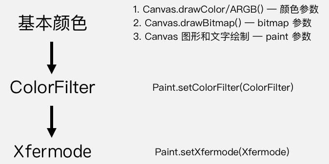

### 1.1 基本颜色

根据绘制内容的不同，像素基本颜色的控制方式也不同：

Canvas 的方法 | 像素颜色的设置方式
---|---
`drawColor/RGB/ARGB` | 像素颜色作为参数传入
`drawBitmap` | 与 bitmap 参数的像素颜色相同
图形和文字 `drawCircle / drawPath / drawText` | 在 Paint 参数中设置

通过 Paint 的方法设置颜色时，有两种方式：

* 直接用 `Paint.setColor/ARGB` 来设置颜色
* 通过 `Shader` 来指定着色方案

 
#### 1.1.1 直接设置颜色

##### 1.1.1.1 `setColor(int colir)` 

```java
mPaint.setColor(Color.parseColor("#009688"));
canvas.drawRect(30, 30, 230, 180, mPaint);
```

运行效果如下：


> 与 setColor 对应的是 `getColor()`

##### 1.1.1.2 `setARGB(int a, int r, int g, int b)`

```java
mPaint.setARGB(100,255,0,0);
canvas.drawRect(30, 30, 230, 180, mPaint);
```

运行效果如下：

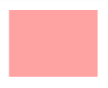

#### 1.1.2 `setShader(Shader)`

`Shader` 即着色器，也是用于设置绘制颜色的。`Shader` 是图形处理领域的通用概念，设置的是一个颜色方案（着色规则）。**设置 Shader 之后，在绘制图形或文字时会覆盖 `setColor/ARGB` 的颜色值。**

在 Android 中绘制时并不直接使用 `Shader` ，而是使用其子类：`LinearGradient`、`RadialGradient `、`SweepGradient `、`BitmapShader `、`ComposeShader`。

##### 1.1.2.1 `LinearGradient` 线性渐变 

`LinearGradient(float x0, float y0, float x1, float y1, int color0, int color1, Shader.TileMode tile)`

* `x0`、`y0`、`x1`、`y1` 确定渐变的两个端点（从而确定渐变角度）
* `color0`、`color1` 分别确定渐变的起始色和终止色
* `tile` 着色规则，类型为 `TileMode`。有三种值可选：`CLAMP`、`MIRROR`、`REPEAT`

TileMode | 效果示意
---|---
CLAMP | 
MIRROR | 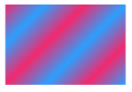
REPEAT | 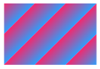

```java
Shader shader = new LinearGradient(100, 100, 500, 500,
        Color.parseColor("#E91E63"), Color.parseColor("#2196F3"),
        Shader.TileMode.CLAMP);
mPaint.setShader(shader);

// 因为设置了 Shader ，所以此处的颜色将不生效
mPaint.setColor(Color.RED);
canvas.drawCircle(300, 300, 200, mPaint);
```

运行效果如下：


##### 1.1.2.2 `RadialGradient ` 辐射渐变

`RadialGradient(float centerX, float centerY, float radius, int centerColor, int edgeColor, TileMode tileMode)`

* `centerX`、 `centerY`：辐射中心的坐标
* `radius`：辐射半径
* `centerColor`：辐射中心的颜色
* `edgeColor`：辐射边缘的颜色
* `tileMode`：着色模式。

```java
Shader shader = new RadialGradient(300, 300,  200,
                Color.parseColor("#E91E63"), Color.parseColor("#2196F3"),
                Shader.TileMode.CLAMP);
mPaint.setShader(shader);

canvas.drawCircle(300, 300, 200, mPaint);
```

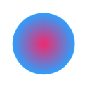

> 调整 RadialGradient 的 radius 和 tile 之后可以得到不同的显示效果。 


##### 1.1.2.3 `SweepGradient ` 扫描渐变

`SweepGradient(float cx, float cy, int color0, int color1)`

* `cx` 、`cy` ：扫描的中心
* `color0`：扫描的起始颜色
* `color1`：扫描的终止颜色

```java
Shader shader = new SweepGradient(300, 300,
                Color.parseColor("#E91E63"),
                Color.parseColor("#2196F3")
        );
mPaint.setShader(shader);

canvas.drawCircle(300, 300, 200, mPaint);
```

运行效果如下：


##### 1.1.2.4 `BitmapShader`

`BitmapShader(Bitmap bitmap, Shader.TileMode tileX, Shader.TileMode tileY)` 用 Bitmap 来着色，即用 Bitmap 的像素内容作为图形或者文字的填充。

* `bitmap`：用来做模板的 Bitmap 对象
* `tileX`：横向的 TileMode
* `tileY`：纵向的 TileMode。

```java
Bitmap bitmap = BitmapFactory.decodeResource(getResources(), R.drawable.batman);
Shader shader = new BitmapShader(bitmap, Shader.TileMode.CLAMP, Shader.TileMode.CLAMP);
paint.setShader(shader);
     
...
     
canvas.drawCircle(300, 300, 200, paint);
```

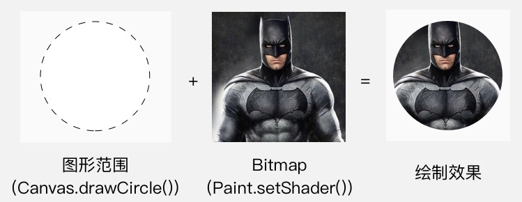

##### 1.1.2.5 `ComposeShader` 混合着色器

`ComposeShader(Shader shaderA, Shader shaderB, PorterDuff.Mode mode)`  将两个 Shader 混合使用。

* `shaderA`, `shaderB`：要被混合使用的两个 Shader
* `mode`: 两个 Shader 的叠加模式，即 shaderA 和 shaderB 应该怎样共同绘制。它的类型是 `PorterDuff.Mode` (详细可查看 1.4)。

```java
// 第一个 Shader：头像的 Bitmap
Bitmap bitmap1 = BitmapFactory.decodeResource(getResources(), R.drawable.batman);
Shader shader1 = new BitmapShader(bitmap1, Shader.TileMode.CLAMP, Shader.TileMode.CLAMP);

// 第二个 Shader
Bitmap bitmap2 = BitmapFactory.decodeResource(getResources(), R.drawable.batman_logo);
Shader shader2 = new BitmapShader(bitmap2, Shader.TileMode.CLAMP, Shader.TileMode.CLAMP);

// ComposeShader：结合两个 Shader
Shader shader = new ComposeShader(shader1, shader2, PorterDuff.Mode.SRC_OVER);
paint.setShader(shader);
     
...
     
canvas.drawCircle(300, 300, 300, paint);
```

> 注意：**上述代码中使用了两个 BitmapShader 来作为 ComposeShader() 的参数，但 ComposeShader() 在硬件加速下是不支持两个相同类型的 Shader 的，所以这里也需要关闭硬件加速才能看到效果。**

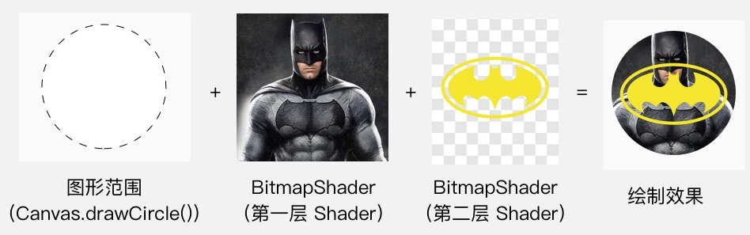


### 1.2 `setColorFilter(ColorFilter)`

`ColorFilter` 即为绘制设置颜色过滤，就是为绘制的内容设置一个统一的过滤策略，然后 `Canvas.drawXXX()` 方法会对每个像素都进行过滤后再绘制出来。

举几个现实中比较常见的颜色过滤的例子：

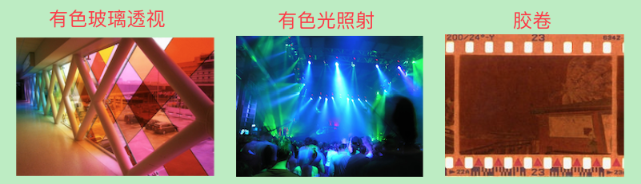

在 Paint 里设置 ColorFilter ，使用的是 `Paint.setColorFilter(ColorFilter filter)` 方法。 ColorFilter 并不直接使用，而是使用它的子类。它共有三个子类：`LightingColorFilter`、 `PorterDuffColorFilter` 和 `ColorMatrixColorFilter`。

#### 1.2.1 LightingColorFilter

`LightingColorFilter(int mul, int add)` ，参数里的 `mul` 和 `add` 都是和颜色值格式相同的 int 值，其中 `mul` 用来和目标像素相乘，`add` 用来和目标像素相加：

```java
R' = R * mul.R / 0xff + add.R
G' = G * mul.G / 0xff + add.G
B' = B * mul.B / 0xff + add.B
R' = R * mul.R / 0xff + add.R
```

一个 "保持原样" 的 "基本 LightingColorFilter"，`mul` 为 `0xffffff`，`add` 为 `0x000000`（也就是0），那么对于一个像素，它的计算过程就是：

```java
// R' = R
R' = R * 0xff / 0xff + 0x0 = R 
// G' = G
G' = G * 0xff / 0xff + 0x0 = G 
// B' = B
B' = B * 0xff / 0xff + 0x0 = B 
```

基于这个 "基本 LightingColorFilter "，你就可以修改一下做出其他的 filter。比如，如果想去掉原像素中的红色，可以把它的 mul 改为 `0x00ffff`（红色部分为 0 ） ，那么它的计算过程就是：

```
// 红色被移除
R' = R * 0x0 / 0xff + 0x0 = 0 
G' = G * 0xff / 0xff + 0x0 = G
B' = B * 0xff / 0xff + 0x0 = B
```

具体效果是这样的：

```java
Paint mPaint = new Paint();
Bitmap bitmap1 = BitmapFactory.decodeResource(getContext().getResources(), R.drawable.icon);

ColorFilter colorFilter = new LightingColorFilter(0x00ffff, 0x000000);
mPaint.setColorFilter(colorFilter);

canvas.drawBitmap(bitmap1,0,0,mPaint);
```

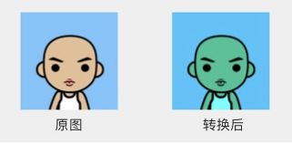

或者，如果你想让它的绿色更亮一些，就可以把它的 add 改为 `0x003000` （绿色部分为 0x30 ），那么它的计算过程就是：

```java
R' = R * 0xff / 0xff + 0x0 = R
// 绿色被加强
G' = G * 0xff / 0xff + 0x30 = G + 0x30 
B' = B * 0xff / 0xff + 0x0 = B
```

```java
Paint mPaint = new Paint();
Bitmap bitmap1 = BitmapFactory.decodeResource(getContext().getResources(), R.drawable.icon);

ColorFilter colorFilter = new LightingColorFilter(0x00ffff, 0x003000);
mPaint.setColorFilter(colorFilter);

canvas.drawBitmap(bitmap1,0,0,mPaint);
```

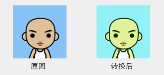

#### 1.2.2 PorterDuffColorFilter

`PorterDuffColorFilter(int color, PorterDuff.Mode mode)` **使用一个指定的颜色和一种指定的 PorterDuff.Mode 来与绘制对象进行合成**。

* `color` 是指定的颜色， 
* `mode` 参数是指定的 Mode 即 `PorterDuff.Mode`。

和 `ComposeShader` 不同的是，`PorterDuffColorFilter` 作为一个 ColorFilter，只能指定一种颜色作为源，而不是一个 Bitmap。

`PorterDuff.Mode` 的内容参考后续的 1.4.

```java
Paint mPaint = new Paint();
Bitmap bitmap1 = BitmapFactory.decodeResource(getContext().getResources(), R.drawable.icon);

ColorFilter colorFilter = new PorterDuffColorFilter(Color.RED, PorterDuff.Mode.OVERLAY);
mPaint.setColorFilter(colorFilter);

canvas.drawBitmap(bitmap1,0,0,mPaint);
```

运行效果如下:

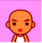

#### 1.2.3 ColorMatrixColorFilter

`ColorMatrixColorFilter` 使用 `ColorMatrix` 来对颜色进行处理。 `ColorMatrix` 内部是一个 4x5 的矩阵：

```java
[ a, b, c, d, e,
  f, g, h, i, j,
  k, l, m, n, o,
  p, q, r, s, t ]
```

通过计算， `ColorMatrix` 可以把要绘制的像素进行转换。对于颜色 `[R, G, B, A]` ，转换算法是这样的：

```java
R’ = a*R + b*G + c*B + d*A + e;
G’ = f*R + g*G + h*B + i*A + j;
B’ = k*R + l*G + m*B + n*A + o;
A’ = p*R + q*G + r*B + s*A + t;
```

`ColorMatrix` 有一些自带的方法可以做简单的转换，例如可以使用 `setSaturation(float sat)` 来设置饱和度；另外你也可以自己去设置它的每一个元素来对转换效果做精细调整。

具体的设置方式可以参考 [StyleImageView](https://github.com/chengdazhi/StyleImageView)，其效果如下：


### 1.3 `setXfermode(Xfermode)`

`Xfermode` 其实就是 `Transfer mode`，用 `X` 来代替 `Trans` 是一些美国人喜欢用的简写方式。严谨地讲，`Xfermode` 指的是你要绘制的内容和 `Canvas` 的目标位置的内容应该怎样结合计算出最终的颜色。但通俗地说，其实就是要你以绘制的内容作为源图像，以 View 中已有的内容作为目标图像，选取一个 `PorterDuff.Mode` 作为绘制内容的颜色处理方案。

创建 `Xfermode` 的时候其实是创建的它的子类 `PorterDuffXfermode`。事实上，`Xfermode` 也只有这一个子类。


```java
Xfermode xfermode = new PorterDuffXfermode(PorterDuff.Mode.SRC_IN);

mPaint.setColor(Color.YELLOW);
canvas.drawRect(0,0,500,300,mPaint);

mPaint.setColor(Color.BLUE);
mPaint.setXfermode(xfermode);
canvas.drawCircle(150,150,100,mPaint);

// 用完要重置
mPaint.setXfermode(null);
```

运行效果如下：

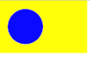


`PorterDuff.Mode` 在 Paint 一共有三处 API ，它们的工作原理都一样，只是用途不同：

API | 用途
---|---
ComposeShader | 混合两个 Shader
PorterDuffColorFilter | 增加一个单色的 ColorFilter
Xfermode | 设置绘制内容和 View  中已有内容的混合计算方式

### 1.4 `PorterDuff.Mode`

#### 1.4.1 `PorterDuff.Mode` 介绍

`PorterDuff.Mode` 用来指定两个图像共同绘制时的颜色策略。它是一个 `enum`，不同的 Mode 可以指定不同的策略。

`颜色策略` 即把源图像绘制到目标图像时二者样色的结合方式。对于 `ComposeShader(shaderA, shaderB, mode) `，`颜色策略` 就是指应该怎样把 shaderB 绘制在 shaderA 上从而得到一个结合后的 Shader。

上一小节中使用了 `Mode: SRC_OVER`。它的算法非常直观：就像上面图中的那样，把源图像直接铺在目标图像上。除此之外，还有其他效果，如下：

* `Mode.DST_OUT`

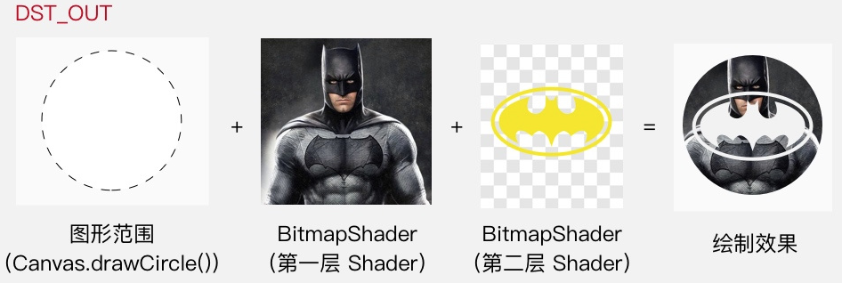

* `DST_IN`

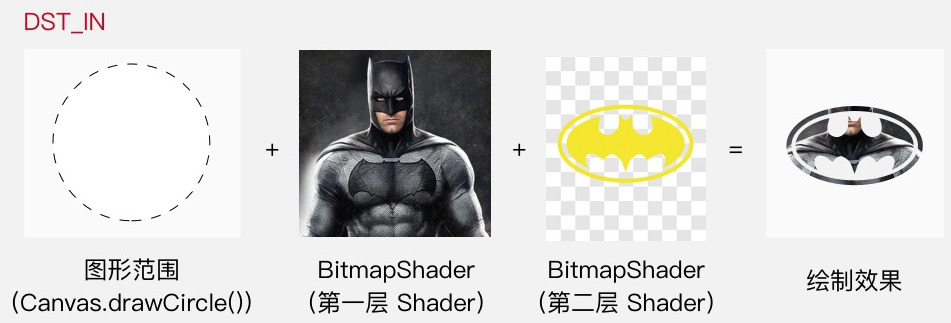


总的来说， `PorterDuff.Mode` 一共有 17 个，可以分为两类：

* Alpha 合成 (Alpha Compositing)
* 混合 (Blending)

#### 1.4.2 Alpha 合成

Alpha 合成，其实就是 `PorterDuff` 这个词所指代的算法。 

> `PorterDuff` 并不是一个具有实际意义的词组，而是两个人的名字（准确讲是姓）。这两个人当年共同发表了一篇论文，描述了 12 种将两个图像共同绘制的操作（即算法）。而这篇论文所论述的操作，都是关于 Alpha 通道（也就是我们通俗理解的「透明度」）的计算的，后来人们就把这类计算称为 Alpha 合成 ( Alpha Compositing ) 。

[具体效果如下 (效果源自官方文档)](https://developer.android.google.cn/reference/android/graphics/PorterDuff.Mode?hl=en)：


#### 1.4.3 混合

`混合`，即 Photoshop 等制图软件里的混合模式（如 multiply、darken、lighten 等）。

>这一类**操作的是颜色本身而不是 Alpha 通道**，并不属于 Alpha 合成，所以和 Porter 与 Duff 这两个人也没什么关系，不过为了使用的方便，它们同样也被 Google 加进了 PorterDuff.Mode 里。


从上面的效果图可以看出，Alpha 合成类的效果都比较直观，基本上可以使用简单的口头表达来描述它们的算法（起码对于不透明的源图像和目标图像来说是可以的），例如 `SRC_OVER` 表示「二者都绘制，但要源图像放在目标图像的上面」，`DST_IN` 表示「只绘制目标图像，并且只绘制它和源图像重合的区域」。

而混合类的效果就相对抽象一些，只从效果图不太能看得出它们的着色算法，更看不出来它们有什么用。

#### 1.4.4 `Xfermode` 注意事项

##### 1.4.4.1 使用离屏缓冲（`Off-screen Buffer`）

我们在使用 `Xfermode` 绘制时，可能会出现如下情况：


按照逻辑我们会认为，在第二步画圆的时候，跟它共同计算的是第一步绘制的方形。但实际上，却是整个 View 的显示区域都在画圆的时候参与计算，并且 View 自身的底色并不是默认的透明色，而且是遵循一种迷之逻辑，导致不仅绘制的是整个圆的范围，而且在范围之外都变成了黑色。就像这样：

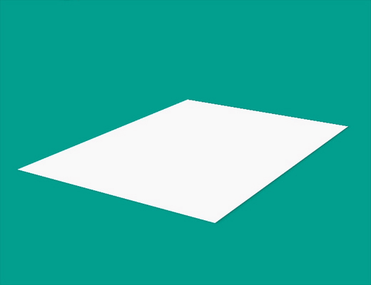

要想使用 `setXfermode()` 正常绘制，必须使用离屏缓存 `(Off-screen Buffer)` 把内容绘制在额外的层上，再把绘制好的内容贴回 View 中。也就是这样：


通过使用离屏缓冲，把要绘制的内容单独绘制在缓冲层， `Xfermode` 的使用就不会出现奇怪的结果了。使用离屏缓冲有两种方式：`Canvas.saveLayer()` 和 `View.setLayerType()`。

* `Canvas.saveLayer()`

`saveLayer()` 可以做短时的离屏缓冲。使用方法很简单，在绘制之前保存，绘制之后恢复。

未启用离屏缓存时的代码及效果如下：

```java
// 启用离屏缓存前的代码。
 Paint mPaint = new Paint();
 Xfermode xfermode = new PorterDuffXfermode(PorterDuff.Mode.DST_OUT);
 
mPaint.setColor(Color.YELLOW);
canvas.drawRect(0,0,500,300,mPaint);

mPaint.setXfermode(xfermode);
mPaint.setColor(Color.BLUE);
canvas.drawCircle(150,150,100,mPaint);
mPaint.setXfermode(null);
```

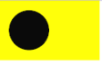

启用离屏缓存后的代码和效果如下：

```java
Paint mPaint = new Paint();
Xfermode xfermode = new PorterDuffXfermode(PorterDuff.Mode.DST_OUT);
 
int savedCanvas=canvas.saveLayer(0,0,500,300,mPaint);

mPaint.setColor(Color.YELLOW);
canvas.drawRect(0,0,500,300,mPaint);

mPaint.setXfermode(xfermode);
mPaint.setColor(Color.BLUE);
canvas.drawCircle(150,150,100,mPaint);
mPaint.setXfermode(null);

canvas.restoreToCount(savedCanvas);
```

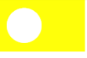

* `View.setLayerType()`

	- `View.setLayerType()` 是直接把整个 View 都绘制在离屏缓冲中。 	- `setLayerType(LAYER_TYPE_HARDWARE)` 是使用 GPU 来缓冲， 	- `setLayerType(LAYER_TYPE_SOFTWARE)` 是直接直接用一个 Bitmap 来缓冲。

如果没有特殊需求，可以选用第一种方法 `Canvas.saveLayer()` 来设置离屏缓冲，以此来获得更高的性能。更多关于离屏缓冲的信息，可以看[官方文档中对于硬件加速的介绍](https://developer.android.google.cn//guide/topics/graphics/hardware-accel.html)。

> 原文中没有对 `setLayerType()` 做更多解释，仅表示后续可能会有详细讲解。

##### 1.4.4.2 控制好透明区域

使用 `Xfermode` 绘制内容时，除了注意使用离屏缓冲，还应该注意控制它的透明区域不要太小，要让它足够覆盖到要和它结合绘制的内容，否则得到的结果很可能不是你想要的。如下图：


>到此为止，前面讲的就是 Paint 的第一类 API——关于颜色的三层设置：直接设置颜色的 API 用来给图形和文字设置颜色； `setColorFilter()` 用来基于颜色进行过滤处理； `setXfermode()` 用来处理源图像和 View 已有内容的关系。

再贴一次本章开始处的图作为回顾：


## 2、效果

效果类的 API ，指的就是抗锯齿、填充/轮廓、线条宽度等等这些。

### 2.1 `setAntiAlias (boolean aa)` 设置抗锯齿

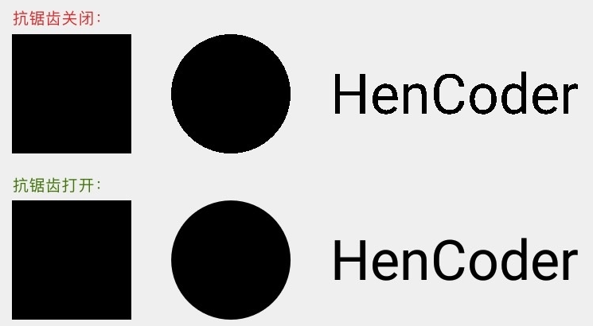

抗锯齿默认是关闭的，如果需要抗锯齿，需要显式地打开。除了 `setAntiAlias(aa) 方法`，还可以在构造 Paint  时打开抗锯齿：

```java
Paint paint = new Paint(Paint.ANTI_ALIAS_FLAG);
```

### 2.2 `setStyle(Paint.Style style)` 设置图形风格

用来设置图形是线条风格还是填充风格的（上一篇已经介绍过。）

```java
// FILL 模式，填充
paint.setStyle(Paint.Style.FILL); 
canvas.drawCircle(300, 300, 200, paint);
```

Style | 效果图
---|---
FILL | 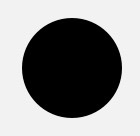
STROKE | 
FILL_AND_STROKE | 

### 2.3 线条形状

可以通过4个方法设置线条形状：`setStrokeWidth(float width)`, `setStrokeCap(Paint.Cap cap)`, `setStrokeJoin(Paint.Join join)`, `setStrokeMiter(float miter)` 。

#### 2.3.1 `setStrokeWidth(float width)`

##### 2.3.1.1 示例

```java
paint.setStyle(Paint.Style.STROKE);
paint.setStrokeWidth(1);
canvas.drawCircle(150, 125, 100, paint);
paint.setStrokeWidth(5);
canvas.drawCircle(400, 125, 100, paint);
paint.setStrokeWidth(40);
canvas.drawCircle(650, 125, 100, paint);
```

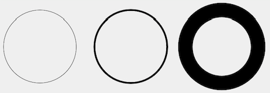

##### 2.3.1.2 线条宽度 0 和 1 的区别

默认情况下，线条宽度为 0，但你会发现，这个时候它依然能够画出线，线条的宽度为 1 像素。那么它和线条宽度为 1 有什么区别呢？

其实这个和后面要讲的一个「几何变换」有关：你可以为 Canvas 设置 Matrix 来实现几何变换（如放大、缩小、平移、旋转），在几何变换之后 Canvas 绘制的内容就会发生相应变化，包括线条也会加粗，例如 2 像素宽度的线条在 Canvas 放大 2 倍后会被以 4 像素宽度来绘制。而当线条宽度被设置为 0 时，它的宽度就被固定为 1 像素，就算 Canvas 通过几何变换被放大，它也依然会被以 1 像素宽度来绘制。Google 在文档中把线条宽度为 0 时称作 `hairline mode（发际线模式）`。

#### 2.3.2 `setStrokeCap(Paint.Cap cap)`

设置线头的形状。线头形状有三种：BUTT 平头、ROUND 圆头、SQUARE 方头。默认为 BUTT。

当线条的宽度是 1 像素时，这三种线头的表现是完全一致的，全是 1 个像素的点；而当线条变粗的时候，它们就会表现出不同的样子：

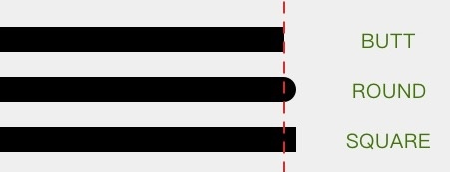

虚线是额外加的，虚线左边是线的实际长度，虚线右边是线头。有了虚线作为辅助，可以清楚地看出 BUTT 和 SQUARE 的区别。

#### 2.3.3 `setStrokeJoin(Paint.Join join)`

设置拐角的形状。有三个值可以选择：`MITER` 尖角、 `BEVEL` 平角和 `ROUND` 圆角。默认为 `MITER`。


MITER 和 BEVEL 的辅助理解：

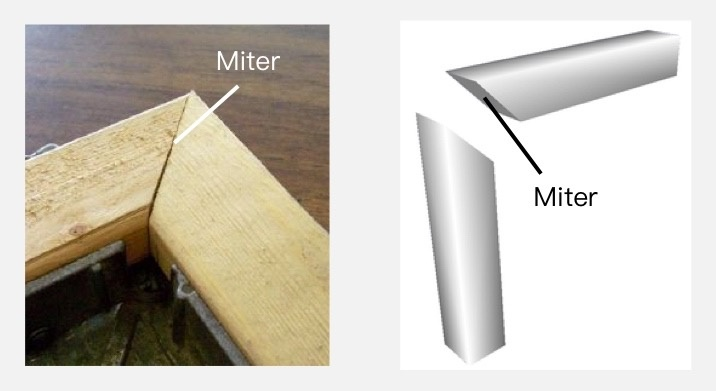

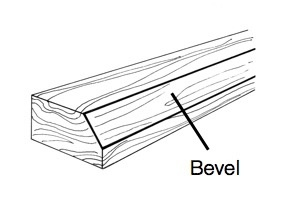

#### 2.3.4 `setStrokeMiter(float miter)` 

该方法是对 `setStrokeJoin()` 的一个补充，它用于设置 `MITER` 型拐角的延长线的最大值，超过该值则自动使用 BEVEL 来绘制尖角。所谓「延长线的最大值」，是这么一回事：

当线条拐角为 MITER 时，拐角处的外缘需要使用延长线来补偿：

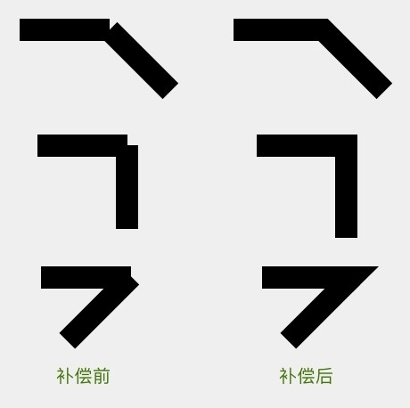

而这种补偿方案会有一个问题：如果拐角的角度太小，就有可能由于出现连接点过长的情况。比如这样:

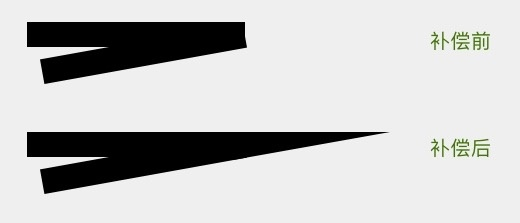

所以为了避免意料之外的过长的尖角出现， MITER 型连接点有一个额外的规则：**当尖角过长时，自动改用 BEVEL 的方式来渲染连接点**。例如上图的这个尖角，在默认情况下是不会出现的，而是会由于延长线过长而被转为 BEVEL 型连接点：

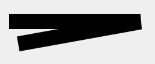

至于多尖的角属于过于尖，尖到需要转为使用 BEVEL 来绘制，则是由一个属性控制的，而这个属性就是 setStrokeMiter(miter) 方法中的 miter 参数。miter 参数是对于转角长度的限制，具体来讲，是指尖角的外缘端点和内部拐角的距离与线条宽度的比。也就是下面这两个长度的比：


用几何知识很容易得出这个比值的计算公式：如果拐角的大小为 θ ，那么这个比值就等于 1 / sin ( θ / 2 ) 。

这个 miter limit 的默认值是 4，对应的是一个大约 29° 的锐角，大于这个角的尖角会被保留，而小于这个夹角的就会被「削成平头」，该锐角如下：

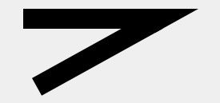

>所以，这个方法虽然名叫 setStrokeMiter(miter) ，但它其实设置的是「 线条在 Join 类型为 MITER 时对于 MITER 的长度限制」。它的这个名字虽然短，但却存在一定的迷惑性，如果叫 setStrokeJoinMiterLimit(limit) 就更准确了。

### 2.4 色彩优化

Paint 的色彩优化有两个方法： `setDither(boolean dither)` 和 `setFilterBitmap(boolean filter)` 。它们的作用都是让画面颜色变得更加「顺眼」，

#### 2.4.1 `setDither(boolean dither)` 设置图像的抖动

**图像的抖动**：是指把图像从较高色彩深度（即可用的颜色数）向较低色彩深度的区域绘制时，在图像中有意地插入噪点，通过有规律地扰乱图像来让图像对于肉眼更加真实的做法。

比如向 1 位色彩深度的区域中绘制灰色，由于 1 位深度只包含黑和白两种颜色，在默认情况下，即不加抖动的时候，只能选择向上或向下选择最接近灰色的白色或黑色来绘制，那么显示出来也只能是一片白或者一片黑。而加了抖动后，就可以绘制出让肉眼识别为灰色的效果了：

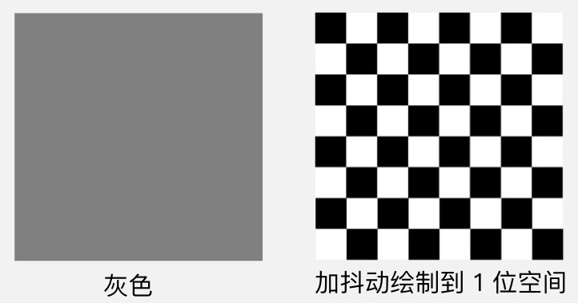

像上面这样，用黑白相间的方式来绘制，就可以骗过肉眼，让肉眼辨别为灰色了。

不过，抖动可不只可以用在纯色的绘制。在实际的应用场景中，**抖动更多的作用是在图像降低色彩深度绘制时，避免出现大片的色带与色块**。如下图（[来自维基百科的图](https://en.wikipedia.org/wiki/Dither)）：


在 Android 中通过如下一行代码即可实现抖动：

```java
paint.setDither(true);
```

目前，`setDither(dither)` 已经没有当年那么实用了，因为现在的 Android 版本的绘制，默认的色彩深度已经是 32 位的 `ARGB_8888` ，效果已经足够清晰了。只有当你向自建的 Bitmap 中绘制，并且选择 16 位色的 `ARGB_4444` 或者 `RGB_565` 的时候，开启它才会有比较明显的效果。

#### 2.4.2 `setFilterBitmap(boolean filter)` 是否使用双线性过滤来绘制 Bitmap

图像在放大绘制的时候，默认使用的是最近邻插值过滤，这种算法简单，但会出现马赛克现象；而如果开启了双线性过滤，就可以让结果图像显得更加平滑。如下图（[来自维基百科的图](https://zh.wikipedia.org/wiki/%E5%8F%8C%E7%BA%BF%E6%80%A7%E8%BF%87%E6%BB%A4)）：

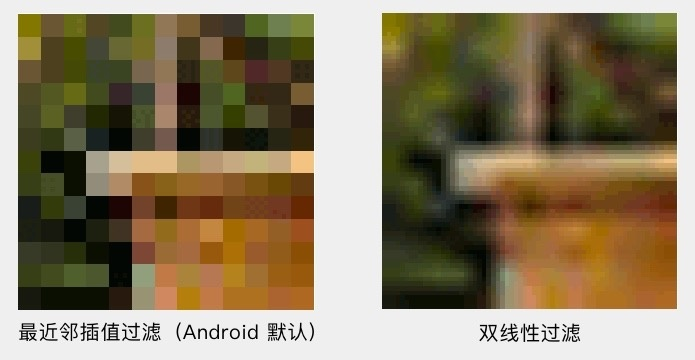

添加如下代码即可实现放大绘制 Bitmap 时开启双线性过滤：

```java
paint.setFilterBitmap(true);
```

以上就是 Paint 的两个色彩优化的方法：` setDither(dither)` ，设置抖动来优化色彩深度降低时的绘制效果； `setFilterBitmap(filterBitmap)` ，设置双线性过滤来优化 Bitmap 放大绘制的效果。

### 2.5 `setPathEffect(PathEffect effect)`

使用 `PathEffect` 来给图形的轮廓设置效果。对 Canvas 所有的图形绘制有效，也就是 `drawLine()`、`drawCircle()`、`drawPath()` 这些方法。大概像这样：

Android 中有 6 种 PathEffect，它们又可以分为两类

* 单一效果的 `CornerPathEffect`、`DiscretePathEffect`、`DashPathEffect`、`PathDashPathEffect` 
* 组合效果的 `SumPathEffect`、`ComposePathEffect`。

#### 2.5.1 CornerPathEffect

`CornerPathEffect(float radius)`,把所有拐角变成圆角，参数 `radius` 是圆角的半径

```java
Paint mPaint = new Paint();
PathEffect effect=new CornerPathEffect(20);

mPaint.setStyle(Paint.Style.STROKE);
mPaint.setStrokeWidth(3);
mPaint.setPathEffect(effect);
canvas.drawRect(50,50,400,300,mPaint);
```

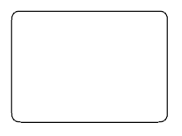

#### 2.5.2 DiscretePathEffect

`DiscretePathEffect(float segmentLength, float deviation)` 把线条进行随机的偏离，让轮廓变得乱七八糟。乱七八糟的方式和程度由参数决定。

* `segmentLength` 是用来拼接的每个线段的长度， 
* `deviation` 是偏离量

`DiscretePathEffect` 具体的做法是，把绘制改为使用定长的线段来拼接，并且在拼接的时候对路径进行随机偏离。

> discrete   [dɪˈskriːt] adj. 离散的，不连续的

```java
Paint      mPaint = new Paint();
PathEffect effect = new DiscretePathEffect(20, 30);

mPaint.setStyle(Paint.Style.STROKE);
mPaint.setStrokeWidth(3);
mPaint.setPathEffect(effect);

canvas.drawRect(50, 50, 400, 300, mPaint);
```

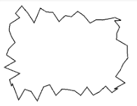

#### 2.5.3 DashPathEffect

`DashPathEffect(float[] intervals, float phase)` ， 使用虚线来绘制线条

* `intervals` 是一个数组，它指定了虚线的格式：**数组中元素必须为偶数（最少是 2 个）**，按照「画线长度、空白长度、画线长度、空白长度」……的顺序排列，例如上面代码中的 20, 5, 10, 5 就表示虚线是按照「画 20 像素、空 5 像素、画 10 像素、空 5 像素」的模式来绘制；
* `phase` 是虚线的偏移量。

```java
Paint mPaint = new Paint();
PathEffect effect=new DashPathEffect(new float[]{5,10,20,40},10);

mPaint.setStyle(Paint.Style.STROKE);
mPaint.setStrokeWidth(5);
mPaint.setPathEffect(effect);

canvas.drawCircle(300,300,200,mPaint);
```

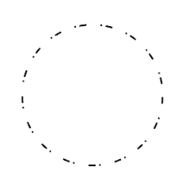


#### 2.5.4 PathDashPathEffect

`PathDashPathEffect(Path shape, float advance, float phase, PathDashPathEffect.Style style)`

* `shape` 用来作为虚线绘制的 Path ； 
* `advance` 是两个相邻的 shape 段之间的间隔，不过注意，这个**间隔是两个 shape 段的起点的间隔，而不是前一个的终点和后一个的起点的距离**； 
* `phase` 和 DashPathEffect 中一样，是虚线的偏移；
* `style`，是用来指定拐弯改变的时候 shape 的转换方式。style 的类型为 `PathDashPathEffect.Style`，是一个 enum ，具体有三个值：`TRANSLATE`：位移，`ROTATE`：旋转，`MORPH`：变体

```java
Paint mPaint        = new Paint();
Path  mTrianglePath = new Path();

{
    mTrianglePath.moveTo(30, 0);
    mTrianglePath.lineTo(60, 60);
    mTrianglePath.lineTo(0, 60);
    mTrianglePath.lineTo(30, 0);
}

PathEffect mDashPathEffect = new PathDashPathEffect(mTrianglePath, 65, 0, PathDashPathEffect.Style.MORPH);

//...

mPaint.setStyle(Paint.Style.STROKE);
mPaint.setStrokeWidth(3);
mPaint.setPathEffect(mDashPathEffect);

canvas.drawRoundRect(50, 50, 650, 450, 150, 150, mPaint);
```

效果图如下：

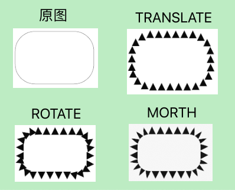

至此，单一效果的 PathEffect 已经介绍完毕，接下来将介绍组合的 PathEffect

#### 2.5.5 SumPathEffect

这是一个组合效果类的 PathEffect 。它的行为特别简单，就是**分别按照两种 PathEffect 分别对目标进行绘制，将得到两个绘制目标。**

```java
Paint mPaint = new Paint();
Path  mPath  = new Path();

{
    mPath.lineTo(200, 300);
    mPath.lineTo(400, 100);
    mPath.lineTo(600, 250);
    mPath.lineTo(700, 50);
}

PathEffect    mDashPathEffect     = new DashPathEffect(new float[]{5, 10, 30, 10}, 0);
PathEffect    mDiscretePathEffect = new DiscretePathEffect(40, 25);
SumPathEffect mSumPathEffect      = new SumPathEffect(mDashPathEffect, mDiscretePathEffect);

@Override
protected void onDraw(Canvas canvas) {
    super.onDraw(canvas);

    mPaint.setStyle(Paint.Style.STROKE);
    mPaint.setStrokeWidth(3);
    mPaint.setPathEffect(mSumPathEffect);

    canvas.drawPath(mPath, mPaint);
}
```

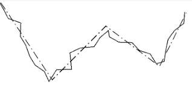


#### 2.5.6 ComposePathEffect

`ComposePathEffect(PathEffect outerpe, PathEffect innerpe)`

* `innerpe` 是先应用的， 
* `outerpe` 是后应用的。

这也是一个组合效果类的 PathEffect 。不过它是先对目标 Path 使用一个 PathEffect，然后再对这个改变后的 Path 使用另一个 PathEffect。**将得到一个组合后的绘制目标**。

```java
 Paint mPaint = new Paint();
    Path  mPath  = new Path();

    {
        mPath.lineTo(200, 300);
        mPath.lineTo(400, 100);
        mPath.lineTo(600, 250);
        mPath.lineTo(700, 50);
    }

    PathEffect        mDashPathEffect     = new DashPathEffect(new float[]{5, 10, 30, 10}, 0);
    PathEffect        mDiscretePathEffect = new DiscretePathEffect(40, 25);
    
    // 先做偏离，再做虚线
    ComposePathEffect mSumPathEffect      = new ComposePathEffect(mDashPathEffect, mDiscretePathEffect);

    @Override
    protected void onDraw(Canvas canvas) {
        super.onDraw(canvas);

        mPaint.setStyle(Paint.Style.STROKE);
        mPaint.setStrokeWidth(5);
        mPaint.setPathEffect(mSumPathEffect);

        canvas.drawPath(mPath, mPaint);
    }
```

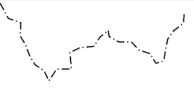

>注意： PathEffect 在有些情况下不支持硬件加速，需要关闭硬件加速才能正常使用：

>`Canvas.drawLine()` 和 `Canvas.drawLines()` 方法画直线时，`setPathEffect() `是不支持硬件加速的；
`PathDashPathEffect` 对硬件加速的支持也有问题，所以当使用 `PathDashPathEffect` 的时候，最好也把硬件加速关了。

---

`setShadowLayer()` 和 `setMaskFilter()` ，它们和前面的效果类方法有点不一样：它们设置的是「附加效果」，也就是基于在绘制内容的额外效果。

### 2.6 `setShadowLayer(,,,)`

#### 2.6.1 `setShadowLayer(,,,)` 使用介绍
`setShadowLayer(float radius, float dx, float dy, int shadowColor)` 在之后的绘制内容下面加一层阴影。

*  `radius` 是阴影的模糊范围； 
*  `dx`、`dy` 是阴影的偏移量； 
*  `shadowColor` 是阴影的颜色

如果要清除阴影层，使用 **clearShadowLayer()**

```java
mPaint.setStrokeWidth(3);
mPaint.setStyle(Paint.Style.STROKE);
mPaint.setShadowLayer(10, 0, 0, Color.RED);

canvas.drawRoundRect(50,50,450,350,15,15,mPaint);
```

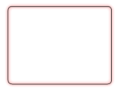

#### 2.6.2 注意事项

* 在硬件加速开启的情况下， `setShadowLayer()` 只支持文字的绘制，文字之外的绘制必须关闭硬件加速才能正常绘制阴影。

* 如果 `shadowColor` 是半透明的，阴影的透明度就使用 `shadowColor` 自己的透明度；而如果 `shadowColor` 是不透明的，阴影的透明度就使用 `paint` 的透明度。


### 2.7 `setMaskFilter(MaskFilter maskfilter)`

为**之后**的绘制设置 `MaskFilter`。

>`setShadowLayer()`是设置的在绘制层下方的附加效果；而这个 `MaskFilter` 和它相反，设置的是在绘制层上方的附加效果。

>到现在已经有两个 `setXxxFilter(filter)` 了。前面有一个 `setColorFilter(filter)` ，是对每个像素的颜色进行过滤；而这里的 `setMaskFilter(filter)` 则是基于整个画面来进行过滤。

`MaskFilter` 有两种： `BlurMaskFilter` 和 `EmbossMaskFilter`。

#### 2.7.1 BlurMaskFilter 模糊效果

`BlurMaskFilter(float radius, BlurMaskFilter.Blur style) `中， `radius` 参数是模糊的范围， `style` 是模糊的类型。一共有四种：

* `NORMAL`: 内外都模糊绘制
* `SOLID`: 内部正常绘制，外部模糊
* `INNER`: 内部模糊，外部不绘制
* `OUTER`: 内部不绘制，外部模糊

```java
Paint          mPaint          = new Paint();
Bitmap         mBitmap         = BitmapFactory.decodeResource(getResources(), R.drawable.joke);
BlurMaskFilter mBlurMaskFilter = new BlurMaskFilter(80, BlurMaskFilter.Blur.NORMAL);

@Override
protected void onDraw(Canvas canvas) {
    super.onDraw(canvas);

    mPaint.setMaskFilter(mBlurMaskFilter);
    canvas.drawBitmap(mBitmap, 100, 100, mPaint);
}
```

上述代码中 `joke.png` 原图如下:


我们在构造 BlurMaskFilter 时传递不同的 `BlurMaskFilter.Blur` 时将得到如下不同的效果：


#### 2.7.2 EmbossMaskFilter 浮雕效果

`EmbossMaskFilter(float[] direction, float ambient, float specular, float blurRadius)`

* `direction` 是一个 3 个元素的数组，指定了光源的方向； 
* `ambient` 是环境光的强度，数值范围是 0 到 1； 
* `specular` 是炫光的系数； 
* `blurRadius` 是应用光线的范围。

```java
Paint            mPaint          = new Paint();
Bitmap           mBitmap         = BitmapFactory.decodeResource(getResources(), R.drawable.joke);
EmbossMaskFilter mBlurMaskFilter = new EmbossMaskFilter(new float[]{0,1,1},0.2f,10,12);

@Override
protected void onDraw(Canvas canvas) {
    super.onDraw(canvas);

    mPaint.setMaskFilter(mBlurMaskFilter);
    canvas.drawBitmap(mBitmap, 100, 100, mPaint);
}
```

下图效果来自原文：


> CnPeng 2020-05-26 
> 
> 实际测试时未能复现上图中的效果，而且，在 android-29 的文档中，该类已经被标记为废弃，且有如下注释：@deprecated This subclass is not supported and should not be instantiated.

### 2.8 获取绘制的 Path

这是效果类的最后一组方法，也是效果类唯一的一组 get 方法。

这组方法做的事是，**根据 paint 的设置，计算出绘制 Path 或文字时的实际 Path。**

这里你可能会冒出两个问题：

* 什么叫「实际 Path」？ Path 就是 Path，这加上个「实际」是什么意思？
* 文字的 Path ？文字还有 Path？

这两个问题的答案就在后面的内容里。

#### 2.8.1 `getFillPath(Path src, Path dst)`

`实际 Path` ，指的就是 `drawPath()` 所绘制内容的轮廓，要算上线条宽度和设置的 PathEffect。

默认情况下（线条宽度为 0、没有 PathEffect），原 Path 和实际 Path 是一样的；而在线条宽度不为 0 （并且模式为 STROKE 模式或 `FLL_AND_STROKE` ），或者设置了 PathEffect 的时候，实际 Path 就和原 Path 不一样了：

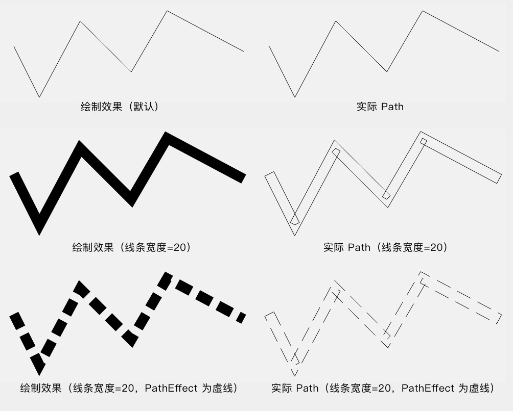

通过 `getFillPath(src, dst)` 会计算出实际 Path，然后把结果保存在 dst 里。

* `src` 是原 Path ，
* `dst` 就是实际 Path 的保存位置

#### 2.8.2 `getTextPath(,,,,,)`

* `getTextPath(String text, int start, int end, float x, float y, Path path)` 
* `getTextPath(char[] text, int index, int count, float x, float y, Path path)`

`文字的 Path`: 在绘制文字时，使用 `Canvas.drawText()` 方法，在该方法底层，文字信息全是被转化成图形，对图形进行绘制的。 `getTextPath()` 方法，获取的就是目标文字所对应的 Path 。这就是所谓 `文字的 Path`。

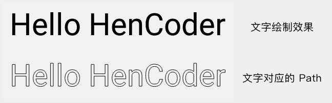

---

`getFillPath()` 和 `getTextPath()` ，就是获取绘制的 Path 的方法。之所以把它们归类到「效果」类方法，是因为它们主要是用于图形和文字的装饰效果的位置计算，比如[自定义的下划线效果:](https://medium.com/google-developers/a-better-underline-for-android-90ba3a2e4fb)

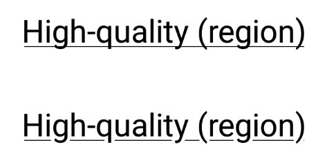

## 3、`drawText()` 相关

Paint 有些设置是和文字绘制相关的，即和 `drawText()` 相关的。

比如设置文字大小：

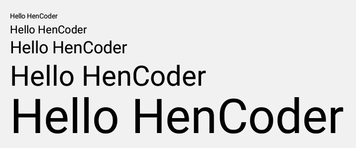

比如设置文字间隔：

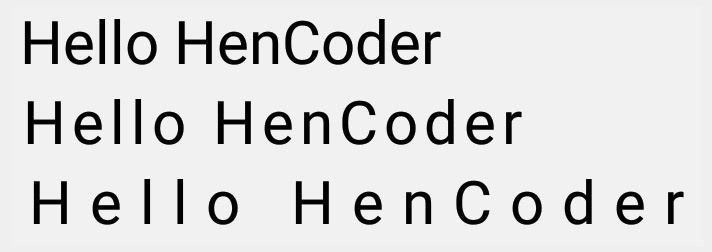

比如设置各种文字效果：

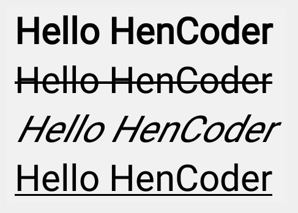

除此之外，Paint 还有很多与文字绘制相关的设置或计算的方法，非常详细。具体可查看 [3-drawText()文字的绘制.md](3-drawText()文字的绘制.md)

## 4、初始化

这一类方法很简单，它们是用来初始化 Paint 对象，或者是批量设置 Paint 的多个属性的方法。

### 4.1 `reset()`

重置 Paint 的所有属性为默认值。相当于重新 new 一个，不过性能当然高一些啦。

### 4.2 `set(Paint src)`

把 src 的所有属性全部复制过来。相当于调用 src 所有的 get 方法，然后调用这个 Paint 的对应的 set 方法来设置它们。

### 4.3 `setFlags(int flags)`

批量设置 flags。相当于依次调用它们的 set 方法。例如：

```java
paint.setFlags(Paint.ANTI_ALIAS_FLAG | Paint.DITHER_FLAG);
```

等价于:

```java
paint.setAntiAlias(true);
paint.setDither(true);
```

---

以上就是 Paint 的四类方法：颜色类、效果类、文字绘制相关以及初始化类。其中颜色类、效果类和初始化类都已经在这节里面讲过了，剩下的一类——文字绘制类，[将在下一篇中讲解](3-drawText()文字的绘制.md)。