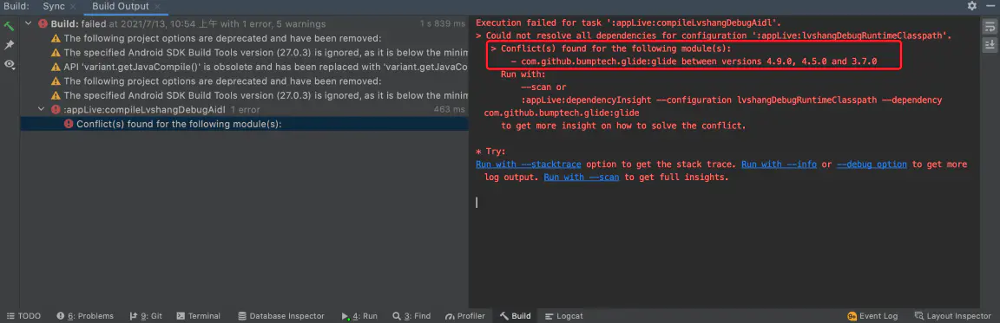

# 1. 46-快速解决Android项目依赖冲突

[原文链接：《快速解决Android项目依赖冲突》](https://www.jianshu.com/p/4fd0e50cd335)

冲突类型无非是类、jar包重复，比如：



## 1.1. 方案1：精确查找有冲突的依赖库

### 1.1.1. 显示冲突依赖详细信息

在 App 模块的 build.gradle 中增加配置：

```groovy
android {
    defaultConfig{
        configurations.all {
            resolutionStrategy {
            // 显示冲突的依赖库版本信息
            failOnVersionConflict()
        }
    }
}
```

### 1.1.2. 编译，查看控制台详细输出

下面的图例显示项目中存在 4.9.0、4.5.0 和 3.7.0 三个版本的 glide


### 1.1.3. 直接修改对应依赖版本

在对应模块的 build.gradle 里面修改为同一个版本号即可

```groovy
dependencies {
    implementation "com.github.bumptech.glide:glide:4.9.0"
}
```

## 1.2. 方案2：使用exclude进行依赖排除

使用依赖排除的方式

### 1.2.1. project依赖排除示例

```groovy
// 引用 eduhdsdk 模块，并排除 umeng的common模块
api (project(': eduhdsdk')){
    exclude group: 'com.umeng.umsdk', module: 'common'
}
```

### 1.2.2. 远程依赖排除示例

```groovy
// 引用 socket.io-client 库，并排除 json 模块
implementation("io.socket:socket.io-client:1.0.0") {
    exclude group: 'org.json', module: 'json'
}
```

## 1.3. 使用全局强制指定依赖版本

部分情况，可能使用 exclude 排除无法解决，则可以进行全局强制指定依赖库版本

```groovy
android {
    defaultConfig{
        configurations.all {
            resolutionStrategy {
                // 强制使用 28.0.2 版本的 support 包
                force 'com.android.support:support-v4:28.0.2'
                // 强制使用 4.9.0 版本的 glide 库
                force 'com.github.bumptech.glide:glide:4.9.0'
                // 展示错误信息
                failOnVersionConflict()
            }
        }
    }
}
```

## 1.4. 补充：如何exclude aar包中的某个jar包

参考链接：[如何exclude aar包中的某个jar包](https://blog.csdn.net/HuangLin_Developer/article/details/80614497)

假如要移除的jar包在aar包中的classes.jar中：

核心：

① 解压 aar 文件到 tmpDir 目录下

```
unzip ×××.aar -d tmpDir
```

② 找到 classes.jar 包，用压缩工具打开，删除目标文件

③ 将tmpDir重新打包成一个新的aar

```
// 注意末尾有个 .
jar cvf ×××NewLib.aar -C tmpDir/ .
```