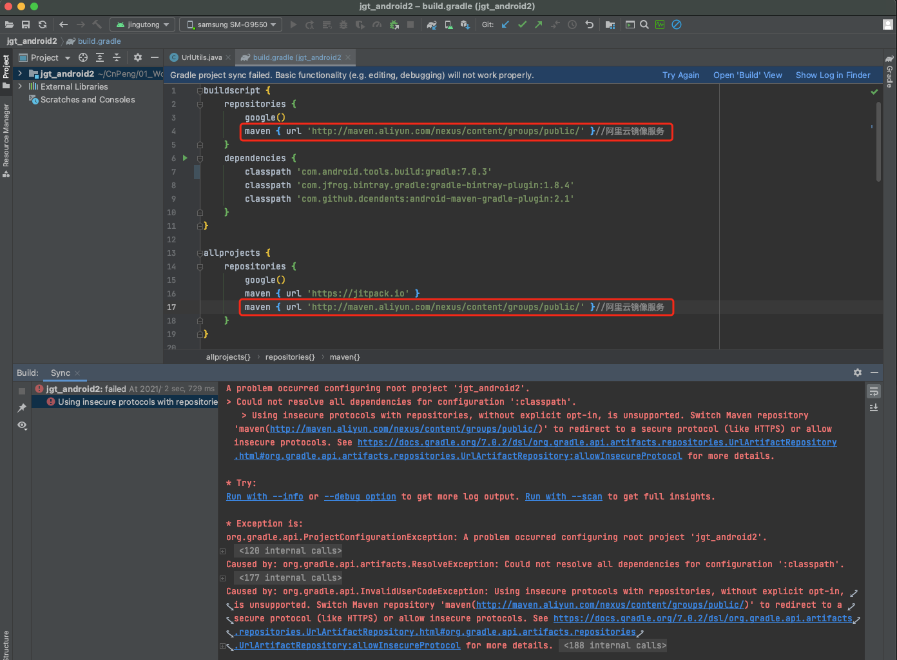
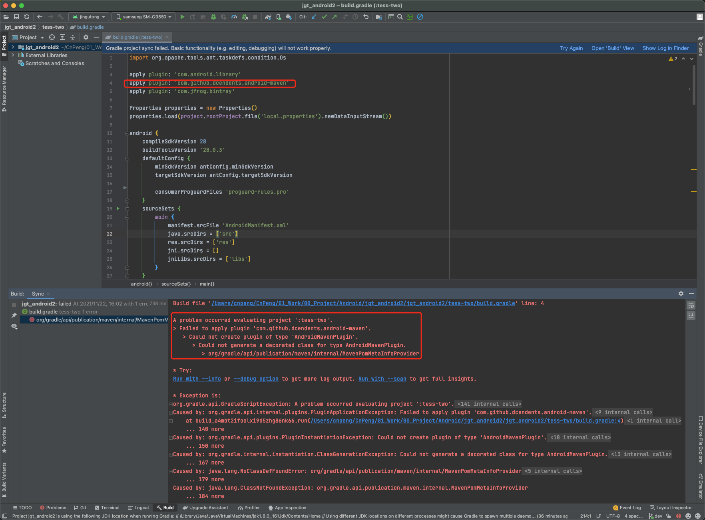
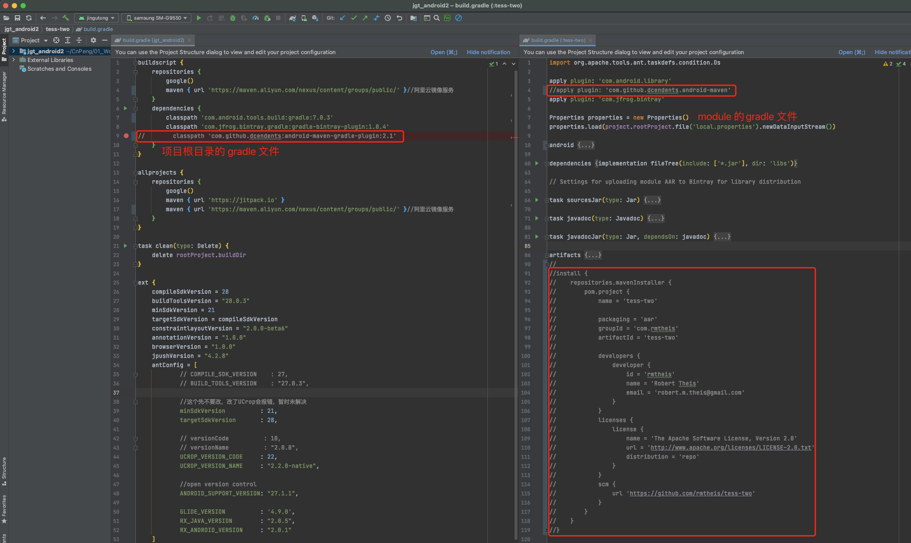
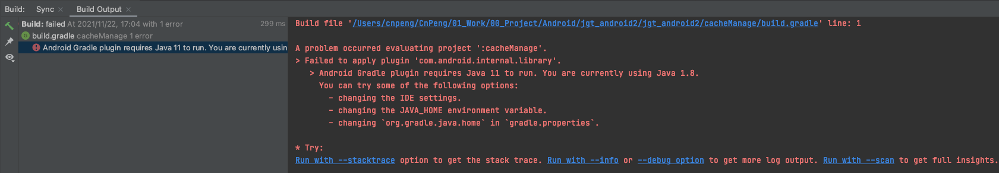
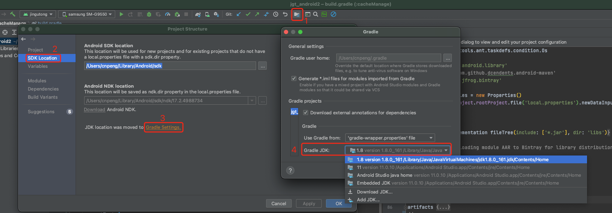
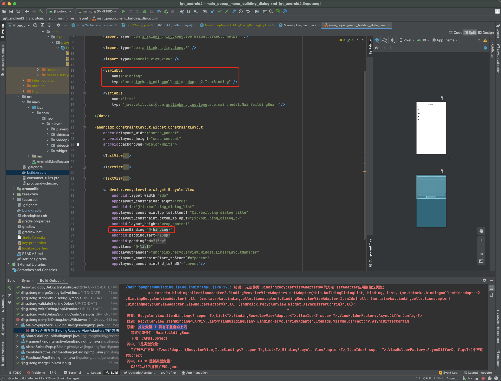

# 1. 从gradle3.5.0升级到7.0.3的问题整理

## 1.1. ResolveException

### 1.1.1. 问题现象

```java
A problem occurred configuring root project 'jgt_android2'.
> Could not resolve all dependencies for configuration ':classpath'.
   > Using insecure protocols with repositories, without explicit opt-in, is unsupported. Switch Maven repository 'maven(http://maven.aliyun.com/nexus/content/groups/public/)' to redirect to a secure protocol (like HTTPS) or allow insecure protocols. See https://docs.gradle.org/7.0.2/dsl/org.gradle.api.artifacts.repositories.UrlArtifactRepository.html#org.gradle.api.artifacts.repositories.UrlArtifactRepository:allowInsecureProtocol for more details. 

* Try:
Run with --info or --debug option to get more log output. Run with --scan to get full insights.

* Exception is:
org.gradle.api.ProjectConfigurationException: A problem occurred configuring root project 'jgt_android2'

Caused by: org.gradle.api.artifacts.ResolveException: Could not resolve all dependencies for configuration ':classpath'.

Caused by: org.gradle.api.InvalidUserCodeException: Using insecure protocols with repositories, without explicit opt-in, is unsupported. Switch Maven repository 'maven(http://maven.aliyun.com/nexus/content/groups/public/)' to redirect to a secure protocol (like HTTPS) or allow insecure protocols. See https://docs.gradle.org/7.0.2/dsl/org.gradle.api.artifacts.repositories.UrlArtifactRepository.html#org.gradle.api.artifacts.repositories.UrlArtifactRepository:allowInsecureProtocol for more details.
```



### 1.1.2. 解决

将 http 的 maven 仓库改成 https 的

## 1.2. could not create plugin of type 'AndroidMavenPlugin'

### 1.2.1. 错误信息



### 1.2.2. 解决方案

`android-maven-gradle-plugin` 是为了将我们的 module 发布到 maven 仓库的，如果我们的项目不需要发布，则可以直接将对应的 maven 内容注释掉即可（含项目主目录的 build.gradle 和 module 的  build.gradle 文件）。如下：



### 1.2.3. 补充：

如果需要发布到 maven 仓库，需要使用新的 [maven-publish-plugin](https://developer.android.google.cn/studio/build/maven-publish-plugin)

具体步骤参考：

* [https://docs.gradle.org/current/userguide/publishing_maven.html](https://docs.gradle.org/current/userguide/publishing_maven.html)

* [《android maven发布插件使用指南》](https://www.jianshu.com/p/862fa52fba39)

## 1.3. Android Gradle plugin requires Java 11 to run. You are currently using Java 1.8.

### 1.3.1. 问题



### 1.3.2. 解决方案



## 1.4. 推论变量 T 具有不兼容的上限

### 1.4.1. 问题现象



### 1.4.2. 解决


