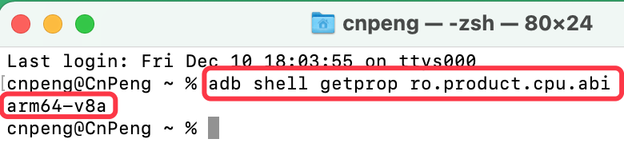

# 1. 查看手机cpu架构信息

## 1.1. 为什么

Android 手机架构有 `'armeabi-v7a'`, `'arm64-v8a'`, `'x86'` 等，按照 [《Google Play-指南-支持 64 位架构》](https://developer.android.google.cn/distribute/best-practices/develop/64-bit) 中的描述，如果我们的 app 项目中使用了 C 语言或者 C 语言相关的库，则必须在表示 64 位架构的`lib/arm64-v8a` 或 `lib/x86_64` 目录中添加对应的 `.so` 库文件。

## 1.2. 怎么办

为了方便测试支持情况，我们就需要获知测试手机的架构模式。

将手机连接到电脑，然后打开命令行工具，并输入：`adb shell getprop ro.product.cpu.abi`，如下图：

## 1.3. 补充

更多兼容 64 位架构的操作可参考 [《Google Play-指南-支持 64 位架构》](https://developer.android.google.cn/distribute/best-practices/develop/64-bit) 