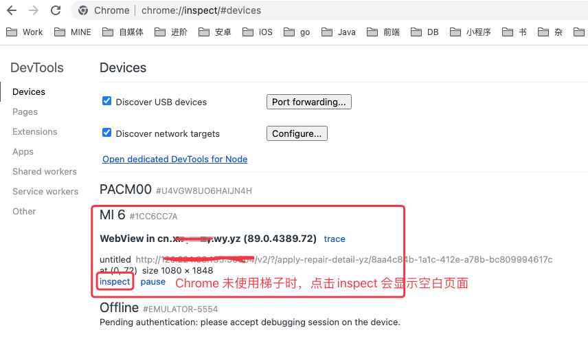
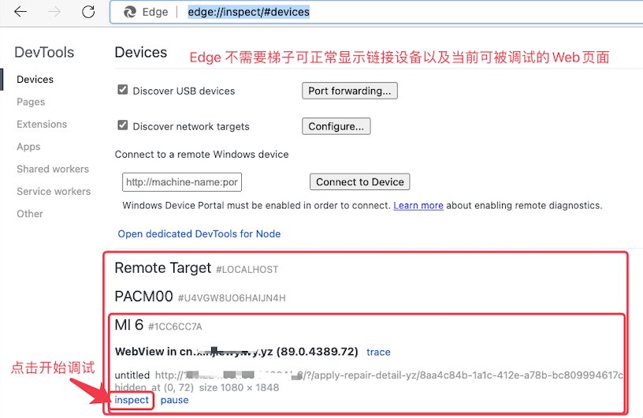
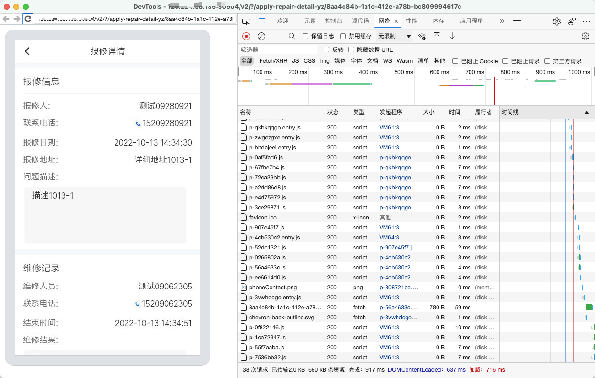

# 1. 53-调试WebView页面的内容

## 1.1. 准备

* 手机开启开发者模式、USB调试。
* 安装 Chrome 浏览器或者 Edge 浏览器。
* Android 端 WebView 初始化时调用 `WebView.setWebContentsDebuggingEnabled(true);` 启用调试。

## 1.2. 调试

* Chrome 浏览器打开：[chrome://inspect/#devices](chrome://inspect/#devices)

* Edge 浏览器打开：[edge://inspect/#devices](edge://inspect/#devices)

调试页面如下：

