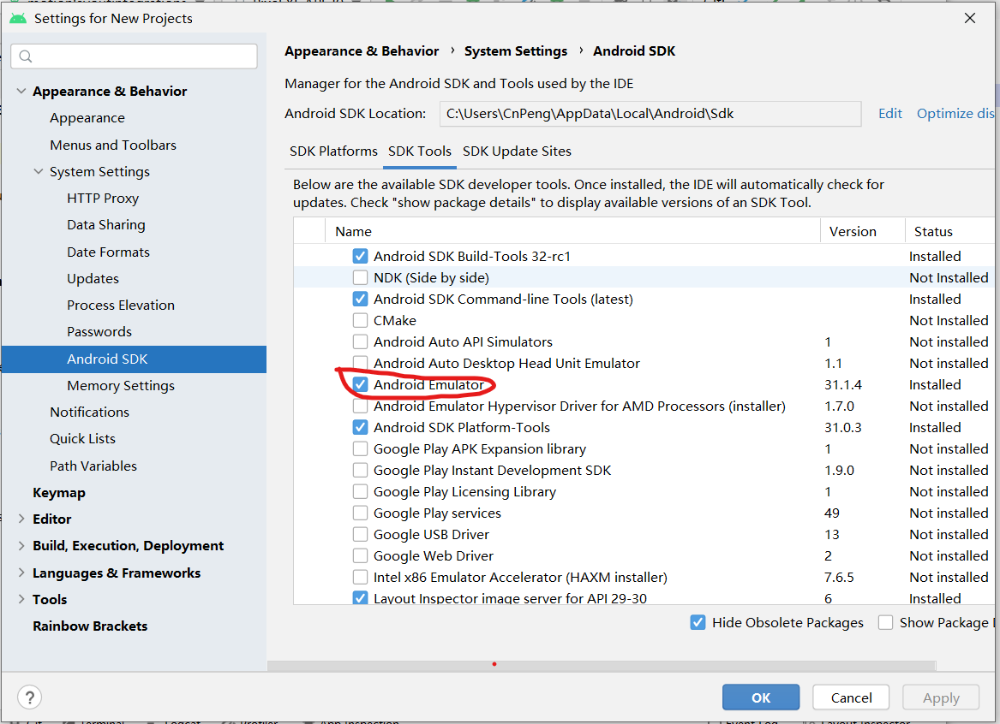
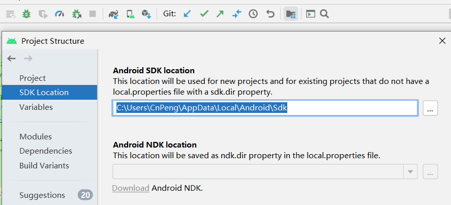
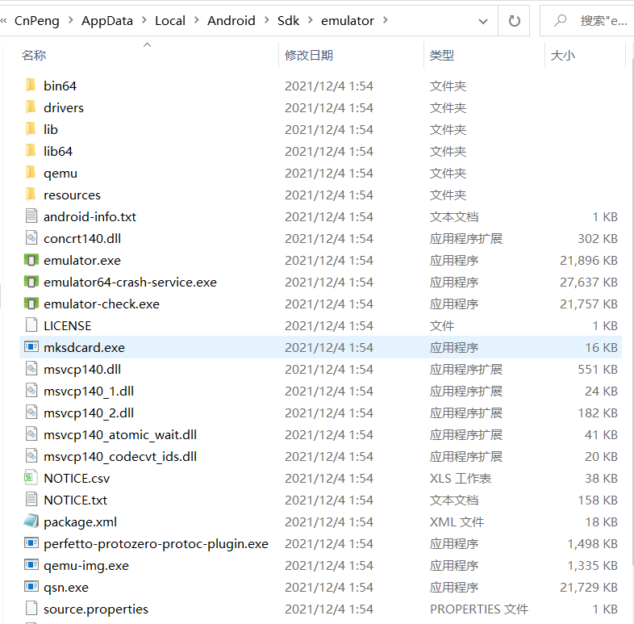

# 1. Windows下在AS中创建模拟器时一直提示未安装模拟器

Windows 系统下的 AndroidStudio 中创建模拟器时，一直提示 `no emulator installed` ， 导致无法创建。

## 1.1. 先尝试卸载已有的 emulator

先尝试从 SDK 管理工具中卸载现有的 emulator ， 如下图：

然后再重新创建，在创建过程中会提示我们重新下载和安装  enmulator , 但当我们下载和安装完成之后，创建模拟器时还是提示 `no emulator installed`。

## 1.2. 查看 sdk 目录，确认 emulator 是否存在

点击 AndroidStudio 中的 `Project Struct` 按钮，查看 sdk 目录，如下图：

然后进入windows 系统中的上述路径，查看 emulator 目录下的内容正常，如下图：

所以，我们可以确定 emulator 镜像没有问题。但问题在哪呢？

## 1.3. 关掉杀毒软件

执行完上一小节中的操作依旧无法创建时，尝试关闭系统的杀毒软件。然后再次尝试创建，创建成功！！！

千想万想，却怎么也想不到竟然是杀毒软件导致的。