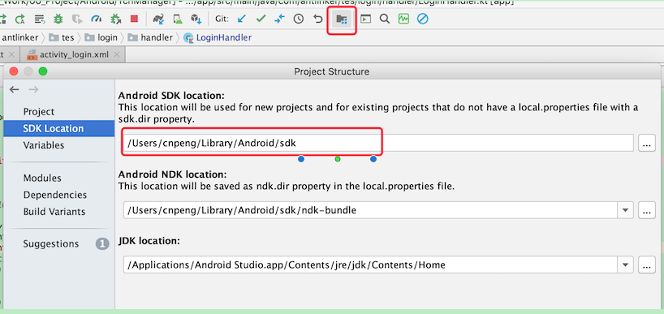

MAC 下配置环境变量，以 adb 的配置为例：

* 先打开终端，然后输入

```		
// 切换到根目录
cd ~/
```

* 打开配置文件

```
//方式1：编辑时以普通文本模式编辑，关闭即保存
open -e .bash_profile		

//方式2：以 vim 方式编辑，编辑和保存时需要使用 vim 命令
vim .bash_profile

// 注意：如果配置文件不存在，可通过 touch 命令创建，如下
touch .bash_profile

```

* 查看 Android SDK 目录



* 编辑配置文件

```
# 声明 SDK 目录变量
export ANDROID_SDK_ROOT=/Users/cnpeng/Library/Android/sdk
# 将 SDK 中的 tools 目录追加到环境变量 ${PATH} 表示已有的 PATH，:$xxx 表示末尾追加
export PATH=${PATH}:${ANDROID_SDK_ROOT}/tools
# 将 SDK 中的 platform-tools 目录追加到环境变量
export PATH=${PATH}:${ANDROID_SDK_ROOT}/platform-tools
```

* 让修改立即生效

```
source .bash_profile
```

**注意：如果 重启终端 或者 重启电脑 之后，环境变量又失效了，可以参考 [05、MAC重启后环境变量失效的解决.md](05、MAC重启后环境变量失效的解决.md) 解决**


相关参考：

* [vi / vim 编辑器的基本使用介绍](https://blog.csdn.net/north1989/article/details/53367461)

* [mac下ADB环境变量的配置（以android adb为例）](https://www.jianshu.com/p/618d55a79832)

* [配置gradle环境变量以及gradle: Permission denied解决方案](https://blog.csdn.net/zhichaosong/article/details/81148184)