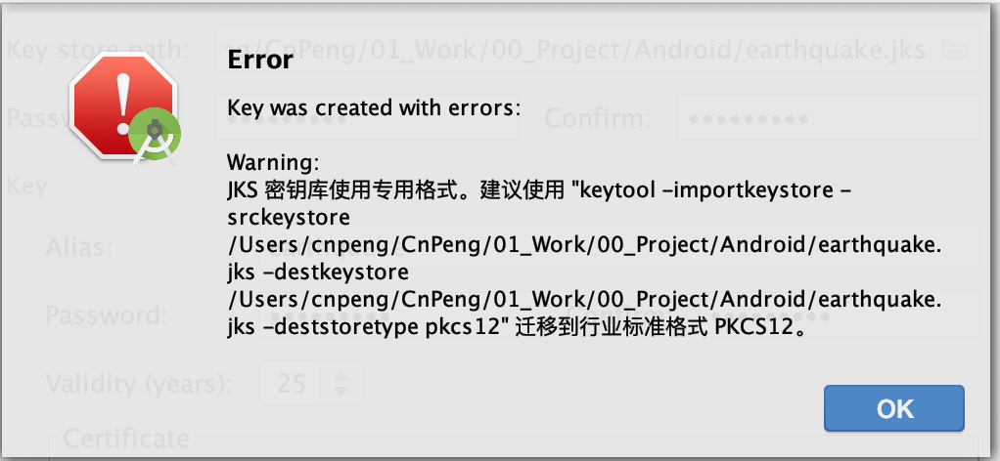
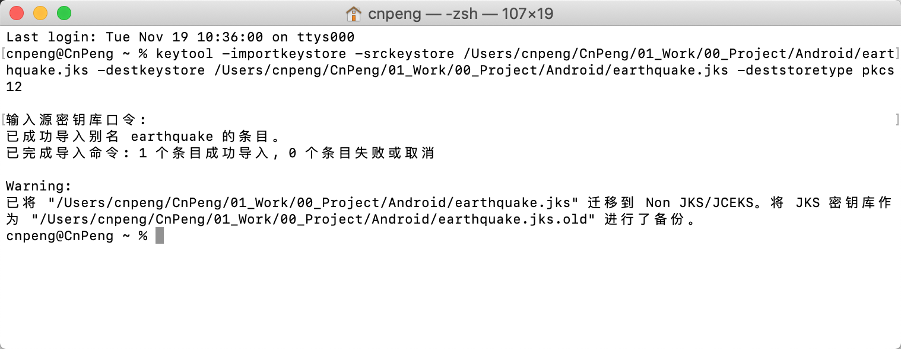

新项目创建 key 并准备打包时出现如下提示：



含义就是将 key 文件的格式迁移到 pkcs12 格式，具体操作就按照上图中的建议执行就可以了。



* 完整命令及结果如下：

```
Last login: Tue Nov 19 10:36:00 on ttys000
cnpeng@CnPeng ~ % keytool -importkeystore -srckeystore /Users/cnpeng/CnPeng/01_Work/00_Project/Android/earthquake.jks -destkeystore /Users/cnpeng/CnPeng/01_Work/00_Project/Android/earthquake.jks -deststoretype pkcs12

输入源密钥库口令:  
已成功导入别名 earthquake 的条目。
已完成导入命令: 1 个条目成功导入, 0 个条目失败或取消

Warning:
已将 "/Users/cnpeng/CnPeng/01_Work/00_Project/Android/earthquake.jks" 迁移到 Non JKS/JCEKS。将 JKS 密钥库作为 "/Users/cnpeng/CnPeng/01_Work/00_Project/Android/earthquake.jks.old" 进行了备份。
cnpeng@CnPeng ~ % 
```