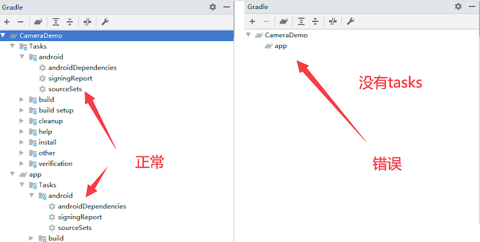
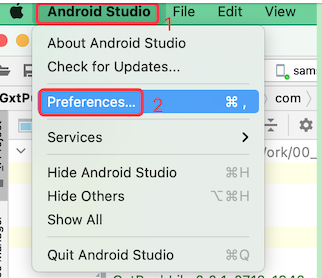
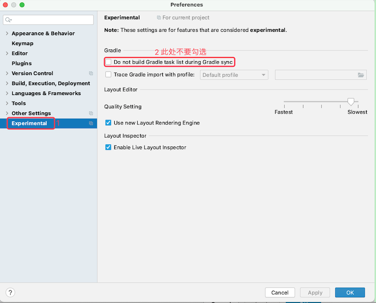
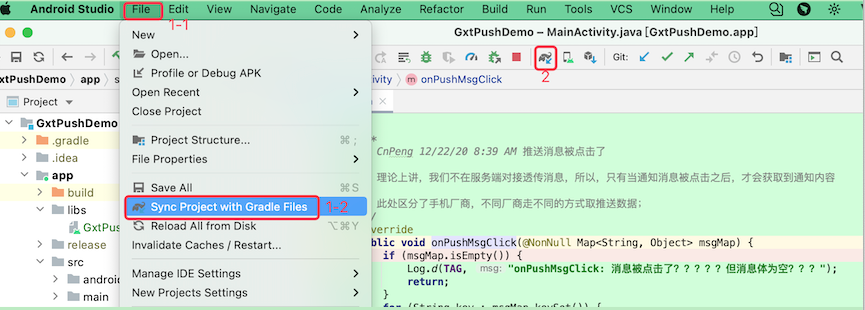

# 1. 38-Gradle窗口不显示task列表

## 1.1. 问题现象

升级到 AndroidStudio 4.2 之后，打开右侧的 Gradle 面板时，其 Gralde 列表中仅显示了 Gradle 的依赖情况，没有显示对应的 Gradle Task 任务。如下图：

## 1.2. 解决方案

将上图中的 2 处取消勾选之后，重新执行 Gradle 的同步操作之后，即可在 Gradle 面板中查看对应的 Task 任务。

Gradle 同步的方案有如下两种：

