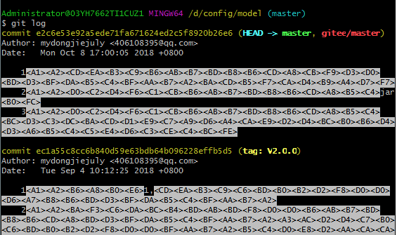

# 1. 40-AS中git的中文提交记录显示为字节码形态

[原文：GIT使用log命令显示中文乱码](https://www.cnblogs.com/yanzige/p/9810333.html)

AS 版本：Artic Fox | 2020.3.1  

## 1.1. 现象

## 1.2. 解决方案：

先在命令行中执行如下两条命令：

* `git config --global i18n.commitencoding utf-8`  --注释：该命令表示提交命令的时候使用utf-8编码集提交

* `git config --global i18n.logoutputencoding utf-8` --注释：该命令表示日志输出时使用utf-8编码集显示

然后在环境变量配置文件中增加 `export LESSCHARSET=utf-8` --注释：设置LESS字符集为utf-8

此时，log 中的中文信息将正常显示。

[点击查看：Mac 电脑中配置环境变量的方式 ](03、MAC环境变量的配置-adb为例.md)