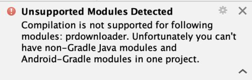
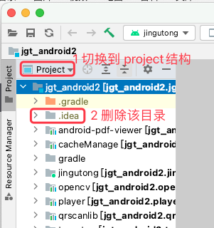
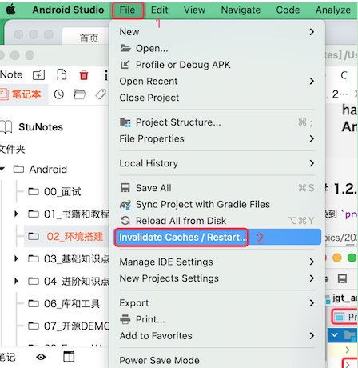
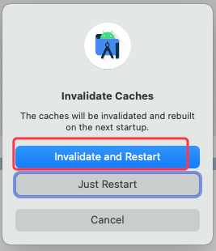

# 1. 41-Unsupported modules detected

AS 版本：Artic Fox | 2020.3.1  

## 1.1. 问题现象

Compilation is not supported for following modules: prdownloader. Unfortunately you can’t have non-Gradle Java modules and Android-Gradle modules in one project.

## 1.2. 解决方案：

切换到 `project` 项目结构，然后删除 `.idea` 目录，然后重启 AS 即可。

## 1.3. 其他备用方案

如果通过上述删除 `.idea` 的方式还是不行，则可以考虑尝试如下步骤：

