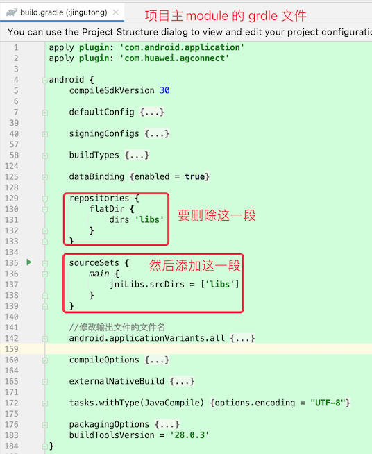

# 1. 45-Using flatDir should be avoided because it doesn‘t support any meta-data formats

AndroidStudio 版本：ArcticFox 2020.3.1 
Gradle 版本：7.0.2 

编译过程中报错：Using flatDir should be avoided because it doesn‘t support any meta-data formats

解决方案：

