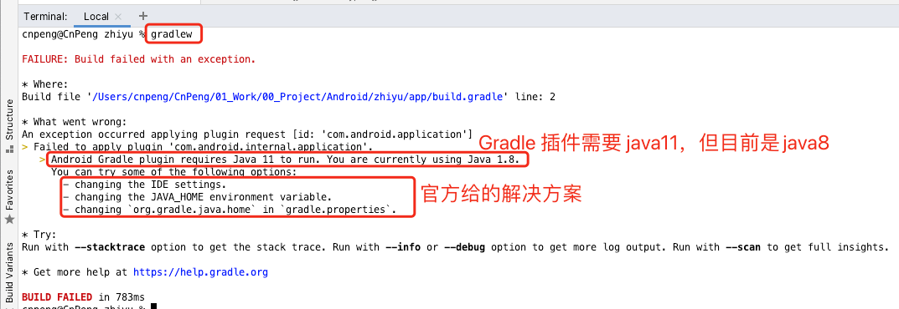
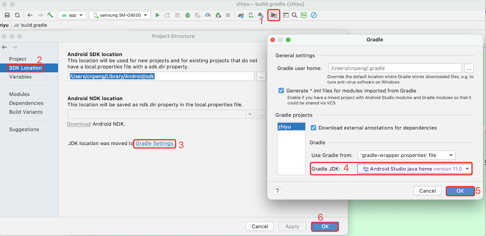
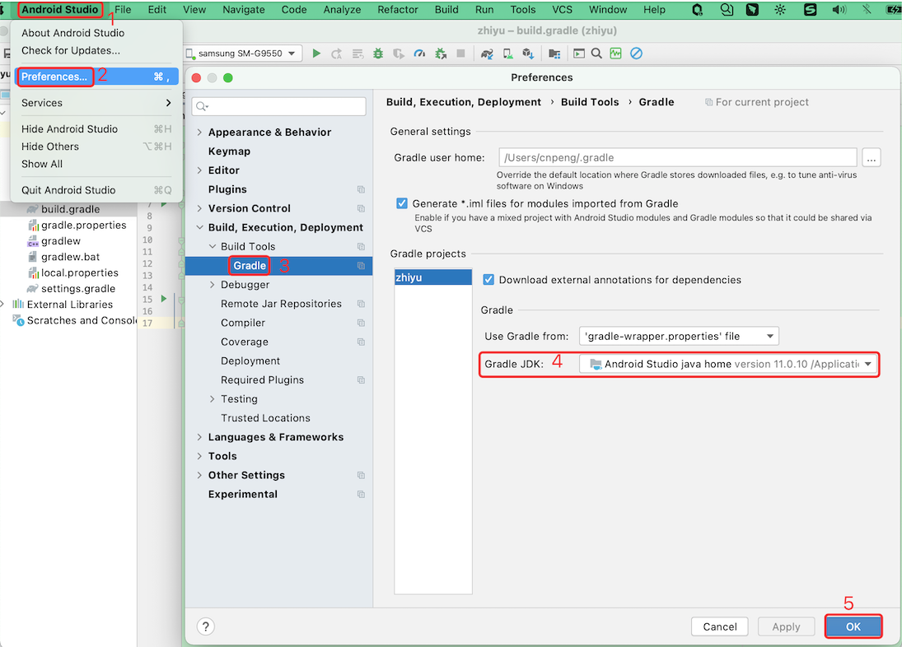
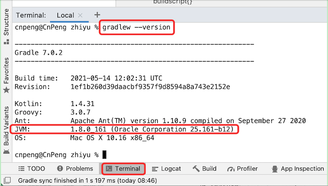
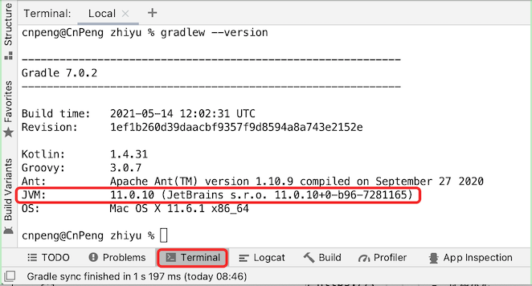

# 1. Android Gradle plugin requires Java 11 toRun

> 内容中的解决方案是基于 Mac 电脑整理的，Windows 电脑中可能会略有差异。

## 1.1. 问题现象

* Android Studio Arctic Fox | 2020.3.1 Patch 3
* 项目中使用的 gradle 的版本：`com.android.tools.build:gradle:7.0.3`
* 问题摘要：Android Gradle plugin requires Java 11 to run. You are currently using Java 1.8.

将 AndroidStudio 升级到 Arctic Fox | 2020.3.1 Patch 3 之后，新建了一个项目，项目中使用的 gradle 版本为 `com.android.tools.build:gradle:7.0.3`。然后打开 AndroidStudio 自带终端，执行 `gradlew` 命令时，报错：`Android Gradle plugin requires Java 11 to run. You are currently using Java 1.8.` , 具体如下图。




* 问题详细内容

```
cnpeng@CnPeng zhiyu % gradlew 

FAILURE: Build failed with an exception.

* Where:
Build file '/Users/cnpeng/CnPeng/01_Work/00_Project/Android/zhiyu/app/build.gradle' line: 2

* What went wrong:
An exception occurred applying plugin request [id: 'com.android.application']
> Failed to apply plugin 'com.android.internal.application'.
   > Android Gradle plugin requires Java 11 to run. You are currently using Java 1.8.
     You can try some of the following options:
       - changing the IDE settings.
       - changing the JAVA_HOME environment variable.
       - changing `org.gradle.java.home` in `gradle.properties`.

* Try:
Run with --stacktrace option to get the stack trace. Run with --info or --debug option to get more log output. Run with --scan to get full insights.

* Get more help at https://help.gradle.org

BUILD FAILED in 783ms
cnpeng@CnPeng zhiyu % 

```

## 1.2. 解决方案

在上面截图中可以看出，官方已经给出了三种解决思路：

- changing the IDE settings.——修改 IDE 中的配置项
- changing the JAVA_HOME environment variable.——修改环境变量中的 `JAVA_HOME`
- changing `org.gradle.java.home` in `gradle.properties`.——在 `gradle.properties` 中指定 `java.home` 

### 1.2.1. 修改 IDE 配置

通过 IDE 设置项指定 Gradle 使用的 JDK 版本为 java 11，有两种方式，分别如下：

* 方式1



* 方式2



**注意** ：在选择 JDK 路径时，既可以选择 AndroidStudio 自带的，也可以选择其他路径下的，或者也可以通过 `Download JDK` 或 `Add JDK`  自行添加其他的。只要版本合适即可。


**完成上述设置之后，在终端中执行 `gradlew` 时依旧会出现前述的错误信息**。 所以，我们还需要继续执行后面的操作。

### 1.2.2. 配置环境变量中的 `JAVA_HOME`

#### 1.2.2.1. 查看 gradle 使用的 jdk 等信息

虽然我们已经在 IDE 的设置中指定了 Gradle JDK 为 java 11。但是，当我们在 AndroidStudio 自带的终端中使用 `graldew --version` 命令查看 gradle 信息时会发现，JVM 并没有变成 java 11，如下图：



所以，接下来我们就需要配置环境变量。


#### 1.2.2.2. 配置环境变量

将系统环境变量中的 `JAVA_HOME` 指向 Java 11 的 jdk（此处使用了 AndroidStudio 中携带的 jdk ） 。Mac 中配置环境变量的步骤如下：

* 打开系统中的`终端`，然后切换到系统根目录

```
// 切换到根目录
cd ~/
```

* 打开 `bash_profile` 配置文件

```
//方式1：编辑时以普通文本模式编辑，关闭即保存——推荐这种方式
open -e .bash_profile

//方式2：以 vim 方式编辑，编辑和保存时需要使用 vim 命令
vim .bash_profile

// 注意：如果配置文件不存在，可通过 touch 命令创建，如下
touch .bash_profile
```

* 追加环境变量

```
# AndroidStudio 自带 jre 配置为环境变量。注意，此处 Android 后面紧跟一个 \和空格
export JAVA_HOME=/Applications/Android\ Studio.app/Contents/jre/Contents/Home
export PATH=$JAVA_HOME/bin:$PATH
```

完成上述编辑之后，直接关闭编辑窗口即可保存。

* 让配置生效

```
# 执行该命令可以确保配置文件立即生效
source .bash_profile
```

完成上述配置之后，当我们在 AndroidStudio 自带的终端中使用 `graldew --version` 命令查看 gradle 信息时会发现 JVM 已经变成  java 11，如下图：



此时，再次从 AndroidStudio 自带的终端中执行 `graldlew` 命令时可以正常了。

### 1.2.3. 配置 gradle.properties


**注意**：

* 经过前面两种方案的配置之后，如果问题已解，则不需要配置该项。如果问题依旧未解，可以添加该配置。
* **在多人协作的项目中，如果将 gradle.properties 文件提交到仓库中，要及时提醒其他人员** 
* 实测如果不配置环境变量，只配置 IDE 设置和该项时，并不能解决 `gradlew` 报错的问题。

示例如下：

```
# 指定 gradle.java.home 为 AndroidStudio 中自带的 jdk 目录
org.gradle.java.home = /Applications/Android Studio.app/Contents/jre/Contents/Home
```

