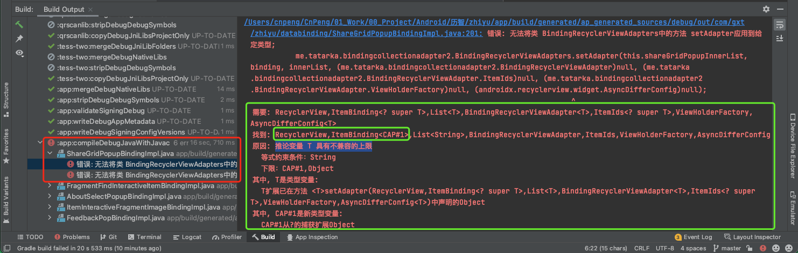
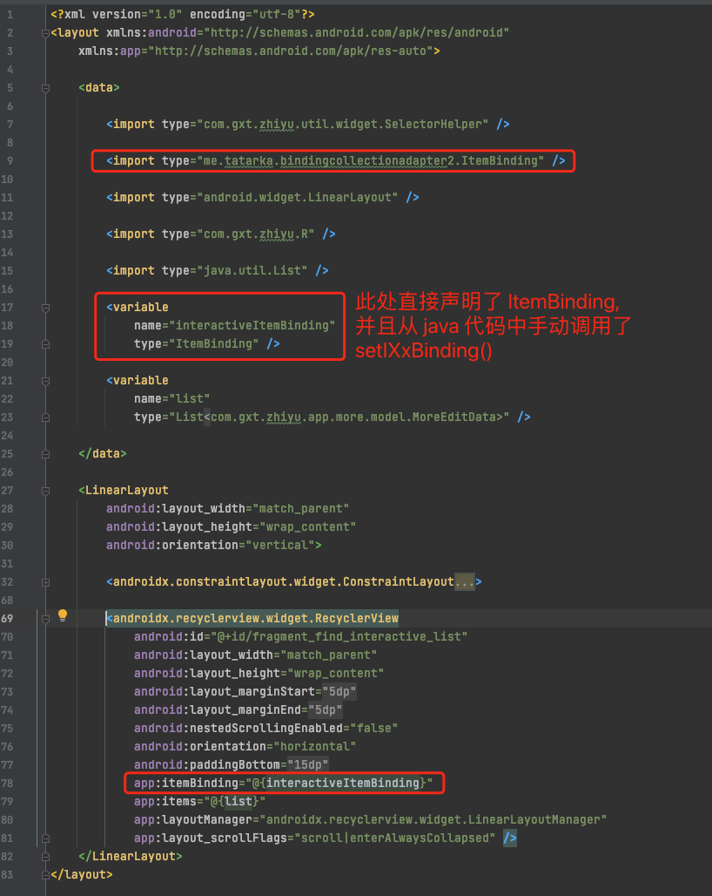

# 1. 升级Gradle到7.0.3之后databinding提示推论变量具有不兼容的上限

## 1.1. 环境

* AndroidStudio：Android Studio Arctic Fox | 2020.3.1 Patch 3
* Gradle : com.android.tools.build:gradle:7.0.3
* Java : 11.0.1


## 1.2. 错误信息

升级 AndroidStudio 之后，同时升级了 Gradle 和 java（ Gradle 7.0.3 要求必须使用 java 11 ） , 并且项目中使用了 [**me.tatarka.bindingcollectionadapter2:bindingcollectionadapter-recyclerview:4.0.0**](https://github.com/evant/binding-collection-adapter)。

运行项目时，AndroidStudio 报错：`推论变量 T 具有不兼容的上限`，完整错误信息如下：



## 1.3. 错误原因

在 xml 中直接声明了 ItemBinding ，并在 java 代码中手动调用了 setXxBiniding() 方法。




## 1.4. 解决方式

按照 [binding-collection-adapter](https://github.com/evant/binding-collection-adapter) 文档中的说明操作：

* 先声明一个 ViewModel , 
* 然后在其中初始化需要使用的 `itemBinding` ，
* 然后在 xml 布局文件中声明要使用的 vm
* 然后在 xml 中通过 vm.itemBinding 进行引用

viewModel :

```java
public class ViewModel {
  public final ObservableList<String> items = new ObservableArrayList<>();
  public final ItemBinding<String> itemBinding = ItemBinding.of(BR.item, R.layout.item);
}
```

布局文件

```xml
<!-- layout.xml -->
<layout xmlns:android="http://schemas.android.com/apk/res/android"
    xmlns:app="http://schemas.android.com/apk/res-auto">
    <data>
      <import type="com.example.R" />
      <variable name="viewModel" type="com.example.ViewModel"/>
    </data>

    <ListView
      android:layout_width="match_parent"
      android:layout_height="match_parent"
      app:items="@{viewModel.items}"
      app:itemBinding="@{viewModel.itemBinding}"/>

    <androidx.recyclerview.widget.RecyclerView
      android:layout_width="match_parent"
      android:layout_height="match_parent"
      app:layoutManager="androidx.recyclerview.widget.LinearLayoutManager"
      app:items="@{viewModel.items}"
      app:itemBinding="@{viewModel.itemBinding}"/>

    <androidx.viewpager.widget.ViewPager
      android:layout_width="match_parent"
      android:layout_height="match_parent"
      app:items="@{viewModel.items}"
      app:itemBinding="@{viewModel.itemBinding}"/>

    <Spinner
      android:layout_width="match_parent"
      android:layout_height="match_parent"
      app:items="@{viewModel.items}"
      app:itemBinding="@{viewModel.itemBinding}"
      app:itemDropDownLayout="@{R.layout.item_dropdown}"/>
</layout>

```

item 布局文件：

```xml
<!-- item.xml -->
<layout xmlns:android="http://schemas.android.com/apk/res/android"
    xmlns:app="http://schemas.android.com/apk/res-auto">
    <data>
      <variable name="item" type="String"/>
    </data>

    <TextView
      android:id="@+id/text"
      android:layout_width="match_parent"
      android:layout_height="wrap_content"
      android:text="@{item}"/>
</layout>
```


