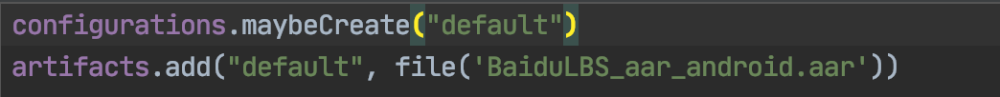
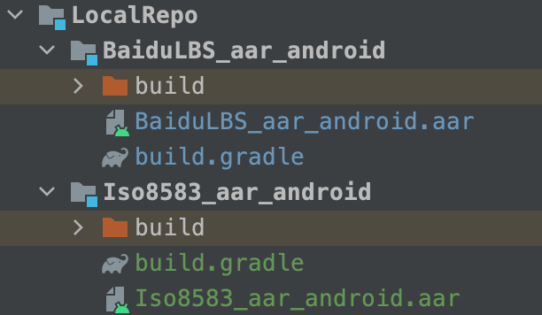
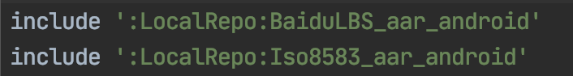
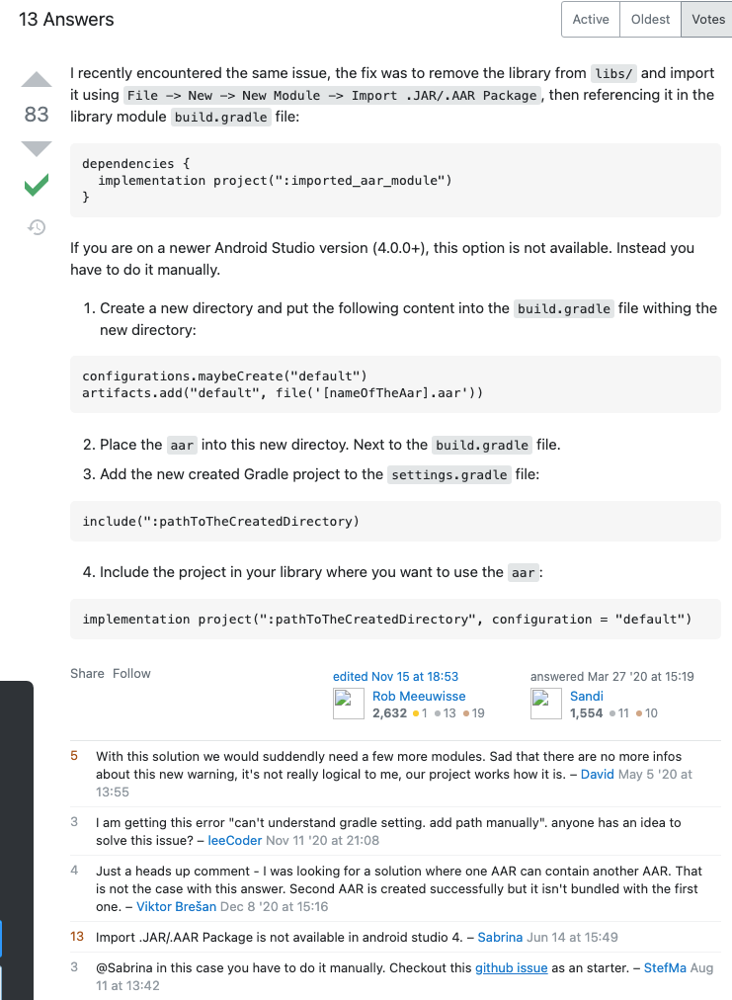

# 1. 构建aar时无法直接依赖本地aar文件

* 错误提示：Direct local .aar file dependencies are not supported when building an AAR.
* AndroidStudio: Android Studio Arctic Fox | 2020.3.1 Patch 3
* Gradle 版本：com.android.tools.build:gradle:7.0.3

## 1.1. 参考1

[《完美解决Direct local .aar file dependencies are not supported when building an AAR.》](https://www.cnblogs.com/baiyuas/p/14383723.html)

最近 gradle 升级了，然后编译就出现了这个错误

```
Direct local .aar file dependencies are not supported when building an AAR.
```

然后求助了百度，给出了下面解决方案

在 module 的 build.gradle 文件中增加如下内容：

```gradle
android {
      ........
   repositories {
      flatDir {
            dirs 'libs'
        }
   }
}

dependencies {
     ....
    implementation(name: 'BaiduLBS_AndroidSDK_Lib', ext: 'aar')
}
```

这样子确实可以了，其实就是将 libs 作为本地仓库，然后引用参考下的库文件。但是编译时候会有这个提示

> Using flatDir should be avoided because it doesn't support any meta-data formats.

我是个完美的人，网上又中了一圈，提出 `File->New->New Module -> Import .jar/.aar`。

然后在 `build.gradle` 文件中引入依赖 `implementation project(path: ':xxxxx')` 

在旧版本的 AndroidStudio 中是可以的，在新版的 AndroidStudio 中已经移除了这个功能，不知道为啥。

我也懒得翻看更新日志了。所以我用旧版本导入一个 aar 作为一个 module 。导入后发现就多了一个 `build.gradle` 文件。

综上总结，在高版本的 AndroidStudio 并且使用了版本的 gradle 出现了上述问题可以按着如下引用: 

* 在你工程根目录下新建一个文件夹 `YouLib` ，将你的 `aar` 文件放入，然后在该目录下新建一个 `build.gradle` 文件



* 在 `settings.gradle` 导入该工程

```gradle
include ':YouLib'
```

* 在你需要依赖的工程里面的 `build.gradle` 中增加依赖

```groovy
implementation project(path: ':YouLib') // 这里需要注意的是，YouLib是你aar库所在文件夹
```
当然如果你有很多 `aar` 库，那么你需要在根目录创建一个 `LocalRepo` 目录，然后将你不同的 `aar` 库放在不同文件夹下。在 `setting.gradle` 分别导入





## 1.2. 参考2

[Error building Android library: Direct local .aar file dependencies are not supported](https://stackoverflow.com/questions/60878599/error-building-android-library-direct-local-aar-file-dependencies-are-not-supp)

文中最高票回答如下：

I recently encountered the same issue, the fix was to remove the library from `libs/` and import it using `File -> New -> New Module -> Import .JAR/.AAR Package`, then referencing it in the library module build.gradle file:

```groovy
dependencies {
  implementation project(":imported_aar_module")
}
```
If you are on a newer **Android Studio version (4.0.0+)**, this option** is not available**. 

Instead you have to do it manually.

* Create a new directory and put the following content into the `build.gradle` file withing the new directory:

```groovy
configurations.maybeCreate("default")
artifacts.add("default", file('[nameOfTheAar].aar'))
```

* Place the `aar` into this new directoy. Next to the `build.gradle` file.

* Add the new created Gradle project to the `settings.gradle` file:

```groovy
include(":pathToTheCreatedDirectory)
```

* Include the project in your library where you want to use the aar:

```groovy
implementation project(":pathToTheCreatedDirectory", configuration = "default")
```

原回答截图如下：


