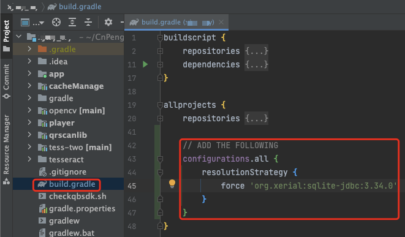

# 1. 迁移到搭载M1芯片的Mac时的问题汇总

新近更换了搭载 M1 芯片的 Mac 电脑，在将旧电脑中正常运行的项目拷贝过来并运行时，出现了一系列的问题。本文对此进行相应的总结。

## 1.1. Unknown host CPU architecture: arm64

### 1.1.1. 现象

项目中使用了 NDK ,  版本为 17，初次在 M1 电脑中编译时报错：

```log
Unknown host CPU architecture: arm64

Process 'command 'xx/xx/ndk-build.cmd'' finished with non-zero exit value 1
```

### 1.1.2. 解决

>* 截至 2022-11-14，按照 《[Unknown host CPU architecture: arm64 , Android NDK SiliconM1 Apple MacBook Pro》](https://stackoverflow.com/questions/69541831/unknown-host-cpu-architecture-arm64-android-ndk-siliconm1-apple-macbook-pro)] 中第一条描述，直接升级 ndk 到 24.0.8215888 及以后版本也可解决该问题。目前 AndroidStudio 中支持的最新版本为 25.1.8937393。
>* 如果由于某些原因导致项目中的 ndk 无法升级，还可以继续参考下面的解决方案。

按照 [《ndk-build 脚本中的 M1 支持 #1410》](https://github.com/android/ndk/issues/1410) 描述，该问题是 ndk 与 M1 芯片不兼容导致的。参考 [《Unknown host CPU architecture: arm64 , Android NDK SiliconM1 Apple MacBook Pro》](https://stackoverflow.com/questions/69541831/unknown-host-cpu-architecture-arm64-android-ndk-siliconm1-apple-macbook-pro) 中修改 `ndk-build` 一节可以解决该问题，具体步骤如下：

#### 1.1.2.1. 查找ndk目录

打开项目根目录下的  `local.properties` 文件，查看并复制其中的 `ndk.dir`:


如果项目中没有 `local.properties` 文件，则可以在使用了 ndk 的模块（model）的 `build.gradle` 文件中[查找 `android` 节点下的 `ndkVersion`](https://developer.android.com/studio/projects/install-ndk#apply-specific-version)，由于 [AndroidStudio 默认会将下载的 ndk 放置在 `/Users/用户名/Library/Android/sdk/ndk/` 目录下](https://developer.android.com/studio/projects/install-ndk#specific-version)，所以，将二者拼接即可得到完整的路径。


#### 1.1.2.2. 打开 ndk-build 文件

##### 1.1.2.2.1. 打开方式1

打开终端，使用 `open -e` 命令直接打开 `ndk-build` 文件，具体如下：

```sh
open -e /Users/cnpeng/Library/Android/sdk/ndk/17.2.4988734/ndk-build
```

> 注意：上述命令中的目录要换成你自己项目中的 `ndk.dir`


##### 1.1.2.2.2. 打开方式2

打开 `访达`，然后按下 `Shift+command+G` （这是 `访达` 工具栏中 `查看`-`前往文件夹` 的快捷键），在弹窗中的粘贴前面复制的 `ndk.dir` 并回车：


右击 `ndk-build` 文件，然后依次选择 `打开方式`--`其他`--`文本编辑器`，打开该文件：


#### 1.1.2.3. 编辑内容

修改后的内容为：

```sh
#!/bin/sh
DIR="$(cd "$(dirname "$0")" && pwd)"
arch -x86_64 /bin/bash $DIR/build/ndk-build "$@"
```

修改前的内容为：

```sh
#!/bin/sh
DIR="$(cd "$(dirname "$0")" && pwd)"
$DIR/build/ndk-build "$@"
```

对比发现，修改后的版本仅是在第三方的 `$DIR/build/ndk-build "$@"` 前增加了一段 ` arch -x86_64 /bin/bash` ，增加的这一段就是用来支持Mac M1 的。

修改完成保存并退出，然后重新编译项目即可正常。

### 1.1.3. 参考

* [Unknown host CPU architecture: arm64](https://blog.csdn.net/ausboyue/article/details/122476734)
* [Unknown host CPU architecture: arm64 , Android NDK SiliconM1 Apple MacBook Pro](https://stackoverflow.com/questions/69541831/unknown-host-cpu-architecture-arm64-android-ndk-siliconm1-apple-macbook-pro)

## 1.2. No native library is found for os.name=Mac and os.arch=aarch64. path=/org/sqlite/native/Mac/aarch64

### 1.2.1. 现象

项目中使用了 androidx.room ， 在搭载了 M1 芯片的 Mac 电脑中运行报错，具体如下图：


### 1.2.2. 解决

该问题也是因为项目中使用的 room 版本未与 M1 兼容，解决方案有 2，具体如下：

#### 1.2.2.1. 方案1

直接升级 room 到 2.4.1 或更高版本，如下：

```gradle
implementation 'androidx.room:room-runtime:2.4.1'
annotationProcessor "androidx.room:room-compiler:2.4.1"
```

这种方式同时要求升级 `compileSdkVersion` 到 31 , 如下图：


#### 1.2.2.2. 方案2

如果不想升级 `compileSdkVersion`，则可以强制设置 jdbc 为支持 M1的版本，如下图：



具体内容如下：

```gradle
// ADD THE FOLLOWING
configurations.all {
    resolutionStrategy {
       force 'org.xerial:sqlite-jdbc:3.34.0'
    }
}
```

### 1.2.3. 参考

* [Caused by: java.lang.Exception: No native library is found for os.name=Mac and os.arch=aarch64. path=/org/sqlite/native/Mac/aarch64](https://www.cnblogs.com/ace666/p/15879107.html)


## 1.3. Could not find xx.aar

### 1.3.1. 现象

在旧电脑中可以正常运行，但是迁移到新电脑之后，运行项目时一直提示找不到三方库的 `.aar` 文件，具体如下图：


该库的高版本可以正常获取，但是高版本中的 API 变更较大，切换后需要改的代码较多。因此暂不考虑直接升级。

### 1.3.2. 解决

由于 Android 使用 gradle 作为包管理工具，在编译时会将依赖的库下载到本机，所以我们可以考虑到 gradle 的缓存目录中找一找该库的 aar 文件，然后手动将其拷贝到项目的 `libs` 目录中。具体如下：

#### 1.3.2.1. 在旧电脑的缓存中查找该库的 aar 

gradle 的缓存文件存放在 `/Users/用户名/.gradle` 目录中。`.gradle` 目录中有 `.` 前缀，所以是一个隐藏目录。

如果我们想在 `访达` 中手动一级级的找到该目录，就需要通过 `shift+command+.` 将隐藏文件显示出来（再按一次该组合键即可重新隐藏）。然后再依次进入到 `/caches/modules-2/files-2.1` 目录中。

> 我们也可以在终端中执行 `open /Users/cnpeng/.gradle/caches/modules-2/files-2.1` 命令快速打开 gradle 的缓存目录，推荐使用这种命令方式。


进入 `files-2.1` 目录之后就会看到项目中所有依赖库的缓存，找到报错的库名，然后依次找到其 aar 文件，如下图：


#### 1.3.2.2. 修改新电脑中的项目

>一开始尝试将该库的缓存直接拷贝到新电脑的同级目录下，非常遗憾的是依旧编译失败。所以才考虑拷贝 aar 作为依赖项。

将上一小节中找到的 aar 文件拷贝到新电脑中，并将其放置到项目中的 `libs` 目录下。`PictureSelector` 库中有两个模块（model）： `picture_library` 和 `ucrop`，所以我们需要将这两个模块的 aar 文件都拷贝过来。如下：


然后在 `build.gradle` 文件中删除 `implementation` 信息，如下图：


并声明需要解析 `libs` 目录中的 aar 文件，如下：


完成上述操作后，重新在新电脑中编译项目，一切正常。

