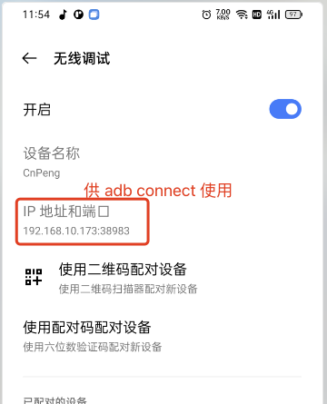
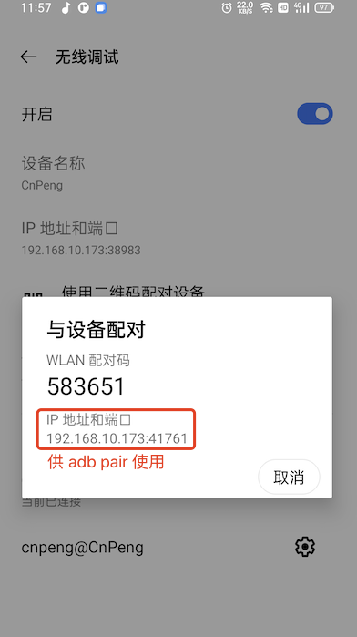

# 1. 001-常用ADB命令

## 1.1. 常用命令

在 Android 开发过程中，ADB（Android Debug Bridge）是一个通用命令行工具，允许您与连接的设备进行通信。以下是一些常用的 ADB 命令：

### 1.1.1. 重启 ADB 服务

- `adb kill-server && adb start-server`：重启 ADB 服务

### 1.1.2. 查看连接的设备

#### 1.1.2.1. 查看连接的设备

- `adb devices`：列出所有已连接到电脑的设备。每个设备都由一个序列号标识。

输出示例：

```
List of devices attached
emulator-5554   device
192.168.1.100:5555  device
```

每台设备有一个唯一标识符（如 emulator-5554 或 192.168.1.100:5555）。

> 如果使用无线连接，设备的唯一标识符将显示为 ip和端口

### 1.1.3. 在指定设备上执行命令

#### 1.1.3.1. 通过 -s 参数指定设备

在任意 ADB 命令后添加 `-s <设备ID>` 即可针对特定设备操作：

```bash
# 向指定设备安装 apk
adb -s emulator-5554 install app.apk

# 列出指定设备上已安装的应用包名
adb -s 192.168.1.100:5555 shell pm list packages
```

#### 1.1.3.2. 通过` -d` 或 `-e` 指定默认设备

* `-d`：指定唯一连接的物理设备（仅当有1台物理设备时有效）。如：`adb -d install app.apk`
* `-e`：指定唯一连接的模拟器（仅当有1台模拟器时有效）。如：`adb -e logcat`

#### 1.1.3.3. 设置环境变量 ANDROID_SERIAL

通过环境变量全局指定默认设备（适用于需要频繁操作同一设备的情况）：


```bash
export ANDROID_SERIAL=emulator-5554  # Linux/macOS
set ANDROID_SERIAL=emulator-5554     # Windows
```

之后直接运行命令即可（无需 `-s`），如：

```bash
# 自动作用于 emulator-5554
adb install app.apk
```

#### 1.1.3.4. 在 adb shell 中指定设备

若需进入指定设备的 Shell：

```
adb -s emulator-5554 shell
```

#### 1.1.3.5. 多设备场景下的常见命令示例

* 查看某台设备的日志：`adb -s 192.168.1.100:5555 logcat`
* 向某台设备推送文件：`adb -s emulator-5554 push local.txt /sdcard/`
* 启动特定设备上的 Activity：`adb -s emulator-5554 shell am start -n com.example/.MainActivity`

#### 1.1.3.6. 批量操作所有设备

若需对所有设备执行相同命令，可通过脚本循环处理：

```bash
for device in $(adb devices | grep -v "List" | awk '{print $1}'); do
    adb -s $device install app.apk
done
```

**注意事项**:

* 设备 ID 可能因连接方式不同而变化（USB 连接 vs. 无线调试）。

* 模拟器的 ID 通常为 emulator-5554 格式，物理设备则为序列号或 IP 地址。

* 无线调试时，确保设备与电脑在同一网络，并已通过 adb connect 配对。


### 1.1.4. 安装和卸载应用程序

#### 1.1.4.1. 安装

   - `adb install <path_to_apk>`：安装指定路径下的 APK 文件到设备上。
       - 覆盖安装：`adb install -r <path_to_apk>`
       - 允许测试包：`adb install -t <path_to_apk>`
#### 1.1.4.2. 卸载

   - `adb uninstall <package_name>`：从设备中卸载指定包名的应用程序。
       - 保留数据：`adb uninstall -k com.example.package`

#### 1.1.4.3. 列出所有已安装应用

   - `adb shell pm list packages`: 列出已安装的应用
        - 过滤关键词（如 "google"）：`adb shell pm list packages | grep google`

#### 1.1.4.4. 清除应用数据

 - `adb shell pm clear com.example.package` ： 清除指定应用的数据

### 1.1.5. 文件传输

> 具体可参考示例中的 `文件传输`

#### 1.1.5.1. 推送文件到设备

   - `adb push <local> <remote>`：将电脑本地文件或目录复制到设备上的指定位置。

#### 1.1.5.2. 从设备拉取文件

   - `adb pull <remote> [<local>]`：从设备上复制文件或目录到电脑本地。

### 1.1.6. 启动和停止服务

   - `adb shell am start -n <package_name>/<activity_class_name>`：启动指定的应用程序活动。
   - `adb shell am force-stop <package_name>`：强制停止与给定包名相关的所有进程和服务。

### 1.1.7. 获取日志信息

   - `adb logcat`：查看设备的日志输出。可以使用不同的过滤器来缩小显示范围，例如仅查看错误消息或特定标签的消息。
       - 按标签过滤：`adb logcat -s TAG_NAME`
       - 清空日志：`adb logcat -c`
       - 输出到文件：`adb logcat > log.txt`
   - `adb logcat --pid=$(adb shell pidof -s com.example.package)` : 查看特定应用的日志

### 1.1.8. 执行Shell命令（操作设备）

   - `adb shell`：打开设备的shell界面，在这里可以执行各种Linux命令以及Android特有的命令。
       - `adb shell ls /sdcard`：查看设备 sdcard 目录下的内容

#### 1.1.8.1. 查看设备信息

- `adb shell getprop`：查看设备信息
    - 具体属性（如版本号）：`adb shell getprop ro.build.version.release`

#### 1.1.8.2. 查看 CPU 架构

- `adb shell getprop ro.product.cpu.abi` ：查看 CPU 架构

#### 1.1.8.3. 查看屏幕分辨率

- `adb shell wm size`：查看屏幕分辨率

#### 1.1.8.4. 输入模拟

##### 1.1.8.4.1. 模拟文本输入

   - `adb shell input text <string>`：向焦点窗口发送文本输入（ `string` 内容需要**用双引号包裹**，不支持中文）。
       - `adb shell input text "Hello"` 向当前焦点窗口输入文本 `Hello`（假如当前你正在用微信和某人聊天，且输入框获取了焦点，那么执行命令后，输入框中就会显示 Hello ）

##### 1.1.8.4.2. 模拟按键事件

   - `adb shell input keyevent <keycode>`：模拟按键事件，如返回键、主屏键等。
       - `KEYCODE_HOME` 主页键（主屏键）
       - `KEYCODE_BACK` 返回键
       - `KEYCODE_POWER` 电源键
       - `KEYCODE_VOLUME_UP` 音量加
       - `adb shell input keyevent KEYCODE_HOME` 模拟触发 Home 键

##### 1.1.8.4.3. 模拟触摸滑动

```shell
# 点击坐标 (500,500)
adb shell input tap 500 500


# 从 (300,1000) 滑动到 (300,500)
adb shell input swipe 300 1000 300 500
```

#### 1.1.8.5. 网络与端口

- `adb shell ifconfig` ：查看网络信息
- `adb forward tcp:本地端口 tcp:设备端口`：端口转发


### 1.1.9. 重启设备

   - `adb reboot`：重启设备。
   - `adb reboot bootloader`：重启进入 bootloader/Fastboot 模式。
   - `adb reboot recovery`：重启进入恢复模式。

### 1.1.10. 调试应用

#### 1.1.10.1. 调试应用

   - `adb bugreport`：生成包含系统状态信息的报告，有助于诊断问题。
   - `adb jdwp`：列出当前可调试的Java进程ID。
   - `adb forward tcp:<host_port> jdwp:<device_port>`：设置端口转发以便通过JDB进行远程调试。

#### 1.1.10.2. 无线调试

##### 1.1.10.2.1. 操作步骤

操作步骤如下：

* 连接到同一网络

* 设备端：
    * 启用无线调试 → 查看配对码（如 123456）和端口（如 1643）。

* 电脑端：
    * `adb pair 设备ip:端口号`
    * 在 shell 界面出现的 `Enter pairing code` 后面输入 配对码。
    * `adb connect 设备ip:端口号`

##### 1.1.10.2.2. 获取 Pairing Code 的方法

* 进入设备的 `开发者选项`（若未开启，进入`设置` > `关于手机` ，然后连续点击 `版本号`7 次）。
* 找到 `无线调试（Wireless Debugging）`并启用。
* 点击 `无线调试` 进入子菜单
    * 该界面会显示 `设备名称`、`IP地址和端口号`（供 `adb connect` 命令使用）
* 选择 `配对设备（Pair device with QR code/Pairing code）`> `使用配对码配对设备`。
    * 此时会显示一个6位数字的 `WLAN配对码`和 `IP地址和端口号`（供 `adb pair` 命令使用）






### 1.1.11. 屏幕截图和录像

#### 1.1.11.1. 截图

##### 1.1.11.1.1. 截图并直接保存在电脑端

   - `adb exec-out screencap -p > screenshot.png`：截取设备屏幕为PNG格式并直接保存在电脑端当前目录下。
       - `adb -d exec-out screencap -p > screenshot.png` ：从当前唯一USB连接的的物理设备上截图并保存到电脑端当前目录下
   - `adb exec-out screencap -p > C:\Path\To\Directory\screenshot.png` ： windows 端截图并保存在电脑指定目录下
   - `adb exec-out screencap -p > /path/to/directory/screenshot.png`：mac/linux 端截图并保存在电脑指定目录下

##### 1.1.11.1.2. 截图

   - `adb shell screencap /sdcard/screenshot.png`：截图并保存在设备的 sdcard 目录下。
       - 如需拷贝到电脑端，需要使用：`adb pull /sdcard/screenshot.png` 命令保存到电脑端当前目录下（图片名称后面也可以指定电脑端的保存目录）
       - 拷贝完成后，可以通过 `adb shell rm /sdcard/screenshot.png` 删除设备上的图片，以节省设备空间

#### 1.1.11.2. 录像

   - `adb shell screenrecord /sdcard/demo.mp4`：录制设备屏幕视频，默认最长持续时间为三分钟或直到按下Ctrl+C。

### 1.1.12. 其他

#### 1.1.12.1. 查看当前 Activity

`adb shell dumpsys activity | grep mResumedActivity`

#### 1.1.12.2. 强制停止应用

`adb shell am force-stop com.example.package`

#### 1.1.12.3. 启动 Activity

`adb shell am start -n com.example.package/.MainActivity`

#### 1.1.12.4. 发送广播

`adb shell am broadcast -a android.intent.action.BOOT_COMPLETED`


## 1.2. 示例

### 1.2.1. 文件传输

当然可以，下面是关于如何使用 ADB 命令进行文件传输的具体示例：

#### 1.2.1.1. 使用 `adb push` 将文件从电脑复制到 Android 设备

假设你有一个名为 `example.txt` 的文本文件位于你的电脑桌面上，并且你想将其复制到 Android 设备的 `/sdcard/` 目录下。

1. 打开命令提示符（Windows）或终端（macOS/Linux）。
2. 输入以下命令：

```shell
adb push C:\Users\YourUsername\Desktop\example.txt /sdcard/
```

注意：请将 `C:\Users\YourUsername\Desktop\example.txt` 替换为你实际的文件路径。在 macOS 或 Linux 上，路径格式会有所不同，例如 `/Users/YourUsername/Desktop/example.txt`。

3. 如果命令执行成功，你应该能看到类似如下的输出信息：

```
   [100%] /sdcard/example.txt
```

#### 1.2.1.2. 使用 `adb pull` 从 Android 设备复制文件到电脑

如果你想从 Android 设备中获取一个文件，比如 `/sdcard/Download/image.jpg`，并将其保存到你的电脑桌面：

1. 在命令提示符或终端中输入以下命令：

```shell
# 复制到电脑指定目录
adb pull /sdcard/Download/image.jpg C:\Users\YourUsername\Desktop\
```

```shell
# 复制到电脑当前目录
adb pull /sdcard/Download/image.jpg
```

同样地，请根据实际情况调整目标路径。对于 macOS 或 Linux 用户，路径可能是这样的 `/Users/YourUsername/Desktop/`。

2. 成功后，你会看到类似的信息：

```
/sdcard/Download/image.jpg: 1 file pulled. 5.6 MB/s (349876 bytes in 0.058s)
```

#### 1.2.1.3. 小贴士

- 确保在执行这些命令之前，您的设备已经通过 USB 正确连接到电脑，并启用了开发者选项中的“USB调试”模式。
- 如果您有多个设备连接到电脑上，需要指定目标设备。可以通过 `-s <device_serial>` 参数来指定设备序列号，例如：

```shell
  adb -s emulator-5554 push example.txt /sdcard/
```

- 若想一次性传输整个目录，可以在命令末尾添加 `-a` 标志（适用于 `push`），或者直接指定目录路径而不是单个文件名。例如，要推送一个名为 `myFolder` 的文件夹及其所有内容到设备上的 `/sdcard/` 目录，可以这样做：

```shell
  adb push myFolder /sdcard/
```
  
这将会把 `myFolder` 文件夹本身以及它里面的所有文件和子文件夹都复制到设备的 `/sdcard/` 下。如果只想复制文件夹的内容而不包括文件夹本身，则可以在源路径后面加上 `/*`：

```shell
  adb push myFolder/* /sdcard/
``` 

这样就可以轻松地在电脑与Android设备之间传输文件了。