# 1. 001-BottomNavigationView使用

## 1.1. 未选中时图标颜色不对的解决

### 1.1.1. 问题现象

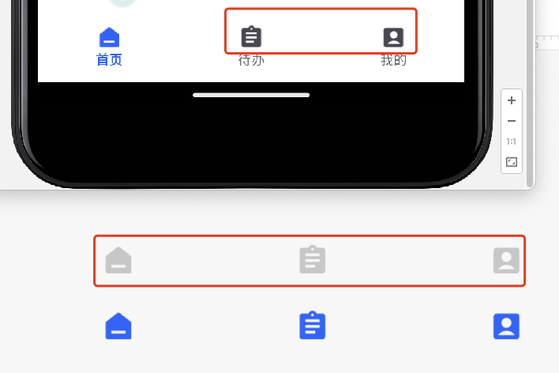

如上图，UI 设计给出的切图是灰色，但运行后，图标确显示为黑色。代码中已经设置了 `app:itemIconTint="@null"`：

```xml
<!-- itemBackground 设置后，不显示默认的水波纹效果 -->
<!-- itemActiveIndicatorStyle 去除默认的稀奇古怪的选中背景色-->
<!-- itemIconTint 基于选中状态为图标着色。如果 menu 中的图标不是 selector ，可以用其着色；否则，设置为null -->
<!-- itemTextColor 基于选中状态切换文本颜色 -->
<com.google.android.material.bottomnavigation.BottomNavigationView
    android:id="@+id/btmNav"
    android:layout_width="0dp"
    android:layout_height="65dp"
    android:background="@color/white"
    app:itemActiveIndicatorStyle="@null"
    app:itemBackground="@color/transparent"
    app:itemIconTint="@null"
    app:itemTextColor="@color/selector_main_tab_text_color"
    app:layout_constraintBottom_toBottomOf="parent"
    app:layout_constraintLeft_toLeftOf="parent"
    app:layout_constraintRight_toRightOf="parent"
    app:menu="@menu/menu_main_btm_nav" />
```

### 1.1.2. 分析

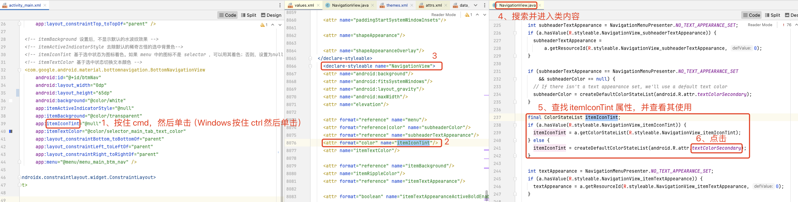

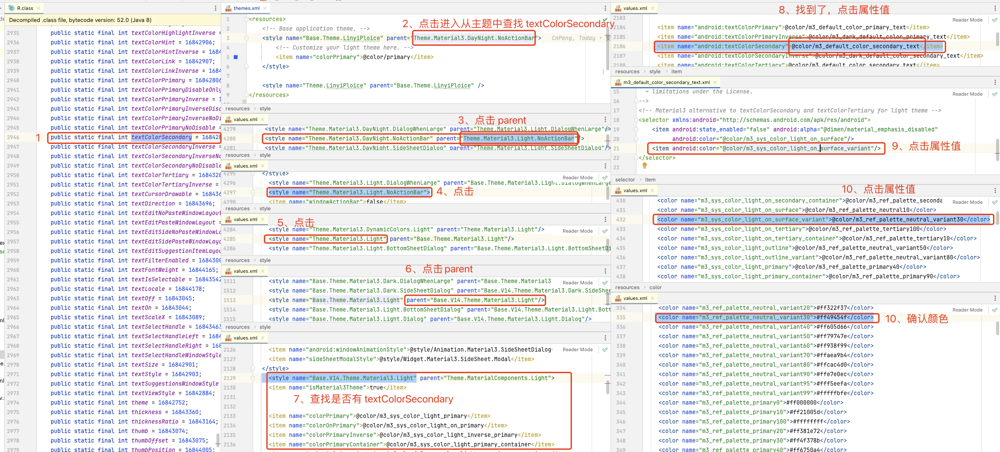

通过上面代码追踪和分析，可知图标颜色不对就是因为 `textColorSecondary` 中的颜色设置导致的，最终的颜色值为 `<color name="m3_ref_palette_neutral_variant30">#ff49454f</color>`。


### 1.1.3. 解决

注意：下面的 `text_hint_material` 其实就是设计稿中图标未选中时的颜色填充值。

#### 1.1.3.1. 方案1：修改主题

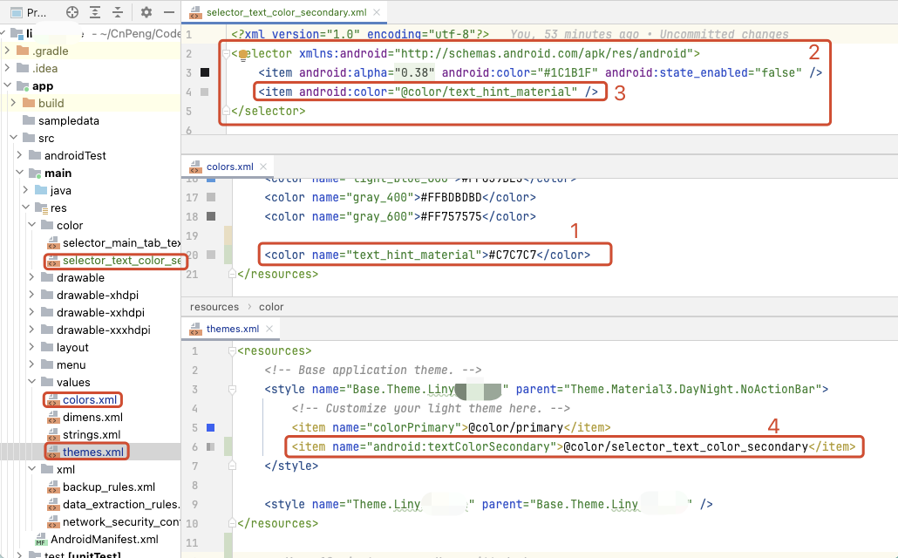

```xml
<?xml version="1.0" encoding="utf-8"?>
<selector xmlns:android="http://schemas.android.com/apk/res/android">
    <item android:alpha="@dimen/material_emphasis_disabled" android:color="#1C1B1F" android:state_enabled="false" />
    <item android:color="@color/text_hint_material" />
</selector>

```

```xml
<resources>
    <!-- Base application theme. -->
    <style name="Base.Theme.Linyi" parent="Theme.Material3.DayNight.NoActionBar">
        <!-- Customize your light theme here. -->
        <item name="colorPrimary">@color/primary</item>
        <item name="android:textColorSecondary">@color/selector_text_color_secondary</item>
    </style>

    <style name="Theme.Linyi" parent="Base.Theme.Linyi" />
</resources>


```


#### 1.1.3.2. 方案2：指定itemIconTint

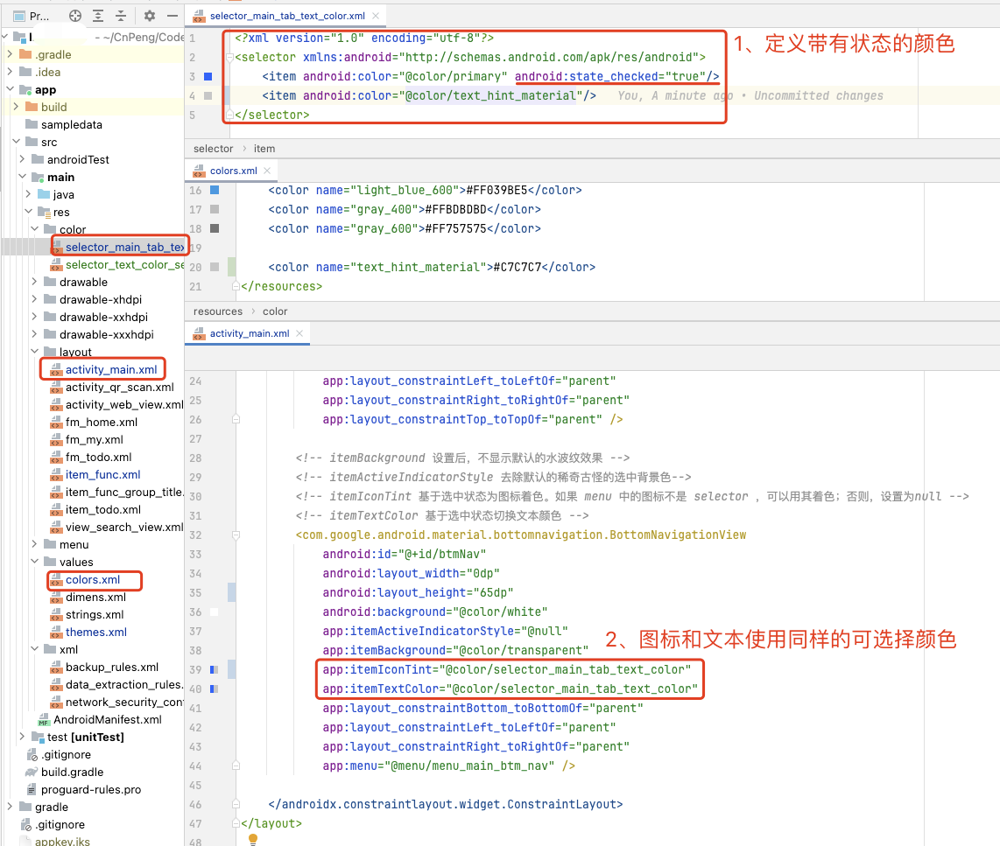


```xml
<?xml version="1.0" encoding="utf-8"?>
<selector xmlns:android="http://schemas.android.com/apk/res/android">
    <item android:color="@color/primary" android:state_checked="true"/>
    <item android:color="@color/text_hint_material"/>
</selector>
```


```xml
 <!-- itemBackground 设置后，不显示默认的水波纹效果 -->
        <!-- itemActiveIndicatorStyle 去除默认的稀奇古怪的选中背景色-->
        <!-- itemIconTint 基于选中状态为图标着色。如果 menu 中的图标不是 selector ，可以用其着色；否则，设置为null -->
        <!-- itemTextColor 基于选中状态切换文本颜色 -->
        <com.google.android.material.bottomnavigation.BottomNavigationView
            android:id="@+id/btmNav"
            android:layout_width="0dp"
            android:layout_height="65dp"
            android:background="@color/white"
            app:itemActiveIndicatorStyle="@null"
            app:itemBackground="@color/transparent"
            app:itemIconTint="@color/selector_main_tab_text_color"
            app:itemTextColor="@color/selector_main_tab_text_color"
            app:layout_constraintBottom_toBottomOf="parent"
            app:layout_constraintLeft_toLeftOf="parent"
            app:layout_constraintRight_toRightOf="parent"
            app:menu="@menu/menu_main_btm_nav" />
```

## 1.2. 修改高度及间距

* `layout_height` 控制整体高度
* `itemPaddingTop` 控制图标与顶部的 margin 间距
* `itemPaddingBottom` 控制文本与底部的 padding 间距


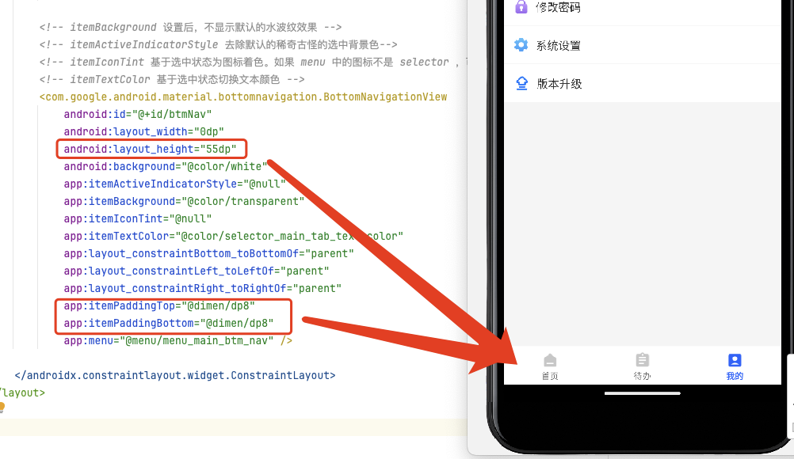

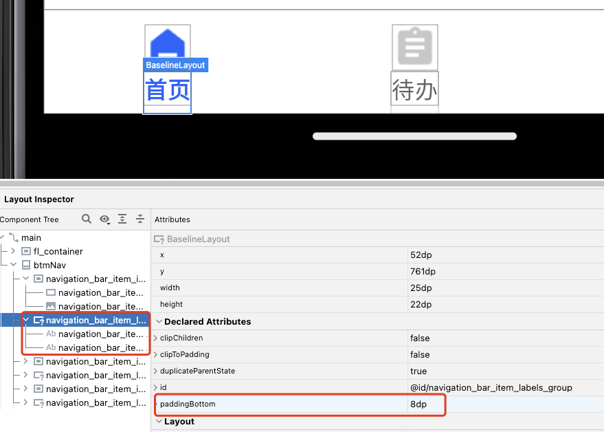

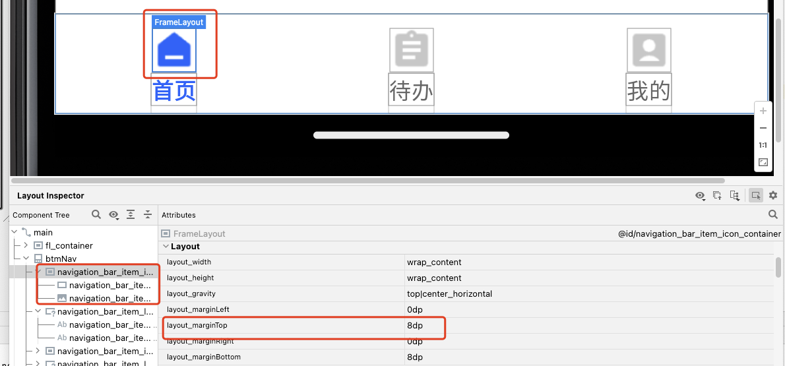

## 1.3. 显示badge(角标/悬浮徽章)

### 1.3.1. 基本使用

​ 在 `BottomNavigationView` 上添加 badge 很简单，它提供了如下操作 badge 的方法：

* `getBadge(int menuItemId)`:  获取badge

* `getOrCreateBadge(int menuItemId) ` : 获取或创建 badge

* `removeBadge(int menuItemId)`: 移除badge

因此添加一个 badge 只需要如下代码：

```kotlin
val navView: BottomNavigationView = findViewById(R.id.nav_view)
val badge = navView.getOrCreateBadge(R.id.navigation_dashboard)
```

​ 效果如下：

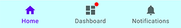


怎么只有一个红点? 因为还没设置数量：

```java
badge.number = 20
```

​ 添加数量后效果如下：


### 1.3.2. 常用属性

`getBadge` 和 `getOrCreateBadge` 方法返回的都是 `BadgeDrawable`，`BadgeDrawable`常用的属性/方法如下：

#### 1.3.2.1. backgroundColor

`backgroundColor` 设置背景色

#### 1.3.2.2. badgeGravity

 `badgeGravity` 设置Badge的显示位置，有四种可先：`TOP_START`，`TOP_END`，`BOTTOM_START`，`BOTTOM_END`，分别对应左上角，右上角，左下角和右下角。

#### 1.3.2.3. badgeTextColor

 `badgeTextColor` 设置文字颜色

#### 1.3.2.4. maxCharacterCount

 `maxCharacterCount` 最多显示几位数字，比如该项设置了3，number 设置为108，则显示99+，如下图所示：


### 1.3.3. 注意事项

* 需要你 Application 的 Theme 继承自 `Theme.MaterialComponents`，如下所示：

```xml
<style name="AppTheme" parent="Theme.MaterialComponents.Light.DarkActionBar">
    <item name="colorPrimary">@color/colorPrimary</item>
    <item name="colorPrimaryDark">@color/colorPrimaryDark</item>
    <item name="colorAccent">@color/colorAccent</item>
</style>
```

* 如果自定义了 `BottomNavigationView` 的 `layout_height` 务必确保 bage 能完全显示。

### 1.3.4. 扩展

​ 同样是位于 `com.google.android.material` 包中的 `TabLayout` 也可以用同样的方式添加 badge : 

```java
tabLayout.getTabAt(0).orCreateBadge.apply {
    number = 10
    backgroundColor = Color.RED
}
```

## 1.4. 其他

> 注意：以下内容摘自 [CSDN:关于BottomNavigationView的使用姿势都在这里了](https://blog.csdn.net/BigBoySunshine/article/details/105774561)，暂未测试。

### 1.4.1. 动态显示/隐藏MenuItem

​ 有些时候需要根据条件来控制menuItem是否显示，有两种方式可以实现：

#### 1.4.1.1. 方案1：remove

```kotlin
val navView: BottomNavigationView = findViewById(R.id.nav_view)
navView.menu.removeItem(R.id.navigation_spacing)
```

​ 这种方式是直接把这个 item 删除掉了，是一个不可逆的过程，也就是说删除后没法再显示出来

#### 1.4.1.2. 方案2：setVisible

```kotlin
// 显示
nav_view.menu.findItem(R.id.navigation_test).isVisible = true
// 隐藏
nav_view.menu.findItem(R.id.navigation_test).isVisible = false
```

​ 效果如下：

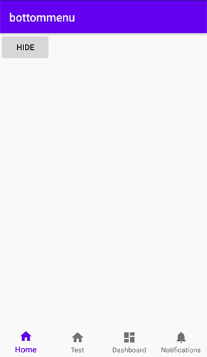


### 1.4.2. 修改字体大小

​ 字体大小分为选中的大小和未选中的大小，他们的默认值分别是14sp/12sp，可以通过覆盖原来的字体大小来改变字体大小。

```xml
<!--默认字体大小 -->
<dimen name="design_bottom_navigation_text_size">14sp</dimen>
<!--选中字体大小 -->
<dimen name="design_bottom_navigation_active_text_size">14sp</dimen>
```

​ 修改前后的效果：

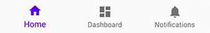


### 1.4.3. labelVisibilityMode

​ 在前面基本属性中已经提到，文字的显示模式有四种:

* auto :​ 这种模式就是item数量在三个及以下全部显示label，三个以上只显示选中item的label，效果如下：


* selected :​ 该模式下，不管item数量是多少都只显示选中的item的label

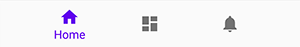

* labeled : 该模式下，不管item数量是多少item的label都显示
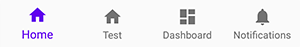

* unlabeled : 该模式下，item的label始终不显示


label 的显示模式可以在布局文件中通过 `labelVisibilityMode` 设置，也可以在 java 代码中通过 `setLabelVisibilityMode` 设置


## 1.5. 图标文字间距

### 1.5.1. 调整图标到顶部的距离

​ 如果想调整图标和文字间的距离，改怎么办呢？查了一些资料大部分都是通过添加 dimen 覆盖默认的 `design_bottom_navigation_margin` 来实现。

```xml
<dimen name="design_bottom_navigation_margin">4dp</dimen>
```

​ 该值默认是把8dp，把它调小了，发现图标和文字的距离变大了，这是怎么回事？其实这个距离并不是图标和文字的间距，而是图标距离顶部和底部的 Margin 值，调小后到顶部的距离也变小了，就显得图标和文字的距离变大了。

​ 如果你有显示 badge 的需求，那这种方式就出问题了，因为 badge 是依附于图标的，图标上移，badge 也会跟着上移，可以就显示不全了


### 1.5.2. 调整文字到底部的距离

​ 那么如果我想调整文字到底部的距离呢？这就需要了解一下每个Item的布局文件 `design_bottom_navigation_item.xml`，其源代码（部分代码省略）如下：

```xml
<merge xmlns:android="http://schemas.android.com/apk/res/android">
  <ImageView
      android:id="@+id/icon"
      android:layout_width="24dp"
      android:layout_height="24dp"
      android:layout_marginTop="@dimen/design_bottom_navigation_margin"
      android:layout_marginBottom="@dimen/design_bottom_navigation_margin"
      android:layout_gravity="center_horizontal"/>
  <com.google.android.material.internal.BaselineLayout
      android:layout_width="wrap_content"
      android:layout_height="wrap_content"
      android:layout_gravity="bottom|center_horizontal"
      android:paddingBottom="10dp">
    <TextView
        android:id="@+id/smallLabel"
        android:layout_width="wrap_content"
        android:layout_height="wrap_content"
        android:textSize="@dimen/design_bottom_navigation_text_size"/>
    <TextView
        android:id="@+id/largeLabel"
        android:layout_width="wrap_content"
        android:layout_height="wrap_content"
        android:textSize="@dimen/design_bottom_navigation_active_text_size"
        android:visibility="invisible"/>
  </com.google.android.material.internal.BaselineLayout>
</merge>
```

> 

## 1.6. 修改控件高度

​ BottomNavigationView 的默认高度是 56dp，如果遇到操蛋的需求非要改它的话就覆盖一下 `design_bottom_navigation_height` 吧，如下：

```xml
<dimen name="design_bottom_navigation_height">84dp</dimen>
```

### 1.6.1. 参考

