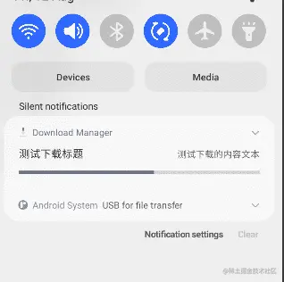
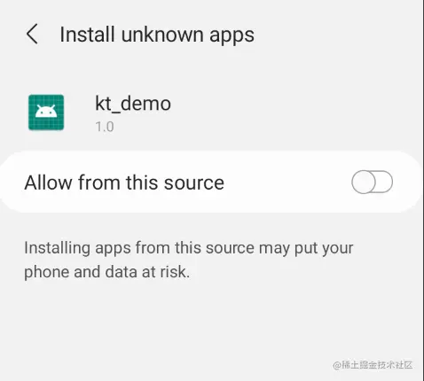
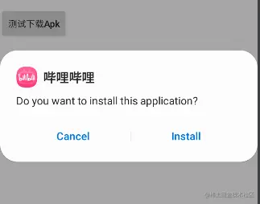
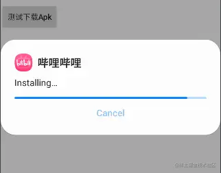
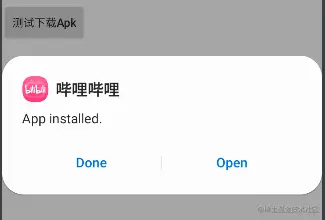
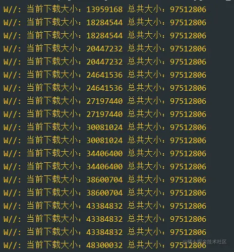

# 1. 001-使用DownloadManager实现下载逻辑

> 基于 DownloadManager 可以实现 App 内的版本升级逻辑。

[原文：下载需要集成第三方？Android原生下载服务DownloadManager不行吗？](https://juejin.cn/post/7132275521768914957)

携手创作，共同成长！这是我参与「掘金日新计划 · 8 月更文挑战」的第20天，[点击查看活动详情](https://juejin.cn/post/7123120819437322247 "https://juejin.cn/post/7123120819437322247")

## 1.1. 前言

App 内的下载功能也是我们常用的场景，比如下载最新的 Apk 安装包，还有些会下载图片，或者资源，插件等场景。

下载不是很简单的功能吗？OkHttp就能下载，基于OkHttp实现的一些框架那更多，比较出名的有FileDownloader okdownload RxDownload 等等。

同时我们 Android 系统服务 DownloadManager 同样可以使用下载服务，他们之间有什么区别？

## 1.2. DownloadManager的默认使用

DownloadManager 是android2.3以后，系统下载的方法。可以让 Android 设备请求的 URI 被下载到一个特定的目标文件。客户端将会在后台与http交互进行下载，或者在下载失败，或者连接改变，重新启动系统后重新下载。还可以进入系统的下载管理界面查看进度。

内部主要包含 DownloadManager.Query 和 DownloadManager.Request 两个重要类。一个是封装一些下载请求的参数，一个是用于查询下载的信息。Request 是必须的，Query是非必须的。

通常使用 DownloadManager 推荐我们使用通知栏展示真正进行下载，并且我们可以跳转到下载器页面查看。

```kotlin
    private fun startDownLoad() {

        //下载链接 这里下载手机B站为示例
        val downloadUrl = "https://dl.hdslb.com/mobile/latest/iBiliPlayer-html5_app_bili.apk"

        val fileName = downloadUrl.substring(downloadUrl.lastIndexOf('/') + 1)
        //这里下载到指定的目录，我们存在公共目录下的download文件夹下
        val fileUri = Uri.fromFile(
            File(
                Environment.getExternalStoragePublicDirectory(Environment.DIRECTORY_DOWNLOADS),
                System.currentTimeMillis().toString() + "-" + fileName
            )
        )
        //开始构建 DownloadRequest 对象
        val request = DownloadManager.Request(Uri.parse(downloadUrl))

        //构建通知栏样式
        request.setTitle("测试下载标题")
        request.setDescription("测试下载的内容文本")

        //下载或下载完成的时候显示通知栏
        request.setNotificationVisibility(DownloadManager.Request.VISIBILITY_VISIBLE or DownloadManager.Request.VISIBILITY_VISIBLE_NOTIFY_COMPLETED)

        //指定下载的文件类型为APK
        request.setMimeType("application/vnd.android.package-archive")
//            request.addRequestHeader()   //还能加入请求头
//            request.setAllowedNetworkTypes(DownloadManager.Request.NETWORK_WIFI)   //能指定下载的网络

        //指定下载到本地的路径(可以指定URI)
        request.setDestinationUri(fileUri)

        //开始构建 DownloadManager 对象
        val downloadManager = commContext().getSystemService(DOWNLOAD_SERVICE) as DownloadManager

        //加入Request到系统下载队列，在条件满足时会自动开始下载。返回的为下载任务的唯一ID
        val requestID = downloadManager.enqueue(request)

        //注册下载任务完成的监听
        commContext().registerReceiver(object : BroadcastReceiver() {

            override fun onReceive(context: Context, intent: Intent) {

                //已经完成
                if (intent.action.equals(DownloadManager.ACTION_DOWNLOAD_COMPLETE)) {

                    //获取下载ID
                    val id = intent.getLongExtra(DownloadManager.EXTRA_DOWNLOAD_ID, -1)
                    val uri = downloadManager.getUriForDownloadedFile(id)
                    YYLogUtils.w("下载完成了- uri:$uri")

                    installApk(uri)

                } else if (intent.action.equals(DownloadManager.ACTION_NOTIFICATION_CLICKED)) {

                    //如果还未完成下载，跳转到下载中心
                    YYLogUtils.w("跳转到下载中心")
                    val viewDownloadIntent = Intent(DownloadManager.ACTION_VIEW_DOWNLOADS)
                    viewDownloadIntent.flags = Intent.FLAG_ACTIVITY_NEW_TASK
                    context.startActivity(viewDownloadIntent)

                }

            }
        }, IntentFilter(DownloadManager.ACTION_DOWNLOAD_COMPLETE))
    }

```

注释的很详细，步骤如下：

1.  我们封装一个 Request 对象设置下载的链接Uri,设置下载到的目标文件夹，设置是否需要展示通知等。
2.  构建 DownloadManager 服务，把 Request 任务放入队列，如果满足条件即可生效。
3.  一般来说我们都希望下载完成之后能处理一些事情，我们就需要监听完成的广播（非必须的）。

这里需要注意的是：

1.  可能需要申请SD卡权限，
2.  如果下载是公共目录，在Android12以上只有download等少数文件夹是开放的，其他的文件夹可能无法访问。
3.  如果下载的是沙盒目录，你无需申请SD卡权限，但是如果外部应用想要访问到此文件，需要定义FileProvider提供给对方使用（比如Apk安装）

完成的效果：



我们下载的是一个Apk，由于我们下载到了公共目录的download文件夹下面，所以我们可以直接调用安装方法，（注意Android8.0的兼容）

兼容8.0以上 声明权限

```ini
<uses-permission android:name="android.permission.REQUEST_INSTALL_PACKAGES" />
```

直接调用即可

```kotlin
    private fun installApk(uri: Uri) {
        val intent = Intent(Intent.ACTION_VIEW)
        intent.flags = Intent.FLAG_ACTIVITY_NEW_TASK
        intent.addFlags(Intent.FLAG_GRANT_READ_URI_PERMISSION)
        intent.setDataAndType(uri, "application/vnd.android.package-archive")
        startActivity(intent)
    }
```

效果：

由于测试机器为Android12，所以需要同意未知的安装包安装权限









一系列的操作就安装成功了。

不行！我不能让我的Apk就这么暴露在公共目录下面！我要隐私，我要下载在沙盒里面！行不行？

当然行，太行了，我们下载到沙盒的目录中的话，我们只能自己的应用有访问权限，其他的应用程序访问就需要FileProvider，这里简单的过一下吧。

```xml
        <provider
            android:name="androidx.core.content.FileProvider"
            android:authorities="com.meiyue.smartcity.fileprovider"
            android:grantUriPermissions="true"
            android:exported="false">
           
            <meta-data
                android:name="android.support.FILE_PROVIDER_PATHS"
                android:resource="@xml/file_paths" />
        </provider>
```

```xml
<paths xmlns:android="http://schemas.android.com/apk/res/android">

    <!--下载apk-->
    <external-path
        name="download"
        path=""/>

</paths>
```

那么我们获取Uri的时候我们就需要通过FileProvider来获取Uri对象了

```java
     Uri apkUri = FileProvider.getUriForFile(context, "com.meiyue.smartcity.fileprovider", file);
```

关于FileProvider感觉已经被开发者玩坏了，有机会会单独出一期，今天的主题是下载服务的使用，我们回归主题。

## 1.3. DownloadManager的静默下载

哇，真的能下载了呢！好简单哦。但是你这么好Low啊，用户一看就知道我在干什么了，我想下载个资源包或插件那怎么办，总不能让用户看到我在下载吧。

万一偷偷的下载点东西干点坏事，不是搞得大家都知道了。啊，你这个通知栏也太丑了，只能设置Title Content，又不能定制UI，放弃！

（下载的时候通知栏的样式是由厂商或系统决定的）

放心，都可以实现的！DownloadManager 其实可以设置不使用通知栏的。

那我怎么知道进度和状态？其实 DownloadManager 内部有 Query 可以查询这些状态的。那我们实现一个偷偷的静默下载逻辑看看。

```kotlin
    private val scheduledExecutorService: ScheduledExecutorService = Executors.newScheduledThreadPool(3)

    private fun startDownLoad() {

        //下载链接 这里下载手机B站为示例
        val downloadUrl = "https://dl.hdslb.com/mobile/latest/iBiliPlayer-html5_app_bili.apk"

        val fileName = downloadUrl.substring(downloadUrl.lastIndexOf('/') + 1)
        //这里下载到指定的目录，我们存在公共目录下的download文件夹下
        val fileUri = Uri.fromFile(
            File(
                Environment.getExternalStoragePublicDirectory(Environment.DIRECTORY_DOWNLOADS),
                System.currentTimeMillis().toString() + "-" + fileName
            )
        )
        //开始构建 DownloadRequest 对象
        val request = DownloadManager.Request(Uri.parse(downloadUrl))

        //下载时候隐藏通知栏
        request.setNotificationVisibility(DownloadManager.Request.VISIBILITY_HIDDEN)

        //指定下载的文件类型为APK
        request.setMimeType("application/vnd.android.package-archive")
//            request.addRequestHeader()   //还能加入请求头
//            request.setAllowedNetworkTypes(DownloadManager.Request.NETWORK_WIFI)   //能指定下载的网络

        //指定下载到本地的路径(可以指定URI)
        request.setDestinationUri(fileUri)

        //开始构建 DownloadManager 对象
        val downloadManager = commContext().getSystemService(DOWNLOAD_SERVICE) as DownloadManager

        //加入Request到系统下载队列，在条件满足时会自动开始下载。返回的为下载任务的唯一ID
        val requestID = downloadManager.enqueue(request)

        //注册获取进度的监听
        YYLogUtils.w("开始下载：fileUri:$fileUri requestID:$requestID")
        //每秒定时刷新一次
        val command = Runnable {
            getBytesAndStatus(requestID)
        }
        scheduledExecutorService.scheduleAtFixedRate(command, 0, 1, TimeUnit.SECONDS)

        //注册下载任务完成的监听
        commContext().registerReceiver(object : BroadcastReceiver() {

            override fun onReceive(context: Context, intent: Intent) {

                //已经完成
                if (intent.action.equals(DownloadManager.ACTION_DOWNLOAD_COMPLETE)) {

                    //解绑进度监听
                    scheduledExecutorService.shutdown()

                    //获取下载ID
                    val id = intent.getLongExtra(DownloadManager.EXTRA_DOWNLOAD_ID, -1)
                    val uri = downloadManager.getUriForDownloadedFile(id)
                    YYLogUtils.w("下载完成了- uri:$uri")

                    installApk(uri)

                } else if (intent.action.equals(DownloadManager.ACTION_NOTIFICATION_CLICKED)) {

                    //如果还未完成下载，跳转到下载中心
                    YYLogUtils.w("跳转到下载中心")
                    val viewDownloadIntent = Intent(DownloadManager.ACTION_VIEW_DOWNLOADS)
                    viewDownloadIntent.flags = Intent.FLAG_ACTIVITY_NEW_TASK
                    context.startActivity(viewDownloadIntent)

                }

            }
        }, IntentFilter(DownloadManager.ACTION_DOWNLOAD_COMPLETE))
    }

    //获取当前进度，和总进度
    private fun getBytesAndStatus(downloadId: Long) {

        val query = DownloadManager.Query().setFilterById(downloadId)
        var cursor: Cursor? = null

        val downloadManager = commContext().getSystemService(DOWNLOAD_SERVICE) as DownloadManager

        try {
            cursor = downloadManager.query(query)
            if (cursor != null && cursor.moveToFirst()) {

//                //Notification 标题
//                val title = cursor.getString(cursor.getColumnIndex(DownloadManager.COLUMN_TITLE))

//                //描述
//                val description = cursor.getString(cursor.getColumnIndex(DownloadManager.COLUMN_DESCRIPTION))

                val downloaded = cursor.getInt(cursor.getColumnIndexOrThrow(DownloadManager.COLUMN_BYTES_DOWNLOADED_SO_FAR))
                val total = cursor.getInt(cursor.getColumnIndexOrThrow(DownloadManager.COLUMN_TOTAL_SIZE_BYTES))
                val progress = downloaded * 100 / total

                YYLogUtils.w("当前下载大小：$downloaded 总共大小：$total")
            }
        } finally {
            cursor?.close()
        }

    }

    private fun installApk(uri: Uri) {
        val intent = Intent(Intent.ACTION_VIEW)
        intent.flags = Intent.FLAG_ACTIVITY_NEW_TASK
        intent.addFlags(Intent.FLAG_GRANT_READ_URI_PERMISSION)
        intent.setDataAndType(uri, "application/vnd.android.package-archive")
        startActivity(intent)
    }

```

注意点：

1.  一定要设置 VISIBILITY\_HIDDEN 才能不显示通知栏
2.  如果高版本设置 VISIBILITY\_HIDDEN 报错，需要设置权限

```ini
 <uses-permission android:name="android.permission.DOWNLOAD_WITHOUT_NOTIFICATION" />
```

3.  我们使用 Query 来查询下载的状态，如果要监听下载进度，我们使用定时任务即可，比如每一秒查询一次。（这里的定时任务可以以任意方式来实现）

这样我们就可以实现和应用内部OkHttp来下载一样的效果啦。



通知栏不能自定义UI？现在我们是静默下载了，你想弹窗展示进度，布局展示进度，通知栏展示进度，自定义通知栏什么的，只要拿到下载的进度，那不是任你揉搓了！属实是想怎么玩就怎么玩了。

## 1.4. 总结

DownloadManager 同样很灵活 ，其实他提供了很多 Api 。我们可以使用它实现各种定制化的下载需求。（比如断点续传，重新下载等），如有有需求，大家可以基于 DownloadManager 实现一个下载的框架。

我觉得 DownloadManager 对比其他的类似OkHttp这样的下载框架，最大的一个优点是系统服务，由于它是系统服务，只要我们的App开启了一个下载任务，那么退出App，这个下载任务一样能继续下载，而使用OkHttp下载就算放在前台Service中，也是有几率挂掉的，而 DownloadManager 则不会。

**当然两种方案都是可以用的**，看不同的使用场景了，让我选的话，如果我做的应用是多媒体类型的，有很多的队列并发下载，并查看媒体文件之类的，我可能会使用 okdownload ，但是如果我做的就是很普通的应用，大量并发下载的场景不多，我可能就会使用DownloadManager实现了。

同时我们可以基于系统服务进行一些联动，比如我们之前讲到的 [WorkManager](https://juejin.cn/post/7130793502933254180 "https://juejin.cn/post/7130793502933254180") 。每12小时检查一下远程的资源与版本，我们就可以搭配 DownloadManager 在后台偷偷的下载资源与插件。并且他们都支持指定Wifi环境下的下载。简直完美。

想测试的同学可以看看代码，运行一下，[源码在此](https://gitee.com/newki123456/Kotlin-Room/blob/d976cc5e9ad1236a44b79f49b47908f1eb3eb6e9/standalone/demorunalone/src/main/java/com/guadou/kt_demo/demo/demo16_record/Demo16RecordActivity.kt "https://gitee.com/newki123456/Kotlin-Room/blob/d976cc5e9ad1236a44b79f49b47908f1eb3eb6e9/standalone/demorunalone/src/main/java/com/guadou/kt_demo/demo/demo16_record/Demo16RecordActivity.kt")。

最后吐槽一句，DownloadManager 可比 坑爹的 LocationManager 好用多了。

好了，我如有讲解不到位或错漏的地方，希望同学们可以指出交流。

如果感觉本文对你有一点点点的启发，还望你能`点赞`支持一下,你的支持是我最大的动力。

Ok,这一期就此完结。

## 1.5. 补充

* [AppUpdate升级逻辑库](https://github.com/azhon/AppUpdate)