# 1. ShapeableImageView

## 1.1. 基本介绍

ShapeableImageView 继承自 AppCompatImageView 并实现了 Shapeable 接口。

基于 ShapeableImageView 在不写 shape、不引入三方库的情况下即可实现圆角、圆形、半圆、切角等效果。

使用前需要先引入 `material` 库（截至 2021-12-10 ，最新版本为 1.4.0-alpha02）：

```xml
implementation "com.google.android.material:material:1.4.0-alpha02"
```

## 1.2. 属性

### 1.2.1. 属性介绍

ShapeableImageView 的核心属性有 4 个：

属性	|描述
---|---
`strokeWidth`	| 描边宽度
`strokeColor`	| 描边颜色
`shapeAppearance`	| 取值为 style.xml 中声明的 style，用来控制图片的形状
`shapeAppearanceOverlay` | 取值同上，表示叠加层

### 1.2.2. strokeWith 注意事项

在设置 `strokeWith` 时，必须配套设置一个 `padding` 值，且 padding = storkeWith/2 。因为在进行绘制时，画笔的一半会在矩形区域以外，如下图：

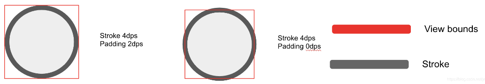

## 1.3. 使用

### 1.3.1. 常规

```xml
<com.google.android.material.imageview.ShapeableImageView
    android:layout_width="wrap_content"
    android:layout_height="wrap_content"
    android:layout_margin="10dp"
    android:src="@mipmap/ic_avatar" />
```

使用方式和普通 `ImageView` 无差异。

### 1.3.2. 圆角


```xml
<com.google.android.material.imageview.ShapeableImageView
    android:layout_width="wrap_content"
    android:layout_height="wrap_content"
    android:layout_margin="10dp"
    android:src="@mipmap/ic_avatar"
    app:shapeAppearance="@style/RoundedStyle" />

```

```xml
<!--ShapeableImageView 圆角-->
<style name="RoundedStyle">
    <item name="cornerFamily">rounded</item>
    <item name="cornerSize">10dp</item>
</style>
```

* 没有直接设置圆角的属性，需要用到 `app:shapeAppearance`，其值为 `style.xml` 中声明的 style
* `cornerFamily` 角的处理方式，rounded圆角，cut裁剪
* `cornerSize` 圆角大小

### 1.3.3. 圆


```xml
<com.google.android.material.imageview.ShapeableImageView
    android:layout_width="wrap_content"
    android:layout_height="wrap_content"
    android:layout_margin="10dp"
    android:src="@mipmap/ic_avatar"
    app:shapeAppearance="@style/CircleStyle" />
```

```xml
<!--ShapeableImageView 圆 -->
<style name="CircleStyle">
    <item name="cornerFamily">rounded</item>
    <item name="cornerSize">50%</item>
</style>
```

* 圆角的大小可以用百分比，也可以自己计算，比如宽高100dp，圆角50dp

### 1.3.4. 描边


```xml
<com.google.android.material.imageview.ShapeableImageView
    android:layout_width="wrap_content"
    android:layout_height="wrap_content"
    android:layout_margin="10dp" 
    android:padding="2dp"
    android:src="@mipmap/ic_avatar"
    app:shapeAppearance="@style/CircleStyle"
    app:strokeColor="@color/red"
    app:strokeWidth="4dp" />
```

* app:strokeColor 描边颜色
* app:strokeWidth 描边宽度

注意这里padding的数值是描边宽度的一半，后面会说


### 1.3.5. 切角


```xml
<com.google.android.material.imageview.ShapeableImageView
    android:layout_width="wrap_content"
    android:layout_height="wrap_content"
    android:layout_margin="10dp" 
    android:padding="2dp"
    android:src="@mipmap/ic_avatar"
    app:shapeAppearance="@style/CutStyle"
    app:strokeColor="@color/red"
    app:strokeWidth="4dp" />
```

```xml
<!--ShapeableImageView 切角 -->
<style name="CutStyle">
    <item name="cornerFamily">cut</item>
    <item name="cornerSize">10dp</item>
</style>
```

cornerFamily：cut 处理模式变为裁剪

### 1.3.6. 菱形

```xml
<com.google.android.material.imageview.ShapeableImageView
    android:layout_width="wrap_content"
    android:layout_height="wrap_content"
    android:layout_margin="10dp" 
    android:padding="2dp"
    android:src="@mipmap/ic_avatar"
    app:shapeAppearance="@style/RhombusStyle"
    app:strokeColor="@color/red"
    app:strokeWidth="4dp" />
```

```xml
<!--ShapeableImageView 菱形 -->
<style name="RhombusStyle">
    <item name="cornerFamily">cut</item>
    <item name="cornerSize">50%</item>
</style>
```

同样，裁剪模式下圆角大小也可以使用百分比计算

### 1.3.7. 叶子


```xml
<com.google.android.material.imageview.ShapeableImageView
    android:layout_width="wrap_content"
    android:layout_height="wrap_content"
    android:layout_margin="10dp" 
    android:padding="2dp"
    android:src="@mipmap/ic_avatar"
    app:shapeAppearance="@style/LeafStyle"
    app:strokeColor="@color/red"
    app:strokeWidth="4dp" />
```

```
<!--ShapeableImageView 叶子 -->
<style name="LeafStyle">
    <item name="cornerFamily">rounded</item>
    <item name="cornerSizeTopLeft">50%</item>
    <item name="cornerSizeBottomRight">50%</item>
</style>
```

* cornerSizeTopLeft 左上圆角
* cornerSizeBottomRight 右下圆角

以此类推，左上、左下、右上、右下等

### 1.3.8. 半圆

```xml
<com.google.android.material.imageview.ShapeableImageView
    android:layout_width="wrap_content"
    android:layout_height="wrap_content"
    android:layout_margin="10dp" 
    android:padding="2dp"
    android:src="@mipmap/ic_avatar"
    app:shapeAppearance="@style/SemicircleStyle"
    app:strokeColor="@color/red"
    app:strokeWidth="4dp" />
```

```xml
<!--ShapeableImageView 半圆 -->
<style name="SemicircleStyle">
    <item name="cornerFamily">rounded</item>
    <item name="cornerSizeTopLeft">50%</item>
    <item name="cornerSizeTopRight">50%</item>
</style>
```

### 1.3.9. 六边形


```xml
<com.google.android.material.imageview.ShapeableImageView
    android:layout_width="wrap_content"
    android:layout_height="50dp"
    android:layout_margin="10dp" 
    android:padding="2dp"
    android:scaleType="centerCrop"
    android:src="@mipmap/ic_avatar"
    app:shapeAppearance="@style/HexagonStyle"
    app:strokeColor="@color/red"
    app:strokeWidth="4dp" />
```

```xml
<!--ShapeableImageView 六边形 -->
<style name="HexagonStyle">
    <item name="cornerFamily">cut</item>
    <item name="cornerSizeTopLeft">50%</item>
    <item name="cornerSizeTopRight">50%</item>
    <item name="cornerSizeBottomLeft">50%</item>
    <item name="cornerSizeBottomRight">50%</item>
</style>
```

### 1.3.10. Tips 形状

```xml
<com.google.android.material.imageview.ShapeableImageView
        android:id="@+id/siv_tip"
        android:layout_width="100dp"
        android:layout_height="30dp" 
        android:scaleType="centerCrop"
        android:src="@drawable/hlq_test" 
        app:shapeAppearanceOverlay="@style/tipsCornerStyle" />
```

对应 style：

```xml
<!-- 小 Tips -->
    <style name="tipsCornerStyle">
        <item name="cornerFamilyTopLeft">rounded</item>
        <item name="cornerSizeTopLeft">50%</item>
        <item name="cornerFamilyBottomLeft">rounded</item>
        <item name="cornerSizeBottomLeft">50%</item>
        <item name="cornerFamilyTopRight">cut</item>
        <item name="cornerSizeTopRight">50%</item>
        <item name="cornerFamilyBottomRight">cut</item>
        <item name="cornerSizeBottomRight">50%</item>
    </style>
```

### 1.3.11. 右上角半圆

```xml
<com.google.android.material.imageview.ShapeableImageView
        android:id="@+id/siv_top_right"
        android:layout_width="80dp"
        android:layout_height="80dp" 
        android:scaleType="fitXY"
        android:src="@drawable/hlq_test" 
        app:shapeAppearanceOverlay="@style/topRightCornerStyle" />
```

对应 style：

```xml
<!-- 右上角圆角图片 -->
    <style name="topRightCornerStyle">
        <item name="cornerFamilyTopRight">rounded</item>
        <item name="cornerSizeTopRight">50dp</item>
    </style>
```

### 1.3.12. 子弹头

```xml
<com.google.android.material.imageview.ShapeableImageView
        android:id="@+id/siv_egg"
        android:layout_width="80dp"
        android:layout_height="80dp" 
        android:scaleType="fitXY"
        android:src="@drawable/hlq_test" 
        app:shapeAppearanceOverlay="@style/eggStyle" />
```

对应 style：

```xml
<!-- 小鸡蛋图片 -->
    <style name="eggStyle">
        <item name="cornerFamilyTopRight">rounded</item>
        <item name="cornerSizeTopRight">50dp</item>
        <item name="cornerSizeTopLeft">50dp</item>
        <item name="cornerFamilyTopLeft">rounded</item>
    </style>
```

## 1.4. 源码解析

### 1.4.1. 构造函数

我们看看 ShapeableImageView 中的构造函数，如下图：

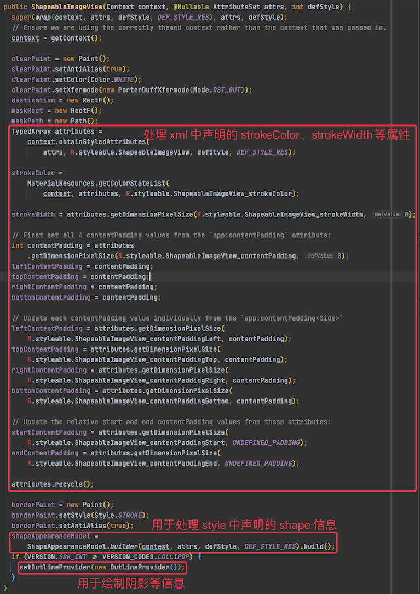

如上图，在构造函数中初始化了用于绘制的 paint ， 解析了在 xml 中声明的 `strokeWidth`、`strokeColor` 等属性信息，构造了 `shapeAppearanceModel`,还设置了一个 `OutlineProvider`——用于绘制阴影等信息。

### 1.4.2. ShapeAppearanceModel.builder(,,,)

我们重点看的是：

```xml
shapeAppearanceModel = ShapeAppearanceModel.builder(context, attrs, defStyle, DEF_STYLE_RES).build();
```

`ShapeAppearanceModel.builder(,,,)` 的内部实现如下：

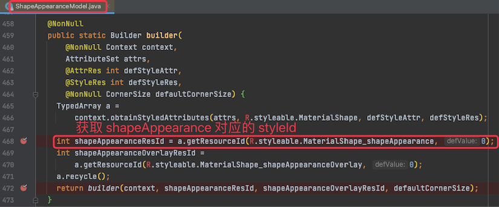

上图中，在 `return` 语句中调用了 `builder(,,,)` 函数，其内部实现如下：

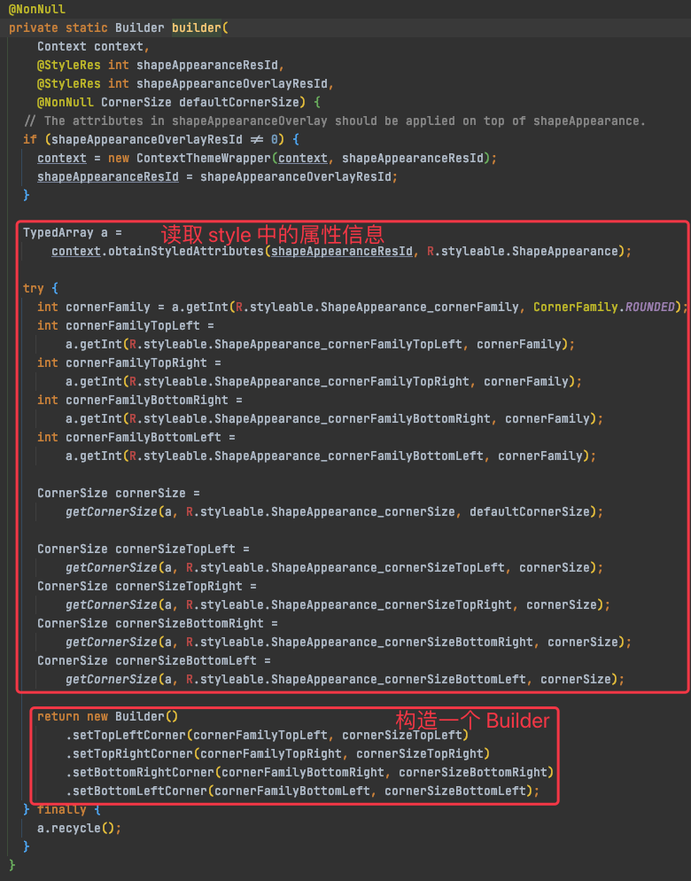

通过上图我们可以看到，`builder` 方法内部解析了 `style` 中声明的属性，然后基于这些属性构造了一个 `ShapeAppearanceModel.Builder`。

而 `Builder.build()` 方法又可以返回一个 `ShapeAppearanceModel` 实例

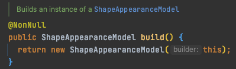

### 1.4.3. setOutlineProvider()

> TODO 没整明白这个 shadowDrawable 在什么时机使用，按字面意思理解应该是用于绘制 shadow .

在 ShapeableImageView 的构造方法中，获取到 `ShapeAppearanceModel.Builder` 之后，接下来就调用了 `setOutlineProvider()` 方法，传入该方法的是 `OutlineProvider` 类的实例，该类是 `ShapeableImageView` 的内部类，其定义如下：

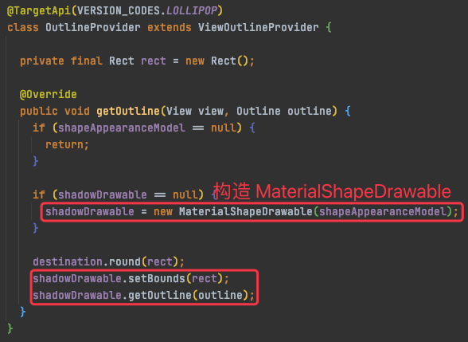

如上图 ， `MaterialShapeDrawable` 的构造方法中接收了前面得到的 `ShapeAppearanceModel` 实例，并基于该实例构造了一个将要绘制的 Drawable 对象，如下图：

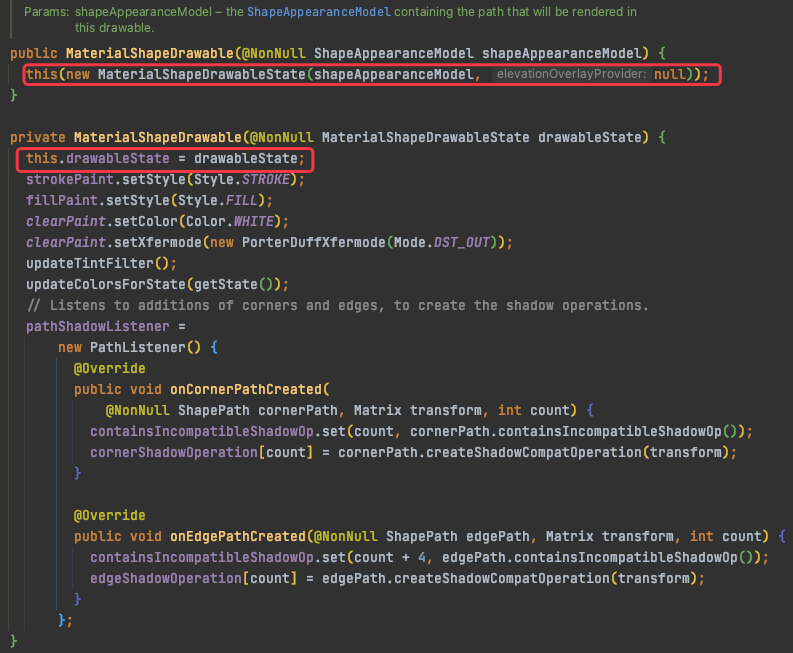

我们再回过头来看 `setOutlineProvider()` ，该方法是  View 中的方法， 其定义如下：

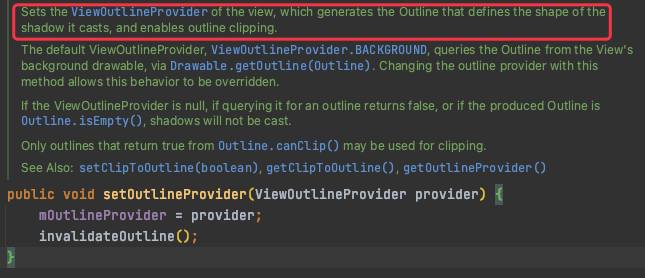

上图中，会调用 `invalidateOutline()` 对 `outline` 重绘，如下：

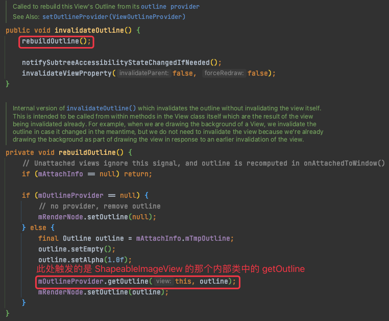

### 1.4.4. 后续动作

接下来就会触发`ShapeableImageView`  中的 `onMeasure()` 进行测量，测量完成之后会触发 `onSizeChanged(,,,)` 等方法，如下：

```java
// 尺寸发生变化
@Override
protected void onSizeChanged(int width, int height, int oldWidth, int oldHeight) {
  super.onSizeChanged(width, height, oldWidth, oldHeight);
  updateShapeMask(width, height);
}

// 更新 shapeMask, 并根据 shapeAppearanceModel 计算新的绘制路径
private void updateShapeMask(int width, int height) {
  destination.set(
      getPaddingLeft(), getPaddingTop(), width - getPaddingRight(), height - getPaddingBottom());
  pathProvider.calculatePath(shapeAppearanceModel, 1f /*interpolation*/, destination, path);
  // Remove path from rect to draw with clear paint.
  maskPath.rewind();
  maskPath.addPath(path);
  // Do not include padding to clip the background too.
  maskRect.set(0, 0, width, height);
  maskPath.addRect(maskRect, Direction.CCW);
}

// 开始绘制
@Override
protected void onDraw(Canvas canvas) {
  super.onDraw(canvas);
  // 绘制图形
  canvas.drawPath(maskPath, clearPaint);
  // 绘制 stroke 边线
  drawStroke(canvas);
}
```

## 1.5. 自定义图形

基于前面的源码分析我们可以获知：`ShapeableImageView` 的核心是 `ShapeAppearanceModel`


可以看到有各种边和角的属性，这里注意两个点：

* `MaterialShapeUtils.createDefaultCornerTreatment()` 创建默认角的处理方式
* `MaterialShapeUtils.createDefaultEdgeTreatment()` 创建默认边的处理方式

也就意味着，边和角除了默认，是可以自定义的，这就有极大的想象空间了，

比如这样：

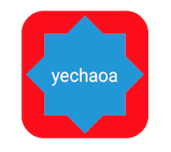

```kotlin
// 代码设置 角和边
val shapeAppearanceModel2 = ShapeAppearanceModel.builder().apply {
    setAllCorners(RoundedCornerTreatment())
    setAllCornerSizes(50f)
    setAllEdges(TriangleEdgeTreatment(50f, false))
}.build()
val drawable2 = MaterialShapeDrawable(shapeAppearanceModel2).apply {
    setTint(ContextCompat.getColor(this@ShapeableImageViewActivity, R.color.colorPrimary))
    paintStyle = Paint.Style.FILL_AND_STROKE
    strokeWidth = 50f
    strokeColor = ContextCompat.getColorStateList(this@ShapeableImageViewActivity, R.color.red)
}
mBinding.text2.setTextColor(Color.WHITE)
mBinding.text2.background = drawable2
```

再比如这样：

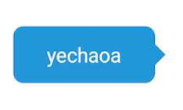

```kotlin
// 代码设置 聊天框效果
val shapeAppearanceModel3 = ShapeAppearanceModel.builder().apply {
    setAllCorners(RoundedCornerTreatment())
    setAllCornerSizes(20f)
    setRightEdge(object : TriangleEdgeTreatment(20f, false) {
        // center 位置 ， interpolation 角的大小
        override fun getEdgePath(length: Float, center: Float, interpolation: Float, shapePath: ShapePath) {
            super.getEdgePath(length, 35f, interpolation, shapePath)
        }
    })
}.build()
val drawable3 = MaterialShapeDrawable(shapeAppearanceModel3).apply {
    setTint(ContextCompat.getColor(this@ShapeableImageViewActivity, R.color.colorPrimary))
    paintStyle = Paint.Style.FILL
}
(mBinding.text3.parent as ViewGroup).clipChildren = false // 不限制子view在其范围内
mBinding.text3.setTextColor(Color.WHITE)
mBinding.text3.background = drawable3
```

### 1.5.1. MaterialShapeDrawable

源码（有删减）：

```java
public class MaterialShapeDrawable extends Drawable implements TintAwareDrawable, Shapeable {
...
  @Override
  public void draw(@NonNull Canvas canvas) {
    fillPaint.setColorFilter(tintFilter);
    final int prevAlpha = fillPaint.getAlpha();
    fillPaint.setAlpha(modulateAlpha(prevAlpha, drawableState.alpha));

    strokePaint.setColorFilter(strokeTintFilter);
    strokePaint.setStrokeWidth(drawableState.strokeWidth);

    final int prevStrokeAlpha = strokePaint.getAlpha();
    strokePaint.setAlpha(modulateAlpha(prevStrokeAlpha, drawableState.alpha));

    if (pathDirty) {
      calculateStrokePath();
      calculatePath(getBoundsAsRectF(), path);
      pathDirty = false;
    }

    maybeDrawCompatShadow(canvas);
    if (hasFill()) {
      drawFillShape(canvas);
    }
    if (hasStroke()) {
      drawStrokeShape(canvas);
    }
...
  static final class MaterialShapeDrawableState extends ConstantState {
    ...
    public MaterialShapeDrawableState(@NonNull MaterialShapeDrawableState orig) {
      shapeAppearanceModel = orig.shapeAppearanceModel;
      elevationOverlayProvider = orig.elevationOverlayProvider;
      strokeWidth = orig.strokeWidth;
      colorFilter = orig.colorFilter;
      fillColor = orig.fillColor;
      strokeColor = orig.strokeColor;
      tintMode = orig.tintMode;
      tintList = orig.tintList;
      alpha = orig.alpha;
      scale = orig.scale;
      shadowCompatOffset = orig.shadowCompatOffset;
      shadowCompatMode = orig.shadowCompatMode;
      useTintColorForShadow = orig.useTintColorForShadow;
      interpolation = orig.interpolation;
      parentAbsoluteElevation = orig.parentAbsoluteElevation;
      elevation = orig.elevation;
      translationZ = orig.translationZ;
      shadowCompatRadius = orig.shadowCompatRadius;
      shadowCompatRotation = orig.shadowCompatRotation;
      strokeTintList = orig.strokeTintList;
      paintStyle = orig.paintStyle;
      if (orig.padding != null) {
        padding = new Rect(orig.padding);
      }
    }
	...
  }
...
}
```

没什么特别的，你只需要知道除了可以设置描边之外，还可以设置背景、阴影等其他属性。

说明

* ShapeAppearanceModel只能是实现Shapeable接口的View才可以设置，比如Chip、MaterialButtom等。
* 而MaterialShapeDrawable其实就是Drawable，是所有View都可以设置的。

### 1.5.2. 默认圆角问题

> 实测在 `com.google.android.material:material:1.4.0-alpha02` API 30 中没有默认圆角。

有细心的同学会发现啊，第一个常规的 ShapeableImageView 还是有一点圆角的，没错，属于默认的，跟踪一下源码来看一下：

```xml
<style name="Widget.MaterialComponents.ShapeableImageView" parent="android:Widget">
    <item name="strokeColor">@color/material_on_surface_stroke</item>
    <item name="shapeAppearance">?attr/shapeAppearanceMediumComponent</item>
</style>
```

第一个是颜色，很明显不是我们要找的，继续看 shapeAppearanceMediumComponent

```xml
<attr format="reference" name="shapeAppearanceMediumComponent"/>
```

只是一个简单的属性，继续查找关联引用

```xml
    <item name="shapeAppearanceMediumComponent">
      @style/ShapeAppearance.MaterialComponents.MediumComponent
    </item>
```

又引用了一个style，继续看ShapeAppearance.MaterialComponents.MediumComponent这个style

```xml
<style name="ShapeAppearance.MaterialComponents.MediumComponent">
    <item name="cornerSize">@dimen/mtrl_shape_corner_size_medium_component</item>
</style>
```

哦豁，看到了熟悉的属性 cornerSize，藏的还挺深，继续看看数值是多少

```xml
<dimen name="mtrl_shape_corner_size_medium_component">4dp</dimen>
```

默认4dp。

那如果不想要这个圆角怎么办呢，可以学习源码仿写一个，不过上面也看到了，有点绕，不如直接写个style搞定：

```xml
    <!--ShapeableImageView 去圆角-->
    <style name="Corner0Style">
        <item name="cornerSize">0dp</item>
    </style>
```

然后引用

```
app:shapeAppearance="@style/Corner0Style"
```

### 1.5.3. 查看支持的属性

我们先在 xml 文件中定义一个 `app:shapeAppearance` 引用的 style , 然后点击该 style 中的 item 的名称即可跳转到 `values.xml` 文件中，在该文件中我们就可以获知支持的属性信息。如下图：

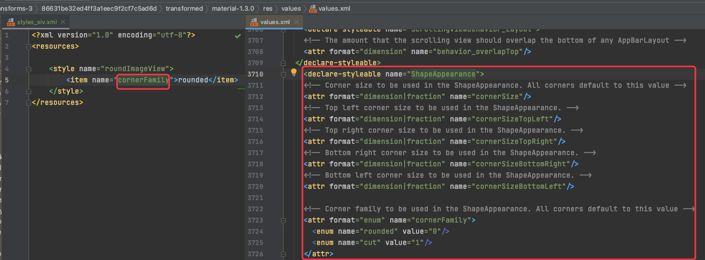


## 1.6. 参考

* [ShapeableImageView 官方 reference 文档](https://developer.android.google.cn/reference/com/google/android/material/imageview/ShapeableImageView)
* [ShapeAppearanceModel 官方 reference 文档](https://developer.android.google.cn/reference/com/google/android/material/shape/ShapeAppearanceModel)

---

* [Android Material组件使用详解](https://blog.csdn.net/magic0908/article/details/101029876)


* [Android ShapeableImageView使用详解，告别shape、三方库](https://blog.csdn.net/yechaoa/article/details/117339632)
* [Material组件之ShapeableImageView的使用（学习笔记）](https://blog.csdn.net/baidu_34587520/article/details/108992294)