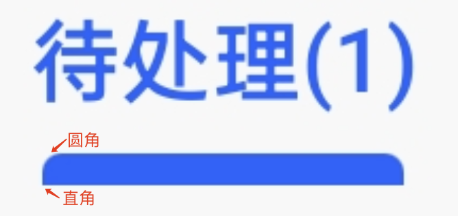
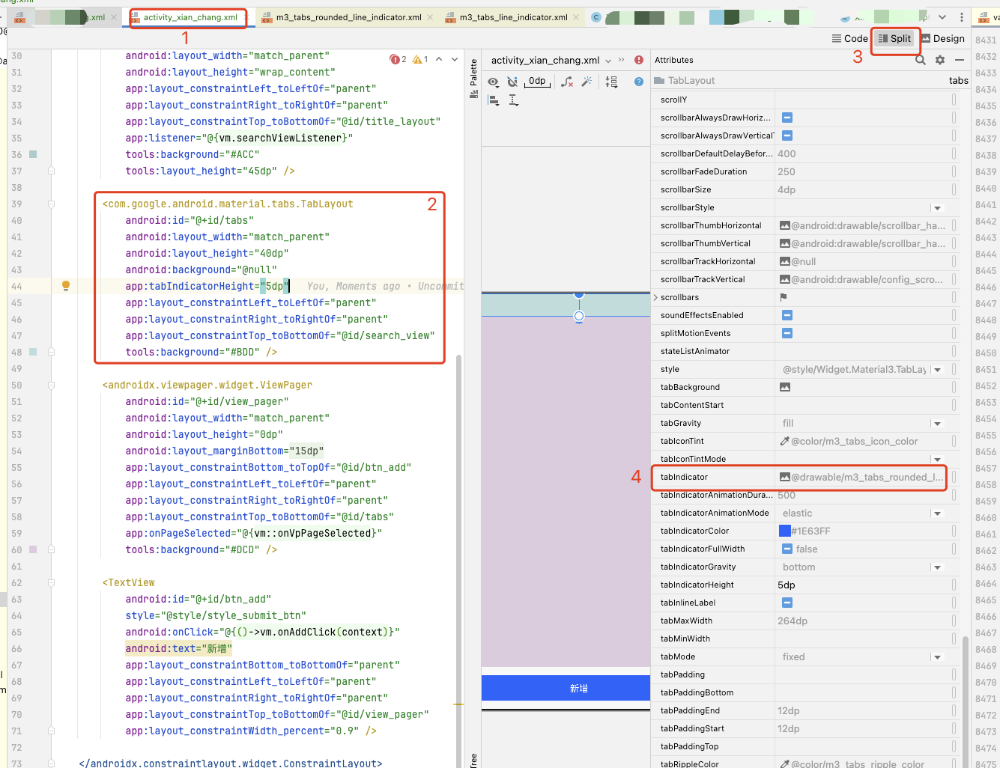
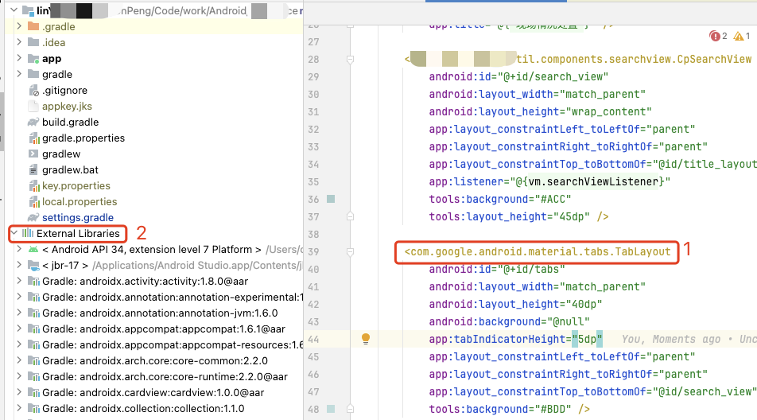
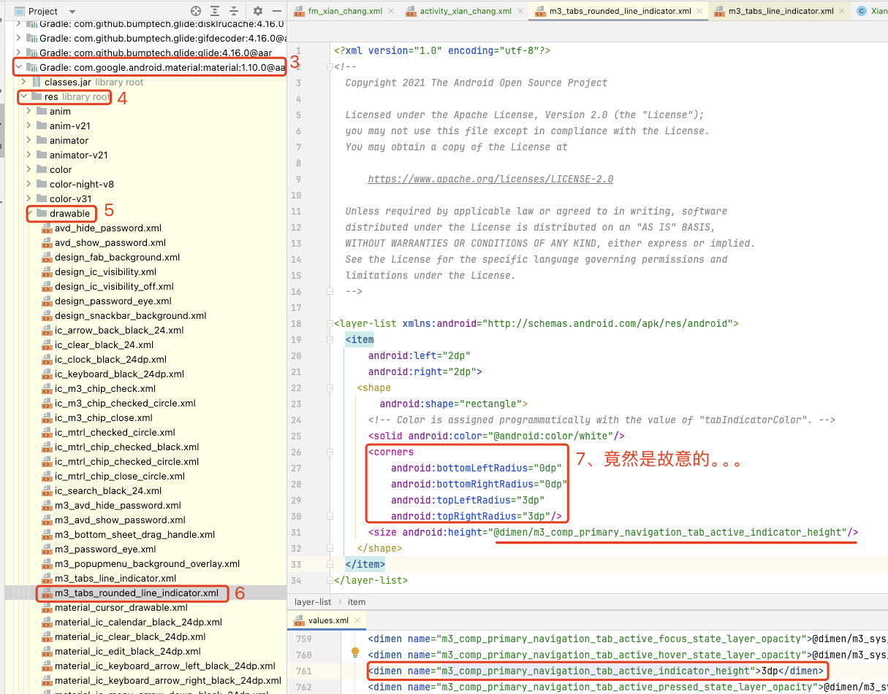
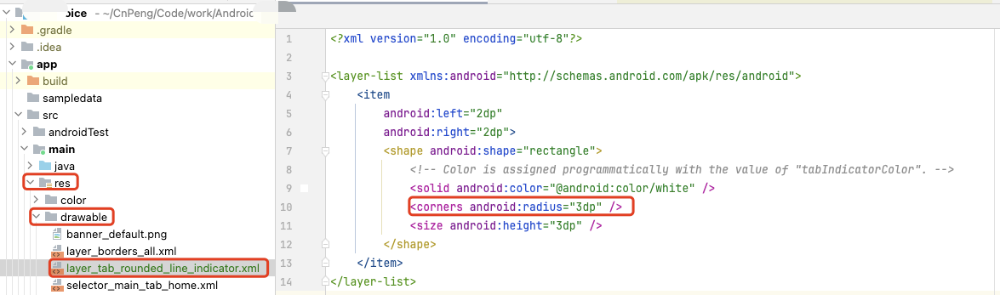
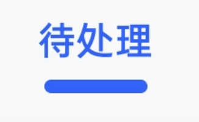

# 1. TabLayout中Tab被选中时indicator异常

## 1.1. 问题现象

AndroidStudio Jellyfish | 2023.3.1 Patch 1

项目应用的主题如下：

```xml
<resources>
    <!-- Base application theme. -->
    <style name="Base.Theme.LinyiPolice" parent="Theme.Material3.DayNight.NoActionBar">
        <!-- Customize your light theme here. -->
        <item name="colorPrimary">@color/primary</item>
        <!-- 修改 BottomNavigationView 不设置 itemTint 且 item 未选中时的图标渲染色 -->
        <item name="android:textColorSecondary">@color/selector_text_color_secondary</item>
        <!-- 全局修改页面背景色-->
        <item name="android:windowBackground">@color/background</item>
    </style>

    <style name="Theme.LinyiPolice" parent="Base.Theme.LinyiPolice" />
</resources>
```

布局文件内容如下：


```xml
<com.google.android.material.tabs.TabLayout
    android:id="@+id/tabs"
    android:layout_width="match_parent"
    android:layout_height="40dp"
    android:background="@null"
    app:layout_constraintLeft_toLeftOf="parent"
    app:layout_constraintRight_toRightOf="parent"
    app:layout_constraintTop_toBottomOf="@id/search_view"
    tools:background="#BDD" />
```

项目运行之后，我们发现 Tab 的指示器有异常——上半部分有圆角，下半部分没有圆角。难道是被遮挡了？？或者说有  BUG ??

截图如下：




## 1.2. 问题分析

### 1.2.1. 查看默认的 indicator 图片值：



默认的图标为 `@drawable/m3_tabs_rounded_line_indicator`

### 1.2.2. 在源码中找到该图片：





## 1.3. 解决

### 1.3.1. 定义 drawable 



```xml
<?xml version="1.0" encoding="utf-8"?>

<layer-list xmlns:android="http://schemas.android.com/apk/res/android">
    <item
        android:left="2dp"
        android:right="2dp">
        <shape android:shape="rectangle">
            <!-- Color is assigned programmatically with the value of "tabIndicatorColor". -->
            <solid android:color="@android:color/white" />
            <corners android:radius="3dp" />
            <size android:height="3dp" />
        </shape>
    </item>
</layer-list>

```

### 1.3.2. 替换

```xml
<com.google.android.material.tabs.TabLayout
    android:id="@+id/tabs"
    android:layout_width="match_parent"
    android:layout_height="40dp"
    android:background="@null"
    app:layout_constraintLeft_toLeftOf="parent"
    app:layout_constraintRight_toRightOf="parent"
    app:layout_constraintTop_toBottomOf="@id/search_view"
    app:tabIndicator="@drawable/layer_tab_rounded_line_indicator"
    tools:background="#BDD" />
```

运行后查看效果如下：

