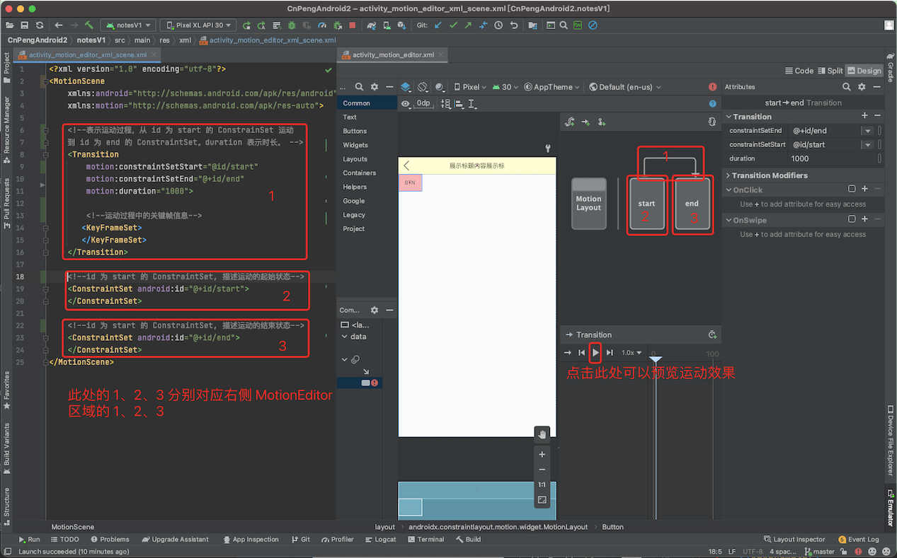
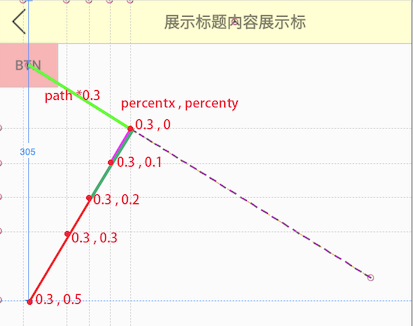
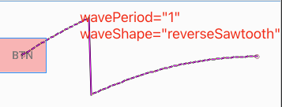
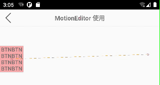

# 1. MotionLayout 构建动效

MotionLayout 是 ConstrainLayout 的子类，它能够让我们更方便的为视图添加动效。

>注意：**MotionLayout 仅适用于其直接子级，不支持嵌套布局层次结构或 Activity 转换**。

使用 MotionLayout 前需要先在 model 的 `build.gradle` 文件中添加对 ConstraintLayout 的依赖，版本不能低于 2.0，此处使用的是 2.0.4：

```groovy
dependencies {
    implementation 'androidx.constraintlayout:constraintlayout:2.0.4'
}
```


## 1.1. MotionEditor 的基本使用

MotionEditor 是与 MotionLayout 相关的视图编辑器。借助 MotionEditor 我们只需要编辑少量代码，然后通过拖拽点击即可实现动效。

接下来我们就实现一个简单的位移动效。

### 1.1.1. 转换 ConstraintLayout

先构建一个以 ConstraintLayout 为根布局的 xml , 在其中新增一个 button 按钮，并为其添加约束。代码如下（示例代码中使用了 DataBinding）：

```xml
<?xml version="1.0" encoding="utf-8"?>
<layout xmlns:app="http://schemas.android.com/apk/res-auto">

    <data>

        <variable
            name="vm"
            type="com.cnpeng.newapi.motionlayout.vm.MotionEditorVm" />
    </data>

    <androidx.constraintlayout.widget.ConstraintLayout xmlns:android="http://schemas.android.com/apk/res/android"
        android:layout_width="match_parent"
        android:layout_height="match_parent">

        <!--这是自定义的 title 布局-->
        <include
            android:id="@+id/title"
            layout="@layout/include_title_layout"
            app:layout_constraintLeft_toLeftOf="parent"
            app:layout_constraintTop_toTopOf="parent"
            app:leftBtnClick="@{()->vm.onBackBtnClick()}"
            app:title="@{`MotionEditor 使用`,default=`MotionEditor`}" />

        <Button
            android:layout_width="60dp"
            android:layout_height="44dp"
            android:background="#FAA"
            android:gravity="center"
            android:text="BTN"
            app:layout_constraintLeft_toLeftOf="parent"
            app:layout_constraintTop_toBottomOf="@id/title" />

    </androidx.constraintlayout.widget.ConstraintLayout>
</layout>
```

然后在 `Split` 或 `Design` 视图的预览区域中右击，并选择 `Convert to MotionLayout`，如下图:


然后会出现如下弹窗：


选择 `Convert` 之后，会呈现如下界面：


上图中，右侧 4 区域的视图就是 MotionEditor 的内容。

### 1.1.2. MotionScene 文件

在上一小节中，完成转换之后，我们会看到跟布局变成了 MotionLayout，且其中有一个 `app:layoutDescription` 属性，该属性的值是执行 `Convert` 操作时自动生成的根节点为 `MotionScene` 的 `.xml` 文件，该文件就描述了界面的动效信息。其内部结构如下：



```xml
<?xml version="1.0" encoding="utf-8"?>
<MotionScene
    xmlns:android="http://schemas.android.com/apk/res/android"
    xmlns:motion="http://schemas.android.com/apk/res-auto">

    <!--表示运动过程，从 id 为 start 的 ConstrainSet 运动
    到 id 为 end 的 ConstraintSet。duration 表示时长。 -->
    <Transition
        motion:constraintSetStart="@id/start"
        motion:constraintSetEnd="@+id/end"
        motion:duration="1000">

        <!--运动过程中的关键帧信息-->
       <KeyFrameSet>
       </KeyFrameSet>
    </Transition>

    <!--id 为 start 的 ConstraintSet, 描述运动的起始状态-->
    <ConstraintSet android:id="@+id/start">
    </ConstraintSet>

    <!--id 为 start 的 ConstraintSet, 描述运动的结束状态-->
    <ConstraintSet android:id="@+id/end">
    </ConstraintSet>
</MotionScene>
```

> 关于节点的具体含义和内部子节点的定义在后面会做详细说明。

### 1.1.3. 添加动效

完成前面的跟布局转换之后，运行 app ，我们会发现界面还是静态的。接下来我们就借助 MotionEditor 来让界面中的 Button 动起来。步骤如下：

#### 1.1.3.1. 完整步骤的示意动图


#### 1.1.3.2. 步骤拆解1

在上面的动图中，我们先选择 `Design` 预览视图，然后点击预览中的 Button 按钮，点击之后会显示 MotionEditor 界面。

接下来点击 MotionEditor 区域的 `end`，表示我们将要设置动效结束时的信息，然后拖动预览区域的 Button 到右侧：


完成拖动之后，左侧代码区域中会新增一个 `Constraint` 节点，如下：


#### 1.1.3.3. 步骤拆解2

在上一小节中，完成拖动之后，我们点击 MotionEditor 区域表示 `Transition` 的连接线，然后点击 `Create click or swipe handler` 按钮，如下图：


点击上图中的 2 之后，会出现如下弹窗，我们选择 `Click Handler`:


在新出现的弹窗中选择触发 `Transtion` 的 View :


点击上图的 `Add` 之后，会在 `Transition` 节点中新增一个 `OnClick` 节点，如下图：


#### 1.1.3.4. 预览动效

完成上述两步的编辑之后，点击下图中 1处的按钮，即可实现动效预览：


### 1.1.4. 运行并查看动效

完成前面的设置之后，完整的 MotionScene  文件的内容如下：

```xml
<?xml version="1.0" encoding="utf-8"?>
<MotionScene xmlns:android="http://schemas.android.com/apk/res/android"
    xmlns:motion="http://schemas.android.com/apk/res-auto">

    <!--表示运动过程，从 id 为 start 的 ConstrainSet 运动
    到 id 为 end 的 ConstraintSet。duration 表示时长。 -->
    <Transition
        motion:constraintSetEnd="@+id/end"
        motion:constraintSetStart="@id/start"
        motion:duration="1000">

        <!--运动过程中的关键帧信息-->
        <KeyFrameSet></KeyFrameSet>
        <!--点击 id 为 button 的 view 之后，触发 Transtion 操作-->
        <OnClick motion:targetId="@+id/button" />
    </Transition>

    <!--id 为 start 的 ConstraintSet, 描述运动的起始状态-->
    <ConstraintSet android:id="@+id/start"></ConstraintSet>

    <!--id 为 start 的 ConstraintSet, 描述运动的结束状态-->
    <ConstraintSet android:id="@+id/end">
        <!--动效结束时的信息-->
        <Constraint
            android:id="@+id/button"
            android:layout_width="60dp"
            android:layout_height="44dp"
            android:layout_marginLeft="348dp"
            android:layout_marginTop="216dp"
            motion:layout_constraintLeft_toLeftOf="parent"
            motion:layout_constraintTop_toBottomOf="@id/title" />
    </ConstraintSet>
</MotionScene>
```

接下来运行项目，当我们点击按钮之后，就可以看到按钮发生了位移，如下图：


### 1.1.5. 补充

#### 1.1.5.1. MotionLayout 的特有属性

`MotionLayout` 继承自 `ConstraintLayout` ，除了拥有 `ConstraintLayout` 的属性之外，还有如下特有属性：

属性 | 含义/作用| 备注
---|---|---
`layoutDescription`  | 声明要引用的 MotionScene 文件 | 
`applyMotionScene`  | 表示是否应用 MotionScene 文件中的信息 | 默认值为 true
`currentState` | 设置当前的状态 | 取值为引用的 MotionScene 文件中 ConstraintSet 节点的 id。 <br> 比如我们可以将其设置为 `@id/end` (结束状态)。
`motionProgress` | 设置页面开始时的动画进度 | 值为 0 到 1 之间的小数。 <br> 例如，将 `motionProgress` 设置为 0.5，那么打开页面时将展示动效（`Transtion`）执行到一半时的状态。
`showPaths`  | 是否显示动效的运动轨迹 | 值为 boolean 类型； true，会用一条虚线展示运动轨迹；false ，不展示
`motionDebug` | 显示何种调试信息 | 设置之后会在界面的下方显示一些动画调试信息（ CnPeng : 这个没大看明白，调试信息在哪里？）

如果同时设置了 `motion:showPaths` 和 `motion:motionDebug` ， `motionDebug` 的设置会覆盖 `motion:showPaths`.

属性值|含义/作用
---|---
`NO_DEBUG`	| 不显示轨迹线，也不显示 debug 信息
`SHOW_PROGRESS`	| 不显示轨迹线，只显示 debug 信息
`SHOW_PATH`	| 只显示轨迹线，不显示 debug 信息
`SHOW_ALL`	| 同时显示轨迹线和 debug 信息

#### 1.1.5.2. 在 MotionEditor 中预览动效

在预览动效时，我们首先要点击任意子 View 唤起 MotionEditor 界面。然后选择一条表示 `Transtion` 的示意线，然后就可以播放、暂停、调整动效速度等。

为了查看动效的运动轨迹，我们还有必要为布局文件中的 `MotionLayout` 设置 `tools:showPaths="true"` 属性。根据上一小节中的描述，我们也可以使用 `motionDebug` 属性来控制是否显示运动轨迹。

> 为了仅在预览时展示运动轨迹，此处使用 `tools` 命名空间；如果希望 app 部署到手机之后依旧显示轨迹，则需要使用 `app` 命名空间。


### 1.1.6. 总结

通过前面的示例我们可以知道，控制动效的关键是 `app:layoutDescription` 引用的根节点为 MotionScene 的 `.xml` 文件。我们只要编辑好该文件中的内容，即可达到我们预期的动效。

## 1.2. MotionScene 文件的节点解析

MotionScene 文件中完整的节点嵌套结构如下：

    ├─ MotionScene
    │  ├─ Transition
    |    ├─ OnClick
    |    ├─ OnSwipe
    |    └─ KeyFrameSet
    |        ├─ KeyPosition
    │        └─ KeyAttribute
    │  └─ ConstraintSet
    |    └─ Constraint
    │        └─ CustomAttribute

### 1.2.1. MotionScene

`<MotionScene>` 节点是文件的根节点。

#### 1.2.1.1. 必选子节点

节点名 | 作用 | 数量限制| 备注
---|---|---|---
`<Transition>` | 指定需要执行的动效的起始和结束状态，以及两种状态之间的转换 | 一个或多个 | 有多个 `<Transition>` 元素时，MotionLayout 会根据用户的动作选择最合适的元素。例如，`<MotionScene>` 可能有四个 `<Transition>` 子元素，每个元素都包含一个 `<onSwipe>`，分别响应用户在不同方向的滑动操作。当用户在屏幕上滑动时，MotionLayout 会使用适当的 `<Transition>` 以便沿该方向滑动。

#### 1.2.1.2. 可选子节点

节点名 | 作用 | 数量限制| 备注
---|---|---|---
`<ConstraintSet>` | 指定 `<Transition>` 节点的开始和结束状态 | 零个或多个 `<ConstraintSet>`  | 

#### 1.2.1.3. 属性

属性 | 作用/含义 | 备注
---|---|---|---
`defaultDuration` | 定义 `<Transition>` 节点的默认持续时间（以毫秒为单位）。 | 例如，在设置了 `defaultDuration="300"` 的情况下，如果所有 `<Transition>` 节点都没有明确指定自己 `duration` 属性，则默认持续时间为 300 毫秒。如果 `<Transition>` 节点有设置，则不使用。

### 1.2.2. Transition

用于指定动效的开始和结束状态、任何所需的中间状态以及触发该运动的用户交互

#### 1.2.2.1. 可选子节点

子节点均为可选节点

节点名 | 作用 | 数量限制| 备注
---|---|---|---
`<onClick>` | 指定触发动效的 viewID | 零个或多个 | 具体参考 onClick 一节
`<onSwipe>` | 指定触发动效的滑动事件 | 零个或多个 | 具体参考 onSwipe 一节
`<KeyFrameSet>` | 指定动效的关键帧信息 | 零个或多个 | 具体参考 KeyFrameSet 一节

#### 1.2.2.2. 属性

属性 | 作用/含义 | 备注
---|---|---|---
`constraintSetStart` | 动效的初始状态 | 取值可以是 `<ConstraintSet>` 的 ID，也可以是布局。如需指定 `<ConstraintSet>`，取值为 `@+id/constraintSetId`。如需指定布局，取值为 `@layout/layoutState`。
`constraintSetEnd` |动效的最终状态 | 取值同上
`duration` | 动效的时长 | 以毫秒为单位。如果未指定，则使用 `<MotionScene>`  元素的 `defaultDuration` 属性。

### 1.2.3. Transition 的子节点

#### 1.2.3.1. onClick

指定当用户**点按**某个特定视图时触发动效。

单个 `<Transition>` 可以具有多个 `<onClick`> 节点，其中每个 `<onClick>` 可指定一个不同的目标视图和一个在点按此视图时要执行的操作。

属性 | 作用/含义 | 备注
---|---|---|---
`targetId` |  触发 `Transition` 事件的 ViewID | 点击 targetId 对应的 View 时，触发 `Transition`
`clickAction` | 点按视图时要执行的操作 | 可选。默认情况下，如果当前处于 `constraintSetStart` 状态，点击后则移动到 end 状态并带有动效；反之，点击后则移动到 start 状态。

`clickAction` 的取值如下：

* `transitionToStart` ：让 `<Transition>` 关联的 `<ConstraintSet>` 中指定的  View 移动到 start 位置/状态 ，并添加平缓动画效果；如果 View 已经在 start 位置/状态，则无变化。
* `transitionToEnd`：让 `<Transition>` 关联的 `<ConstraintSet>` 中指定的  View 移动到 end 位置/状态 ，并添加平缓动画效果；如果 View 已经在 end 位置/状态，则无变化。
* `jumpToStart`：让 `<Transition>` 关联的 `<ConstraintSet>` 中指定的  View 直接跳转到 start 位置/状态 ，无动画效果；如果已经在 start 位置/状态，则无变化。
* `jumpToEnd`：让 `<Transition>` 关联的 `<ConstraintSet>` 中指定的  View 直接跳转到 end 位置/状态 ，无动画效果；如果已经在 end 位置/状态，则无变化。
* `toggle`：如果 `<Transition>` 关联的 `<ConstraintSet>` 中指定的  View 处于 start 位置/状态 ，则切换为 end 位置/状态；反之，则切换为 start 位置/状态。不设置 `clickAction` 时默认为该效果。


示例：

点击 button2 按钮时触发 `<Transtion>`：如果 id 为 `button` 的按钮处于 start 状态（视图左上方）, 则移动到 `<ConstraintSet android:id="@+id/end">` 约束的位置/状态；反之，则移动到 start 状态。代码如下：

`activity_motion_deitor.xml`:

```xml
<?xml version="1.0" encoding="utf-8"?>
<layout xmlns:android="http://schemas.android.com/apk/res/android"
    xmlns:app="http://schemas.android.com/apk/res-auto">
    <data>
        <variable
            name="vm"
            type="com.cnpeng.newapi.motionlayout.vm.MotionEditorVm" />
    </data>

    <androidx.constraintlayout.motion.widget.MotionLayout
        android:id="@+id/constraintLayout"
        android:layout_width="match_parent"
        android:layout_height="match_parent"
        app:layoutDescription="@xml/activity_motion_editor_scene">

        <include
            android:id="@+id/title"
            layout="@layout/include_title_layout"
            app:layout_constraintLeft_toLeftOf="parent"
            app:layout_constraintTop_toTopOf="parent"
            app:leftBtnClick="@{()->vm.onBackBtnClick()}"
            app:title="@{`MotionEditor 使用`}" />

        <Button
            android:id="@+id/button"
            android:layout_width="60dp"
            android:layout_height="44dp"
            android:background="#FAA"
            android:gravity="center"
            android:text="BTN"
            app:layout_constraintLeft_toLeftOf="parent"
            app:layout_constraintTop_toBottomOf="@id/title" />

        <Button
            android:id="@+id/button2"
            android:layout_width="60dp"
            android:layout_height="44dp"
            android:background="#FAA"
            android:gravity="center"
            android:text="BTN2"
            android:layout_marginTop="@dimen/dp10"
            app:layout_constraintRight_toRightOf="parent"
            app:layout_constraintTop_toBottomOf="@id/title" />
    </androidx.constraintlayout.motion.widget.MotionLayout>
</layout>
```

`activity_motion_editor_scene.xml`:

```xml
<?xml version="1.0" encoding="utf-8"?>
<MotionScene xmlns:android="http://schemas.android.com/apk/res/android"
    xmlns:motion="http://schemas.android.com/apk/res-auto">

    <!--表示运动过程，从 id 为 start 的 ConstrainSet 运动
    到 id 为 end 的 ConstraintSet。duration 表示时长。 -->
    <Transition
        motion:constraintSetEnd="@+id/end"
        motion:constraintSetStart="@id/start"
        motion:duration="1000">

        <!--运动过程中的关键帧信息-->
        <KeyFrameSet></KeyFrameSet>
        <!--点击 id 为 button2 的 view 之后，触发 Transtion 操作-->
        <OnClick motion:targetId="@+id/button2" motion:clickAction="toggle"/>
    </Transition>

    <!--id 为 start 的 ConstraintSet, 描述运动的起始状态-->
    <ConstraintSet android:id="@+id/start"></ConstraintSet>

    <!--id 为 start 的 ConstraintSet, 描述运动的结束状态-->
    <ConstraintSet android:id="@+id/end">
        <!--动效结束时的信息-->
        <Constraint
            android:id="@+id/button"
            android:layout_width="60dp"
            android:layout_height="44dp"
            android:layout_marginLeft="348dp"
            android:layout_marginTop="216dp"
            motion:layout_constraintLeft_toLeftOf="parent"
            motion:layout_constraintTop_toBottomOf="@id/title" />
    </ConstraintSet>
</MotionScene>
```

#### 1.2.3.2. onSwipe

指定用户在布局上**滑动**时要执行的操作以及动画速度。

单个 `<Transition>` 可以具有多个 `<onSwipe>` 节点，其中每个 `<onSwipe>` 可指定一个不同的滑动方向和一项在用户执行该滑动时要执行的其他操作。

属性 | 作用/含义 | 备注
---|---|---|---
`touchAnchorId` | 在滑动之后移动的视图。| 
`touchAnchorSide` | 滑动所固定到的目标视图的一侧。| MotionLayout 将尝试在该固定点与用户手指之间保持恒定的距离。可接受的值包括 "`left`"、"`right`"、"`top`" 和 "`bottom`"。（**CnPeng : 这个属性有点难理解，实测也没看出来有啥不一样。** ）
`dragDirection` | 用户滑动动作的方向。 | 如果设置了此属性，此 `<onSwipe>` 将仅适用于沿特定方向的滑动。可接受的值包括 "`dragLeft`"、"`dragRight`"、"`dragUp`" 和 "`dragDown`"。
`dragScale` | 控制视图相对于滑动长度的移动距离。| 默认值为 1，表明视图移动的距离应与滑动距离一致。<br>如果 dragScale 小于 1，视图移动的距离会远远小于滑动距离（例如，dragScale 为 0.5 意味着如果滑动移动 4 厘米，目标视图会移动 2 厘米）。<br>如果 dragScale 大于 1，视图移动的距离会大于滑动距离（例如，dragScale 为 1.5 意味着如果滑动移动 4 厘米，目标视图会移动 6 厘米）。
`maxVelocity` | 目标视图的最大速度。 | 
`maxAcceleration` | 目标视图的最大加速度。| 

#### 1.2.3.3. KeyFrameSet

指定动效过程中视图的位置和属性。使 MotionLayout 能够将视图平滑地从起点移至每个中间点，然后移至最终目标位置。

默认情况下，运动会从初始状态逐渐进入结束状态；通过使用 `<KeyFrameSet>`，可以构建更复杂的运动。

`<KeyFrameSet>` 包含 `<KeyPosition>` 或 `<KeyAttribute>` 节点。这些节点中的每个节点都指定目标视图在运动的特定点处的位置或属性。

例如，假设动效的初始状态为在视图左下角有一个不透明球，而最终状态为该球到达右上角且完全透明。默认情况下，MotionLayout 会沿对角线移动此球，球体逐渐透明，直到到达目标位置为止。使用 `<KeyFrameSet>` 则可以更改此行为。

假设我们需要将球设置为纵向移至左上角，同时保持完全不透明，然后水平移至右上角，同时淡出。我们就可以通过创建 `<KeyFrameSet>` 并在其中添加 `<KeyPosition>` 和 `<KeyAttribute>` 实现此目的。`<KeyPosition>` 表示球的中间位置，`<KeyAttribute>` 指定球在运动的中点保持不透明。

在 MotionEditor 中添加关键帧（Frame）的方式如下：


##### 1.2.3.3.1. 子节点-KeyPosition

指定视图在动效中特定时刻的位置。该属性用于**调整默认的运动路径**。

例如，如果某个对象从左上角开始到右下角结束，则默认的动效将按直线路径沿屏幕对角线向下移动该对象。通过添加一个或多个 `<KeyPosition>` 元素，可以使路径变形（实现弧线、折线等路径）。

属性 | 作用/含义 | 备注
---|---|---|---
`motionTarget` | 指定当前 `<KeyPosition>` 作用于哪个 View。| 取值为目标 view 的 id
`framePosition` | 指定动效中视图何时到达该 `<KeyPosition>` 指定的点。| 取值为 1 到 99 之间的整数。例如，如果 framePosition 为 25，则视图在整个运动路径的四分之一处到达指定点。
`percentX`、`percentY` | 指定视图应到达的位置。| 取值为 0~1 之间的浮点数。具体位置会受到 `keyPositionType` 属性值的影响。
`keyPositionType` | 指定 `percentX` 和 `percentY` 的计算方式。 | 

`keyPositionType` 的取值说明如下：

取值|说明
---|---
`parentRelative` | 表示计算相对于**父视图**  的 `percentX` 和 `percentY` 值。<br>X 为横轴，范围从 0（左端）到 1（右端）。Y 为纵轴，其中 0 为顶部，1 为底部。<br><br>例如，如果我们希望目标视图到达父视图右端中间的某个点，可以将 `percentX` 设置为 1，将 `percentY` 设置为 0.5。
`deltaRelative` | 此时 ,  `percentX` 的取值相对于 `<Transtion>` 在 X 轴方向的移动距离； `percentY` 的取值相对于 `<Transtion>` 在 Y 轴方向的移动距离。<br><br>例如，假设目标视图向上移动 100 dp，然后再向右移动 100 dp。但我们希望视图首先在运动的前四分之一部分向上移动 40 dp，然后向上呈弧形移动。为此，**需要将 `framePosition` 设置为 25，将 `keyPositionType` 设置为 `deltaRelative` ，并将 `percentY` 设置为 **-0.4**。**
`pathRelative` | 此时，以 `<Transtion>` 起点和终点的连线作为 x 轴，与该线垂直的线作为 y 轴。x 轴向右为正，y 轴向下为正。 `percentX` 和 `percentY` 是相对于起点和终点连线长度的取值。<br><br>假设我们希望视图：在动效前半部分的移动距离占总距离的 10％，然后加速移动以覆盖剩余 90％ 的距离。为此，**需要将 `framePosition` 设置为 50，将 `keyPositionType` 设置为 `pathRelative` ，并将 `percentX` 设置为 0.1。**


* parentRelative 示意图

以父视图的宽高作为 `percentX`、`percentY` 的基准。

当我们设置  `keyPositionType="parentRelative"`，`framePosition="50"` 时，调整 `percentX` 和 `percentY` 的值会得到如下的效果：


* deltaRelative 示意图

动效起始点的坐标为 `(0,0)`，终点的坐标为 `(1,1)`。`percentX` 的取值基于从起点到终点时在 X 轴的移动距离，`percentY` 的取值基于从起点到终点时在 Y 轴的移动距离。

当我们设置  `keyPositionType="deltaRelative"`，`framePosition="50"` 时，调整 `percentX` 和 `percentY` 的值会得到如下的效果：


* pathRelative 示意图

当我们设置  `keyPositionType="pathRelative"`，`framePosition="50"` 时，调整 `percentX` 和 `percentY` 的值会得到如下两幅图的效果（在下图中，如果 percenty 取负值，将会在连线的右上方取点。）：




##### 1.2.3.3.2. 子节点-KeyAttribute

指定动效执行过程中视图在特定时刻的[标准属性](https://developer.android.google.cn/reference/android/support/constraint/motion/MotionLayout#standard-attributes)及其值。

* 标准属性如下：

属性 | 说明
---|---
`android:visibility`	| View 的可见性
`android:alpha` 	| View 的透明度
`android:elevation`	| View 在 Z 轴的倾斜度
`android:rotation`	| View 的旋转角度
`android:rotationX`	| View 在 X 轴的旋转角度
`android:rotationY`	| View 在 Y 轴的旋转角度
`android:scaleX`	| View 在 X 轴方向的缩放幅度
`android:scaleY`	| View 在 Y 轴方向的缩放幅度
`android:translationX` 	| View 在 X 轴方向的移动距离
`android:translationY` 	| View 在 Y 轴方向的移动距离
`android:translationZ`     | View 在 Z 轴方向的移动距离

* `<KeyAttribute>` 的属性如下：

属性 | 作用/含义 | 备注
---|---|---|---
`motionTarget` |  受该 `<KeyAttribute>` 控制的 ViewID
`framePosition` | 取值为 1 到 99 之间的整数。用于指定在动效中视图何时具有该 `<KeyAttribute>` 指定的属性。<br>例如，如果 `framePosition` 为 25，则表示 View 在动效执行到四分之一时具有指定属性。

* 示例：

```xml
<KeyAttribute
    android:scaleX="0.2"
    android:scaleY="0.2"
    motion:framePosition="50"
    motion:motionTarget="@+id/button" />
```

上述代码中，

`motion:motionTarget="@+id/button"` 指定了受控的 ViewID,  `motion:framePosition="50"` 指定动效执行到 50% 时变让 `button` 在 x、y 轴上分别变为原始视图的 0.2 倍。

* 运行效果如下：


##### 1.2.3.3.3. 子节点-KeyCycle

根据给定的 `waveShape`（波形）和 `wavePeriod`（波动周期） 对指定 View 在动效过程中的**标准属性** 进行周期性变化。

（注意，重点是控制此处设置的标准属性，如果不设置标准属性，则没有波形效果）。

* 可控制的标准属性（不支持 Visibility）：

属性 | 说明
---|---
`android:alpha` 	| View 的透明度
`android:elevation`	| View 在 Z 轴的倾斜度
`android:rotation`	| View 的旋转角度
`android:rotationX`	| View 在 X 轴的旋转角度
`android:rotationY`	| View 在 Y 轴的旋转角度
`android:scaleX`	| View 在 X 轴方向的缩放幅度
`android:scaleY`	| View 在 Y 轴方向的缩放幅度
`android:translationX` 	| View 在 X 轴方向的移动距离
`android:translationY` 	| View 在 Y 轴方向的移动距离
`android:translationZ`     | View 在 Z 轴方向的移动距离

* `<KeyCycle>` 的属性值

属性 | 作用/含义
---|---
`motionTarget` | 受影响的 View 的 ID。
`wavePeriod` | 波动周期
`waveShape`  | 波形。取值有： `sin`-正弦,  `square`-方形 , ` triangle`-三角形 , `sawtooth`-锯齿 ， `reverseSawtooth`-反向锯齿 ,  `cos`-余弦 , `bounce`-反射（鱼鳞形）
`waveOffset` | 波形在 Y 轴的偏移距离（即视图整体下移多少距离）

* 示例：

我们先修改前述示例中  button 的移动方向和位置，让它从窗口左侧移动到窗口右侧，如下图：


然后，我们添加 `<KeyCycle>` ，让 Button 在动画过程中在 Y 轴向下偏移 50dp，并以 1 个周期的三角形波形进行移动。核心代码如下：


```xml
 <KeyCycle
      android:translationY="50dp"
      motion:motionTarget="@+id/button"
      motion:wavePeriod="1"
      motion:waveShape="triangle" />
```

效果如下：


当 `motion:wavePeriod="2"` 时的效果如下：


更多波形的效果如下：





##### 1.2.3.3.4. 子节点-KeyTrigger

动画执行过程中调用 View 的**空参方法**。

* 属性说明

属性|说明
---|---
`motionTarget`  | 被控制的 ViewId
`framePosition` | 动画的 frame(帧) 的百分比，取值为 1~99 之间的整数。当动画执行到该百分比位置时，执行 `onCross`、`onPositiveCross`、`onNegativeCross` 中指定的方法。
`onCross` | 动画执行到 `framePosition` 时需要调用的方法名。**该方法名称必须是 `motionTarget` 指定的 View 中所具备的`空参`方法**。正向动画（start 到 end）和反向动画 (end 到 start) 都会执行。
`onPositiveCross` | 正向动画执行到 `framePosition` 时需要调用的方法名。
`onNegativeCross` |  正向动画执行到 `framePosition` 时需要调用的方法名。

* 示例

我们先修改前一小节示例中的 Button 按钮，让其高度包裹内容，并为 text 属性设置一个比较长的值，然后增加 `<KeyTrigger>` , 控制动画执行到一半时，让文本变成单行，核心代码如下：

```xml
<KeyTrigger
    motion:framePosition="50"
    motion:motionTarget="@+id/button"
    motion:onCross='setSingleLine' />
```

效果如下：




代码内容截图：


* 注意事项及源码分析

**注意：** `onCross`、`onPositiveCross`、`onNegativeCross` 中指定的方法名必须是空参方法。关于该注意事项的简要分析如下（以 onCross 为例）：

在 `KeyTrigger` 类中通过 `public void read(,) ` 读取属性信息，


如上图，该方法中又调用了其内部静态类 `KeyTrigger` 的静态方法 `read(,,)`, 该静态方法定义如下：


在上图中，读取到通过 `onCross` 声明的方法名之后，赋值给 `mCross`。

当动画执行时，会触发 `conditionallyFire(,)` 方法，其定义如下：


在上述方法中，我们会看到在触发 `onCross` 声明的方法时，本质上是调用了反射。在通过反射读取方法信息时，没有声明参数类型；在通过 `invoke()` 调用方法时也没有传递参数，所以，`onCross` 只能接收空参方法名。

##### 1.2.3.3.5. 子节点-KeyTimeCycle

`KeyTimeCycle` 的属性和 `KeyCycle` 的属性一致。但是， `KeyTimeCycle` 指定的效果自始至终都会伴随 View 展示，不论 View 是否正在执行 `<Transition>` 声明的动画。

* 示例

核心代码：

```xml
<!--wave 参数无效-->
<KeyTimeCycle
    android:rotation="320"
    motion:motionTarget="@+id/button"
    motion:wavePeriod="1"
    motion:waveShape="sin" />
```

效果如下：


通过上图我们发现，我们设置的 `waveShape`、`wavePerid` 并未生效。

完整代码截图（因为动画会一直伴随 View ，所以，为了触发动画，我们又新增一个 button1）：


* KeyCycle 和 KeyTimeCycle 混合使用

核心代码：

```xml
<KeyCycle
    android:translationY="50dp"
    motion:motionTarget="@+id/button
    motion:wavePeriod="1"
    motion:waveShape="bounce" />
<!--wave 参数无效-->
<KeyTimeCycle
    android:rotation="320"
    motion:motionTarget="@+id/button
    motion:wavePeriod="1"
    motion:waveShape="sin" />
```

效果如下：


### 1.2.4. ConstraintSet

指定所有视图在动画序列中某一点上的位置和属性。

通常，一个 `<Transition>`  元素可指向两个 `<ConstraintSet>` 元素，一个定义动画序列的开始，另一个定义结束。

#### 1.2.4.1. 必选子节点

节点名 | 作用 | 数量限制| 备注
---|---|---|---
`<Constraint>` | 指定动效中某个 view 中的约束信息 | 一个或多个 | 

#### 1.2.4.2. 属性

属性 | 作用/含义 | 备注
---|---|---|---
`id` | 此约束条件集的唯一标识符。 | `<Transition>` 需要此 ID 来确定动画序列的起点和终点。
`deriveConstraintsFrom` | 另一个 ConstraintSet 的 ID | 使用该 id 对应的 ConstrainSet 中的约束信息替换当前 ConstraintSet 中的全部约束信息。除非当前 ConstraintSet 中有明确声明的约束信息。

### 1.2.5. ConstraintSet 的子节点

#### 1.2.5.1. Constraint

指定动效中某个 view 的位置和属性。

##### 1.2.5.1.1. 可选子节点-CustomAttribute

可包含一个或多个 `<CustomAttribute>` 节点，通过该节点可以约定视图的背景色、字体、字号等信息。

`CustomAttribute` 的属性说明：

属性|含义|备注
---|---|---
`attributeName`| 属性名称 | 是必需属性，且该属性名必须有对应的 getter 和 setter 方法。<br>例如， 属性名称 `backgroundColor` 在此处为合法值，因为视图具有基本的 `getBackgroundColor()` 和 `setBackgroundColor()` 方法。

我们通过指定了 `attributeName` 指定了属性名称之后，还必须增加一行为该属性赋值的 xml 语句。在该语句中，值的接收者必须是下列选项之一：

接收者|说明
---|---
`motion:customColorValue`|  适用于颜色
`motion:customIntegerValue` |  适用于整数
`motion:customFloatValue` | 适用于浮点值
`motion:customStringValue` |  适用于字符串
`motion:customDimension` |  适用于尺寸
`motion:customBoolean` |  适用于布尔值

**注意**:

* 在指定自定义属性时，必须在 `<Transtion>` 中描述开始和结束的 `<ConstraintSet>`  的 `<Constraint>` 中分别定义一次。也就是说，要使用 `<CustomAttribute>`， 就必须在 Transtion 的开始和结束时都定义（成对出现）；否则，不生效。


##### 1.2.5.1.2. 属性

`<Constraint>` 节点支持 [`ConstraintLayout` 的完整属性](https://developer.android.google.cn/reference/android/support/constraint/ConstraintLayout#developer-guide)。


## 1.3. Part2


上图来自 [《Introduction to MotionLayout (part I)》](，https://medium.com/google-developers/introduction-to-motionlayout-part-i-29208674b10d)


## 1.4. 参考资料

### 1.4.1. 官方资料

* [使用 Motion Editor 构建动画](https://developer.android.google.cn/studio/write/motion-editor)

---

* [概览：使用 MotionLayout 管理运动和微件动画](https://developer.android.google.cn/training/constraint-layout/motionlayout)
* [Carousel with MotionLayout（简体中文的文档没有这一节）](https://developer.android.google.cn/training/constraint-layout/motionlayout/carousel)
* [MotionLayout 示例](https://developer.android.google.cn/training/constraint-layout/motionlayout/examples)
* [MotionLayout属性参考文档](https://developer.android.google.cn/training/constraint-layout/motionlayout/ref)

---

* [(part I) Introduction to MotionLayout](https://medium.com/google-developers/introduction-to-motionlayout-part-i-29208674b10d)
* [(part II) Introduction to MotionLayout ](https://medium.com/google-developers/introduction-to-motionlayout-part-ii-a31acc084f59)
* [(part III) Introduction to MotionLayout ](https://medium.com/google-developers/introduction-to-motionlayout-part-iii-47cd64d51a5)
* [(part iv) Defining motion paths in MotionLayout](https://medium.com/google-developers/defining-motion-paths-in-motionlayout-6095b874d37)

---

* [CodeLab: Animation with MotionLayout](https://codelabs.developers.google.com/codelabs/motion-layout#0)
* [motionlayout示例仓库-github](https://github.com/googlecodelabs/motionlayout.git)

### 1.4.2. 其他资料

* [MotionLayout 动画从未如此简单！](https://mp.weixin.qq.com/s/MXZheSIwt0E9Evi6mSJw2Q)
* [丝滑！MotionLayout的高级玩法我学会了](https://mp.weixin.qq.com/s/-Ayv1gA9-fIvlTqJrJV4qw)