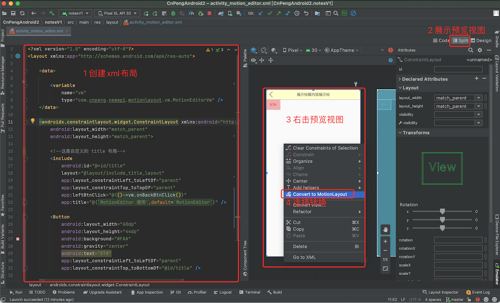
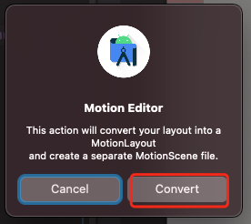
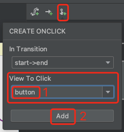
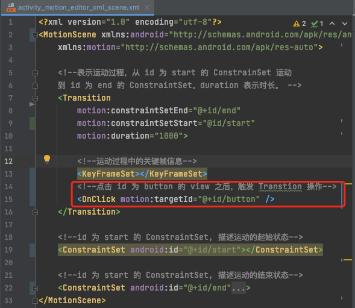
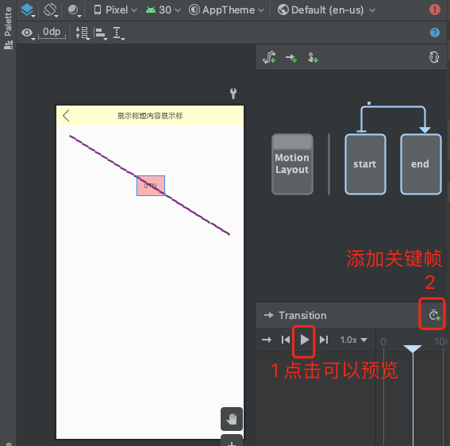
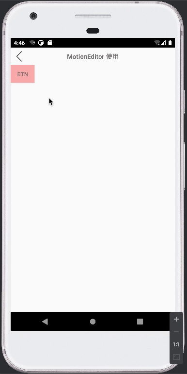
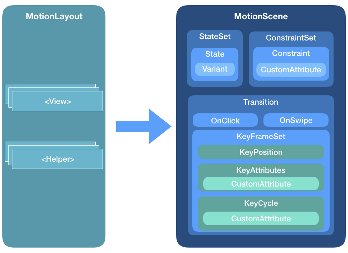

# 1. MotionEditor 构建 MotionLayout 动效

MotionLayout 是 ConstrainLayout 的子类，它能够让我们更方便的为视图添加动效。

>注意：**MotionLayout 的动画效果仅适用于其直接子级，不支持嵌套布局层次结构或 Activity 转换**。

使用 MotionLayout 前需要先在 model 的 `build.gradle` 文件中添加对 ConstraintLayout 的依赖，版本不能低于 2.0，此处使用的是 2.0.4：

```groovy
dependencies {
    implementation 'androidx.constraintlayout:constraintlayout:2.0.4'
}
```

MotionEditor 是与 MotionLayout 相关的视图编辑器。借助 MotionEditor 我们只需要编辑少量代码，然后通过拖拽点击即可实现动效。

接下来我们就实现一个简单的位移动效。

## 1.1. 转换 ConstraintLayout

先构建一个以 ConstraintLayout 为根布局的 xml , 在其中新增一个 button 按钮，并为其添加约束。代码如下（示例代码中使用了 DataBinding）：

```xml
<?xml version="1.0" encoding="utf-8"?>
<layout xmlns:app="http://schemas.android.com/apk/res-auto">

    <data>

        <variable
            name="vm"
            type="com.cnpeng.newapi.motionlayout.vm.MotionEditorVm" />
    </data>

    <androidx.constraintlayout.widget.ConstraintLayout xmlns:android="http://schemas.android.com/apk/res/android"
        android:layout_width="match_parent"
        android:layout_height="match_parent">

        <!--这是自定义的 title 布局-->
        <include
            android:id="@+id/title"
            layout="@layout/include_title_layout"
            app:layout_constraintLeft_toLeftOf="parent"
            app:layout_constraintTop_toTopOf="parent"
            app:leftBtnClick="@{()->vm.onBackBtnClick()}"
            app:title="@{`MotionEditor 使用`,default=`MotionEditor`}" />

        <Button
            android:layout_width="60dp"
            android:layout_height="44dp"
            android:background="#FAA"
            android:gravity="center"
            android:text="BTN"
            app:layout_constraintLeft_toLeftOf="parent"
            app:layout_constraintTop_toBottomOf="@id/title" />

    </androidx.constraintlayout.widget.ConstraintLayout>
</layout>
```

然后在 `Split` 或 `Design` 视图的预览区域中右击，并选择 `Convert to MotionLayout`，如下图:



然后会出现如下弹窗：



选择 `Convert` 之后，会呈现如下界面：


上图中，右侧 4 区域的视图就是 MotionEditor 的内容。

## 1.2. MotionScene 文件

在上一小节中，完成转换之后，我们会看到跟布局变成了 MotionLayout，且其中有一个 `app:layoutDescription` 属性，该属性的值是执行 `Convert` 操作时自动生成的根节点为 `MotionScene` 的 `.xml` 文件，该文件就描述了界面的动效信息。其内部结构如下：


```xml
<?xml version="1.0" encoding="utf-8"?>
<MotionScene
    xmlns:android="http://schemas.android.com/apk/res/android"
    xmlns:motion="http://schemas.android.com/apk/res-auto">

    <!--表示运动过程，从 id 为 start 的 ConstrainSet 运动
    到 id 为 end 的 ConstraintSet。duration 表示时长。 -->
    <Transition
        motion:constraintSetStart="@id/start"
        motion:constraintSetEnd="@+id/end"
        motion:duration="1000">

        <!--运动过程中的关键帧信息-->
       <KeyFrameSet>
       </KeyFrameSet>
    </Transition>

    <!--id 为 start 的 ConstraintSet, 描述运动的起始状态-->
    <ConstraintSet android:id="@+id/start">
    </ConstraintSet>

    <!--id 为 start 的 ConstraintSet, 描述运动的结束状态-->
    <ConstraintSet android:id="@+id/end">
    </ConstraintSet>
</MotionScene>
```

> 关于节点的具体含义和内部子节点的定义在后面会做详细说明。

## 1.3. 添加动效

完成前面的跟布局转换之后，运行 app ，我们会发现界面还是静态的。接下来我们就借助 MotionEditor 来让界面中的 Button 动起来。步骤如下：

### 1.3.1. 完整步骤的示意动图


### 1.3.2. 步骤拆解1

在上面的动图中，我们先选择 `Design` 预览视图，然后点击预览中的 Button 按钮，点击之后会显示 MotionEditor 界面。

接下来点击 MotionEditor 区域的 `end`，表示我们将要设置动效结束时的信息，然后拖动预览区域的 Button 到右侧：


完成拖动之后，左侧代码区域中会新增一个 `Constraint` 节点，如下：


### 1.3.3. 步骤拆解2

在上一小节中，完成拖动之后，我们点击 MotionEditor 区域表示 `Transition` 的连接线，然后点击 `Create click or swipe handler` 按钮，如下图：


点击上图中的 2 之后，会出现如下弹窗，我们选择 `Click Handler`:


在新出现的弹窗中选择触发 `Transtion` 的 View :



点击上图的 `Add` 之后，会在 `Transition` 节点中新增一个 `OnClick` 节点，如下图：



### 1.3.4. 预览动效

完成上述两步的编辑之后，点击下图中 1处的按钮，即可实现动效预览：



## 1.4. 运行并查看动效

完成前面的设置之后，完整的 MotionScene  文件的内容如下：

```xml
<?xml version="1.0" encoding="utf-8"?>
<MotionScene xmlns:android="http://schemas.android.com/apk/res/android"
    xmlns:motion="http://schemas.android.com/apk/res-auto">

    <!--表示运动过程，从 id 为 start 的 ConstrainSet 运动
    到 id 为 end 的 ConstraintSet。duration 表示时长。 -->
    <Transition
        motion:constraintSetEnd="@+id/end"
        motion:constraintSetStart="@id/start"
        motion:duration="1000">

        <!--运动过程中的关键帧信息-->
        <KeyFrameSet></KeyFrameSet>
        <!--点击 id 为 button 的 view 之后，触发 Transtion 操作-->
        <OnClick motion:targetId="@+id/button" />
    </Transition>

    <!--id 为 start 的 ConstraintSet, 描述运动的起始状态-->
    <ConstraintSet android:id="@+id/start"></ConstraintSet>

    <!--id 为 start 的 ConstraintSet, 描述运动的结束状态-->
    <ConstraintSet android:id="@+id/end">
        <!--动效结束时的信息-->
        <Constraint
            android:id="@+id/button"
            android:layout_width="60dp"
            android:layout_height="44dp"
            android:layout_marginLeft="348dp"
            android:layout_marginTop="216dp"
            motion:layout_constraintLeft_toLeftOf="parent"
            motion:layout_constraintTop_toBottomOf="@id/title" />
    </ConstraintSet>
</MotionScene>
```

接下来运行项目，当我们点击按钮之后，就可以看到按钮发生了位移，如下图：



## 1.5. 补充

### 1.5.1. MotionLayout 的特有属性

`MotionLayout` 继承自 `ConstraintLayout` ，除了拥有 `ConstraintLayout` 的属性之外，还有如下特有属性：

属性 | 含义/作用| 备注
---|---|---
`layoutDescription`  | 声明要引用的 MotionScene 文件 | 
`applyMotionScene`  | 表示是否应用 MotionScene 文件中的信息 | 默认值为 true
`currentState` | 设置当前的状态 | 取值为引用的 MotionScene 文件中 ConstraintSet 节点的 id。 <br> 比如我们可以将其设置为 `@id/end` (结束状态)。
`motionProgress` | 设置页面开始时的动画进度 | 值为 0 到 1 之间的小数。 <br> 例如，将 `motionProgress` 设置为 0.5，那么打开页面时将展示动效（`Transtion`）执行到一半时的状态。
`showPaths`  | 是否显示动效的运动轨迹 | 值为 boolean 类型； true，会用一条虚线展示运动轨迹；false ，不展示
`motionDebug` | 显示何种调试信息 | 设置之后会在界面的下方显示一些动画调试信息（ CnPeng : 这个没大看明白，调试信息在哪里？）

如果同时设置了 `motion:showPaths` 和 `motion:motionDebug` ， `motionDebug` 的设置会覆盖 `motion:showPaths`.

属性值|含义/作用
---|---
`NO_DEBUG`	| 不显示轨迹线，也不显示 debug 信息
`SHOW_PROGRESS`	| 不显示轨迹线，只显示 debug 信息
`SHOW_PATH`	| 只显示轨迹线，不显示 debug 信息
`SHOW_ALL`	| 同时显示轨迹线和 debug 信息

### 1.5.2. 在 MotionEditor 中预览动效

在预览动效时，我们首先要点击任意子 View 唤起 MotionEditor 界面。然后选择一条表示 `Transtion` 的示意线，然后就可以播放、暂停、调整动效速度等。

为了查看动效的运动轨迹，我们还有必要为布局文件中的 `MotionLayout` 设置 `tools:showPaths="true"` 属性。根据上一小节中的描述，我们也可以使用 `motionDebug` 属性来控制是否显示运动轨迹。

> 为了仅在预览时展示运动轨迹，此处使用 `tools` 命名空间；如果希望 app 部署到手机之后依旧显示轨迹，则需要使用 `app` 命名空间。


## 1.6. 总结

通过前面的示例我们可以知道，控制动效的关键是 `app:layoutDescription` 引用的根节点为 MotionScene 的 `.xml` 文件。我们只要编辑好该文件中的内容，即可达到我们预期的动效。


## 1.7. 参考资料

### 1.7.1. 官方资料

* [使用 Motion Editor 构建动画](https://developer.android.google.cn/studio/write/motion-editor)


## 1.8. Part2



上图来自 [《Introduction to MotionLayout (part I)》](，https://medium.com/google-developers/introduction-to-motionlayout-part-i-29208674b10d)

