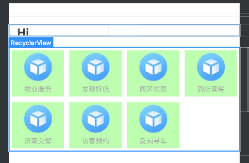

# 1. GridlayoutManager时条目等分

## 1.1. 效果及核心逻辑

### 1.1.1. 效果




### 1.1.2. 核心逻辑

实现上述效果的核心逻辑：

* 自定义 ItemDecoration ，在 `getItemOffsets` 中设置条目偏移量
* 调用 rv 的 `addItemDecoration` ，参数为前一步中自定义的 ItemDecoration
* 条目的 xml 布局 width 属性需要设置为 `match_parent` (必须设置，否则还是不等分的效果)

## 1.2. 示例

### 1.2.1. 普通版示例

* 调用：

```java
GridLayoutManager manager = new GridLayoutManager(getContext(),2,GridLayoutManager.VERTICAL,false);
rv.addItemDecoration(new SpaceItemDecoration(0,2));
rv.setLayoutManager(manager);
```

* 自定义 `ItemDecoration`

```java
public class SpaceItemDecoration extends RecyclerView.ItemDecoration {

    private int leftRight;
    private int topBottom;

    // leftRight 为横向间的距离 topBottom为纵向间距离

    public SpaceItemDecoration(int leftRight, int topBottom) {
        this.leftRight = leftRight;
        this.topBottom = topBottom;
    }

    @Override
    public void onDraw(Canvas c, RecyclerView parent, RecyclerView.State state) {
        super.onDraw(c, parent, state);
    }

    @Override
    public void getItemOffsets(Rect outRect, View view, RecyclerView parent, RecyclerView.State state) {
        LinearLayoutManager layoutManager = (LinearLayoutManager) parent.getLayoutManager();
        // 竖直方向的
        if (layoutManager.getOrientation() == LinearLayoutManager.VERTICAL) {
            // 最后一项需要 bottom
            if (parent.getChildAdapterPosition(view) == layoutManager.getItemCount() - 1) {
                outRect.bottom = topBottom;
            }
            outRect.top = topBottom;
            outRect.left = leftRight;
            outRect.right = leftRight;
        } else {
            // 最后一项需要 right
            if (parent.getChildAdapterPosition(view) == layoutManager.getItemCount() - 1) {
                outRect.right = leftRight;
            }
            outRect.top = topBottom;
            outRect.left = leftRight;
            outRect.bottom = topBottom;
        }
    }
}
```


### 1.2.2. DataBinding 版示例

#### 1.2.2.1. xml 布局文件

##### 1.2.2.1.1. home2_fm.xml（节选）

```xml
<?xml version="1.0" encoding="utf-8"?>
<layout
    xmlns:android="http://schemas.android.com/apk/res/android"
    xmlns:app="http://schemas.android.com/apk/res-auto"
    xmlns:tools="http://schemas.android.com/tools">

    <data>

        <import type="cn.xinjiewy.wy.R" />

        <import type="android.view.View" />

        <import type="cn.xinjiewy.wy.library.binding.viewadapter.recyclerview.LineManagers" />

        <variable
            name="vm"
            type="cn.xinjiewy.wy.app.home.vm.HomeV2Vm" />

        <variable
            name="findList"
            type="java.util.List&lt;cn.xinjiewy.wy.app.parkscan.model.ParkFunctionBean>" />
    </data>

    <androidx.constraintlayout.widget.ConstraintLayout
        android:id="@+id/fragment_find_root"
        android:layout_width="match_parent"
        android:layout_height="match_parent"
        android:paddingBottom="@dimen/dp55">

         <!--其他内容省略-->

        <!--横向功能项-->
        <androidx.recyclerview.widget.RecyclerView
            android:id="@+id/rv_func"
            android:layout_width="match_parent"
            android:layout_height="wrap_content"
            android:background="@color/white"
            android:nestedScrollingEnabled="false"
            android:orientation="vertical"
            android:visibility="@{findList==null||findList.size()==0?View.GONE:View.VISIBLE}"
            app:itemBinding="@{vm.funcItemBinding}"
            app:items="@{findList}"
            app:layoutManager="androidx.recyclerview.widget.GridLayoutManager"
            app:layout_constraintTop_toBottomOf="@id/fragment_find_banner"
            app:layout_scrollFlags="noScroll"
            app:lineManager="@{LineManagers.gridHW(5)}"
            app:spanCount="4"
            tools:background="#CEA" />

         <!--其他内容省略-->
    </androidx.constraintlayout.widget.ConstraintLayout>
</layout>
```

上面的代码中，使用了 DataBinding , 并定义了多组自定义 BindingAdapter ： `app:itemBinding`、`app:items`、`app:lineManager`, 具体查看下一小节。

##### 1.2.2.1.2. 条目布局文件

* home2_item_func.xml

```xml
<?xml version="1.0" encoding="utf-8"?>
<layout
    xmlns:android="http://schemas.android.com/apk/res/android"
    xmlns:app="http://schemas.android.com/apk/res-auto">

    <data>

        <import type="android.view.View" />

        <import type="cn.xinjiewy.wy.R" />

        <import type="androidx.core.content.ContextCompat" />

        <variable
            name="data"
            type="cn.xinjiewy.wy.app.parkscan.model.ParkFunctionBean" />

        <variable
            name="listener"
            type="cn.xinjiewy.wy.library.utils.callback.OnItemClickListener" />

    </data>

    <androidx.constraintlayout.widget.ConstraintLayout
        android:layout_width="match_parent"
        android:layout_height="wrap_content"
        android:background="#AFA"
        android:onClick="@{()->listener.onItemClick(data)}"
        android:padding="@dimen/dp5">

        <ImageView
            android:id="@+id/park_scan_func_item_image"
            android:layout_width="@dimen/dp50"
            android:layout_height="@dimen/dp50"
            app:iconUrl="@{data.menu.icon}"
            app:layout_constraintEnd_toEndOf="parent"
            app:layout_constraintStart_toStartOf="parent"
            app:layout_constraintTop_toTopOf="parent" />

        <TextView
            android:layout_width="wrap_content"
            android:layout_height="wrap_content"
            android:layout_marginTop="@dimen/dp5"
            android:maxLength="6"
            android:singleLine="true"
            android:text="@{data.menu.name}"
            android:textColor="@color/auxiliary_text_color"
            android:textSize="@{data.menu.name.length()>4?@dimen/text_size_smallest:@dimen/text_middle2}"
            app:layout_constraintBottom_toBottomOf="parent"
            app:layout_constraintEnd_toEndOf="parent"
            app:layout_constraintStart_toStartOf="parent"
            app:layout_constraintTop_toBottomOf="@id/park_scan_func_item_image" />

    </androidx.constraintlayout.widget.ConstraintLayout>
</layout>
```


#### 1.2.2.2. BindingAdapter

这是我们自定义的 BindingAdapter ， 其主要作用是 `addItemDecoration`

```java
public class ViewAdapter {
    @BindingAdapter("lineManager")
    public static void setLineManager(RecyclerView recyclerView, LineManagers.LineManagerFactory lineManagerFactory) {
        recyclerView.addItemDecoration(lineManagerFactory.create(recyclerView));
    }
}
```

#### 1.2.2.3. LineManagers

```java
public class LineManagers {
    protected LineManagers() {
    }

    public interface LineManagerFactory {
        RecyclerView.ItemDecoration create(RecyclerView recyclerView);
    }

    public static LineManagerFactory both() {
        return recyclerView -> new DividerLine(recyclerView.getContext(), DividerLine.LineDrawMode.BOTH);
    }

    public static LineManagerFactory horizontal() {
        return recyclerView -> new DividerLine(recyclerView.getContext(), DividerLine.LineDrawMode.HORIZONTAL);
    }

    //横纵都要加间距
    public static LineManagerFactory gridHW(final int space) {
        return recyclerView -> new GridSpacesItemDecoration(ConverSionTool.dip2px(recyclerView.getContext(), space));
    }

    public static LineManagerFactory grid(final int leftRight) {
        return recyclerView -> new SpacesItemDecoration(ConverSionTool.dip2px(recyclerView.getContext(), leftRight)
                , ConverSionTool.dip2px(recyclerView.getContext(), leftRight));
    }

    public static LineManagerFactory vertical() {
        return recyclerView -> new DividerLine(recyclerView.getContext(), DividerLine.LineDrawMode.VERTICAL);
    }
}
```

#### 1.2.2.4. 自定义 Decoration

```java
public class GridSpacesItemDecoration extends RecyclerView.ItemDecoration {
    private int space;

    public GridSpacesItemDecoration(int spacing) {
        this.space = spacing;
    }

    @Override
    public void getItemOffsets(Rect outRect, View view, RecyclerView parent, RecyclerView.State state) {
        if (parent.getLayoutManager() != null) {
            if (parent.getLayoutManager() instanceof LinearLayoutManager && !(parent.getLayoutManager() instanceof GridLayoutManager)) {
                if (((LinearLayoutManager) parent.getLayoutManager()).getOrientation() == LinearLayoutManager.HORIZONTAL) {
                    outRect.set(space, 0, space, 0);
                } else {
                    outRect.set(0, space, 0, space);
                }
            } else {
                outRect.set(space, space, space, space);
            }
        }
    }
}
```


### 1.2.3. 补充

#### 1.2.3.1. 其他相关自定义 Decoration

##### 1.2.3.1.1. DividerLine

```java
public class DividerLine extends RecyclerView.ItemDecoration {
    private static final String TAG = DividerLine.class.getCanonicalName();
    //默认分隔线厚度为2dp
    private static final float DEFAULT_DIVIDER_SIZE = 0.5f;
    //控制分隔线的属性,值为一个drawable
    private static final int ATTRS[] = {android.R.attr.listDivider};
    //divider对应的drawable
    private Drawable dividerDrawable;
    private Context mContext;
    private int dividerSize;
    //默认为null
    private LineDrawMode mMode = null;

    /**
     * 分隔线绘制模式,水平，垂直，两者都绘制
     */
    public enum LineDrawMode {
        HORIZONTAL, VERTICAL, BOTH
    }

    public DividerLine(Context context) {
        mContext = context;
        //获取样式中对应的属性值
        //        TypedArray attrArray = context.obtainStyledAttributes(ATTRS);
        dividerDrawable = ContextCompat.getDrawable(context, R.color.content_divide_color);
        //        attrArray.recycle();
    }

    public DividerLine(Context context, LineDrawMode mode) {
        this(context);
        mMode = mode;
    }

    public DividerLine(Context context, int dividerSize, LineDrawMode mode) {
        this(context, mode);
        this.dividerSize = dividerSize;
    }

    public int getDividerSize() {
        return dividerSize;
    }

    public void setDividerSize(int dividerSize) {
        this.dividerSize = dividerSize;
    }

    public LineDrawMode getMode() {
        return mMode;
    }

    public void setMode(LineDrawMode mode) {
        mMode = mode;
    }

    /**
     * Item绘制完毕之后绘制分隔线
     * 根据不同的模式绘制不同的分隔线
     *
     * @param c
     * @param parent
     * @param state
     */
    @Override
    public void onDrawOver(Canvas c, RecyclerView parent, RecyclerView.State state) {
        super.onDrawOver(c, parent, state);
        if (getMode() == null) {
            throw new IllegalStateException("assign LineDrawMode,please!");
        }
        switch (getMode()) {
            case VERTICAL:
                drawVertical(c, parent, state);
                break;
            case HORIZONTAL:
                drawHorizontal(c, parent, state);
                break;
            case BOTH:
                drawHorizontal(c, parent, state);
                drawVertical(c, parent, state);
                break;
        }
    }

    /**
     * 绘制垂直分隔线
     *
     * @param c
     * @param parent
     * @param state
     */
    private void drawVertical(Canvas c, RecyclerView parent, RecyclerView.State state) {
        final int childCount = parent.getChildCount();
        for (int i = 0; i < childCount; i++) {
            final View child = parent.getChildAt(i);
            final RecyclerView.LayoutParams params = (RecyclerView.LayoutParams) child
                    .getLayoutParams();
            final int top = child.getTop() - params.topMargin;
            final int bottom = child.getBottom() + params.bottomMargin;
            final int left = child.getRight() + params.rightMargin;
            final int right = getDividerSize() == 0 ? left + dip2px(mContext, DEFAULT_DIVIDER_SIZE) : left + getDividerSize();
            dividerDrawable.setBounds(left, top, right, bottom);
            dividerDrawable.draw(c);
        }
    }

    /**
     * 绘制水平分隔线
     *
     * @param c
     * @param parent
     * @param state  去掉了最后一根线
     */
    private void drawHorizontal(Canvas c, RecyclerView parent, RecyclerView.State state) {
        int childCount = parent.getChildCount();
        for (int i = 0; i < childCount - 1; i++) {
            //分别为每个item绘制分隔线,首先要计算出item的边缘在哪里,给分隔线定位,定界
            final View child = parent.getChildAt(i);
            //RecyclerView的LayoutManager继承自ViewGroup,支持了margin
            final RecyclerView.LayoutParams params = (RecyclerView.LayoutParams) child.getLayoutParams();
            //child的左边缘(也是分隔线的左边)
            final int left = child.getLeft() - params.leftMargin;
            //child的底边缘(恰好是分隔线的顶边)
            final int top = child.getBottom() + params.topMargin;
            //child的右边(也是分隔线的右边)
            final int right = child.getRight() - params.rightMargin;
            //分隔线的底边所在的位置(那就是分隔线的顶边加上分隔线的高度)
            final int bottom = getDividerSize() == 0 ? top + dip2px(mContext, DEFAULT_DIVIDER_SIZE) : top + getDividerSize();
            dividerDrawable.setBounds(left, top, right, bottom);
            //画上去
            dividerDrawable.draw(c);
        }
    }

    @Override
    public void getItemOffsets(Rect outRect, View view, RecyclerView parent, RecyclerView.State state) {
        super.getItemOffsets(outRect, view, parent, state);
        outRect.bottom = getDividerSize() == 0 ? dip2px(mContext, DEFAULT_DIVIDER_SIZE) : getDividerSize();
        outRect.right = getDividerSize() == 0 ? dip2px(mContext, DEFAULT_DIVIDER_SIZE) : getDividerSize();
    }
}
```


##### 1.2.3.1.2. SpacesItemDecoration

```java
public class SpacesItemDecoration extends RecyclerView.ItemDecoration {
    private int leftRight, topBottom;

    public SpacesItemDecoration(int leftRight, int topBottom) {
        this.leftRight = leftRight;
        this.topBottom = topBottom;
    }

    @Override
    public void getItemOffsets(Rect outRect, View view,
                               RecyclerView parent, RecyclerView.State state) {
        LinearLayoutManager layoutManager = (LinearLayoutManager) parent.getLayoutManager();
        //竖直方向的
        if (layoutManager.getOrientation() == RecyclerView.VERTICAL) {
            //最后一项需要 bottom
            if (parent.getChildAdapterPosition(view) != layoutManager.getItemCount() - 1) {
                outRect.bottom = topBottom;
            }
            if (parent.getChildAdapterPosition(view) != 0) {
                outRect.top = topBottom;
            }
            outRect.left = leftRight;
            outRect.right = leftRight;
        } else {
            //最后一项需要right
            if (parent.getChildAdapterPosition(view) != layoutManager.getItemCount() - 1) {
                outRect.right = leftRight;
            }
            if (parent.getChildAdapterPosition(view) != 0) {
                outRect.left = leftRight;
            }
            outRect.top = topBottom;
            outRect.bottom = topBottom;
        }
    }
}
```

##### 1.2.3.1.3. DividerLine

```java
public class DividerLine extends RecyclerView.ItemDecoration {
    private static final String TAG = DividerLine.class.getCanonicalName();
    //默认分隔线厚度为2dp
    private static final float DEFAULT_DIVIDER_SIZE = 0.5f;
    //控制分隔线的属性,值为一个drawable
    private static final int ATTRS[] = {android.R.attr.listDivider};
    //divider对应的drawable
    private Drawable dividerDrawable;
    private Context mContext;
    private int dividerSize;
    //默认为null
    private LineDrawMode mMode = null;

    /**
     * 分隔线绘制模式,水平，垂直，两者都绘制
     */
    public enum LineDrawMode {
        HORIZONTAL, VERTICAL, BOTH
    }

    public DividerLine(Context context) {
        mContext = context;
        //获取样式中对应的属性值
        //        TypedArray attrArray = context.obtainStyledAttributes(ATTRS);
        dividerDrawable = ContextCompat.getDrawable(context, R.color.content_divide_color);
        //        attrArray.recycle();
    }

    public DividerLine(Context context, LineDrawMode mode) {
        this(context);
        mMode = mode;
    }

    public DividerLine(Context context, int dividerSize, LineDrawMode mode) {
        this(context, mode);
        this.dividerSize = dividerSize;
    }

    public int getDividerSize() {
        return dividerSize;
    }

    public void setDividerSize(int dividerSize) {
        this.dividerSize = dividerSize;
    }

    public LineDrawMode getMode() {
        return mMode;
    }

    public void setMode(LineDrawMode mode) {
        mMode = mode;
    }

    /**
     * Item绘制完毕之后绘制分隔线
     * 根据不同的模式绘制不同的分隔线
     *
     * @param c
     * @param parent
     * @param state
     */
    @Override
    public void onDrawOver(Canvas c, RecyclerView parent, RecyclerView.State state) {
        super.onDrawOver(c, parent, state);
        if (getMode() == null) {
            throw new IllegalStateException("assign LineDrawMode,please!");
        }
        switch (getMode()) {
            case VERTICAL:
                drawVertical(c, parent, state);
                break;
            case HORIZONTAL:
                drawHorizontal(c, parent, state);
                break;
            case BOTH:
                drawHorizontal(c, parent, state);
                drawVertical(c, parent, state);
                break;
        }
    }

    /**
     * 绘制垂直分隔线
     *
     * @param c
     * @param parent
     * @param state
     */
    private void drawVertical(Canvas c, RecyclerView parent, RecyclerView.State state) {
        final int childCount = parent.getChildCount();
        for (int i = 0; i < childCount; i++) {
            final View child = parent.getChildAt(i);
            final RecyclerView.LayoutParams params = (RecyclerView.LayoutParams) child
                    .getLayoutParams();
            final int top = child.getTop() - params.topMargin;
            final int bottom = child.getBottom() + params.bottomMargin;
            final int left = child.getRight() + params.rightMargin;
            final int right = getDividerSize() == 0 ? left + dip2px(mContext, DEFAULT_DIVIDER_SIZE) : left + getDividerSize();
            dividerDrawable.setBounds(left, top, right, bottom);
            dividerDrawable.draw(c);
        }
    }

    /**
     * 绘制水平分隔线
     *
     * @param c
     * @param parent
     * @param state  去掉了最后一根线
     */
    private void drawHorizontal(Canvas c, RecyclerView parent, RecyclerView.State state) {
        int childCount = parent.getChildCount();
        for (int i = 0; i < childCount - 1; i++) {
            //分别为每个item绘制分隔线,首先要计算出item的边缘在哪里,给分隔线定位,定界
            final View child = parent.getChildAt(i);
            //RecyclerView的LayoutManager继承自ViewGroup,支持了margin
            final RecyclerView.LayoutParams params = (RecyclerView.LayoutParams) child.getLayoutParams();
            //child的左边缘(也是分隔线的左边)
            final int left = child.getLeft() - params.leftMargin;
            //child的底边缘(恰好是分隔线的顶边)
            final int top = child.getBottom() + params.topMargin;
            //child的右边(也是分隔线的右边)
            final int right = child.getRight() - params.rightMargin;
            //分隔线的底边所在的位置(那就是分隔线的顶边加上分隔线的高度)
            final int bottom = getDividerSize() == 0 ? top + dip2px(mContext, DEFAULT_DIVIDER_SIZE) : top + getDividerSize();
            dividerDrawable.setBounds(left, top, right, bottom);
            //画上去
            dividerDrawable.draw(c);
        }
    }

    @Override
    public void getItemOffsets(Rect outRect, View view, RecyclerView parent, RecyclerView.State state) {
        super.getItemOffsets(outRect, view, parent, state);
        outRect.bottom = getDividerSize() == 0 ? dip2px(mContext, DEFAULT_DIVIDER_SIZE) : getDividerSize();
        outRect.right = getDividerSize() == 0 ? dip2px(mContext, DEFAULT_DIVIDER_SIZE) : getDividerSize();
    }
}

```

#### 1.2.3.2. 其他相关 BindingAdapter

> 该 adapter 在三方库中定义，导入方式如下：
> implementation 'me.tatarka.bindingcollectionadapter2:bindingcollectionadapter:4.0.0'
>    implementation 'me.tatarka.bindingcollectionadapter2:bindingcollectionadapter-recyclerview:4.0.0'

该 adapter 中包含 `app:itemBinding`、`app:items` 等。

```java
public class BindingRecyclerViewAdapters {
    // RecyclerView
    @SuppressWarnings("unchecked")
    @BindingAdapter(value = {"itemBinding", "items", "adapter", "itemIds", "viewHolder", "diffConfig"}, requireAll = false)
    public static <T> void setAdapter(RecyclerView recyclerView,
                                      ItemBinding<? super T> itemBinding,
                                      List<T> items,
                                      BindingRecyclerViewAdapter<T> adapter,
                                      BindingRecyclerViewAdapter.ItemIds<? super T> itemIds,
                                      BindingRecyclerViewAdapter.ViewHolderFactory viewHolderFactory,
                                      AsyncDifferConfig<T> diffConfig) {
        if (itemBinding != null) {
            BindingRecyclerViewAdapter oldAdapter = (BindingRecyclerViewAdapter) recyclerView.getAdapter();
            if (adapter == null) {
                if (oldAdapter == null) {
                    adapter = new BindingRecyclerViewAdapter<>();
                } else {
                    adapter = oldAdapter;
                }
            }
            adapter.setItemBinding(itemBinding);

            if (diffConfig != null && items != null) {
                AsyncDiffObservableList<T> list = (AsyncDiffObservableList<T>) recyclerView.getTag(R.id.bindingcollectiondapter_list_id);
                if (list == null) {
                    list = new AsyncDiffObservableList<>(diffConfig);
                    recyclerView.setTag(R.id.bindingcollectiondapter_list_id, list);
                    adapter.setItems(list);
                }
                list.update(items);
            } else {
                adapter.setItems(items);
            }

            adapter.setItemIds(itemIds);
            adapter.setViewHolderFactory(viewHolderFactory);

            if (oldAdapter != adapter) {
                recyclerView.setAdapter(adapter);
            }
        } else {
            recyclerView.setAdapter(null);
        }
    }

    @BindingConversion
    public static <T> AsyncDifferConfig<T> toAsyncDifferConfig(DiffUtil.ItemCallback<T> callback) {
        return new AsyncDifferConfig.Builder<>(callback).build();
    }
}

```