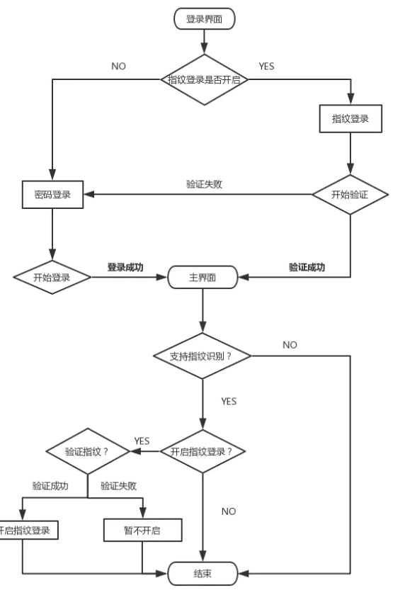
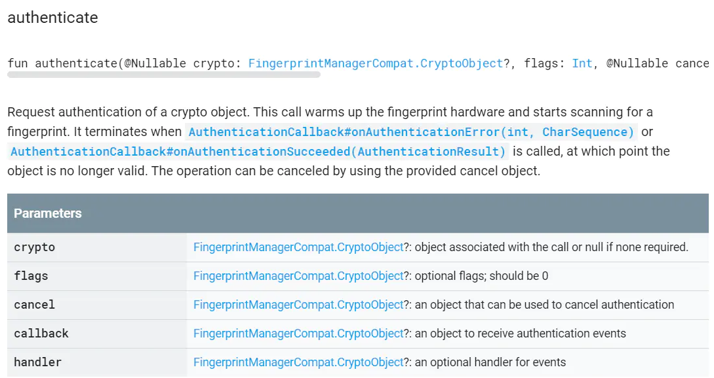

* [原文链接：Android指纹识别浅析](https://juejin.im/post/5e682172e51d4526eb2264d1?utm_source=gold_browser_extension)
* [对应 demo 地址](https://github.com/wsdydeni/fingerprint-demo)

## 一、流程思考

流程思路启发于支付宝
登陆界面判断是否开启 指纹登录进入主界面可设置是否开启指纹登录




## 二、相关 API



这个方法为核心方法 用于拉起指纹识别

* `flags`  Int 可选标志 传0即可
* `handler` Handler 可以直接传NULL
* `crypto` FingerprintManagerCompat.CryptoObject?   密码对象的包装类
* `callback` FingerprintManagerCompat.AuthenticationCallback 验证结果的回调
* `cancel` CancellationSignal 取消操作并向取消监听器发出信号 用于取消指纹识别时

## 三、代码实现

* 创建密封类

创建密匙时 使用AES + CBC + PADDING_PKCS7进行加密

```kotlin
class CipherHelper {
    private var _keystore : KeyStore
    init {
        _keystore = KeyStore.getInstance(KEYSTORE_NAME)
        _keystore.load(null)
    } 
   companion object{
       const val KEY_NAME = "MyCipherHelper" 
       const val KEYSTORE_NAME = "AndroidKeyStore" 
       const val KEY_ALGORITHM = KeyProperties.KEY_ALGORITHM_AES
       const val BLOCK_MODE = KeyProperties.BLOCK_MODE_CBC
       const val ENCRYPTION_PADDING = KeyProperties.ENCRYPTION_PADDING_PKCS7
       const val TRANSFORMATION = "$KEY_ALGORITHM/$BLOCK_MODE/$ENCRYPTION_PADDING"
    }
    fun createCipher(retry : Boolean) : Cipher{
        val key = GetKey()
        val cipher = Cipher.getInstance(TRANSFORMATION)
        try {
            cipher.init(Cipher.ENCRYPT_MODE or Cipher.DECRYPT_MODE,key)
        }catch (e : KeyPermanentlyInvalidatedException){ 
           _keystore.deleteEntry(KEY_NAME) 
           if(retry){
                createCipher(false)
            }else{ 
               Exception("Could not create the cipher for fingerprint authentication.",e)
            } 
       }  
      return cipher
    } 
   private fun GetKey() : Key { 
       if(!_keystore.isKeyEntry(KEY_NAME)){ 
           CreateKey()
        } 
       return _keystore.getKey(KEY_NAME,null)
    } 
   private fun CreateKey(){ 
       val keyGenerator = KeyGenerator.getInstance(KEY_ALGORITHM, KEYSTORE_NAME)
        val keyGenParameterSpec = KeyGenParameterSpec.Builder(KEY_NAME, 
           KeyProperties.PURPOSE_ENCRYPT or KeyProperties.PURPOSE_DECRYPT) 
           .setBlockModes(BLOCK_MODE) 
           .setEncryptionPaddings(ENCRYPTION_PADDING)  
           .setUserAuthenticationRequired(true)
           .build()
        keyGenerator.init(keyGenParameterSpec)
        keyGenerator.generateKey()
    }
}
```

* 用于验证的弹窗

```kotlin
class FingerprintVerifyDialog(context: Activity): Dialog(context, R.style.TransparentDialogStyle) {
    private lateinit var onClickListener : OnClickListener
    private var tipText : TextView
    private var cancelBtn : TextView
    init { 
        setContentView(R.layout.finger_verify_dialog)
        setCanceledOnTouchOutside(false)
        tipText = findViewById(R.id.finger_verify_tip)
        cancelBtn = findViewById(R.id.cancel_finger_verify_btn)
        cancelBtn.setOnClickListener { onClickListener.onCancel()
            this.dismiss()
         } 
       windowAnim() 
   } 
   override fun onBackPressed() {
        super.onBackPressed()
        onClickListener.onDismiss()
    } 
   fun setOnClickListener(onClickListener: OnClickListener) : FingerprintVerifyDialog{
        this.onClickListener = onClickListener
        return this
    }
    fun setTipText(tip : String,color : Int){
        tipText.text = tip 
        tipText.setTextColor(color)
    }
    interface OnClickListener{
        fun onCancel() 
        fun onDismiss()
    }
    private fun windowAnim() {
        val window = window!! //得到对话框 
        window.setWindowAnimations(R.style.dialogWindowAnim) //设置窗口弹出动画
        window.setType(WindowManager.LayoutParams.TYPE_APPLICATION_PANEL)
        window.setFlags(WindowManager.LayoutParams.FLAG_FULLSCREEN, WindowManager.LayoutParams.FLAG_FULLSCREEN)
        window.setLayout(ViewGroup.LayoutParams.MATCH_PARENT, ViewGroup.LayoutParams.MATCH_PARENT)
    }
}
```

* 本地SP存储记录

做一个sharedPreferences的扩展类,并通过委托来访问

```kotlin
class MyPreference<T>(private val name : String, private val default : T) {
    private val sharedPreferences : SharedPreferences
            by lazy { MyApplication.instance.applicationContext.getSharedPreferences(Constans.SHARE_PREFERENCE_NAME,Context.MODE_PRIVATE)} 
    operator fun getValue(thisRef : Any?,property : KProperty<*>) : T = getSharedPreferences(name,default)
    operator fun setValue(thisRef: Any?,property: KProperty<*>,value: T) = putSharedPreferences(name,value)
    private fun putSharedPreferences(name : String,value : T)  = with(sharedPreferences.edit()){
        when(value){
            is Int -> putInt(name,value)
            is String -> putString(name,value)
            is Float -> putFloat(name,value)
            is Long -> putLong(name,value)
            is Boolean -> putBoolean(name,value)
            else -> throw IllegalArgumentException("SharedPreference can't be save this type")
        }.apply()
    }
    private fun getSharedPreferences(name : String,default: T) : T = with(sharedPreferences){
        val res : Any = when(default){
            is Int -> getInt(name,default)
            is Boolean -> getBoolean(name,default)
            is String -> getString(name,default)!!
            is Float -> getFloat(name,default)
            is Long -> getLong(name,default)
            else -> throw IllegalArgumentException("SharedPreference can't be get this type")
        }
        return res as T
    }
}
object DelegatesExt {
    fun <T> myPreferences(name : String,default : T) = MyPreference(name,default)
}
class Constans{
    companion object{
        const val SHARE_PREFERENCE_NAME = "MySharePreference"
        const val OPEN_FINGERPRINT_LOGIN = "open_fingerprint_login"
    }
}
```

* 用于回调的监听接口

```kotlin
interface FingerprintCallback {
    /**
    * @description 无指纹硬件或硬件不可用
    */
    fun onHwUnavailable()
    /**
    * @description 未添加指纹
    */
    fun onNoneEnrolled() 
   /**
    * @description 验证成功
    */
    fun onSucceeded()
    /**
    * @description 验证失败
    */ 
   fun onFailed()
    /**
    * @description 取消验证
    */
    fun onCancel()
}
```

* 指纹识别扩展类

提前初始初始化加密类 封装指纹验证方法 开始指纹验证
添加监听 对验证结果回调处理 判断设备是否支持指纹识别

```kotlin
class FingerprintImpl {
    private lateinit var context: Activity 
    private lateinit var fingerprintCallback: FingerprintCallback //验证回调
    lateinit var fingerprintVerifyDialog: FingerprintVerifyDialog //验证弹窗
    private lateinit var cancellationSignal : CancellationSignal
    companion object{
        private lateinit var cryptoObject : CryptoObject
        val instance by lazy {
            try {
                cryptoObject = CryptoObject(CipherHelper().createCipher(true))
            }catch (e : Exception){
                e.printStackTrace()
            }
            FingerprintImpl()
        }
    }
    /**
    * @description 初始化并调用指纹验证
    */
    fun authenticate(context : Activity,callback: FingerprintCallback){
        this.context = context
        this.fingerprintCallback = callback
        cancellationSignal = CancellationSignal()
        fingerprintVerifyDialog = FingerprintVerifyDialog(context).setOnClickListener(onClickListener)
        cancellationSignal.setOnCancelListener { fingerprintVerifyDialog.dismiss() }
        from(context).authenticate(cryptoObject,0,cancellationSignal,authenticationCallback,null)
        fingerprintVerifyDialog.show()
    }
   
    private val onClickListener : OnClickListener = object : OnClickListener{
        override fun onCancel() {
            fingerprintCallback.onCancel() 
       }
        override fun onDismiss() {
            cancellationSignal.cancel() 
       }
    }
    /**
    * @description 验证结果回调
    */
    private val authenticationCallback = object  : AuthenticationCallback(){
        override fun onAuthenticationError(errMsgId: Int, errString: CharSequence?) { 
           super.onAuthenticationError(errMsgId, errString)
            if(errMsgId != 5) fingerprintVerifyDialog.setTipText(errString!!.toString(),Color.RED)
        }
        override fun onAuthenticationSucceeded(result: AuthenticationResult?) {
            super.onAuthenticationSucceeded(result)
            fingerprintVerifyDialog.setTipText("验证成功",Color.GREEN)
            fingerprintVerifyDialog.dismiss()
            fingerprintCallback. ()
        }
        override fun onAuthenticationHelp(helpMsgId: Int, helpString: CharSequence?) {
            super.onAuthenticationHelp(helpMsgId, helpString)
            fingerprintVerifyDialog.setTipText(helpString!!.toString(),Color.YELLOW)
        } 
       override fun onAuthenticationFailed() {
            super.onAuthenticationFailed()
            fingerprintVerifyDialog.setTipText("验证失败",Color.RED)
            fingerprintCallback.onFailed()
        }
    }
    /**
    * @description 判断当前是否支持指纹识别
    */ 
   fun canAuthenticate(context: Context,fingerprintCallback: FingerprintCallback) : Boolean{
       
        if(!from(context).isHardwareDetected){ //是否支持指纹识别
            fingerprintCallback.onHwUnavailable() 
            return false
        } 
        
       if(!from(context).hasEnrolledFingerprints()){ //是否已经添加指纹
            fingerprintCallback.onNoneEnrolled()
            return false
        }
        return true
    }
}
```

* 最后封装

只需传入回调处理就可以直接使用

```kotlin
class FingerprintManager(private var context: Activity, 
    private var callback: FingerprintCallback) {
    //是否支持指纹识别
    var isSupportFingerLogin : Boolean = false
    private var fingerprintImpl : FingerprintImpl = FingerprintImpl.instance
    init {
        isSupportFingerLogin = fingerprintImpl.canAuthenticate(context,callback)
    }
   /**
    * @description 开始指纹识别
    */ 
   fun autherticate(){ 
       fingerprintImpl.authenticate(context,callback)
    }
}
```