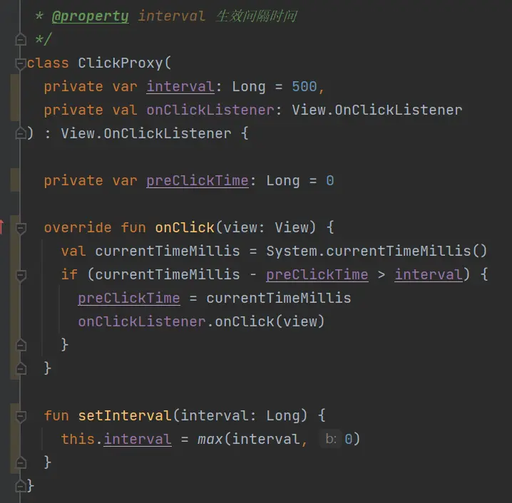
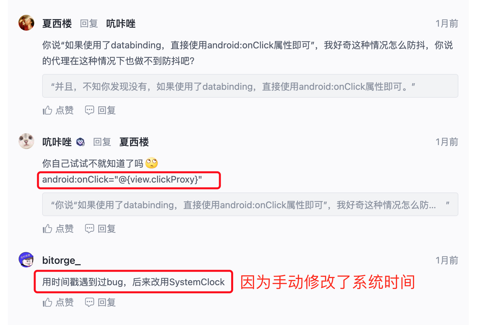

具体实现参考项目中的 AntClickHelper 和 AntViewClickListener

[原文链接：](https://juejin.cn/post/7197337416096055351?utm_source=gold_browser_extension#comment)

前言
其实快速点击是个很好解决的问题，但是如何优雅的去解决确是一个难题，本文主要是记录一些本人通过解决快速点击的过程中脑海里浮现的一些对这个问题的深思。
1. AOP
可以通过AOP来解决这个问题，而且AOP解决的方法也很优雅，在开源上也应该是能找到对应的成熟框架。
AOP来解决这类问题其实是近些年一个比较好的思路，包括比如像数据打点，通过AOP去处理，也能得到一个比较优雅的效果。牛逼的人甚至可以不用别人写的框架，自己去封装就行，我因为对这个技术栈不熟，这里就不献丑了。
总之，如果你想快速又简单的处理这种问题，AOP是一个很好的方案
2. kotlin
使用kotlin的朋友有福了，kotlin中有个概念是扩展函数，使用扩展函数去封装放快速点击的操作逻辑，也能很快的实现这个效果。它的好处就是突出两个字“方便”
那是不是我用java，不用kotlin就实现不了kotlin这个扩展函数的效果？当然不是了。这让我想到一件事，我也有去看这类问题的文章，看看有没有哪个大神有比较好的思路，然后我注意到有人就说用扩展函数就行，不用这么麻烦。
OK，那扩展函数是什么？它的原理是什么？不就是静态类去套一层吗？那用java当然能实现，为什么别人用java去封装这套逻辑就是麻烦呢？代码不都是一样，只不过kotlin帮你做了而已。所以我觉得kotlin的扩展函数效果是方便，但从整体的解决思路上看，缺少点优雅。
3. 流
简单来说也有很多人用了Rxjava或者kotlin的flow去实现，像这种实现也就是能方便而已，在底层上并没有什么实质性的突破，所以就不多说了，说白了就是和上面一样。
4. 通过拦截
因为上面已经说了kt的情况，所以接下来的相关代码都会用java来实现。
通过拦截来达到防止快速点击的效果，而拦截我想到有2种方式，第一种是拦截事件，就是基于事件分发机制去实现，第二种是拦截方法。 
相对而言，其实我觉得拦截方法会更加安全，举个场景，假如你有个页面，然后页面正在到计算，到计算完之后会显示一个按钮，点击后弹出一个对话框。然后过了许久，改需求了，改成到计算完之后自动弹出对话框。但是你之前的点击按钮弹出对话框的操作还需要保留。那就会有可能因为某些操作导致到计算完的一瞬间先显示按钮，这时你以迅雷不及掩耳的速度点它，那就弹出两次对话框。
（1）拦截事件
其实就是给事件加个判断，判断两次点击的时间如果在某个范围就不触发，这可能是大部分人会用的方式。
正常情况下我们是无法去入侵事件分发机制的，只能使用它提供的方法去操作，比如我们没办法在外部影响dispatchTouchEvent这些方法。当然不正常的情况下也许可以，你可以尝试往hook的方向去思考能不能实现，我这边就不思考这种情况了。
public class FastClickHelper {

    private static long beforeTime = 0;
    private static Map<View, View.OnClickListener> map = new HashMap<>();

    public static void setOnClickListener(View view, View.OnClickListener onClickListener) {
        map.put(view, onClickListener);
        view.setOnClickListener(new View.OnClickListener() {
            @Override
            public void onClick(View v) {
                long clickTime = SystemClock.elapsedRealtime();
                if (beforeTime != 0 && clickTime - beforeTime < 1000) {
                    return;
                }
                beforeTime = clickTime;

                View.OnClickListener relListener = map.get(v);
                if (relListener != null) {
                    relListener.onClick(v);
                }
            }
        });
    }

}
复制代码
简单来写就是这样，其实这个就和上面说的kt的扩展函数差不多。调用的时候就
FastClickHelper.setOnClickListener(view, this);
复制代码
但是能看出这个只是针对单个view去配置，如果我们想其实页面所有view都要放快速点击，只不过某个view需要快速点击，比如抢东西类型的，那肯定不能防。所以给每个view单独去配置就很麻烦，没关系，我们可以优化一下
public class FastClickHelper {

    private Map<View, Integer> map;
    private HandlerThread mThread;

    public void init(ViewGroup viewGroup) {
        map = new ConcurrentHashMap<>();
        initThread();
        loopAddView(viewGroup);

        for (View v : map.keySet()) {
            v.setOnTouchListener(new View.OnTouchListener() {
                @Override
                public boolean onTouch(View v, MotionEvent event) {
                    if (event.getAction() == MotionEvent.ACTION_DOWN) {
                        int state = map.get(v);
                        if (state == 1) {
                            return true;
                        } else {
                            map.put(v, 1);
                            block(v);
                        }
                    }
                    return false;
                }
            });
        }
    }

    private void initThread() {
        mThread = new HandlerThread("LAZY_CLOCK");
        mThread.start();
    }

    private void block(View v) {
        // 切条线程处理
        Handler handler = new Handler(mThread.getLooper());
        handler.postDelayed(new Runnable() {
            @Override
            public void run() {
                if (map != null) {
                    map.put(v, 0);
                }
            }
        }, 1000);
    }

    private void exclude(View... views) {
        for (View view : views) {
            map.remove(view);
        }
    }

    private void loopAddView(ViewGroup viewGroup) {
        for (int i = 0; i < viewGroup.getChildCount(); i++) {
            if (viewGroup.getChildAt(i) instanceof ViewGroup) {
                ViewGroup vg = (ViewGroup) viewGroup.getChildAt(i);
                map.put(vg, 0);
                loopAddView(vg);
            } else {
                map.put(viewGroup.getChildAt(i), 0);
            }
        }
    }

    public void onDestroy() {
        try {
            map.clear();
            map = null;
            mThread.interrupt();
        } catch (Exception e) {
            e.printStackTrace();
        }
    }

}
复制代码
我把viewgroup当成入参，然后给它的所有子view都设置，因为onclicklistener比较常用，所以改成了设置setOnTouchListener，当然外部如果给view设置了setOnTouchListener去覆盖我这的set，那就只能自己做特殊处理了。
在外部直接调用
FastClickHelper fastClickHelper = new FastClickHelper();
fastClickHelper.init((ViewGroup) getWindow().getDecorView());
复制代码
如果要想让某个view不要限制快速点击的话，就调用exclude方法。这里要注意使用完之后释放资源，要调用onDestroy方法释放资源。
关于这个部分的思考，其实上面的大家都会，也基本是这样去限制，但是就是即便我用第二种代码，也要每个页面都调用一次，而且看起来，多少差点优雅。
首先我想的办法是在事件分发下发的过程去做处理，就是在viewgroup的dispatchTouchEvent或者onInterceptTouchEvent这类方法里面，但是我简单看了源码是没有提供方法出来的，也没有比较好去hook的地方，所以只能暂时放弃思考在这个下发流程去做手脚。
补充一下，如果你是自定义view，那肯定不会烦恼这个问题，但是你总不能所有的view都做成自定义的吧。
其次我想怎么能通过不写逻辑代码能实现这个效果，但总觉得这个方向不就是AOP吗，或者不是通过开发层面，在开发结束后想办法去注入字节码等操作，我觉得要往这个方向思考的话，最终的实现肯定不是代码层面去实现的。
（2）拦截方法
上面也说了，相对于拦截事件，假设如果都能实现的情况下，我更倾向于去拦截方法。
因为从这层面上来说，如果实现拦截方法，或者说能实现中断方法，那就不只是能做到防快速点击，而是能给方法去定制相对应的规则，比如某个方法在1秒的间隔内只能调用一次，这个就是防快速点击的效果嘛，比如某个方法我限制只能调一次，如果能实现，我就不用再额外写判断这个方法调用一次过后我设置一个布尔类型，然后下次调用再判断这个布尔类型来决定是否调用，
那现在是没办法实现拦截方法吗？当然有办法，只不过会十分的不优雅，比如一个方法是这样的。
public void fun(){
    // todo 第1步
    // todo 第2步
    // todo ......
    // todo 第n步
}
复制代码
那我可以封装一个类，里面去封装一些策略，然后根据策略再去决定方法要不要执行这些步骤，那可能就会写成
public void fun(){
    new FunctionStrategy(FunctionStrategy.ONLY_ONE, new CallBack{
        @Override
        public void onAction() {
            // todo 第1步
            // todo 第2步
            // todo ......
            // todo 第n步
        }
    })
}
复制代码
这样就实现了，比如只调用一次，具体的只调用一次的逻辑就写在FunctionStrategy里面，然后第2次，第n次就不会回调。当然我这是随便乱下来表达这个思路，现实肯定不能这样写。首先这样写就很不优雅，其次也会存在很多问题，扩展性也很差。
那在代码层面还有其它办法拦截或者中断方法吗，在代码层还真有办法中断方法，没错，那就是抛异常，但是话说回来，你也不可能在每个地方都try-catch吧，不切实际。
目前对拦截方法或者中断方法，我是没想到什么好的思路了，但是我觉得如果能实现，对防止快速点击来说，肯定会是一个很好的方案。

## 摘自原文评论区

使用自定义代理实现：

