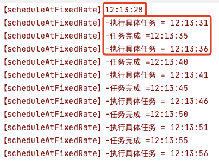
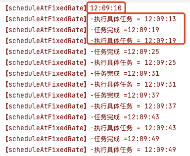
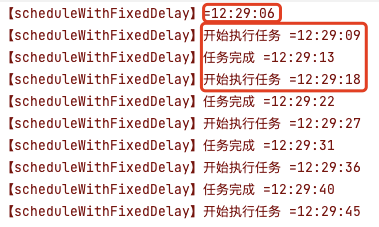
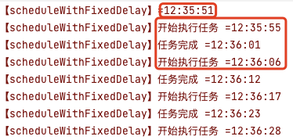
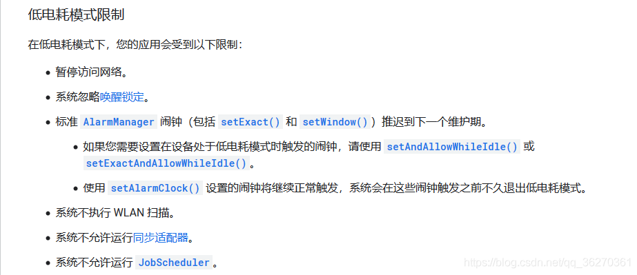

# 1. 0116-实现定时任务的五种方式


## 1.1. 普通线程 sleep 的方式

可用于一般的轮询 Polling


```java
new Thread(new Runnable() {
    @Override
    public void run () {
        while (true) {
            //todo
            try {
                Thread.sleep(iDelay);
            } catch (InterruptedException e) {
                e.printStackTrace();
            }
        }
    }
}).start();
```

优点：非常简单的实现，逻辑清晰明了，也是最常见的写法
缺点：**在 sleep 结束后，并不能保证竞争到 cpu 资源，这也就导致了下次执行时间必定 >=iDelay ，存在时间精度问题**

## 1.2. Timer定时器

```java
//Timer + TimerTask结合的方法
private final Timer timer = new Timer();
private TimerTask timerTask = new TimerTask() {
    @Override
    public void run () {
        //todo
    }
};
```

启动定时器方法：

```java
timer.schedule(TimerTask task, long delay, long period)
```

立即执行:

```java
timer.schedule(timerTask, 0, 1000); //立刻执行，间隔1秒循环执行
```

延时执行:

```java
timer.schedule(timerTask, 2000, 1000); //等待2秒后再执行，间隔1秒循环执行
```

关闭定时器方法：

```java
timer.cancel();
```

优点：纯正的定时任务，纯 java SDK，单独线程执行，比较安全，而且还可以在运行过程中取消执行。
缺点：**基于单线程执行，多个任务之间会相互影响，多个任务的执行是串行的，性能较低**；而且 timer 也无法保证时间精确度，是因为手机休眠的时候，无法唤醒 cpu，**不适合后台任务的定时**。

## 1.3. ScheduledExecutorService


### 1.3.1. scheduleAtFixedRate

表示**按固定周期 （period）执行任务**。

```java
 private Runnable runnable2 = new Runnable() {
     @Override
     public void run () {
         //todo
     }
 };

 ScheduledExecutorService executor = Executors.newScheduledThreadPool(1);

 executor.scheduleAtFixedRate(runnable2, 0, 1, TimeUnit.SECONDS);
```


关于 `scheduleAtFixedRate(Runnable command, long initialDelay, long period, TimeUnit unit) `方法说明：

* command：需要执行的线程。
* initialDelay：第一次执行需要延时的时间，如若立即执行，则 `initialDelay = 0`。
* period：固定频率，周期性执行的时间。表示每隔 `period` 执行一次。
* unit：时间单位，常用的有 `MILLISECONDS`、`SECONDS`和`MINUTES`等。需要注意的是，这个单位会影响 initialDelay 和 period，如果 `unit = MILLISECONDS`，则 initialDelay 和period 传入的是毫秒，如果 `unit = SECONDS`，则 initialDelay 和 period 传入的是秒


#### 1.3.1.1. 任务执行时间小于 period

使用 `scheduleAtFixedRate`，初次执行时延时 3 秒，每 5 秒执行一次，任务耗时 4 秒（`SystemClock.sleep(2000L);`）：

```java
Log.e(TAG, "【scheduleAtFixedRate】" + simpleDateFormat.format(System.currentTimeMillis()));
ScheduledExecutorService executor = Executors.newScheduledThreadPool(1);

executor.scheduleAtFixedRate(new Runnable() {
    @Override
    public void run () {
        Log.e(TAG, "【scheduleAtFixedRate】-执行具体任务 = " + simpleDateFormat.format(System.currentTimeMillis()));
        SystemClock.sleep(4000L);
        Log.e(TAG, "【scheduleAtFixedRate】-任务完成 =" + simpleDateFormat.format(System.currentTimeMillis()));
    }
}, 3, 5, TimeUnit.SECONDS);
```

执行结果如下：



#### 1.3.1.2. 任务执行时间大于 period

使用 `scheduleAtFixedRate`，初次执行时延时 3 秒，每 5 秒执行一次，任务耗时 6 秒（`SystemClock.sleep(6000L);`）：

```java
Log.e(TAG, "【scheduleAtFixedRate】" + simpleDateFormat.format(System.currentTimeMillis()));
ScheduledExecutorService executor = Executors.newScheduledThreadPool(1);

executor.scheduleAtFixedRate(new Runnable() {
    @Override
    public void run () {
        Log.e(TAG, "【scheduleAtFixedRate】-执行具体任务 = " + simpleDateFormat.format(System.currentTimeMillis()));
        SystemClock.sleep(6000L);
        Log.e(TAG, "【scheduleAtFixedRate】-任务完成 =" + simpleDateFormat.format(System.currentTimeMillis()));
    }
}, 3, 5, TimeUnit.SECONDS);
```

执行结果如下：



通过上述示例可知，

#### 1.3.1.3. 总结

* `scheduleAtFixedRate(,,)` 表示第一次执行任务时延时 `initialDelay` 个 `unit` 开始执行，然后每 `period` 个 `unit` 执行一次。
* 如果任务执行时间超过了 `period` 个 `unit`，则**下次任务执行的开始时间为本次任务执行的结束时间**。
* 如果任务执行时间未超过 `period` 个 `unit`, 则**下次任务执行的开始时间为本次任务执行的开始时间 + `period` 个 unit**。

### 1.3.2. scheduleWithFixedDelay

`scheduleWithFixedDelay(Runnable command, long initialDelay, long delay, TimeUnit unit)`，这个也是带延迟时间的调度，也是循环执行。

表示：**以上次任务执行的结束时间为基准，延时 delay 后执行下次任务。**

#### 1.3.2.1. 任务执行时间小于 delay

使用 `scheduleWithFixedDelay`，第一次执行任务时延时 3 秒，本次任务执行完成 5 秒后执行下一次任务，任务每次执行耗时 4 秒（`SystemClock.sleep(4000L);`）：

```java
Log.e(TAG, "【scheduleWithFixedDelay】=" + simpleDateFormat.format(System.currentTimeMillis()));
ScheduledExecutorService executor = Executors.newScheduledThreadPool(1);

executor.scheduleWithFixedDelay(new Runnable() {
    @Override
    public void run () {
        Log.e(TAG, "【scheduleWithFixedDelay】开始执行任务 =" + simpleDateFormat.format(System.currentTimeMillis()));
        SystemClock.sleep(4000L);
        Log.e(TAG, "【scheduleWithFixedDelay】任务完成 =" + simpleDateFormat.format(System.currentTimeMillis()));
    }
}, 3, 5, TimeUnit.SECONDS);
```

执行结果如下：



如上图可知：

* 下一次任务执行的开始时间 = 当前任务执行的结束时间 + `delay`。

#### 1.3.2.2. 任务执行时间大于 delay

```java
Log.e(TAG, "【scheduleWithFixedDelay】=" + simpleDateFormat.format(System.currentTimeMillis()));
ScheduledExecutorService executor = Executors.newScheduledThreadPool(1);

executor.scheduleWithFixedDelay(new Runnable() {
    @Override
    public void run () {
        Log.e(TAG, "【scheduleWithFixedDelay】开始执行任务 =" + simpleDateFormat.format(System.currentTimeMillis()));
        SystemClock.sleep(6000L);
        Log.e(TAG, "【scheduleWithFixedDelay】任务完成 =" + simpleDateFormat.format(System.currentTimeMillis()));
    }
}, 3, 5, TimeUnit.SECONDS);
```

执行效果如下：



如上图可知：

* 即便任务执行时间大于 delay ， 下次任务执行的开始时间依旧等于 当前任务结束时间 + delay。

#### 1.3.2.3. 总结

在使用 `scheduleWithFixedDelay(,,)` 时，不论任务的执行需要多长时间，**下次任务执行的开始时间 = 当前任务结束时间 + delay**。


### 1.3.3. 总结

优点：`ScheduledExecutorService` 是一个线程池，其内部使用的延迟队列，本身就是基于等待/唤醒机制实现的，所以 CPU 并不会一直繁忙。解决了 Timer&TimerTask 存在的问题，**多任务处理时效率高**
缺点：取消时需要打断线程池的运行，而且和外界的通信不太好处理

## 1.4. 使用 Handler 中的 postDelayed 方法

```java
private Handler mHandler = new Handler();
private Runnable runnable = new Runnable() {
    @Override
    public void run() {
        //todo

    }
};

mHandler.post(runnable); //立即执行
mHandler.postDelayed(runnable, iDelay); //延时执行
mHandler.removeCallbacks(runnable); //取消执行
```

优点：比较简单的 android 实现，适用 UI 线程
缺点：使用不当会造成内存泄露

## 1.5. Service + AlarmManger + BroadcastReceiver

适用于长期或者有精确要求的定时任务。

需要注意：从API 19开始，该方式的最小执行时间是 5S，如果小于 5S，则设置无效，还是按照 5S 周期执行

### 1.5.1. AlarmManger

闹钟服务，在特定的时刻为我们广播一个指定的 Intent。

简单说就是我们自己定一个时间， 然后当到时间时，AlarmManager 会广播一个我们设定好的 Intent，比如时间到了，可以指向某个 Activity 或者 Service。

另外要注意一点的是，**AlarmManager 主要是用来在某个时刻运行你的代码的**，**即时你的 APP 在那个特定时间并没有运行！**

还有，从API 19 开始，Alarm 的机制都是非准确传递的，操作系统将会转换闹钟 ，来最小化唤醒和电池的使用！某些新的API会支持严格准确的传递，见 `setWindow(int, long, long, PendingIntent)和setExact(int, long, PendingIntent)`。 targetSdkVersion 在API 19之前应用仍将继续使用以前的行为，所有的闹钟在要求准确传递的情况下都会准确传递。

更多详情可见官方API文档：[AlarmManager](https://developer.android.google.cn/reference/android/app/AlarmManager)

#### 1.5.1.1. 设置闹钟

* `set(int type,long startTime,PendingIntent pi)`：一次性闹钟
* `setRepeating(int type，long startTime，long intervalTime，PendingIntent pi)`： 重复性闹钟，时间不固定
* `setInexactRepeating（int type，long startTime，long intervalTime,PendingIntent pi）`： 重复性闹钟，时间不固定
* `setAndAllowWhileIdle(int type, long triggerAtMillis, PendingIntent operation)`： 和 set 方法类似，这个闹钟运行在系统处于低电模式时有效
* `setExactAndAllowWhileIdle(int type, long triggerAtMillis, PendingIntent operation)`：和 setAndAllowWhileIdle 一样，如果需要在低功耗模式下触发闹钟，那可以使用这个方法。
* `setExact(int type, long triggerAtMillis, PendingIntent operation)`： 在规定的时间精确的执行闹钟，比set方法设置的精度更高，建议使用这个方法设置闹钟

`setInexactRepeating` 和 `setRepeating` 两种方法都是用来设置重复闹铃的。 `setRepeating` 执行时间更为精准。在Android 4.4之后，Android 系统为了省电把时间相近的闹铃打包到一起进行批量处理，这就使得 `setRepeating` 方法设置的闹铃不能被精确的执行，必须要使用 `setExact` 来代替。但是手机进入低电耗模式之后，这个时候通过 `setExact` 设置的闹铃也不是100%准确了，需要用 `setExactAndAllowWhileIdle` 方法来设置，闹铃才能在低电耗模式下被执行。



更多详情可见官方API文档：[针对低电耗模式和应用待机模式进行优化](https://developer.android.google.cn/training/monitoring-device-state/doze-standby?hl=zh-cn)

上面方法中的参数说明：

* `type` ：闹钟类型，有五种类型：
    * `AlarmManager.ELAPSED_REALTIME`: 闹钟在手机睡眠状态下不可用，该状态下闹钟使用相对时间（相对于系统启动开始），状态值为3
    * `AlarmManager.ELAPSED_REALTIME_WAKEUP`：闹钟在睡眠状态下会唤醒系统并执行提示功能，该状态下闹钟也使用相对时间，状态值为2
    * `AlarmManager.RTC`：闹钟在睡眠状态下不可用，该状态下闹钟使用绝对时间，即当前系统时间，状态值为1
    * `AlarmManager.RTC_WAKEUP`：表示闹钟在睡眠状态下会唤醒系统并执行提示功能，该状态下闹钟使用绝对时间，状态值为0
    * `AlarmManager.POWER_OFF_WAKEUP`：表示闹钟在手机关机状态下也能正常进行提示功能，所以是5个状态中用的最多的状态之一，该状态下闹钟也是用绝对时间，状态值为4；不过本状态好像受SDK版本影响，某些版本并不支持；

* `startTime` ：闹钟的第一次执行时间，以**毫秒**为单位，可以自定义时间，不过一般使用当前时间。 需要注意的是：本属性与第一个属性（type）密切相关,
    * 如果第一个参数对应的闹钟使用的是相对时间 （`ELAPSED_REALTIME`和`ELAPSED_REALTIME_WAKEUP`），那么本属性就得使用相对时间 （相对于系统启动时间来说）,比如当前时间就表示为: `SystemClock.elapsedRealtime()`
    * 如果第一个参数对应的闹钟使用的是绝对时间(`RTC、RTC_WAKEUP`、`POWER_OFF_WAKEUP`）, 那么本属性就得使用绝对时间，比如当前时间就表示为：`System.currentTimeMillis()`。

* `intervalTime` ：表示两次闹钟执行的间隔时间,也是以毫秒为单位。

* `PendingIntent`：绑定了闹钟的执行动作，比如发送一个广播、给出提示等等。不过需要注意：
    * 如果是**通过启动服务来实现闹钟提示**的话， `PendingIntent` 对象的获取就应该采用 `Pending.getService (Context c,int i,Intent intent,int j)`方法；
    * 如果是**通过广播来实现闹钟提示**的话， `PendingIntent` 对象的获取就应该采用 `PendingIntent.getBroadcast (Context c,int i,Intent intent,int j)`方法；
    * 如果是**采用 Activity 的方式来实现闹钟提示**的话， `PendingIntent` 对象的获取就应该采用 `PendingIntent.getActivity(Context c,int i,Intent intent,int j)`方法。
    * 如果这三种方法错用了的话，虽然不会报错，但是看不到闹钟提示效果。

* `triggerAtMillis`：闹钟触发时间，与 startTime 一样，也是以毫秒为单位，跟第一个属性（type）密切相关。

#### 1.5.1.2. 取消闹钟

```java
//如果是PendingIntent方式注册的闹铃。
cancel(PendingIntent pi)
//如果是AlarmManager.OnAlarmListener方式注册的闹铃
cancel(AlarmManager.OnAlarmListener listener)
```

### 1.5.2. Service + AlarmManger + BroadcastReceiver

上面方式结合可以实现精确定时，适用于配合 service 在后台执行一些长期的定时行为，比如每隔五分钟保存一次历史数据。

#### 1.5.2.1. 获取AlarmManager实例对象：

```java
AlarmManager alarmManager = (AlarmManager) getSystemService(ALARM_SERVICE);
```

#### 1.5.2.2. 设置闹钟：

```java
if (Build.VERSION.SDK_INT >= Build.VERSION_CODES.M) {//6.0低电耗模式需要使用此方法才能准时触发定时任务
    alarmManager.setExactAndAllowWhileIdle(AlarmManager.ELAPSED_REALTIME_WAKEUP, SystemClock.elapsedRealtime(), pendingIntent);
} else if (Build.VERSION.SDK_INT >= Build.VERSION_CODES.KITKAT) {//4.4以上，使用此方法触发定时任务时间更为精准
    alarmManager.setExact(AlarmManager.ELAPSED_REALTIME_WAKEUP, SystemClock.elapsedRealtime(), pendingIntent);
} else {//4.4以下，使用旧方法
    alarmManager.setRepeating(AlarmManager.ELAPSED_REALTIME_WAKEUP, SystemClock.elapsedRealtime(), TIME_INTERVAL, pendingIntent);
}
```

#### 1.5.2.3. 全部代码：

```java
public class HistoryDataService extends Service {

    private static final String ALARM_ACTION = "SAVE_HISTORY_DATA_ACTION";
    private static final int TIME_INTERVAL = 300000; // 5min 1000 * 60 * 5
    private PendingIntent pendingIntent;
    private AlarmManager alarmManager;

    private BroadcastReceiver alarmReceiver = new BroadcastReceiver() {
        @Override
        public void onReceive(Context context, Intent intent) {
            //定时任务
            //todo
            Log.i("HistoryDataService", "onReceive: 执行保存历史数据");

            //如果版本高于4.4，需要重新设置闹钟
            if (Build.VERSION.SDK_INT >= Build.VERSION_CODES.M) {
                alarmManager.setExactAndAllowWhileIdle(AlarmManager.ELAPSED_REALTIME_WAKEUP, SystemClock.elapsedRealtime() + TIME_INTERVAL, pendingIntent);
            } else if (Build.VERSION.SDK_INT >= Build.VERSION_CODES.KITKAT) {
                alarmManager.setExact(AlarmManager.ELAPSED_REALTIME_WAKEUP, SystemClock.elapsedRealtime() + TIME_INTERVAL, pendingIntent);
            }
        }
    };

    public HistoryDataService() {
    }

    @Override
    public void onCreate() {
        super.onCreate();

        IntentFilter intentFilter = new IntentFilter(ALARM_ACTION);
        registerReceiver(alarmReceiver, intentFilter);

        alarmManager = (AlarmManager) getSystemService(ALARM_SERVICE);
        pendingIntent = PendingIntent.getBroadcast(this, 0, new Intent(ALARM_ACTION), 0);

        if (Build.VERSION.SDK_INT >= Build.VERSION_CODES.M) {//6.0低电耗模式需要使用此方法才能准时触发定时任务
            alarmManager.setExactAndAllowWhileIdle(AlarmManager.ELAPSED_REALTIME_WAKEUP, SystemClock.elapsedRealtime(), pendingIntent);
        } else if (Build.VERSION.SDK_INT >= Build.VERSION_CODES.KITKAT) {//4.4以上，使用此方法触发定时任务时间更为精准
            alarmManager.setExact(AlarmManager.ELAPSED_REALTIME_WAKEUP, SystemClock.elapsedRealtime(), pendingIntent);
        } else {//4.4以下，使用旧方法
            alarmManager.setRepeating(AlarmManager.ELAPSED_REALTIME_WAKEUP, SystemClock.elapsedRealtime(), TIME_INTERVAL, pendingIntent);
        }
    }


    @Override
    public void onDestroy() {
        super.onDestroy();
        unregisterReceiver(alarmReceiver);
        alarmManager.cancel(pendingIntent);
    }

    @Override
    public IBinder onBind(Intent intent) {
        // TODO: Return the communication channel to the service.
        throw new UnsupportedOperationException("Not yet implemented");
    }
}
```


参考文章：[AlarmManager(闹钟服务)](https://www.runoob.com/w3cnote/android-tutorial-alarmmanager.html)


## 1.6. 参考

参考：[Android 实现定时任务的五种方式](https://blog.csdn.net/qq_36270361/article/details/106341685)

参考：[Android 定时任务之Service + AlarmManger + BroadcastReceiver](https://blog.csdn.net/qq_36270361/article/details/106314351)