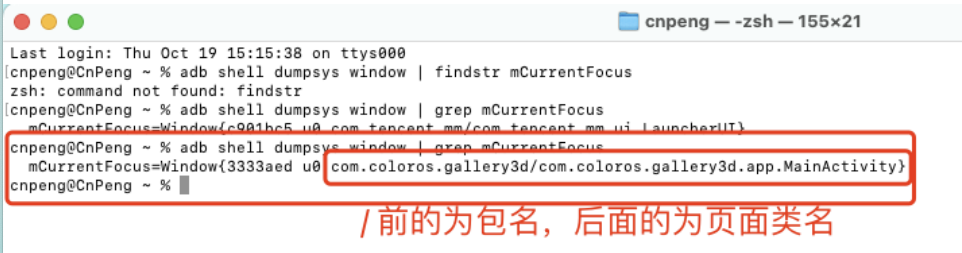

# 1. 0061-使用adb命令查看当前运行的包名及其前台页面

## 1.1. 需求

查看当前运行 App 的包名，并查看其当前页面的类名。  

## 1.2. 解决

打开设备上的开发者模式和USB调试，

然后将设备和电脑连接，

然后在电脑终端中执行 ：

```bash
adb shell dumpsys window | findstr mCurrentFocus
```

如果提示找不到 `findstr` 命令，则将其替换为 `grep`：

```bash
adb shell dumpsys window | grep mCurrentFocus
```

执行完成之后，将会看到如下内容：


