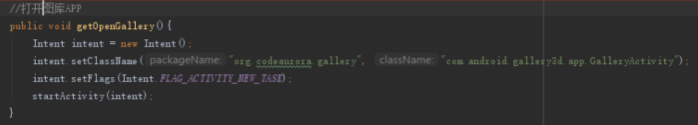

# 0018-通过代码打开系统相册或特定程序

在 Activity 或 Fragment 中可以使用 intent 打开：


```java
public void openXX(){
    Intent intent = new Intent();
    intent.setClassName(“目标应用的包名”,"目标应用的目标页面类名");
    intent.setFlags(Intent.FLAG_ACTIVITY_NEW_TASK);
    startActivity(intent);
}
```

示例：打开系统相册：



注意：不同手机的系统相册包名和类名不一致，所以上述代码并不具备通用性，此处仅是做一个例子。

> 关于如何获取应用包名和类名，可以参考前一篇[《0117-使用adb命令查看当前运行的包名及其前台页面.md》](0117-使用adb命令查看当前运行的包名及其前台页面.md)