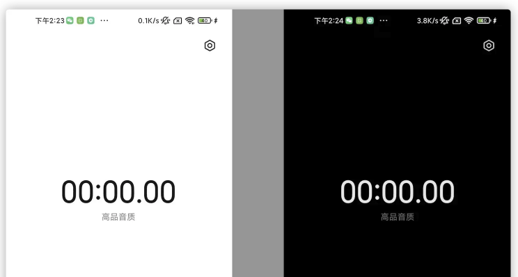

# 1. 0119-修改状态栏背景色及文本颜色

原文[最简单改变状态栏文字及背景颜色的方法](https://juejin.cn/post/6999523995053719582)

## 1.1. 问题

我们知道，Android的状态栏（StatusBar）是可以由开发者自行更改背景颜色的，至于文字颜色，不能直接由自己修改色值，而是黑白两种颜色，对应的是Light和Dark两种全局主题模式。

为了良好的用户体验，我们在状态栏背景为深色时，需要给予白色字体，反之亦然。比如这样：



然而，有些时候我们在Light Mode下并不需要黑色字体，就需要自己手动修改了。

## 1.2. 方法

### 1.2.1. 修改状态栏

以前我们修改状态栏相关的内容，都是去找各种反射代码，或者各种封装好的 StatusBarUtil 之类的，不仅代码不优雅，还容易出现千奇百怪的兼容性问题，不利于维护。

如今，谷歌官方已经给出了解决方案，一切尽在AndroidX。直接看代码：

```java
import androidx.core.view.ViewCompat;
import androidx.core.view.WindowInsetsControllerCompat;

public class MainActivity extends BaseActivity {
    @Override
    protected void onCreate(Bundle savedInstanceState) {
        super.onCreate(savedInstanceState);
        setContentView(R.layout.activity_main);
        // 修改状态栏字体颜色，用AndroidX官方兼容API
        WindowInsetsControllerCompat wic = ViewCompat.getWindowInsetsController(getWindow().getDecorView());
        if (wic != null) {
            // true表示Light Mode，状态栏字体呈黑色，反之呈白色
            wic.setAppearanceLightStatusBars(false);
        }

        // 修改状态栏背景颜色，还是通用API，这个比较简单
        getWindow().setStatusBarColor(...);
    }
}
```

### 1.2.2. 修改导航栏

引申一下，包括修改底部导航栏，都是类似的：

```java
// 修改导航栏按钮颜色
wic.setAppearanceLightNavigationBars(false);
// 修改导航栏背景色
getWindow().setNavigationBarColor();
```

## 1.3. 源码解析

要使用 `WindowInsetsControllerCompat` 这个类，只需要引入 `androidx.core` 即可，版本号随意，按最新的来。

但如果你已经依赖了 `androidx.appcompat` 或 `com.google.android.material` ，就不需要单独引入core了，因为前两者已经包含了core：

```groovy
dependencies {
    // 直接依赖
    implementation "androidx.core:core:1.5.0"
    // 间接依赖
    implementation "androidx.appcompat:appcompat:1.3.1"
    // or
    implementation "com.google.android.material:material:1.4.0"
}
```

其实我们感兴趣也可以简单看看源码。首先会根据不同的系统版本号返回对应的实现：

```java
@Nullable
public static WindowInsetsControllerCompat getWindowInsetsController(@NonNull View view) {
    if (Build.VERSION.SDK_INT >= 30) {
        return ViewCompat.Api30Impl.getWindowInsetsController(view);
    } else {
        Context context = view.getContext();
        while (context instanceof ContextWrapper) {
            if (context instanceof Activity) {
                Window window = ((Activity) context).getWindow();
                return window != null ? WindowCompat.getInsetsController(window, view) : null;
            }
            context = ((ContextWrapper) context).getBaseContext();
        }
        return null;
    }
}
```

然后再根据对应的版本调用相应的实现接口：

```java
private static class Impl {
    Impl() {
        //privatex
    }

    // ... 省略其他

    public boolean isAppearanceLightStatusBars() {
        return false;
    }

    public void setAppearanceLightStatusBars(boolean isLight) {
    }

    public boolean isAppearanceLightNavigationBars() {
        return false;
    }

    public void setAppearanceLightNavigationBars(boolean isLight) {
    }
}

@RequiresApi(20)
private static class Impl20 extends Impl {...}

@RequiresApi(23)
private static class Impl23 extends Impl20 {...}

@RequiresApi(26)
private static class Impl26 extends Impl23 {...}

@RequiresApi(30)
private static class Impl30 extends Impl {...}
```

所以这就是为什么此类可以兼容不同版本而不用开发者担心兼容性问题了，有效缓解碎片化的情况。我们从中也可看出一些细微差异，比如API 26之前都是逐代继承兼容，但到了30就重新实现了一遍接口，说明30做了一些改动较大的优化。