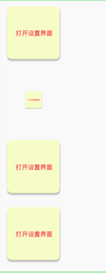
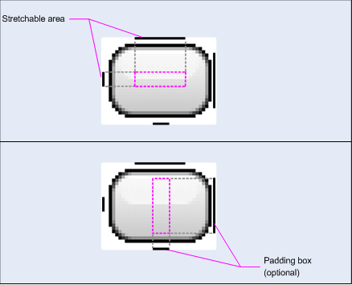

各类 Drawbale 的使用总结

涵盖如何在 xml 中定义，如果在 代码中定义。

相关官方文档：

* [可绘制对象资源](https://developer.android.com/guide/topics/resources/drawable-resource?hl=zh-CN#Shape)
* [Images and graphics](https://developer.android.com/guide/topics/graphics?hl=zh-CN)
* [android.graphics.drawable](https://developer.android.com/reference/android/graphics/drawable/package-summary?hl=zh-CN)


## 一、Shape Drawable

早期其他相关文章内容：

* [android中shape的使用介绍 1--常用属性](https://blog.csdn.net/north1989/article/details/52938619)
* [android中shape的使用介绍-2环形](https://blog.csdn.net/north1989/article/details/52939888)
* [android中shape的使用介绍 3--矩形](https://blog.csdn.net/north1989/article/details/52944474)
* [Shape--使用介绍 4 ：椭圆形](https://blog.csdn.net/north1989/article/details/52945748)

### 1、xml 文件实现——`<shape>`

[官方文档：形状可绘制对象](https://developer.android.com/guide/topics/resources/drawable-resource#Shape)

#### (1)、存储和引用

标题|描述
---|---
存储目录|`res/drawable/xx.xml`
xml 文件编译之后对应的类|GradientDrawable
java 中的引用方式|R.drawable.xx
xml 中的引用方式|`@包名:drawable/xx`

#### (2)、语法格式

```xml
<?xml version="1.0" encoding="utf-8"?>
<shape
    xmlns:android="http://schemas.android.com/apk/res/android"
    android:shape=["rectangle" | "oval" | "line" | "ring"] >
    <corners
        android:radius="integer"
        android:topLeftRadius="integer"
        android:topRightRadius="integer"
        android:bottomLeftRadius="integer"
        android:bottomRightRadius="integer" />
    <gradient
        android:angle="integer"
        android:centerX="float"
        android:centerY="float"
        android:centerColor="integer"
        android:endColor="color"
        android:gradientRadius="integer"
        android:startColor="color"
        android:type=["linear" | "radial" | "sweep"]
        android:useLevel=["true" | "false"] />
    <padding
        android:left="integer"
        android:top="integer"
        android:right="integer"
        android:bottom="integer" />
    <size
        android:width="integer"
        android:height="integer" />
    <solid
        android:color="color" />
    <stroke
        android:width="integer"
        android:color="color"
        android:dashWidth="integer"
        android:dashGap="integer" />
</shape>
```

* shape 的取值为 line 时，表示绘制一条水平线，需要通过 `<stroke>` 定义线的宽度
* shape 的取值为 ring 是，表示绘制圆环，此时，才可以使用如下属性
	* `android:innerRadius` 尺寸。环内部（中间的孔）的半径，以尺寸值或尺寸资源表示。
	* `android:innerRadiusRatio` 浮点型。环内部的半径，以环宽度的比率表示。例如，如果 `android:innerRadiusRatio="5"`，则内半径等于环宽度除以 5。此值被 `android:innerRadius` 覆盖。默认值为 **9**。
	* `android:thickness` 尺寸。环的厚度，以尺寸值或尺寸资源表示。
	* `android:thicknessRatio` 浮点型。环的厚度，表示为环宽度的比率。例如，如果 `android:thicknessRatio="2"`，则厚度等于环宽度除以 2。此值被 `android:innerRadius` 覆盖。默认值为 **3**。
* `android:useLevel` 布尔值。只有当前文件被用作 LevelListDrawable 的 item 时，此值为 true 。通常应为 false ，否则形状不会显示。  
* 默认情况下，在使用该 drawable 时，即便定义了 size 也会缩放至容器的大小。但在 ImageView 中使用时，可以通过 `android:scaleType="center"` 来限制缩放


**gradient 的属性解析：**

属性|含义
---|---
android:angle|整型。渐变的角度（度）。0 为从左到右，90 为从上到上。必须是 45 的倍数。默认值为 0。
android:centerX|浮点型。渐变中心的相对 X 轴位置 (0 - 1.0)。
android:centerY|浮点型。渐变中心的相对 Y 轴位置 (0 - 1.0)。
android:centerColor|颜色。起始颜色与结束颜色之间的可选颜色，以十六进制值或颜色资源表示。
android:endColor|颜色。结束颜色，表示为十六进制值或颜色资源。
android:gradientRadius|浮点型。渐变的半径。仅在 `android:type="radial"` 时适用。
android:startColor|颜色。起始颜色，表示为十六进制值或颜色资源。
android:useLevel|布尔值。如果这用作 LevelListDrawable，则此值为“true”。
android:type|关键字。要应用的渐变图案的类型。取值参考下表

**type 的取值如下**：

值|说明
---|---
"linear"	|线性渐变。这是默认值。
"radial"	|径向渐变。起始颜色为中心颜色。
"sweep"	|流线型渐变。


### 2、代码实现——ShapeDrawable 

* [官方文档：ShapeDrawable 类定义](https://developer.android.com/reference/android/graphics/drawable/ShapeDrawable.html)
* [官方文档：ShapeDrawable 使用示例](https://developer.android.com/guide/topics/graphics/drawables#shape-drawable)

```kotlin
val rectShape = ShapeDrawable(OvalShape()).apply {
            paint.color = 0XFF2196F3.toInt()
            setBounds(1, 1, 1, 1)
        }
textView.backgroundDrawable = rectShape
```

ShapeDrawable 中可使用的属性和方法比较少，只能绘制出基本的二维图形，不能实现圆角、边线、渐变等内容。使用较少。

### 3、代码实现——GradientDrawable

* [官方文档：GradientDrawable 类定义](https://developer.android.com/reference/android/graphics/drawable/GradientDrawable.html?hl=zh-CN)

GradientDrawable 拥有 `<shape>` 的完整属性，是代码实现 Shape 的首选, 示例如下：

```kotlin
/**
 * CnPeng:2019-07-22 22:13 获取shapeDrawable
 * @param solidColorId 颜色id，如 R.color.white
 * @param cornerRadius 圆角半径，单位 px
 * @param cornerRadiusArray 圆角半径的数组，每两个为一组，共四组八个数据，单位px
 * @param strokeWidth 边线宽度，单位px
 * @param strokeColorId 边线颜色，示例 R.color.black
 */
@JvmOverloads
fun Context.getShapeDrawable(@ColorRes solidColorId: Int,
                             cornerRadius: Float = 0F,
                             cornerRadiusArray: FloatArray? = null,
                             strokeWidth: Int = 0,
                             @ColorRes strokeColorId: Int = R.color.divider
): Drawable {

    return GradientDrawable().apply {
        shape = GradientDrawable.RECTANGLE
        setColor(getColorV2(solidColorId))

        if (null != cornerRadiusArray && 8 == cornerRadiusArray.size) {
            cornerRadii = cornerRadiusArray
        } else {
            if (cornerRadius > 0) {
                setCornerRadius(cornerRadius)
            }
        }

        if (0 > strokeWidth) {
            setStroke(strokeWidth, getColorV2(strokeColorId))
        }
    }
}
```

## 二、Layer Drawable

LayerDrawable 是对一组 Drawable 的管理，绘制时按照后来居上的原则，后添加的绘制在最上层。

早期相关文章：

* [layer-list -- layer-list的基本使用介绍](https://blog.csdn.net/north1989/article/details/53485729)

### 1、xml 实现——`<layer-list>`

[官方文档介绍](https://developer.android.com/guide/topics/resources/drawable-resource#LayerList)

### (1)、存储和引用

使用 `<layer-list>` 标识，被管理的 Drawable 对象放置在 `<item>` 中

标题|描述
---|---
存储目录|`res/drawable/xx.xml`
xml 文件编译之后对应的类|LayerDrawable
java 中的引用方式|R.drawable.xx
xml 中的引用方式|`@包名:drawable/xx`

### (2)、语法格式

#### 1）、基本使用

```xml
<?xml version="1.0" encoding="utf-8"?>
<layer-list
    xmlns:android="http://schemas.android.com/apk/res/android" >
    <item
        android:drawable="@[package:]drawable/drawable_resource"
        android:id="@[+][package:]id/resource_name"
        android:top="dimension"
        android:right="dimension"
        android:bottom="dimension"
        android:left="dimension" />
</layer-list>
```

`<item>` 节点的属性解析如下：

* `id` 表示当前 item 对应 drawable 的唯一标识。可以通过 `View.findViewByID()` 或 `Activity.findViewById()` 获取这个 item 中的 drawable 对象
* `top` 表示相对于顶部的偏移量。其他 right 、bottom、left 同理

#### 2）、使用 `<bitmap>` 作为 `<item>` 的子节点

在前一小节的基本使用格式中，为了适应容器的大小 ，`<item>` 中的 drawable 会被缩放。

为了避免缩放，我们可以将 `<bitmap>` 作为 `<item>` 的子节点，在 `<bitmap>` 中指定要显示的 drawable ，并指定其 gravity 的取值，比如：

```xml
<item>
  <bitmap android:src="@drawable/image"
          android:gravity="center" />
</item>
```

* 如果将 layerDrawable 作为 background ，能够直接看到使用 drawble 和 bitmap 作为 `<item>` 节点内容的区别；
* 如果将 layerDrawable 作为 ImageView 的 src ，则需要调整 scaleType　的才能看到是它们的区别。

#### 3）、完整示例代码

* `layer_test1.xml`

```xml
<?xml version="1.0" encoding="utf-8"?>
<layer-list xmlns:android="http://schemas.android.com/apk/res/android">
    <item
        android:drawable="@drawable/iv_open_drawer" />
</layer-list>
```

* `layer_test2.xml`

```xml
<?xml version="1.0" encoding="utf-8"?>
<layer-list xmlns:android="http://schemas.android.com/apk/res/android">
    <item>

        <bitmap
            android:gravity="center"
            android:src="@drawable/iv_open_drawer" />
    </item>
</layer-list>
```

* `activity_test.xml`

```xml
<?xml version="1.0" encoding="utf-8"?>
<LinearLayout xmlns:android="http://schemas.android.com/apk/res/android"
    xmlns:tools="http://schemas.android.com/tools"
    android:layout_width="match_parent"
    android:layout_height="match_parent"
    android:orientation="vertical"
    tools:context="com.cnpeng.android2.d_mine.a10_drawable.LayerDrawableActivity">
	<!--这里显示的是缩放后的图-->
    <TextView
        android:layout_width="150dp"
        android:layout_height="150dp"
        android:background="@drawable/layer_test1" />

	 <!--这里显示的是原图大小，没有被缩放-->
    <TextView
        android:layout_width="150dp"
        android:layout_height="150dp"
        android:background="@drawable/layer_test2" />

	<!--作为 src 使用时要想显示不缩放的原图，需要配置 scaleType-->
    <ImageView
        android:layout_width="150dp"
        android:layout_height="150dp"
        android:src="@drawable/layer_test1" />

    <ImageView
        android:layout_width="150dp"
        android:layout_height="150dp"
        android:src="@drawable/layer_test2" />

</LinearLayout>
```

* 效果图



### 2、代码实现——LayerDrawable类

[官方介绍文档](https://developer.android.com/reference/android/graphics/drawable/LayerDrawable.html)

继承关系：

```html
public class LayerDrawable 
extends Drawable implements Drawable.Callback

java.lang.Object
   ↳	android.graphics.drawable.Drawable
 	   ↳	android.graphics.drawable.LayerDrawable
 	   
Known direct subclasses
RippleDrawable, TransitionDrawable
```

示例代码：

```kotlin
@JvmOverloads
fun getLayerDrawable(@ColorRes solidColorId0: Int,
                     @ColorRes solidColorId1: Int,
                     bottomLineHeight: Int = 1,
                     insetArray: IntArray? = null
): Drawable {

    val layer0 = getShapeDrawable(solidColorId0)
    val layer1 = getShapeDrawable(solidColorId1)
    val layerDrawable = LayerDrawable(arrayOf(layer0, layer1))

    val tempInsetArray = intArrayOf(0, 0, 0, 
            if (null == insetArray) bottomLineHeight else 0)

    if (null != insetArray && insetArray.isNotEmpty()) {
        for ((i, inset) in insetArray.withIndex())
            if (i < tempInsetArray.size) {
                tempInsetArray[i] = inset
            }
    }
    layerDrawable.setLayerInset(1, tempInsetArray[0], 
            tempInsetArray[1], tempInsetArray[2], tempInsetArray[3])
    return layerDrawable
}

// 调用上述工具类
iv2.background = getLayerDrawable(R.color.black,
                R.color.white,
                insetArray = intArrayOf(10))
```

## 三、Bitmap

### 1、Bitmap 文件

[官方文档](https://developer.android.com/guide/topics/resources/drawable-resource#Bitmap)

指的是存放在 `res/drawable` 目录下的 `.png`、`.jpg`、`.gif` 文件，

标题|描述
---|---
存储目录|`res/drawable/xx.png(或 .jpg、.gif)`
编译之后对应的类|BitmapDrawable
java 中的引用方式|R.drawable.xx
xml 中的引用方式|`@包名:drawable/xx`

示例：

```kotlin
val drawable: Drawable? = ResourcesCompat.getDrawable(resources, R.drawable.myimage, null)
```

### 2、xml 实现——`<bitmap>`

[官方文档](https://developer.android.com/guide/topics/resources/drawable-resource#Bitmap)

本质上算是 Bitmap文件 的别名，但是 xml 的实现方式可以有诸多附加属性，比如 dither(抖动)、tile(层叠)

> `<layer-list>` 中 使用 `<bitmap>` 作为 `<item>` 的条目时，就是利用的 `<bitmap>` 的gravity 属性控制不缩放

语法格式如下：

```xml
<?xml version="1.0" encoding="utf-8"?>
<bitmap
    xmlns:android="http://schemas.android.com/apk/res/android"
    android:src="@[package:]drawable/drawable_resource"
    android:antialias=["true" | "false"]
    android:dither=["true" | "false"]
    android:filter=["true" | "false"]
    android:gravity=["top" | "bottom" | "left" | "right" | "center_vertical" |
                      "fill_vertical" | "center_horizontal" | "fill_horizontal" |
                      "center" | "fill" | "clip_vertical" | "clip_horizontal"]
    android:mipMap=["true" | "false"]
    android:tileMode=["disabled" | "clamp" | "repeat" | "mirror"] />
```

* 属性含义解析

属性|含义
---|---
antialias|布尔值。启用或停用抗锯齿。
dither|布尔值。当位图的像素配置与屏幕不同时（例如：ARGB 8888 位图和 RGB 565 屏幕），启用或停用位图抖动。
filter|布尔值。启用或停用位图过滤。当位图收缩或拉伸以使其外观平滑时使用过滤。
gravity|定义位图的重力。重力指示当位图小于容器时，可绘制对象在其容器中放置的位置。取值可以是一个或多个（用 '|' 分隔），具体取值参考后面 gravity 取值的表格
mipMap|布尔值。启用或停用 mipmap 提示，默认值为 false。[具体可参考setHasMipMap()](https://developer.android.com/reference/android/graphics/Bitmap.html#setHasMipMap(boolean))。
tileMode|平铺模式。**当平铺模式启用时，位图会重复, 并且 gravity 将被忽略。**

* gravity 取值如下：

值|说明
---|---
fill	|按需要扩展对象的垂直大小，使其完全适应其容器。这是默认值。
top   |	将对象放在其容器顶部，不改变其大小。
bottom|	将对象放在其容器底部，不改变其大小。
left  |	将对象放在其容器左边缘，不改变其大小。
right |	将对象放在其容器右边缘，不改变其大小。
center	|将对象放在其容器的水平和垂直轴中心，不改变其大小。
center_vertical	|将对象放在其容器的垂直中心，不改变其大小。
center_horizontal|将对象放在其容器的水平中心，不改变其大小。
fill_vertical		|按需要扩展对象的垂直大小，使其完全适应其容器。
fill_horizontal	|按需要扩展对象的水平大小，使其完全适应其容器。
clip_vertical		|可设置为让子元素的上边缘和/或下边缘裁剪至其容器边界的附加选项。裁剪基于垂直重力：顶部重力裁剪上边缘，底部重力裁剪下边缘，任一重力不会同时裁剪两边。
clip_horizontal	|可设置为让子元素的左边和/或右边裁剪至其容器边界的附加选项。裁剪基于水平重力：左边重力裁剪右边缘，右边重力裁剪左边缘，任一重力不会同时裁剪两边。

* tilemode 取值如下

值|说明
---|---
disabled	|不平铺位图。这是默认值。
clamp		|当着色器绘制范围超出其原边界时复制边缘颜色
repeat		|水平和垂直重复着色器的图像。
mirror		|水平和垂直重复着色器的图像，交替镜像图像以使相邻图像始终相接。

### 3、代码实现——BitmapDrawable

[官方文档](https://developer.android.com/reference/android/graphics/drawable/BitmapDrawable.html)

我们可以基于 **文件路径、输入流、Bitmap对象** 构建 BitmapDrawable

#### 1）、构造函数

由于很多构造函数已经被废弃了，所以，此处仅整理未被废弃的构造函数。

* `BitmapDrawable(Resources res, Bitmap bitmap)`
* `BitmapDrawable(Resources res, String filepath)`
* `BitmapDrawable(Resources res, InputStream is)`

感觉通过代码构造 Bitmap 的使用方式较少，所以示例代码省略

## 四、NinePatch（点九图）

[官方：NinePatch基本介绍](https://developer.android.com/guide/topics/resources/drawable-resource#NinePatch)

[官方：如何绘制点九图](https://developer.android.com/guide/topics/graphics/drawables#nine-patch)



## 五、StateListDrawable

StateListDrawable 根据控件的不同状态显示不同的 drawable

在状态变更时，会从上到下遍历，匹配到第一个符合当前状态的 drawable 时就会停止遍历。所以，我们需要将默认状态定义在最后。

### 1、xml实现——`<selector>`

[官方文档](https://developer.android.com/guide/topics/resources/drawable-resource#StateList)

在 xml 中使用 `<selector>` 表示，其子节点为 `<item>`。`<item>` 中定义了状态及对应的 drawable

标题|描述
---|---
文件位置| `res/drawable/filename.xml`
编译后对应的类| StateListDrawable 
Java 中引用方式|R.drawable.filename
XML 中引用方式|`@[package:]drawable/filename`

* 语法格式

```xml
<?xml version="1.0" encoding="utf-8"?>
<selector xmlns:android="http://schemas.android.com/apk/res/android"
    android:constantSize=["true" | "false"]
    android:dither=["true" | "false"]
    android:variablePadding=["true" | "false"] >
    <item
        android:drawable="@[package:]drawable/drawable_resource"
        android:state_pressed=["true" | "false"]
        android:state_focused=["true" | "false"]
        android:state_hovered=["true" | "false"]
        android:state_selected=["true" | "false"]
        android:state_checkable=["true" | "false"]
        android:state_checked=["true" | "false"]
        android:state_enabled=["true" | "false"]
        android:state_activated=["true" | "false"]
        android:state_window_focused=["true" | "false"] />
</selector>
```

* selector 的属性解析

属性|含义
---|---
constantSize|布尔值。如果可绘制对象报告的内部大小在状态变更时保持不变，则值为“true”（大小是所有状态的最大值）；如果大小根据当前状态而变化，则值为“false”。默认值为 false。
dither|布尔值。值为“true”时，将在位图的像素配置与屏幕不同时（例如：ARGB 8888 位图和 RGB 565 屏幕）启用位图的抖动；值为“false”时则停用抖动。默认值为 true。
variablePadding|布尔值。如果可绘制对象的内边距应根据选择的当前状态而变化，则值为“true”；如果内边距应保持不变（基于所有状态的最大内边距），则值为“false”。启用此功能要求您在状态变更时处理执行布局，这通常不受支持。默认值为 false。

上述三个属性貌似很少使用。

* item 的属性解析

属性|含义
---|---
`state_pressed`|布尔值。触摸/点按
`state_focused`|布尔值。获取焦点
`state_hovered`|布尔值。当光标悬停。通常与 获取焦点 使用相同 drawable
`state_selected`|布尔值。如果在使用定向控件浏览（例如使用方向键浏览列表）的情况下被选择时应使用此项目，则值为“true”；当焦点 (android:state_focused) 不充分（例如，列表视图有焦点但使用方向键选择其中的项目）时，使用所选状态。
`state_checkable`|布尔值。可选中（仅当对象可在可选中与不可选中小部件之间转换时才有用。）
`state_checked`|布尔值。已选中
`state_enabled`|布尔值。启用（能够接收触摸/点击事件）
`state_activated`|布尔值。如果在对象激活作为持续选择（例如，在持续导航视图中“突出显示”之前选中的列表项）时应使用此项目
`state_window_focused`|布尔值。有焦点（应用在前台）

* 示例代码：

```xml
<?xml version="1.0" encoding="utf-8"?>
<selector xmlns:android="http://schemas.android.com/apk/res/android">
    <item android:state_pressed="true"
          android:drawable="@drawable/button_pressed" /> 
    <item android:state_focused="true"
          android:drawable="@drawable/button_focused" /> 
    <item android:state_hovered="true"
          android:drawable="@drawable/button_focused" /> 
    
    <!-- 上述状态均不匹配时的默认图 -->
    <item android:drawable="@drawable/button_normal" /> 
</selector>
```

## 2、代码实现——StateListDrawable

[官方文档](https://developer.android.com/reference/android/graphics/drawable/StateListDrawable.html)

示例代码：

```java
@JvmOverloads
fun getStateListDrawable(stateArray: IntArray,
                         drawableArray: Array<Drawable>,
                         defaultDrawable: Drawable? = null
): Drawable {

    val stateDrawable = StateListDrawable()
    if (stateArray.size == drawableArray.size
            && stateArray.isNotEmpty()
            && drawableArray.isNotEmpty()
    ) {
        for (i in 0 until stateArray.size) {
            stateDrawable.addState(intArrayOf(stateArray[i]), drawableArray[i])
        }
    }

    if (null != defaultDrawable) {
        stateDrawable.addState(intArrayOf(), defaultDrawable)
    }

    return stateDrawable
}
```

* 调用示例：

```kotlin
class StateListDrawableActivity : AppCompatActivity() {

    override fun onCreate(savedInstanceState: Bundle?) {
        super.onCreate(savedInstanceState)
        setContentView(R.layout.activity_state_list_drawable)

		  // 状态前面加 - 表示反状态，-focused 就表示没有焦点的状态
        val focused = android.R.attr.state_focused
        et1.background = getStateListDrawable(intArrayOf(focused, -focused),
                arrayOf(ColorDrawable(Color.RED), ColorDrawable(Color.WHITE)))

        /*
        * 给View、TextView、ImageView、ViewGroup 等默认没有按压状态的控件添加 StateListDrawable 时，
        * 控件需要设置 clickListener ，否则按压效果不生效
        *
        * 即：默认没有状态的控件不会响应对应的状态，包括默认状态，
        * 所以，下面的这个 tv 设置的 defaultStateDrawable无效
        */
        val pressed = android.R.attr.state_pressed
        tv.background = getStateListDrawable(intArrayOf(pressed),
                arrayOf(ColorDrawable(Color.BLUE)),
                ColorDrawable(0xFFC)
        )
        tv.setOnClickListener {
        }

        bt.background = getStateListDrawable(intArrayOf(pressed),
                arrayOf(ColorDrawable(Color.RED)),
                ColorDrawable(Color.BLUE)
        )
    }
}    
```

* `activity_state_list_drawable.xml`

```xml
<?xml version="1.0" encoding="utf-8"?>
<LinearLayout xmlns:android="http://schemas.android.com/apk/res/android"
    xmlns:tools="http://schemas.android.com/tools"
    android:layout_width="match_parent"
    android:layout_height="match_parent"
    android:orientation="vertical"
    tools:context="com.cnpeng.android2.d_mine.a10_drawable.StateListDrawableActivity">

    <EditText
        android:id="@+id/et1"
        android:layout_width="100dp"
        android:layout_height="100dp"
        android:background="#ffc"
        android:gravity="center"
        android:text="测试输入框1" />

    <EditText
        android:id="@+id/et2"
        android:layout_width="100dp"
        android:layout_height="100dp"
        android:layout_marginTop="5dp"
        android:background="#ffc"
        android:gravity="center"
        android:text="测试输入框2" />

    <Button
        android:id="@+id/bt"
        android:layout_width="100dp"
        android:layout_height="60dp"
        android:text="按钮1" />

    <TextView
        android:id="@+id/tv"
        android:layout_width="100dp"
        android:layout_height="60dp"
        android:gravity="center"
        android:text="文本TextView" />

</LinearLayout>
```

----
------------TODO以下内容等待整理---------------
----


> 在早期的 .doc 文档中整理过下列 drawable 

## 六、LevelList Drawable

* [官方文档——LevelList](https://developer.android.com/guide/topics/resources/drawable-resource#LevelList)
* [官方文档——LevelListDrawable](https://developer.android.com/reference/android/graphics/drawable/LevelListDrawable.html)

## 七、Transition Drawable

* [官方文档——Transition](https://developer.android.com/guide/topics/resources/drawable-resource#Transition)
* [官方文档——TransitionDrawable](https://developer.android.com/reference/android/graphics/drawable/TransitionDrawable.html)

## 八、Inset Drawable

* [官方文档——Inset](https://developer.android.com/guide/topics/resources/drawable-resource#Inset)
* [官方文档——InsetDrawable](https://developer.android.com/reference/android/graphics/drawable/InsetDrawable.html)

## 九、Clip Drawable

* [官方文档——Clip](https://developer.android.com/guide/topics/resources/drawable-resource#Clip)
* [官方文档——Clip Drawable](https://developer.android.com/reference/android/graphics/drawable/ClipDrawable.html)

## 十、Scale Drawable

* [官方文档——Scale](https://developer.android.com/guide/topics/resources/drawable-resource#Scale)
* [官方文档——ScaleDrawable](https://developer.android.com/reference/android/graphics/drawable/ScaleDrawable.html)

