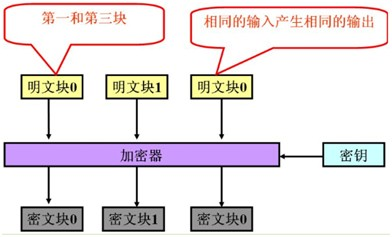
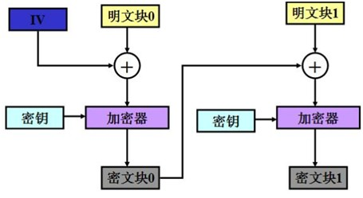
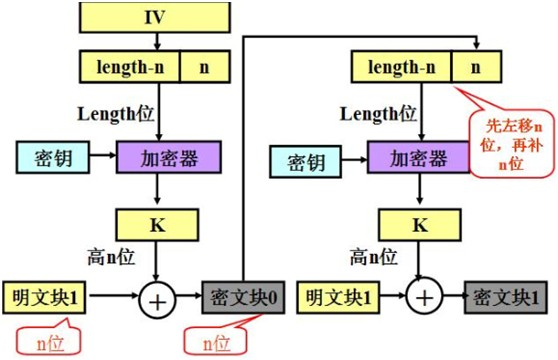
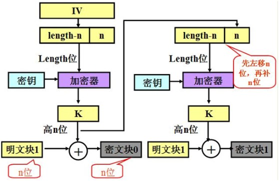
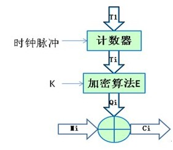

## 一、适用于 Android 的 3DES 加解密工具类


```kotlin
package com.cnpeng.androidutil.comm

import android.util.Base64
import java.util.*
import javax.crypto.Cipher
import javax.crypto.SecretKeyFactory
import javax.crypto.spec.DESKeySpec
import javax.crypto.spec.DESedeKeySpec
import javax.crypto.spec.IvParameterSpec

/**
 * CnPeng 2019-07-31
 * 功用：加解密工具类
 * 其他：
 */
object EncryptUtil {

    /**
     * CnPeng:2019-07-31 14:11 这个加密向量可以自定义，不影响加解密结果. 只要加解密时使用同一个即可。
     *
     * 另外，如果需要同后台交互，并且使用了非 NoPadding 的填充模式，那么在解密时 要么定义同样的 IV ，要么忽略前 iv.length 的字符。
     */
    private val IV = UUID.randomUUID().toString().slice(0..7)

    /**
     * DESCBC加密
     *
     * @param src 数据源
     * @param key 密钥，长度必须是8的倍数
     * @return    返回加密后的数据
     */
    @JvmStatic
    fun encryptDESCBC(src: String, key: String): String {

        try { // --生成key,同时制定是des还是DESede,两者的key长度要求不同
            val desKeySpec = DESKeySpec(key.toByteArray(charset("UTF-8")))
            val keyFactory = SecretKeyFactory.getInstance("DES")
            val secretKey = keyFactory.generateSecret(desKeySpec)

            // --加密向量
            val iv = IvParameterSpec(IV.toByteArray(charset("UTF-8")))

            // --通过Chipher执行加密得到的是一个byte的数组,Cipher.getInstance("DES")就是采用ECB模式,cipher.init(Cipher.ENCRYPT_MODE,
            // secretKey)就可以了.
            val cipher = Cipher.getInstance("DES/CBC/PKCS5Padding")
            cipher.init(Cipher.ENCRYPT_MODE, secretKey, iv)
            val b = cipher.doFinal(src.toByteArray(charset("UTF-8")))

            return Base64.encodeToString(b, Base64.NO_WRAP)
        } catch (e: Exception) {
            e.printStackTrace()
            return ""
        }
    }

    /**
     * DESCBC 解密
     *
     * @param src  数据源
     * @param key  密钥，长度必须是8的倍数
     * @return     返回解密后的原始数据
     */
    @JvmStatic
    fun decryptDESCBC(src: String, key: String): String {

        try { // --通过base64,将字符串转成byte数组
            val bytesrc = Base64.decode(src, Base64.NO_WRAP)

            // --解密的key
            val desKeySpec = DESKeySpec(key.toByteArray(charset("UTF-8")))
            val keyFactory = SecretKeyFactory.getInstance("DES")
            val secretKey = keyFactory.generateSecret(desKeySpec)

            // --向量
            val ivByteArray = IV.toByteArray(charset("UTF-8"))
            val iv = IvParameterSpec(ivByteArray)

            // --Chipher对象解密Cipher.getInstance("DES")就是采用ECB模式,cipher.init(Cipher.DECRYPT_MODE,
            // secretKey)就可以了.
            val cipher = Cipher.getInstance("DES/CBC/PKCS5Padding")
            cipher.init(Cipher.DECRYPT_MODE, secretKey, iv)
            val retByte = cipher.doFinal(bytesrc)

            return String(retByte)
        } catch (e: Exception) {
            e.printStackTrace()
            return ""
        }
    }

    /**
     *  3DES CBC 加密,key必须是长度大于等于 3*8 = 24 位
     */
    @JvmStatic
    fun tripleDESCBCEncode(src: String, key: String): String {

        try {
            val dks = DESedeKeySpec(key.toByteArray(charset("UTF-8")))
            val keyFactory = SecretKeyFactory.getInstance("DESede")
            val securekey = keyFactory.generateSecret(dks)

            // 向量
            val iv = IvParameterSpec(IV.toByteArray(charset("UTF-8")))

            val cipher = Cipher.getInstance("DESede/CBC/PKCS5Padding")
            cipher.init(Cipher.ENCRYPT_MODE, securekey, iv)
            val b = cipher.doFinal(src.toByteArray())

            // return Base64.encodeToString(b, Base64.DEFAULT).replace("\r".toRegex(), "").replace("\n".toRegex(), "")
            return Base64.encodeToString(b, Base64.NO_WRAP)
        } catch (e: Exception) {
            e.printStackTrace()
            return ""
        }
    }

    /**
     * CnPeng:2019-07-31 15:13 3DES CBC解密,key必须是长度大于等于 3*8 = 24 位
     * @param ignoreIv 是否忽略前 IV.length 个字符，当向量与加密向量不一致时必须使用 true ,否则解密结果会出错
     */
    @JvmStatic
    @JvmOverloads
    fun tripleDESCBCDecode(src: String, key: String, ignoreIv: Boolean = false): String {
        try {
            // --通过base64,将字符串转成byte数组
            val bytesrc = Base64.decode(src, Base64.DEFAULT)

            // 解密的key
            val dks = DESedeKeySpec(key.toByteArray(charset("UTF-8")))
            val keyFactory = SecretKeyFactory.getInstance("DESede")
            val securekey = keyFactory.generateSecret(dks)

            // 向量
            val ivByteArray = IV.toByteArray(charset("UTF-8"))
            val iv = IvParameterSpec(ivByteArray)

            // Chipher对象解密
            val cipher = Cipher.getInstance("DESede/CBC/PKCS5Padding")
            cipher.init(Cipher.DECRYPT_MODE, securekey, iv)
            val retByte = cipher.doFinal(bytesrc)

            return if (ignoreIv) {
                //CnPeng 2019-07-31 15:19 只解析索引为 iv.length 到 retByte.size 之间的字符
                String(retByte.copyOfRange(ivByteArray.size, retByte.size))
            } else {
                String(retByte)
            }
        } catch (e: Exception) {
            e.printStackTrace()
            return ""
        }
    }
}
```

## 二、参考链接：
* [3DES加密算法(示例代码主要参考该文章)](https://www.cnblogs.com/shindo/p/6021976.html)
* [aes使用java加密，go解密](https://blog.csdn.net/fangdengfu123/article/details/82997494)
* [《对称加密算法DES、3DES原理和实现方式》（基础知识介绍的比较好）](https://my.oschina.net/zchuanzhao/blog/525898#h2_20)


## 三、附录：《对称加密算法DES、3DES原理和实现方式》
### 1、对称加密算法

#### 1.1 定义
对称加密算法是应用较早的加密算法，技术成熟。在对称加密算法中，数据发信方将明文（原始数据）和加密密钥（mi yue）一起经过特殊加密算法处理后，使其变成复杂的加密密文发送出去。收信方收到密文后，若想解读原文，则需要使用加密用过的密钥及相同算法的逆算法对密文进行解密，才能使其恢复成可读明文。在对称加密算法中，使用的密钥只有一个，发收信双方都使用这个密钥对数据进行加密和解密，这就要求解密方事先必须知道加密密钥。

#### 1.2 优缺点

* 优点：算法公开、计算量小、加密速度快、加密效率高。

* 缺点：
	* （1）交易双方都使用同样钥匙，安全性得不到保证。
	* （2）每对用户每次使用对称加密算法时，都需要使用其他人不知道的惟一钥匙，这会使得发收信双方所拥有的钥匙数量呈几何级数增长，密钥管理成为用户的负担。对称加密算法在分布式网络系统上使用较为困难，主要是因为密钥管理困难，使用成本较高。

### 1.3 常用对称加密算法

基于“对称密钥”的加密算法主要有DES、3DES（TripleDES）、AES、RC2、RC4、RC5和Blowfish等。本文只介绍最常用的对称加密算法DES、3DES（TripleDES）和AES。

### 2、DES
#### 2.1 概述

DES算法全称为Data Encryption Standard，即数据加密算法，它是IBM公司于1975年研究成功并公开发表的。DES算法的入口参数有三个：Key、Data、Mode。其中Key为8个字节共64位，是DES算法的工作密钥；Data也为8个字节64位，是要被加密或被解密的数据；Mode为DES的工作方式,有两种：加密或解密。

#### 2.2 算法原理
DES算法把64位的明文输入块变为64位的密文输出块，它所使用的密钥也是64位，其算法主要分为两步：

#####（1）初始置换

其功能是把输入的64位数据块按位重新组合,并把输出分为L0、R0两部分，每部分各长32位，其置换规则为将输入的第58位换到第一位，第50位换到第2位……依此类推,最后一位是原来的第7位。L0、R0则是换位输出后的两部分，L0是输出的左32位，R0是右32位，例：设置换前的输入值为D1D2D3……D64，则经过初始置换后的结果为:L0=D58D50……D8；R0=D57D49……D7。

#####（2）逆置换

经过16次迭代运算后，得到L16、R16,将此作为输入，进行逆置换，逆置换正好是初始置换的逆运算，由此即得到密文输出。

#### 2.3 五种分组模式

##### 2.3.1 EBC模式



* 优点：
	* 1.简单；
	* 2.有利于并行计算；
	* 3.误差不会被传送；
* 缺点：
	* 1.不能隐藏明文的模式；
	* 2.可能对明文进行主动攻击。

##### 2.3.2 CBC模式
         
CBC模式又称为密码分组链接模式，示意图如下：



* 优点：
	* 1.不容易主动攻击,安全性好于ECB,适合传输长度长的报文,是SSL、IPSec的标准。

* 缺点：
	* 1、不利于并行计算；
	* 2、误差传递；
	* 3、需要初始化向量IV。

##### 2.3.3 CFB模式

CFB模式又称为密码发反馈模式，示意图如下图所示：



* 优点：
	* 1、隐藏了明文模式；
	* 2、分组密码转化为流模式；
	* 3、可以及时加密传送小于分组的数据。

* 缺点:
	* 1、不利于并行计算；
	* 2、误差传送：一个明文单元损坏影响多个单元；
	* 3、唯一的IV。

##### 2.3.4 OFB模式

OFB模式又称输出反馈模式，示意图所下图所示：



* 优点：
	* 1、隐藏了明文模式；
	* 2、分组密码转化为流模式；
	* 3、可以及时加密传送小于分组的数据。

* 缺点：
	* 1、不利于并行计算；
	* 2、对明文的主动攻击是可能的；
	* 3、误差传送：一个明文单元损坏影响多个单元。

##### 2.3.5 CTR模式

计数模式（CTR模式）加密是对一系列输入数据块(称为计数)进行加密，产生一系列的输出块，输出块与明文异或得到密文。对于最后的数据块，可能是长u位的局部数据块，这u位就将用于异或操作，而剩下的b-u位将被丢弃（b表示块的长度）。CTR解密类似。这一系列的计数必须互不相同的。假定计数表示为T1, T2, …, Tn。CTR模式可定义如下：

CTR加密公式如下：

```
Cj = Pj XOR Ek(Tj)

C*n = P*n XOR MSBu(Ek(Tn)) j = 1，2… n-1;
```

CTR解密公式如下：

```
Pj = Cj XOR Ek(Tj)

P*n = C*n XOR MSBu(Ek(Tn)) j = 1，2 … n-1;
```

加密方式：密码算法产生一个16 字节的伪随机码块流，伪随机码块与输入的明文进行异或运算后产生密文输出。密文与同样的伪随机码进行异或运算后可以重产生明文。

AES CTR模式的结构如下图所示。 




CTR 模式被广泛用于 ATM 网络安全和 IPSec应用中，相对于其它模式而言，CRT模式具有如下特点：

■ 硬件效率：允许同时处理多块明文 / 密文。

■ 软件效率：允许并行计算，可以很好地利用 CPU 流水等并行技术。

■ 预处理：算法和加密盒的输出不依靠明文和密文的输入，因此如果有足够的保证安全的存储器，加密算法将仅仅是一系列异或运算，这将极大地提高吞吐量。

■ 随机访问：第 i 块密文的解密不依赖于第 i-1 块密文，提供很高的随机访问能力

■ 可证明的安全性：能够证明 CTR 至少和其他模式一样安全（CBC, CFB, OFB, ...）

■ 简单性：与其它模式不同，CTR模式仅要求实现加密算法，但不要求实现解密算法。对于 AES 等加/解密本质上不同的算法来说，这种简化是巨大的。

■ 无填充，可以高效地作为流式加密使用。

#### 2.4 常用的填充方式
         
在Java进行DES、3DES和AES三种对称加密算法时，常采用的是NoPadding（不填充）、Zeros填充（0填充）、PKCS5Padding填充。

#####  2.4.1 ZerosPadding

全部填充为0的字节，结果如下：

```
       F1 F2 F3 F4 F5 F6 F7 F8   //第一块

      F9 00 00 00 00 00 00 00 //第二块
```

##### 2.4.2 PKCS5Padding

每个填充的字节都记录了填充的总字节数，结果如下：

```
 F1 F2 F3 F4 F5 F6 F7 F8   //第一块

 F9 07 07 07 07 07 07 07 //第二块
```

#### 2.5 Java中的DES实现
         
DES加密算法（ECB、无填充）的Java实现如下所示：

```java
import java.security.InvalidKeyException;
import java.security.Key;
import java.security.NoSuchAlgorithmException;
import java.security.SecureRandom;
import java.security.spec.InvalidKeySpecException;
import javax.crypto.Cipher;
import javax.crypto.SecretKey;
import javax.crypto.SecretKeyFactory;
import javax.crypto.spec.DESKeySpec;
import org.apache.commons.codec.binary.Base64;

/**
 * DES加解密算法
 * @author zhangchuanzhao
 * 2015-11-4 下午5:00:43
 */
public class DESUtil {
    //算法名称 
    public static final String KEY_ALGORITHM = "DES";
    //算法名称/加密模式/填充方式 
    //DES共有四种工作模式-->>ECB：电子密码本模式、CBC：加密分组链接模式、CFB：加密反馈模式、OFB：输出反馈模式
    public static final String CIPHER_ALGORITHM = "DES/ECB/NoPadding";

    /**
     *   
     * 生成密钥key对象
     * @param KeyStr 密钥字符串 
     * @return 密钥对象 
     * @throws InvalidKeyException   
     * @throws NoSuchAlgorithmException   
     * @throws InvalidKeySpecException   
     * @throws Exception 
     */
    private static SecretKey keyGenerator(String keyStr) throws Exception {
        byte input[] = HexString2Bytes(keyStr);
        DESKeySpec desKey = new DESKeySpec(input);
        //创建一个密匙工厂，然后用它把DESKeySpec转换成
        SecretKeyFactory keyFactory = SecretKeyFactory.getInstance(KEY_ALGORITHM);
        SecretKey securekey = keyFactory.generateSecret(desKey);
        return securekey;
    }

    private static int parse(char c) {
        if (c >= 'a') return (c - 'a' + 10) & 0x0f;
        if (c >= 'A') return (c - 'A' + 10) & 0x0f;
        return (c - '0') & 0x0f;
    }

    // 从十六进制字符串到字节数组转换 
    public static byte[] HexString2Bytes(String hexstr) {
        byte[] b = new byte[hexstr.length() / 2];
        int j = 0;
        for (int i = 0; i < b.length; i++) {
            char c0 = hexstr.charAt(j++);
            char c1 = hexstr.charAt(j++);
            b[i] = (byte) ((parse(c0) << 4) | parse(c1));
        }
        return b;
    }

    /** 
     * 加密数据
     * @param data 待加密数据
     * @param key 密钥
     * @return 加密后的数据 
     */
    public static String encrypt(String data, String key) throws Exception {
        Key deskey = keyGenerator(key);
        // 实例化Cipher对象，它用于完成实际的加密操作
        Cipher cipher = Cipher.getInstance(CIPHER_ALGORITHM);
        SecureRandom random = new SecureRandom();
        // 初始化Cipher对象，设置为加密模式
        cipher.init(Cipher.ENCRYPT_MODE, deskey, random);
        byte[] results = cipher.doFinal(data.getBytes());
        // 该部分是为了与加解密在线测试网站（http://tripledes.online-domain-tools.com/）的十六进制结果进行核对
        for (int i = 0; i < results.length; i++) {
            System.out.print(results[i] + " ");
        }
        System.out.println();
        // 执行加密操作。加密后的结果通常都会用Base64编码进行传输 
        return Base64.encodeBase64String(results);
    }

    /** 
     * 解密数据 
     * @param data 待解密数据 
     * @param key 密钥 
     * @return 解密后的数据 
     */
    public static String decrypt(String data, String key) throws Exception {
        Key deskey = keyGenerator(key);
        Cipher cipher = Cipher.getInstance(CIPHER_ALGORITHM);
        //初始化Cipher对象，设置为解密模式
        cipher.init(Cipher.DECRYPT_MODE, deskey);
        // 执行解密操作
        return new String(cipher.doFinal(Base64.decodeBase64(data)));
    }

    public static void main(String[] args) throws Exception {
        String source = "zchuzhao";
        System.out.println("原文: " + source);
        String key = "AABBCCDDEEFF1122";
        String encryptData = encrypt(source, key);
        System.out.println("加密后: " + encryptData);
        String decryptData = decrypt(encryptData, key);
        System.out.println("解密后: " + decryptData);
    }
}
```

测试结果：

原文: zchuzhao

-109 -80 -84 94 101 -26 113 7 

加密后: k7CsXmXmcQc=

解密后: zchuzhao


### 3、3DES
#### 3.1 概述

3DES（或称为Triple DES）是三重数据加密算法（TDEA，Triple Data Encryption Algorithm）块密码的通称。它相当于是对每个数据块应用三次DES加密算法。由于计算机运算能力的增强，原版DES密码的密钥长度变得容易被暴力破解；3DES即是设计用来提供一种相对简单的方法，即通过增加DES的密钥长度来避免类似的攻击，而不是设计一种全新的块密码算法。

#### 3.2 算法原理

使用3条56位的密钥对 数据进行三次加密。3DES（即Triple DES）是DES向AES过渡的加密算法（1999年，NIST将3-DES指定为过渡的加密标准）。

其具体实现如下：设Ek()和Dk()代表DES算法的加密和解密过程，K代表DES算法使用的密钥，P代表明文，C代表密文，这样：

3DES加密过程为：`C=Ek3(Dk2(Ek1(P)))`

3DES解密过程为：`P=Dk1(EK2(Dk3(C)))`

#### 3.3 Java中的3DES实现
 
3DES的在Java的实现与DES类似，如下代码为3DES加密算法、CBC模式、NoPadding填充方式的加密解密结果，参考代码如下所示：

```java
import java.security.InvalidKeyException;
import java.security.Key;

import java.security.NoSuchAlgorithmException;
import java.security.Security;
import java.security.spec.InvalidKeySpecException;

import javax.crypto.Cipher;
import javax.crypto.SecretKeyFactory;
import javax.crypto.spec.DESedeKeySpec;
import javax.crypto.spec.IvParameterSpec;


public class ThreeDESUtil {
    // 算法名称 
    public static final String KEY_ALGORITHM = "desede";
    // 算法名称/加密模式/填充方式 
    public static final String CIPHER_ALGORITHM = "desede/CBC/NoPadding";

    /** 
     * CBC加密 
     * @param key 密钥 
     * @param keyiv IV 
     * @param data 明文 
     * @return Base64编码的密文 
     * @throws Exception 
     */
    public static byte[] des3EncodeCBC(byte[] key, byte[] keyiv, byte[] data) throws Exception {
        Key deskey = keyGenerator(new String(key));
        Cipher cipher = Cipher.getInstance(CIPHER_ALGORITHM);
        IvParameterSpec ips = new IvParameterSpec(keyiv);
        cipher.init(Cipher.ENCRYPT_MODE, deskey, ips);
        byte[] bOut = cipher.doFinal(data);
        for (int k = 0; k < bOut.length; k++) {
            System.out.print(bOut[k] + " ");
        }
        System.out.println("");
        return bOut;
    }

    /** 
     *   
     * 生成密钥key对象 
     * @param KeyStr 密钥字符串 
     * @return 密钥对象 
     * @throws InvalidKeyException   
     * @throws NoSuchAlgorithmException   
     * @throws InvalidKeySpecException   
     * @throws Exception 
     */
    private static Key keyGenerator(String keyStr) throws Exception {
        byte input[] = HexString2Bytes(keyStr);
        DESedeKeySpec KeySpec = new DESedeKeySpec(input);
        SecretKeyFactory KeyFactory = SecretKeyFactory.getInstance(KEY_ALGORITHM);
        return ((Key) (KeyFactory.generateSecret(((java.security.spec.KeySpec) (KeySpec)))));
    }

    private static int parse(char c) {
        if (c >= 'a') return (c - 'a' + 10) & 0x0f;
        if (c >= 'A') return (c - 'A' + 10) & 0x0f;
        return (c - '0') & 0x0f;
    }
 
    // 从十六进制字符串到字节数组转换 
    public static byte[] HexString2Bytes(String hexstr) {
        byte[] b = new byte[hexstr.length() / 2];
        int j = 0;
        for (int i = 0; i < b.length; i++) {
            char c0 = hexstr.charAt(j++);
            char c1 = hexstr.charAt(j++);
            b[i] = (byte) ((parse(c0) << 4) | parse(c1));
        }
        return b;
    }

    /** 
     * 3des解密 
     * @param key 密钥 
     * @param keyiv IV 
     * @param data Base64编码的密文 
     * @return 明文 
     * @throws Exception 
     */
    public static byte[] des3DecodeCBC(byte[] key, byte[] keyiv, byte[] data) throws Exception {
        Key deskey = keyGenerator(new String(key));
        Cipher cipher = Cipher.getInstance(CIPHER_ALGORITHM);
        IvParameterSpec ips = new IvParameterSpec(keyiv);
        cipher.init(Cipher.DECRYPT_MODE, deskey, ips);
        byte[] bOut = cipher.doFinal(data);
        return bOut;
    }

    public static void main(String[] args) throws Exception {
        byte[] key = "6C4E60E55552386C759569836DC0F83869836DC0F838C0F7".getBytes();
        byte[] keyiv = { 1, 2, 3, 4, 5, 6, 7, 8 };
        byte[] data = "zchuzhao".getBytes("UTF-8");
        System.out.println("data.length=" + data.length);
        System.out.println("3des加密解密");
        byte[] str5 = des3EncodeCBC(key, keyiv, data);
        System.out.println(new sun.misc.BASE64Encoder().encode(str5));

        byte[] str6 = des3DecodeCBC(key, keyiv, str5);
        System.out.println(new String(str6, "UTF-8"));
    }
}
```

测试结果如下所示：

data.length=8

3des加密解密

-33 50 107 43 -20 -127 52 17 

3zJrK+yBNBE=

zchuzhao

---


