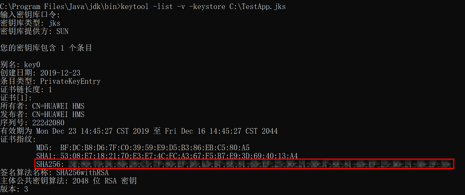
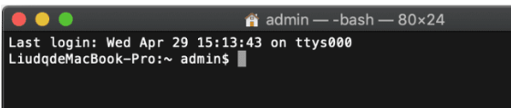
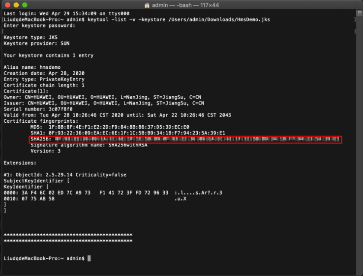

# 1. 获取文件的sha1或sha256

[参考华为文档](https://developer.huawei.com/consumer/cn/doc/development/HMSCore-Guides-V5/android-config-agc-0000001050170137-V5#ZH-CN_TOPIC_0000001086920730__section9471122085218)

## 1.1. 前提条件

在生成签名证书指纹前需要满足以下两个条件：

* 已创建应用程序的签名证书，签名证书创建请参见生成签名证书。
* 当前PC已经安装JDK。

## 1.2. Windows

执行 CMD 命令打开命令行工具，执行 `cd` 命令进入 `keytool.exe` 所在的目录（以下样例为 JDK 安装在 C 盘的 Program Files 目录）。

```cmd
cd C:\Program Files\Java\jdk\bin
```

执行命令 `keytool -list -v -keystore <keystore-file>`，按命令行提示进行操作。`<keystore-file>` 为应用签名证书的完整路径。

例如：

```cmd
keytool -list -v -keystore C:\TestApp.jks
```

根据结果获取对应的SHA256指纹。



## 1.3. macOS

打开 Terminal 终端。



执行命令 `keytool -list -v -keystore <keystore-file>` ，按命令行提示进行操作。`<keystore-file>` 为应用签名证书的完整路径。
例如：

```cmd
keytool -list -v -keystore /Users/admin/Downloads/HmsDemo.jks
```

根据结果获取对应的SHA256指纹:




