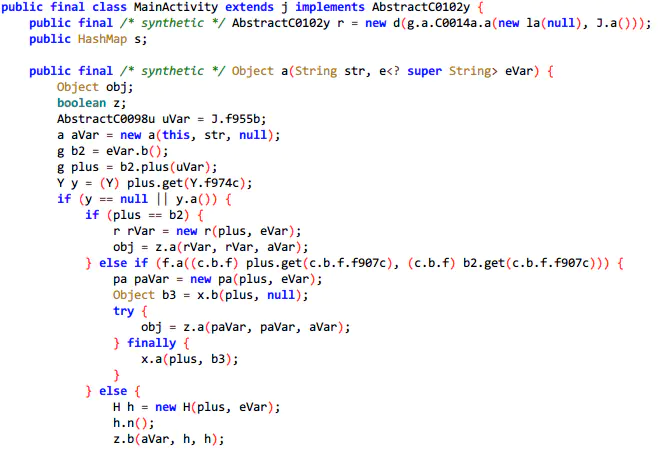

# 1. 7-代码混淆

[原文：《从害怕到真香警告——Android代码混淆大法真是好！》](https://www.jianshu.com/p/6e0d3555df8a)

## 1.1. 引言

Android 代码混淆，老生常谈了，不过大部分 Android 仔对它的认识可能还处于这样的阶段(比如：写这篇文章前的我)：

* 日常开发 Debug 包时不用混淆，正式发布 Release 包前开启代码混淆；
* 混淆好处：
    * 类、方法、变量名变成短且无意义的名字，提高反编译后代码的阅读成本；
    * 删除无用的类、方法与属性，缩减了APK包的大小；
    * 对字节码进行优化，移除无用指令，应用运行更快；
* 怎么混淆
    * 主项目的 build.gradle 设置 `minifyEnabled true`，
    * proguard-rules.pro 加入混淆规则；
* 混淆规则哪里来
    * 网上搜索通用混淆模板复制粘贴，项目依赖到的第三方库官方文档复制粘贴；

大都止步于此，好一点的还知道下 ProGuard 听过 R8，了解`混淆配置语法`，会`自定义混淆规则`。

会上面这些，日常开发已经很够用了，但是现在IT行业这么 "卷"，面试时，面试官问下："混淆具体做了啥？有看过混淆源码吗？说下底层原理..."，也说得过去吧 

所以本节稍微深入点探索下 Android 中的代码混淆~

## 1.2. 日常使用

### 1.2.1. 混淆前后的APK对比

#### 1.2.1.1. 新建项目，并实现基础代码

新建项目，引下 Kotlin 相关依赖，协程等 ( app 层级的 build.gradle)：

```groovy
dependencies {
    implementation fileTree(dir: "libs", include: ["*.jar"])
    implementation "org.jetbrains.kotlin:kotlin-stdlib:$kotlin_version"
    implementation 'androidx.core:core-ktx:1.3.0'
    implementation 'androidx.appcompat:appcompat:1.1.0'
    implementation 'androidx.constraintlayout:constraintlayout:1.1.3'
    implementation 'org.jetbrains.kotlinx:kotlinx-coroutines-core:1.3.7'
    implementation 'org.jetbrains.kotlinx:kotlinx-coroutines-android:1.3.7'
}
```

新建 MainActivity.kt，请求 URL，加载内容：

```java
class MainActivity : AppCompatActivity(), CoroutineScope by MainScope()  {
    override fun onCreate(savedInstanceState: Bundle?) {
        super.onCreate(savedInstanceState)
        setContentView(R.layout.activity_main)
        et_url.setText("https://www.baidu.com")
        bt_load.setOnClickListener {
            launch {
                tv_content.text = "开始加载请求..."
                tv_content.text = "加载完毕，网页内容如下：\n\n\n ${loadUrl(et_url.text.toString())}"
            }
        }
    }

    private suspend fun loadUrl(url: String) = withContext(Dispatchers.IO) {
        var content = ""
        (URL(url).openConnection() as HttpURLConnection).apply {
            requestMethod = "GET"
            content = dealResponse(inputStream)
            disconnect()
        }
        return@withContext content
    }

    private fun dealResponse(inputStream: InputStream): String {
        val reader = BufferedReader(InputStreamReader(inputStream))
        return StringBuffer().apply {
            var str = reader.readLine()
            while (null != str) {
                append(str)
                str = reader.readLine()
            }
        }.toString()
    }

    override fun onDestroy() {
        super.onDestroy()
        cancel()
    }
}
```

运行下看看：


#### 1.2.1.2. 配置项目 gradle 文件

app 层级的 build.gradle 加下 release 的签名和编译配置：

```groovy
signingConfigs {
    release {
        storeFile file('test.jks')
        storePassword '123456'
        keyAlias 'test'
        keyPassword '123456'
    }
}

buildTypes {
    release {
        // 启用代码压缩、优化及混淆
        minifyEnabled true
        // 启用资源压缩，需配合 minifyEnabled=true 使用
        shrinkResources true
        // 指定混淆保留规则
        proguardFiles getDefaultProguardFile('proguard-android-optimize.txt'), 'proguard-rules.pro'
        // 包签名
        signingConfig signingConfigs.release
    }
}
```

#### 1.2.1.3. 查看 debug 包

执行 `gradle assemble` 打下包，静待打包完毕，先看看Debug包：


把APK直接拖到反编译工具 jadx-gui 里，看代码无压力：


#### 1.2.1.4. 查看 release 包

再康康Release包：


体积着实少了一些，而且变量名都变成了abcd。


同样拖到 jadx-gui 里康康：



可读性明显降低~

#### 1.2.1.5. 补充：Proguard mappings

顺带提下这个 `Load Proguard mappings` ，点击加载混淆文件( mapping.txt )后可以去掉代码混淆：


### 1.2.2. 混淆后的 Crash 日志定位

不知道你有没有想过：混淆后的 APK 如果报错，日志信息会是怎样的呢？


改下代码验证下，直接在点击处抛出一个空指针异常试试康：


单凭这里的 b.b.a.a.onClick(Unknow Srouce:2)，似乎很难直接定位到错误代码的真实位置。

一种低效的解决方法：自行对照混淆后生成的 mapping.txt 文件，比如直接搜上面的 b.b.a.a：


顺着往下看不难发现问题所在，但日常开发不建议用此法，这里好找只是因为示例代码简单，推荐另一种方法：`去混淆`。

#### 1.2.2.1. GooglePlay 去混淆

如果你的应用有发布到 Google Play 的话，可以照着官方文档走：[对崩溃堆栈轨迹进行去混淆处理或符号化解析](https://support.google.com/googleplay/android-developer/answer/6295281?hl=zh-cn)


#### 1.2.2.2. proguardgui 去混淆

没有上传到 Google Play 也没关系，直接用 android-sdk/tools/proguard/bin/proguardgui.bat


ProGuard 和 R8 的混淆都可以去，老版本的脚本可能不支持 R8 ，更新下 sdk 即可，使用流程如下图所示：


去混淆前后对比：


注意，Mac 上的 proguard-gui 和上面的略有区别，以下为 mac 中 sdk 目录截图及其运行方式：


然后打开终端，切换到上图中的 bin 目录，然后在终端中输入 `./proguardgui.sh` 即可运行该程序。

日常使用就讲到这里，接着过一下混淆的详细规则。

## 1.3. 混淆规则详解

### 1.3.1. 混淆设置参数

-|-
---|---
`-optimizationpasses 5`  |     # 代码混淆的压缩比例，值介于0-7，默认5
`-verbose`                          |     # 混淆时记录日志
`-dontoptimize`                 |     # 不优化输入的类文件
`-dontshrink`                     |    # 关闭压缩
`-dontpreverify`                |    # 关闭预校验(作用于Java平台，Android不需要，去掉可加快混淆)
`-dontoptimize`                 |     # 关闭代码优化
`-dontobfuscate`                |    # 关闭混淆
`-ignorewarnings`              |    # 忽略警告
`-dontwarn com.squareup.okhttp.**`      |   # 指定类不输出警告信息
`-dontusemixedcaseclassnames`               |   # 混淆后类型都为小写
`-dontskipnonpubliclibraryclasses`      |   # 不跳过非公共的库的类
`-printmapping mapping.txt`                   |   # 生成原类名与混淆后类名的映射文件mapping.txt
`-useuniqueclassmembernames`                 |   # 把混淆类中的方法名也混淆
`-allowaccessmodification`                     |   # 优化时允许访问并修改有修饰符的类及类的成员
`-renamesourcefileattribute SourceFile`           |   # 将源码中有意义的类名转换成SourceFile，用于混淆具体崩溃代码
`-keepattributes SourceFile,LineNumberTable`  |   # 保留行号
`-keepattributes *Annotation*,InnerClasses,Signature,EnclosingMethod` |  # 避免混淆注解、内部类、泛型、匿名类
`-optimizations !code/simplification/cast,!field/ ,!class/merging/`     |  # 指定混淆时采用的算法

### 1.3.2. 保持不被混淆的设置

#### 1.3.2.1. 语法组成：

```
[保持命令] [类] {
    [成员]
}
```

#### 1.3.2.2. 保持命令：

-|-
---|---
`-keep`                                       |  # 防止类和类成员被移除或被混淆；
`-keepnames`                              |  # 防止类和类成员被混淆；
`-keepclassmembers`                  |  # 防止类成员被移除或被混淆；
`-keepclassmembernames`           |   # 防止类成员被混淆；
`-keepclasseswithmembers`        |  # 防止拥有该成员的类和类成员被移除或被混淆；
`-keepclasseswithmembernames` |   # 防止拥有该成员的类和类成员被混淆；

#### 1.3.2.3. 类：

除了具体的类，还有如下内容：

-|-
---|---
访问修饰符   | public、private、protected
通配符(`*`) |  匹配任意长度字符，但不包含包名分隔符( `.`)
通配符(`**`) | 匹配任意长度字符，且包含包名分隔符(`.`)
extends        | 匹配实现了某个父类的子类
implements  | 匹配实现了某接口的类
`$` | 内部类

#### 1.3.2.4. 成员：

-|-
---|---
匹配所有构造器  | `<init>`
匹配所有域        | `<field>`
匹配所有方法     | `<methods>`
访问修饰符        | public、private、protected
`...`              |  匹配任意长度的任意类型参数，如 `void test(...)` 可以匹配不同参数个数的test方法

除了 `*` 和 `**` 通配符外，还支持 `***` 通配符，匹配任意参数类型

#### 1.3.2.5. 常用自定义混淆规则范例

```groovy
# 不混淆某个类的类名，及类中的内容
-keep class cn.coderpig.myapp.example.Test { *; }

# 不混淆指定包名下的类名，不包括子包下的类名
-keep class cn.coderpig.myapp*

# 不混淆指定包名下的类名，及类里的内容
-keep class cn.coderpig.myapp* {*;}

# 不混淆指定包名下的类名，包括子包下的类名
-keep class cn.coderpig.myapp**

# 不混淆某个类的子类
-keep public class * extends cn.coderpig.myapp.base.BaseFragment

# 不混淆实现了某个接口的类
-keep class * implements cn.coderpig.myapp.dao.DaoImp

# 不混淆类名中包含了"entity"的类，及类中内容
-keep class **.*entity*.** {*;}

# 不混淆内部类中的所有public内容
-keep class cn.coderpig.myapp.widget.CustomView$OnClickInterface {
    public *;
}

# 不混淆指定类的所有方法
-keep cn.coderpig.myapp.example.Test {
    public <methods>;
}

# 不混淆指定类的所有字段
-keep cn.coderpig.myapp.example.Test {
    public <fields>;
}

# 不混淆指定类的所有构造方法
-keep cn.coderpig.myapp.example.Test {
    public <init>;
}

# 不混淆指定参数作为形参的方法
-keep cn.coderpig.myapp.example.Test {
    public <methods>(java.lang.String);
}

# 不混淆类的特定方法
-keep cn.coderpig.myapp.example.Test {
    public test(java.lang.String);
}

# 不混淆native方法
-keepclasseswithmembernames class * {
    native <methods>;
}

# 不混淆枚举类
-keepclassmembers enum * {
  public static **[] values();
  public static ** valueOf(java.lang.String);
}

#不混淆资源类
-keepclassmembers class **.R$* {
    public static <fields>;
}

# 不混淆自定义控件
-keep public class * entends android.view.View {
    *** get*();
    void set*(***);
    public <init>;
}

# 不混淆实现了Serializable接口的类成员，此处只是演示，也可以直接 *;
-keepclassmembers class * implements java.io.Serializable {
    static final long serialVersionUID;
    private static final java.io.ObjectStreamField[] serialPersistentFields;
    private void writeObject(java.io.ObjectOutputStream);
    private void readObject(java.io.ObjectInputStream);
    java.lang.Object writeReplace();
    java.lang.Object readResolve();
}

# 不混淆实现了parcelable接口的类成员
-keep class * implements android.os.Parcelable {
    public static final android.os.Parcelable$Creator *;
}

# 注意事项：
# 
# ① jni方法不可混淆，方法名需与native方法保持一致；
# ② 反射用到的类不混淆，否则反射可能出问题；
# ③ 四大组件、Application子类、Framework层下的类、自定义的View默认不会被混淆，无需另外配置；
# ④ WebView的JS调用接口方法不可混淆；
# ⑤ 注解相关的类不混淆；
# ⑥ GSON、Fastjson等解析的Bean数据类不可混淆；
# ⑦ 枚举enum类中的values和valuesof这两个方法不可混淆(反射调用)；
# ⑧ 继承Parceable和Serializable等可序列化的类不可混淆；
# ⑨ 第三方库或SDK，请参考第三方提供的混淆规则，没提供的话，建议第三方包全部不混淆；
```

### 1.3.3. 混淆规则的叠加

不知道你有没有想过：上面日常使用的创建的代码示例，`proguard-rules.pro` 没有配置混淆规则，却混淆了？

其实是因为**混淆规则是叠加的**，而**混淆规则的来源不止主模块里的 `proguard-rules.pro`**，还有这些：

* ① `<module-dir>/proguard-rules.pro`
    * 不止主模块有 `proguard-rules.pro`，子模块也可以有，因为规则是叠加的，故某个模块的配置都可能影响其它模块。

* ② `proguard-android-optimize.txt`
    * AGP 编译时生成，其中包含了对大多数 Android 项目都有用的规则，并且启用 `@Keep*` 注解。
    * AGP 提供的规则文件还有 proguard-defaults.txt 或 proguard-android.txt，可通过 `getDefaultProguardFile` 进行设置，不过建议还是使用这个文件(多了些优化配置)。

* ③ `<module-dir>/build/intermediates/proguard-rules/debug/aapt_rules.txt`
    * 自动生成，AAPT2 会根据对应用清单中的类、布局及其他应用资源的引用，生成保留规则，如不混淆每个Activity。

* ④ AAR库 `<library-dir>/proguard.txt`
* ⑤ Jar库 `<library-dir>/META-INF/proguard/`
    * 如果想查看所有规则 叠加后的混淆规则，可在主目录的 `proguard-rules.pro` 添加下述配置：

```
# 2. 输出所有规则叠加后的混淆规则
-printconfiguration ./build/outputs/mapping/full-config.txt
```

### 1.3.4. 资源压缩

资源压缩其实分为两步：资源合并 与 资源移除。

#### 1.3.4.1. 资源合并

资源合并时，无论是否配置 `shrinkResources true`，AGP 构建 APK 时都会执行，**当存在两个或更多名称相同的资源才会进行资源合并，AGP 会从重复项中选择 优先级更高 的文件，并只将此资源传递给 AAPT2，以供在APK中分发**。

级联优先顺序（从低到高）：**依赖项 → 主资源 → 渠道 → 构建类型**

比如：重复资源存在于主资源及渠道中，Gradle 会选择渠道中的资源； 但如果重复资源在同一层次出现，如 src/main/res/ 和 src/main/res2 中有重复资源，Gradle 就会报资源合并错误。

对应打包 Task 中的 `processDebugResources`，将 aapt 编译后的 flat 产物和合并后的清单文件进行链接处理生成 `._ap` 文件(包含资源文件、清单文件、资源关系映射表文件 resources.arsc ) 及 R.java 文件(保存了资源类型、资源名称及地址的映射关系)。

#### 1.3.4.2. 资源移除

说完资源合并，接着说下资源移除，开启资源压缩后，**所有未被使用的资源默认会被移除**.

如果你想定义那些资源需要保留，可以在 res/raw/ 路径下创建一个xml文件，如 keep.xml，配置示例如下 (此文件不会打包到 APK 中，支持通配符 `*，`此类文件可有多份)：

```xml
<?xml version="1.0" encoding="utf-8"?>
<resources xmlns:tools="http://schemas.android.com/tools"
    <!-- 定义哪些资源要被保留 -->
    tools:keep="@layout/l_used*_c,@layout/l_used_a,@layout/l_used_b*"
    <!-- 定义哪些资源需要被移除 -->
    tools:discard="@layout/unused2"
    <!-- 开启严格模式，可选值strict,safe，前者严格按照 keep 和 discard 指定的资源保留 -->
    <!-- 后者保守删除未引用资源，如代码中使用 Resources.getIdentifier() 引用的资源会保留 -->
    tools:shrinkMode="strict"/>
```

另外，还可以在 build.gradle 中添加 resConfigs 来移除不需要的备用资源文件，如只保留中文：

```
android {
    ...
    defaultConfig {
        resConfigs "zh-rCN" // 不用支持国际化只需打包中文资源
    }
}
```

## 1.4. 从脱糖引出ProGuard、DX、D8、R8

我们都知道 Java 是跨平台的，一次编译，到处运行，同一套 Java 代码可以在 Windows、Linux、Mac 上运行，背后依赖于不同平台/版本的 JVM（Java 虚拟机），Java 代码编译后生成 `.class` 字节码文件，再由 JVM 翻译成特定平台的机器码，然后运行。

JVM 的内部组成图如下：


* 类加载器：加载编译后的 `.class`，链接、检测损坏的字节码，定位并初始化静态变量及静态代码；
* 运行时数据：栈、堆、方法变量等；
* 执行引擎：执行已经加载的代码、清理生成的所有垃圾(gc)；

运行程序时，`Interpreter(解释器)` 会将字节码解释为机器码然后运行，当发现有重复执行的代码时，会切换为 JIT 编译器。`JIT` 编译器会将重复的代码编译为本地机器码，当同样的方法被调用时，直接运行本地机器码，从而提高系统性能。


JVM 的设计是面向无限电量/存储的设备，Android 设备与之相比，太弱鸡了(电量、内存大小、存储等小的可怜)。

不能直接使用，于是 Google 自己设计了一套用于 Android 平台的 Java 虚拟机——Dalvik，支持已转换为 `.dex (Dalvik Executable) ` 压缩格式的 Java 应用程序的运行。

**与 JVM 字节码基于栈不同，Dalvik 基于寄存器(变量都存储在寄存器中)，后者更加高效且需要更少的空间。**

`.java` 和 `.kt` 代码文件被 Java、Kotlin 编译器协作编译为 `.class` ，而后编译为 `.dex` 文件，最后打包到 `.apk` 文件中。

把 APK 安装到设备上，当点击应用图标时，系统会启动一个新的 Dalvik 进程，并将应用包含的 dex 代码加载进来，在运行时交由 Interpreter 或 JIT 编译，然后就可以看到应用的界面了：


在 Dalvik 中，**应用的每次运行都需要执行编译操作，而这段时间是计入程序的执行时间，所以程序的启动速度会有点慢，当然也有好处， 应用安装速度快**。

在 Android 4.4.4 后，Google 开始引入 Dalvik 的替代品——`ART`，从 `JIT(Just In Time，即时编译)` 到 `AOT (Ahead-Of-Time，预编译)`，应用在首次安装时用 dex2oat 将 `dex` 编译为 `.oat` 二进制文件。


点击应用图标启动时，ART 直接加载 `.oat` 文件并运行，启动速度明显提升，**避免了重复编译，减少了CPU的使用频率，也降低了功耗**，当然缺点也是有的：**更长的应用安装时间 和 更大的存储空间占用**。

除了应用安装会触发 dex2oat 编译外，OTA 升级、系统启动(首次/非首次)、系统空闲时也可能会触发，具体要看对应系统的配置。

上面说过 Android 虚拟机采用 **基于寄存器的指令集(opcodes)**，这样会存在一个问题，更高版本 Java 新引入的语法特性不能在上面直接使用。为了让我们能使用上 Java 8 的特性，Google 使用 Transformation 来增加了一步编译过程, 这就是 `脱糖(desugaring)`。

当使用当前 Android 版本不支持的高版本 jdk 语法时，在编译期转换为其支持的低版本 jdk 语法。

脱糖实现的大概发展历程如下：


至此，相信你对 ProGuard、DX、D8 和 R8 在混淆过程中起的作用有了一个基础的认知.

## 1.5. 用 ProGuard 还是 R8

如果没有历史包袱，直接 R8，毕竟兼容绝大部分的 ProGuard 规则，更快的编译速度，对 Kotlin 更友好。

### 1.5.1. Proguard 和 R8 对比

还是简单对比下两者吧：

-|-
---|---
ProGuard | 压缩、优化和混淆 Java 字节码文件的免费工具，开源仓库地址：[proguard](https://github.com/Guardsquare/proguard)
R8 |  ProGuard 的替代工具，支持现有 ProGuard 规则，更快更强，AGP 3.4.0 或更高版本，默认使用 R8 混淆编译器。

如果不想用 R8，想用回 ProGuard 的话(可以但没必要)，可以在 gradle.properties 文件中添加下述配置禁用 R8：

```
android.enableR8=false
android.enableR8.libraries=false
```

但这样在编译 APK 时可能会报错：


在 proguard-rules.pro 文件中加上 `-ignorewarnings` 即可解决。

### 1.5.2. 输出文件

另外，使用 ProGuard 或 R8 构建项目会在 `build\outputs\mapping\release` 输出下述文件：

-|-
---|---
mapping.txt | 原始与混淆过的类、方法、字段名称间的转换；
seeds.txt | 未进行混淆的类与成员；
usage.txt | APK中移除的代码；
resources.txt | 资源优化记录文件，哪些资源引用了其他资源，哪些资源在使用，哪些资源被移除；

注意：上述文件不一定都有，R8 可以在 proguard-rules.pro 文件添加下述配置输出对应文件，如下：

```groovy
# 输出mapping.txt文件
-printmapping ./build/outputs/mapping/mapping.txt

# 输出seeds.txt文件
-printseeds ./build/outputs/mapping/seeds.txt

# 输出usage.txt文件
-printusage ./build/outputs/mapping/usage.txt
```

## 1.6. D8干了啥

不知道细心你的有没有发现，D8 竟在 r8 的包里：


接着在 `TaskManager.java` 搜下 D8，经过各种跳转，来到源头：`createPostCompilationTasks()`，可以看到在创建 D8 相关的 Transform 前还做了一些其他的操作~


### 1.6.1. R8 - 执行前

从注释不难看出，这些 Tasks 就是用来把 `.class` 转 dex 文件的，还加了一些可选步骤如混淆、jacoco(代码覆盖率工具)，还创建了一个 TransformManager 实例，用来管理各种 TransformManager。继续：


这里引起了我的好奇，可能创建脱糖Task？脱糖不是在D8里进行的吗？跟一下代码：


这里的 DESUGAR，猜测是旧版本的 D8 兼容，AS 3.0 引入的，而现在默认是 D8，所以这里其实不会创建脱糖 Task。继续：


获取外部扩展，合并 Java 资源，对合并算法感兴趣的可以点进去 `MergeJavaResourcesTransform.transform()` 看下，这里不展开讲~


继续往下走：


### 1.6.2. Java代码压缩

再往下走，就碰到关键词 R8 了：


这里有下述三个 maybe：

* maybeCreateJavaCodeShrinkerTransform → Java代码压缩
* maybeCreateResourcesShrinkerTransform → 资源压缩
* maybeCreateDexSplitterTransform → dex分割

先看第一个：


这里区分PROGUARD和R8，创建不同的混淆TransformTask，关注 `createR8Transform()` 核心代码如下：

```java
// 前面获取dex的文件列表、混淆列表等，初始化R8Transform实例时传入
R8Transform transform =
        new R8Transform(
                variantScope,
                userMainDexListFiles,
                userMainDexListProguardRules,
                inputProguardMapping,
                variantScope.getOutputProguardMappingFile());

// 处理混淆规则，callback用于在混淆后执行后续操作
return applyProguardRules(
        variantScope,
        inputProguardMapping,
        variantScope.getOutputProguardMappingFile(),
        testedVariantData,
        transform,
        callback);
```

跟下 `applyProguardRules()`，关注下述核心代码(前面的是和测试相关的)：

```java
// This is a "normal" variant in an app/library.
applyProguardConfigForNonTest(transform, variantScope);
```

跟下此方法：


补充其他混淆规则的来源，如 AAPT 生成的混淆文件，判断如果是 AAR 的话，直接 keep 。


跟下 `R8Transform.transform()`，又是参数，最后调用下述方法：


最后在 `r8Tool.kt` 中定位到了此方法，核心代码如下：

```java
// 初始化了一个r8CommandBuilder实例
val r8CommandBuilder = CompatProguardCommandBuilder(!useFullR8, D8DiagnosticsHandler(messageReceiver))

// 然后调用一系列方法，如混淆相关
addMainDexRules()
setMainDexListConsumer()
addProguardConfigurationFiles()
addProguardConfiguration()
setProguardMapOutputPath()

// 配置相关：是否禁用缩小、摇树、脱糖、编译模式
setDisableMinification(toolConfig.disableMinification)
setDisableTreeShaking(toolConfig.disableTreeShaking)
setDisableDesugaring(toolConfig.disableDesugaring)
setMode(compilationMode)
setProgramConsumer(programConsumer)
...

// 初始化r8ProgramResourceProvider实例，用来给R8提供所有资源
val r8ProgramResourceProvider = R8ProgramResourceProvider()

// 各种传参设置

// 最后调用R8.run()
ClassFileProviderFactory(libraries).use { libClasspath ->
    r8CommandBuilder.addLibraryResourceProvider(libClasspath.orderedProvider)
    R8.run(r8CommandBuilder.build())
}
```

具体的逻辑，可以追溯到 `R8.class → run()`，做了这些事：

* 代码删除：通过语法树静态分析技术、发现并删除未使用的代码，如未实例化的 Class 等；
* 代码优化：对运行时代码进行优化，删除死代码、未使用的参数，选择性内联、类合并等；
* 代码混淆：优化标识符名字，减少代码量，会判断混淆规则中是否允许修改标识符名字；
* 行号重新映射 等。

短短 333 行的处理代码，逻辑复杂，恐怖如斯，感兴趣的自己看吧，我是啃不动了...

### 1.6.3. 资源压缩

接着跟下第二个 `maybeCreateResourcesShrinkerTransform()`：


跟下 `ShrinkResourcesTransform.transform()`，


跟下 `SplitterRunnable.run()`，看下具体是怎么压缩资源的，核心代码如下：

```java
// ① 创建资源优化记录文件
File reportFile = null;
if (params.mappingFile != null) {
    File logDir = params.mappingFile.getParentFile();
    if (logDir != null) {
        reportFile = new File(logDir, "resources.txt");
    }
}

// ② 分析资源及使用情况
analyzer.analyze();

// ③ 重写.ap_文件(上面AAPT2生成的)，去掉没有用到的资源，实际上是没有删除本地资源的！
analyzer.rewriteResourceZip(params.uncompressedResourceFile, params.compressedResourceFile);

// ③ 导出统计数据
```

解压 AAPT 生成的 `.ap_` 文件，然后判断是是否为未使用资源，是的话移除，感兴趣可以跟下 `rewriteResourceZip()`。

### 1.6.4. 调D8拆Dex

只有使用了 Multidex 才会走这里，跟下代码：


跟下 `DexSplitterTransform.transform()`


跟下 `DexSplitterTool.Builder`


跟下 `DexSplitter.run()`


跟下 `DexSplitterHelper.run()`


所以最后还是用的 D8 打 Dex，总算把大概的过程过完了~


## 1.7. 自定义混淆字典

之前在反编译人家的 APP 时看到标识符竟然不是 abcd，而是中文和特殊字符，怎么做到的呢？其实不难，自定义一个混淆字典就好，在 app 的 `proguard-rules` 的同级目录创建一个文件，比如 dictionary，内容示例如下：

```groovy
﹢
﹣
×
÷
...太长省略
```

接着在 `proguard-rule`s 添加下述配置：

```groovy
-obfuscationdictionary ./dictionary
-classobfuscationdictionary ./dictionary
-packageobfuscationdictionary ./dictionary
```

再接着 `gradle assemble` 打下包，用 jadx 打开生成的 Release APK 看看：


## 1.8. 模块化混淆

混淆的开启由 app 模块控制，与子模块无关。

建议在 app 模块设置公共混淆规则，子模块设置专属混淆规则，子模块区分 project 和 aar：

```groovy
# Project类型，配置方法同app模块
buildTypes {
    release {
        minifyEnabled false
        proguardFiles getDefaultProguardFile('proguard-android.txt'), 'proguard-rules.pro'
    }
}

# AAR类型
android {
    defaultConfig {
        consumerProguardFiles 'lib-proguard-rules.txt'
    }
    ...
}
```

当然，你想让混淆规则都由 app 模块控制也是可以的，移除模块时记得删掉对应的混淆就好~

## 1.9. 视频学习资源

* [让app瘦到极致的微信资源文件混淆原理](https://www.bilibili.com/video/BV1Bf4y1977A?share_source=copy_web)
* [字节码插桩技术实现自动化方法耗时记录](https://www.bilibili.com/video/BV1Qy4y1y7ZM?share_source=copy_web)

## 1.10. 补充：

以下内容摘自 ：[Android代码混淆&组件化混淆方案](https://www.jianshu.com/p/18a11d175860)

关于 consumerProguardFiles 和 proguardFiles 的区别，网上查了下，没有一个说的清楚点的，求人不如求己，在经过我的实践之后，我总结了有以下几个区别，感兴趣的也可以自己实践下，看看我说的对不对：

* consumerProguardFiles 配置的 proguard 会被打进 aar 包中，而 proguardFiles 配置的 proguard 不会被打进 aa r中
* proguardFiles 配置的 proguard 文件只作用于库文件代码，只在编译发布 aar 的时候有效，在你将库文件作为一个模块添加到 App 模块中后，库文件中consumerProguardFiles 配置的 proguard 文件则会追加到 app 模块的 Proguard 配置文件中，作用于整个 app 代码。
