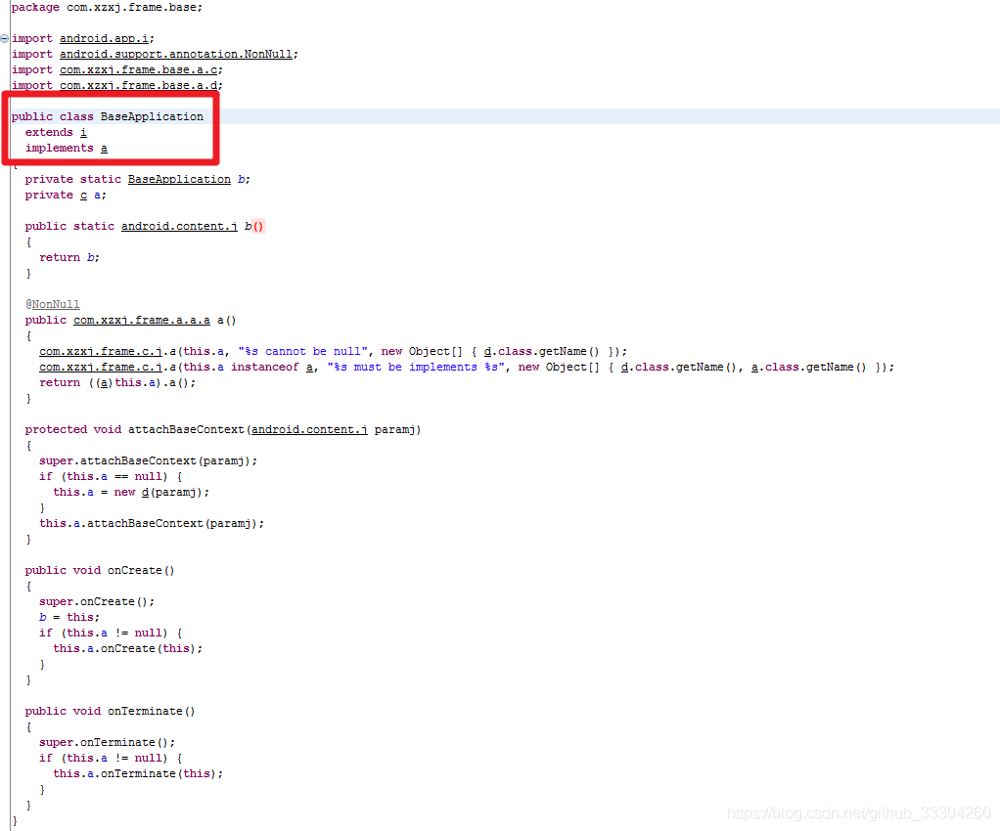
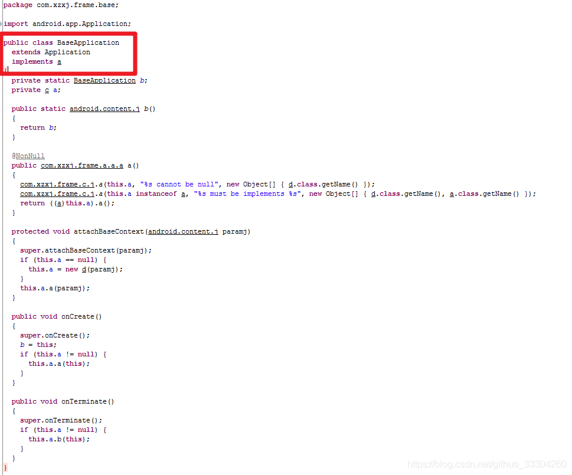
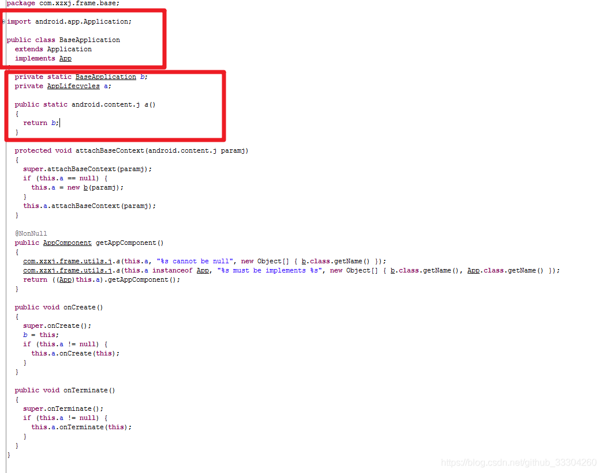
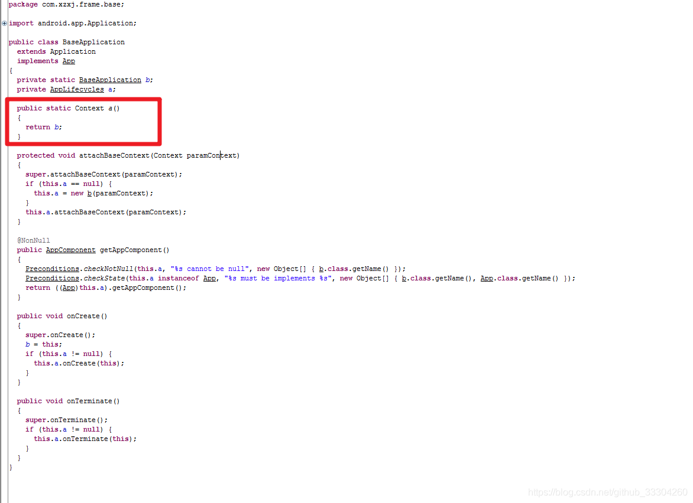

# 1. 8-混淆问题排查

[原文：《Android 混淆问题排查》](https://blog.csdn.net/github_33304260/article/details/85269844)

## 1.1. 问题

近期在开发过程中，突然出现混淆后程序出现运行时异常，编译是正常的，不混淆也是正常的，错误信息如下提示

```
12-07 14:10:27.056 10603-10603/? E/AndroidRuntime: FATAL EXCEPTION: main
    java.lang.RuntimeException: Unable to instantiate application com.xzxj.frame.base.BaseApplication: java.lang.ClassCastException: com.xzxj.frame.base.BaseApplication cannot be cast to android.app.Application
        at android.app.LoadedApk.makeApplication(LoadedApk.java:587)
        at android.app.ActivityThread.handleBindApplication(ActivityThread.java:4891)
        at android.app.ActivityThread.-wrap1(ActivityThread.java)
        at android.app.ActivityThread$H.handleMessage(ActivityThread.java:1530)
        at android.os.Handler.dispatchMessage(Handler.java:111)
        at android.os.Looper.loop(Looper.java:207)
        at android.app.ActivityThread.main(ActivityThread.java:5692)
        at java.lang.reflect.Method.invoke(Native Method)
        at com.android.internal.os.ZygoteInit$MethodAndArgsCaller.run(ZygoteInit.java:888)
        at com.android.internal.os.ZygoteInit.main(ZygoteInit.java:749)
     Caused by: java.lang.ClassCastException: com.xzxj.frame.base.BaseApplication cannot be cast to android.app.Application
        at android.app.Instrumentation.newApplication(Instrumentation.java:1001)
        at android.app.Instrumentation.newApplication(Instrumentation.java:986)
        at android.app.LoadedApk.makeApplication(LoadedApk.java:582)
        at android.app.ActivityThread.handleBindApplication(ActivityThread.java:4891) 
        at android.app.ActivityThread.-wrap1(ActivityThread.java) 
        at android.app.ActivityThread$H.handleMessage(ActivityThread.java:1530) 
        at android.os.Handler.dispatchMessage(Handler.java:111) 
        at android.os.Looper.loop(Looper.java:207) 
        at android.app.ActivityThread.main(ActivityThread.java:5692) 
        at java.lang.reflect.Method.invoke(Native Method) 
        at com.android.internal.os.ZygoteInit$MethodAndArgsCaller.run(ZygoteInit.java:888) 
        at com.android.internal.os.ZygoteInit.main(ZygoteInit.java:749)
```

## 1.2. 思路

* 通过上面的错误信息首先会去排查 AndroidManifest.xml 文件是否注册了Appliction，发现都是注册好的。
* 考虑到关闭混淆正常，开启混淆异常，那么就定位到时混淆的问题
* 既然是混淆问题那就查看混淆配置文件 `proguard-rules.pro`，基本的配置都已经防混淆了
* 接下来的思路就是通过反编译来查看 BaseApplication 到底出了啥额问题

## 1.3. 过程

### 1.3.1. 第一步

我们看到下面反编译的代码



我们的 BaseApplication 继承的 application 被混淆了

那么在 `proguard-rules.pro` 中加入一句 `-keep class android.app.**{*;}`

运行后报错如下：

```
12-10 15:16:07.442 15939-15939/? E/AndroidRuntime: FATAL EXCEPTION: main
    java.lang.VerifyError: Rejecting class com.xzxj.frame.base.BaseApplication because it failed compile-time verification (declaration of 'com.xzxj.frame.base.BaseApplication' appears in /data/app/com.xzxj-1/base.apk:classes2.dex)
        at java.lang.Class.newInstance(Native Method)
        at android.app.Instrumentation.newApplication(Instrumentation.java:1001)
        at android.app.Instrumentation.newApplication(Instrumentation.java:986)
        at android.app.LoadedApk.makeApplication(LoadedApk.java:582)
        at android.app.ActivityThread.handleBindApplication(ActivityThread.java:4891)
        at android.app.ActivityThread.-wrap1(ActivityThread.java)
        at android.app.ActivityThread$H.handleMessage(ActivityThread.java:1530)
        at android.os.Handler.dispatchMessage(Handler.java:111)
        at android.os.Looper.loop(Looper.java:207)
        at android.app.ActivityThread.main(ActivityThread.java:5692)
        at java.lang.reflect.Method.invoke(Native Method)
        at com.android.internal.os.ZygoteInit$MethodAndArgsCaller.run(ZygoteInit.java:888)
        at com.android.internal.os.ZygoteInit.main(ZygoteInit.java:749)
```

看到错误信息变化了，心里应该开心，看来离解决问题更近一步了。

### 1.3.2. 第二步



我们继续反编译，看到继承的接口还是有问题的，虽然感觉不是这个引起的但是强迫症，把接口防混淆，加入如下代码：

`-keep interface com.xzxj.frame.** { *; }`

### 1.3.3. 第三步

运行后依然是同样的错误信息，反编译后代码如下：



此时对比代码分析,应该是如下问题造成的，

混淆前：

```java
public static Context getBaseApplication() {
        return instance;
}
```

混淆后：

```java
public static j a(){
  return b;
}
```

看来 Context 也被混淆了，接下来在 `proguard-rules.pro` 中加入一句 `-keep class android.content.**{*;}`

### 1.3.4. 第四步：

接下来就是见证奇迹的时刻，果然运行正常，我们看一下混淆后的代码



## 1.4. 结论

综上，我们可以分析出来是我们的 android 包下面的文件都被混淆了，于是我们把 `-keep class android.content.**{*;}` 和 `-keep class android.app.**{*;}` 合二为一- `keep class android.**{*;}` 不过按照道理来讲这个不应该被混淆，系统会做处理，猜测可能是某个配置导致系统的一些配置失效，至于该工程为啥这么奇葩待后续分析。

所以以后遇到混淆的问题就按照提示一步一步排查，一定要反编译文件来分析问题，不然无法定位原因。

还有第一次混淆后建议反编译查看一下包里面的代码，有没有需要混淆的核心代码被 keep 掉了。