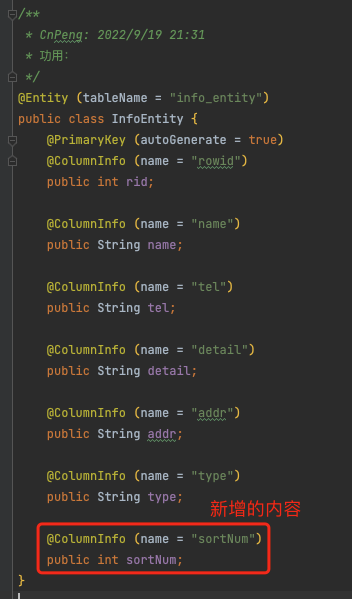
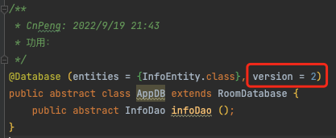
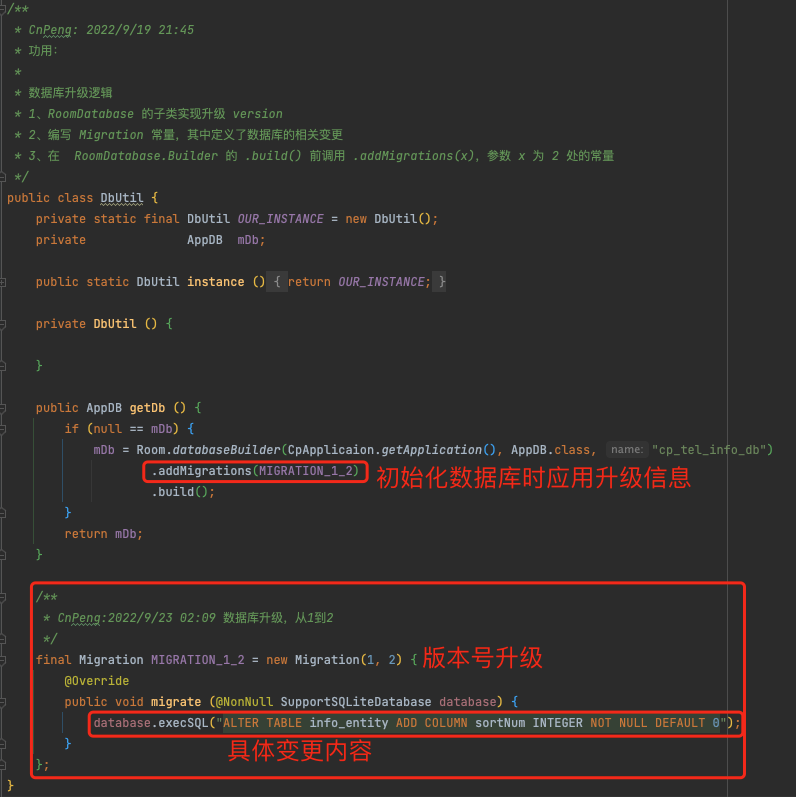

# 1. Room使用

## 1.1. 基础使用

Android 中的 Room 如何使用

Room 是 Android 中的一个持久化库，提供了一个抽象层，可以让开发者以更高效的方式访问 SQLite 数据库。以下是在 Android 中使用 Room 的步骤：

添加依赖项：在你的项目的 build.gradle 文件中添加以下依赖项：
Copy
dependencies {
    def room_version = "2.3.0"

    implementation "androidx.room:room-runtime:$room_version"
    annotationProcessor "androidx.room:room-compiler:$room_version" // For Kotlin use kapt instead of annotationProcessor
}
创建实体类：创建一个包含表列的实体类。
Copy
@Entity(tableName = "users")
data class User(
    @PrimaryKey val uid: Int,
    @ColumnInfo(name = "first_name") val firstName: String?,
    @ColumnInfo(name = "last_name") val lastName: String?
)
创建 DAO 接口：创建一个包含 SQL 查询的 DAO 接口。
Copy
@Dao
interface UserDao {
    @Query("SELECT * FROM users")
    fun getAll(): List<User>

    @Query("SELECT * FROM users WHERE uid IN (:userIds)")
    fun loadAllByIds(userIds: IntArray): List<User>

    @Query("SELECT * FROM users WHERE first_name LIKE :first AND " +
           "last_name LIKE :last LIMIT 1")
    fun findByName(first: String, last: String): User

    @Insert
    fun insertAll(vararg users: User)

    @Delete
    fun delete(user: User)
}
创建数据库类：创建一个继承自 RoomDatabase 的抽象类，并在其中包含 DAO 接口。
Copy
@Database(entities = arrayOf(User::class), version = 1)
abstract class AppDatabase : RoomDatabase() {
    abstract fun userDao(): UserDao
}
初始化数据库：在应用程序的 Application 类中，创建一个 AppDatabase 实例，并将其作为单例存储。
Copy
class MyApp : Application() {
    val database by lazy { AppDatabase.getDatabase(this) }
}
使用数据库：在应用程序中，通过调用 AppDatabase 实例的 DAO 方法来访问数据库。
Copy
val db = MyApp().database
val users = db.userDao().getAll()
以上是使用 Room 的基本步骤，更多详细信息可以参考官方文档。

## 1.2. 版本升级

