# 2、基本自定义构建

## 2.1 理解 Gradle 文件

AndroidStudio 创建一个新项目时，会默认生成三个 gradle 文件，其中 `setting.gradle` 和 `build.gradle` 位于项目根目录下，另一个 `build.gradle` 在 app 模块内，如下图：

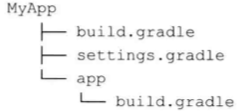	

### 2.1.1 settings 文件

对于只有一个模块的项目，其 `settings.gradle` 文件如下：

```java
rootProject.name='MyApp'
include ':app'
```

settings 文件在初始化阶段被执行，且定义了哪些模块应该包含在构建内。

单模块项目不一定需要 settings 文件，但是多模块项目必须要有 settings 文件，否则，Gradle 不知道哪些模块应包含在构建内。

Gradle 会为每个 settings 文件创建对象的 Settings 对象，并调用该对象的相关方法。

### 2.1.2 顶层构建文件

对于新建的项目，其根目录下的 `build.gradle` 内容如下：

```java
// Top-level build file where you can add configuration options common to all sub-projects/modules.
buildscript {
    repositories {
        google()
        jcenter() 
    }
    dependencies {
        classpath 'com.android.tools.build:gradle:3.6.3'
    }
}

allprojects {
    repositories {
        google()
        jcenter()
    }
}

task clean(type: Delete) {
    delete rootProject.buildDir
}
```

实际构建配置再 `buildscript` 代码块中。

* `repositories ` 指定了我们可用来下载依赖的函数库。
* `dependencies ` 则用户配置构建过程中的依赖包。也就是说，我们不能将模块或模块依赖的项目所使用的依赖包放在此处。通常情况下，这里只应该依赖 gradle 插件。
* `allprojects` 用于声明被所有模块使用的属性。也可以在其中创建应用于全部模块的任务。（除默认的函数库之外，尽量不再在此处声明依赖，耦合性太强。）

### 2.1.3 模块的构建文件

对于新建的项目，其 app 模块目录下的 `build.gradle` 的内容如下：

```java
apply plugin: 'com.android.application'

android {
    compileSdkVersion 29
    buildToolsVersion "29.0.2"

    defaultConfig {
        applicationId "com.cnpeng.myapp"
        minSdkVersion 21
        targetSdkVersion 29
        versionCode 1
        versionName "1.0"

        testInstrumentationRunner "androidx.test.runner.AndroidJUnitRunner"
    }

    buildTypes {
        release {
            minifyEnabled false
            proguardFiles getDefaultProguardFile('proguard-android-optimize.txt'), 'proguard-rules.pro'
        }
    }
}

dependencies {
    implementation fileTree(dir: 'libs', include: ['*.jar'])

    implementation 'androidx.appcompat:appcompat:1.1.0'
    implementation 'androidx.legacy:legacy-support-v4:1.0.0'
    implementation 'androidx.recyclerview:recyclerview:1.1.0'
    implementation 'com.google.android.material:material:1.1.0'
    testImplementation 'junit:junit:4.12'
    androidTestImplementation 'androidx.test.ext:junit:1.1.1'
    androidTestImplementation 'androidx.test.espresso:espresso-core:3.2.0'
}
``` 

其中的内容可以分为三部分：

* 插件
* Android 代码块
* 依赖项

#### 2.1.3.1 插件

插件 `apply plugin: 'com.android.application'` 表示这是一个可运行的程序模块。

#### 2.1.3.2 Android 代码块

该代码块包含了 Android 特有的配置项。这些配置之所以能生效，就是因为我们前面声明了  `apply plugin: 'com.android.application'`  插件。

#### 2.1.3.2.1 `compileSdkVersion` 和 `buildToolsVersion`

`compileSdkVersion` 和 `buildToolsVersion` 是必须要有的。

* `compileSdkVersion` 表示用来编译应用的 Android API 的版本
* `buildToolsVersion` 表示构建工具和编译器的版本。

> 构建工具包含命令行应用，如 aapt、zipalign、dx 和 renderscript，打包时调用这些应用可以生成各种中间产物。可以通过 SDK Manager 下载构建工具。

#### 2.1.3.2.2 `defaultConfig` 代码块

`defaultConfig` 代码块用于配置应用的核心属性。其中的属性可以覆盖 `AndroidManifest.xml` 中的内容。

* `applicationId` 覆盖了 `AndroidManifest.xml ` 中的 `package name`

> Android 在使用 Gradle 作为构建工具之前， `AndroidManifest.xml ` 中的 `package name` 有两个作用：作为应用的唯一标志，以及在 R 资源类中被用作包名。使用 Gradle 作为构建工具之后，`applicationId` 作为应用的唯一标志，而定义在 `AndroidManifest.xml ` 的 `package` 则用作 R 资源类的包名。 使用 `applicationId` 可以非常方便的让我们构建不同的 App 变体（variant）。

* `minSdkVersion` 用来配置运行应用的最小 API 等级
* `targetSdkVersion`  用来通知系统，我们的 App 已经做好了该版本的兼容。
* `versionCode` 和 `versionName` 分别代表版本号和版本名称，二者会覆盖 `manifest` 文件中的对应属性。（目前，新建项目默认仅在 `build.gradle` 文件中有这两个属性）
* `buildTypes` 代码块用来定义如何构建和打包不同构建类型的应用。（详见第四章的内容。）

#### 2.1.3.3 `dependencies` 依赖项

`dependencies` 代码块是标准 Gradle 配置的一部分（所以放在了 android 代码块之外），定义了当前模块的所有依赖包。

默认情况下，新创建的项目依赖 jar 文件时，需要统一放在 `libs` 目录下。即 ` implementation fileTree(dir: 'libs', include: ['*.jar'])` 


## 2.2 任务入门

命令| 含义
---|---
 `gradlew tasks` |会打印所有可用的任务。
 `gradlew tasks --all`| 查看所有任务及其之间的依赖关系。该命令会试运行这些任务，并打印所有被执行的任务。

在新建的项目中会包括 `Android tasks`、`build tasks`、`build setup tasks`、`help tasks`、`install tasks`、`verification tasks` 和 其他 tasks。

### 2.2.1 基础任务

Gradle 的 Android 插件使用了 Java 基础插件，而 Java 基础插件又使用了基础插件。

基础插件添加了任务的标准生命周期和一些共同约定的属性，其中定义了 `assemble` 和 `clean` 任务。

Java 插件定义了 `check` 和 `build` 任务。

在基础插件中，这些任务既没有被实现也不执行任何具体操作，仅是用来定义插件之间的约定：

* `assemble`  集合项目的输出
* `clean` 清理项目的输出
* `checke` 运行所有的检查，通常是单元测试和集成测试。
* `build` 同时运行 `assemble` 和 `check`

### 2.2.2 Android 任务

Android 插件扩展了基础任务，并实现了他们的行为：

命令|含义
---|---
 `assemble`  | 为每个构建版本创建一个 Apk
 `clean`  | 删除项目的所有构建内容，例如 Apk 文件
 `checke` | 运行 Lint 检查
 `build` | 同时运行 `assemble` 和 `check`

> 在新建的项目中，  默认会有 `assembleDebug` 和 `assembleRelease` 两个任务，`assemble` 会同时执行这两个任务。也就是说，`assemble` 会执行所有的构建类型对应的任务。

除上述基础任务外，Android 插件还添加了一些新任务，如：

命令|含义
---|---
`connectedCheck` | 在链接设备或模拟器上运行测试
`deviceCheck`| 一个占位任务，专为其他插件在远端设备上运行测试
`installDebug`| 在连接的设备上安装 Debug 版本的 App 
`installRelease`| 在连接的设别上安装 Release 版本
`uninstallDebug` | 在连接的设备上删除 Debug 版本的 App 

> 所有的 `installXxx` 命令都有对应的 `uninstallXxx` 

构建任务依赖于 `check` 任务，而不是 `connectedCheck` 和 `deviceCheck`。`check` 用于检查项目是否可以构建，`connectedCheck` 和 `deviceCheck` 则用于检查是否有可用的设备供项目的安装或卸载。

`check` 任务会生成一份完整的 Lint 报告，该报告包含检查出来的项目中的问题。默认放置在 `app/build/reports` 目录下，名称为：`lint-results.xml` 和  `lint-results.html`, 如下图：

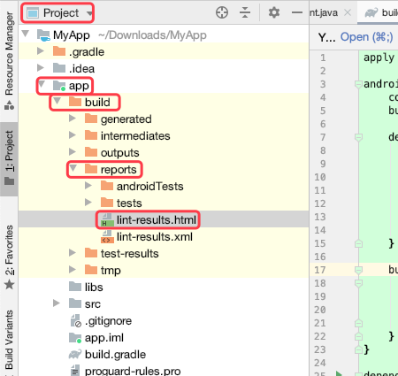

> check 过程中如果出现 Error , 就会终止，但也会对已经检查过的内容生成一份检查报告。通过查阅 `lint-results.html` 可以非常方便的查看和解决对应的问题，html 界面中的内容如下：

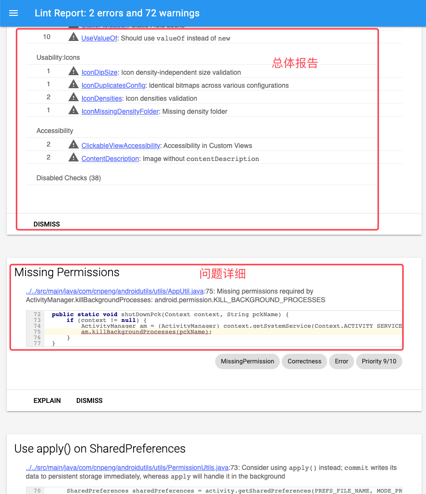

### 2.2.3 AndroidStudio

AndroidStudio 中自带 Gradle 面板，双击其中的任务即可执行。

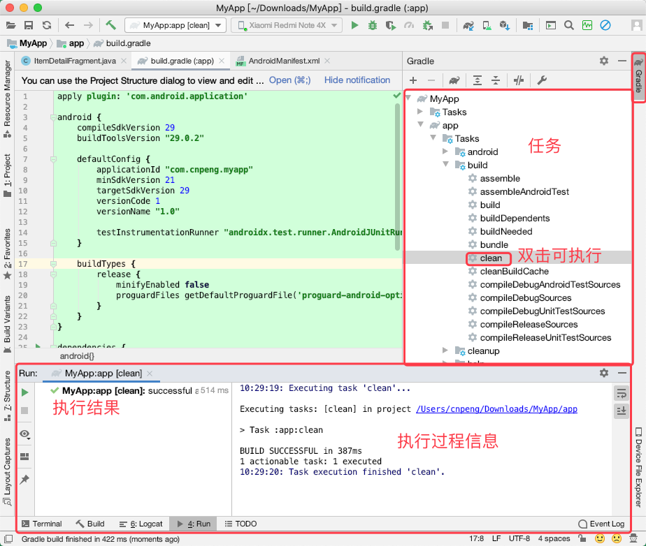

另外，AndroidStudio 中也自带 Terminal 终端面板，我们也可以在其中执行对应的命令。

AndroidStudio 支持修改终端对应的软件，如下：

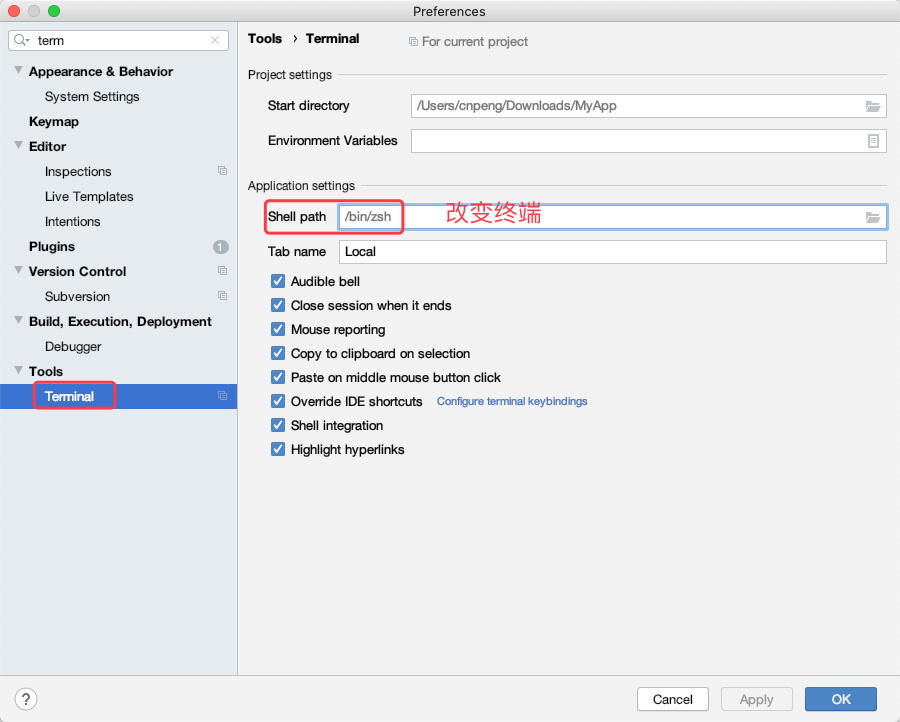

## 2.3 自定义构建

我们修改了 `.gradle` 文件后，要及时同步项目，如下：

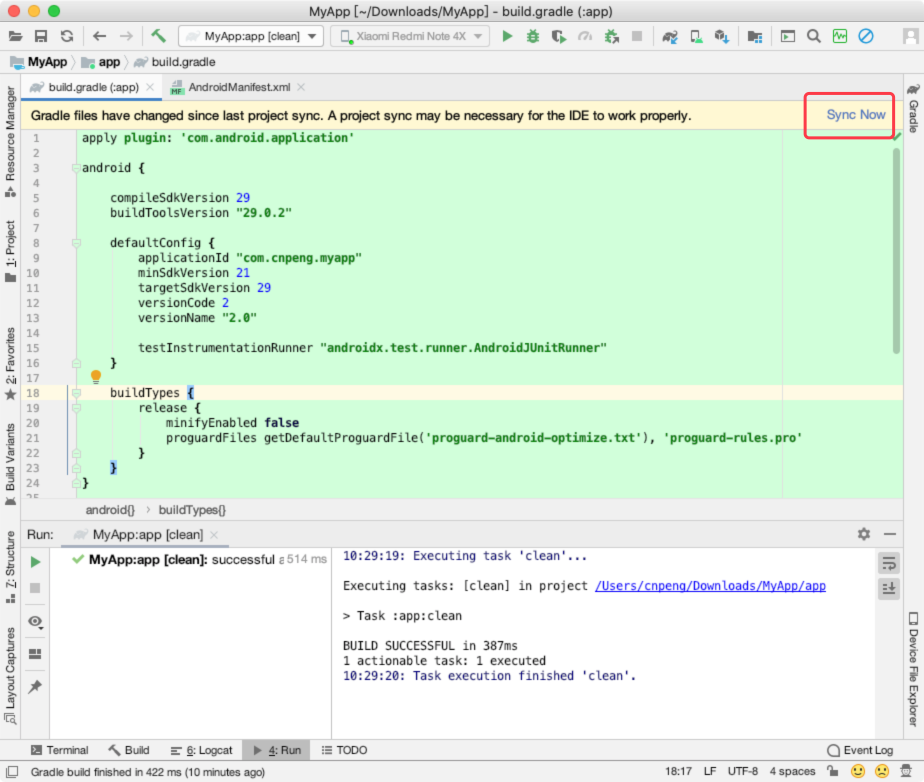

> 在底层，AndroidStudio 的同步实际上运行了 `generateDebugSources` 任务来生成所有必需的类。

### 2.3.1 操控 manifes 文件

我们可以直接通过构建文件而不是 manifest 文件来配置 `applicationId`、`minSdkVersion`、`targetSdkVersion`、`versionCode` 和 `versionName`，另外，下列属性也是我们可以操控的 ：

* `testApplicationId` 针对 instrument 测试 APK 的 applicationId
* `testInstrumentationRunner` JUnit 测试运行期的名称，被用来运行测试（详情见第六章）
* `signingConfig`  签名配置信息（详见第四章）
* `proguardFile` 和 `proguardFiles` 混淆规则文件（详见第九章）

在 AndrodiStudio 中可以通过 `Project Structure` 面板方便的修改相关 gradle 属性，如下图：

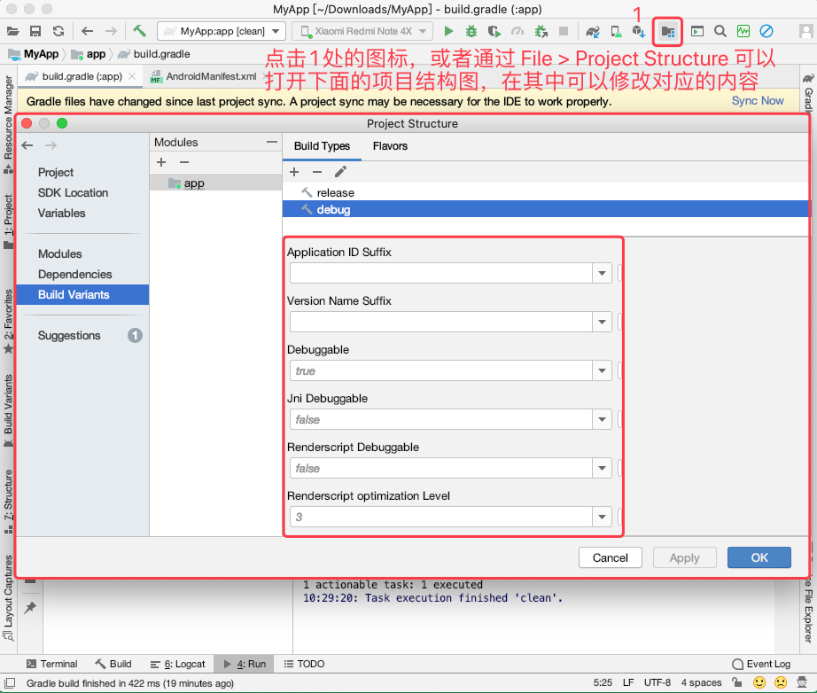

### 2.3.2 BuildConfig 和资源

在 AndroidStudio 中，当我们执行完 build 相关的任务后，就会自动生产一个 `BuildConfig.java` 的类，其中生成的字段对应我们在模块的 `build.gradle` 配置的内容，如下：

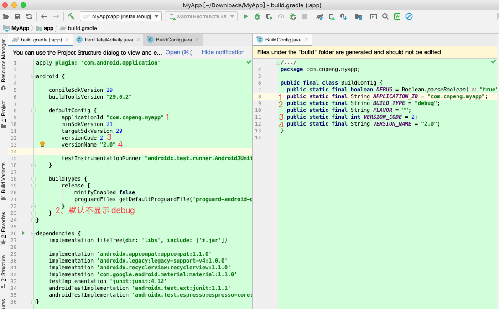

#### 2.3.2.1 添加字段

我们可以通过定制模块的 `build.gradle` 文件中的 `buildTypes` 代码块，实现在不同环境下拥有不同的常量：

```java
buildTypes {
    release {
        minifyEnabled false
        proguardFiles getDefaultProguardFile('proguard-android-optimize.txt'), 'proguard-rules.pro'
        buildConfigField("String","API_URL","\"https://github.com/CnPeng\"")
        buildConfigField("boolean","DEBUG_ENABLE","false")
    }

    debug{
        buildConfigField("String","API_URL","\"https://www.jianshu.com/u/414acf7abc2b\"")
        buildConfigField("boolean","DEBUG_ENABLE","true")
    }
}     
```

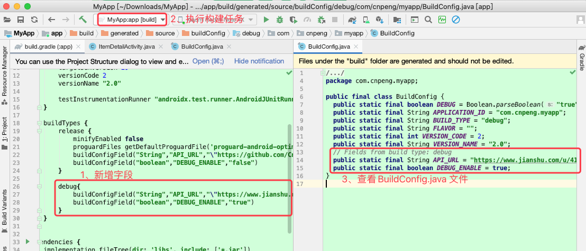

通过上面的定义，我们在代码中就可以直接使用 `BuildConfig.API_URL` 和 `BuidlConfig.DEBUG_ENABLE` 这两个字段了，他们在不同的构建类型中就拥有了不同的值。

> 在上面的代码块中 `buildConfigField(String,String,String)` 方法用来添加构建文件中的字段。三个参数均为字符串，第一个参数为数据类型，对应 java 中的数据类型，但需要用双引号包裹；第二个参数我字段名；第三个参数为字段值，也要用双引号包裹，如果值本身就是字符串则需要使用转义，示例：`"\"https://www.jianshu.com/u/414acf7abc2b\""`.

#### 2.3.2.2 定义资源

模块的 `build.gradle` 中还支持自定义资源值。在此处定义的资源值与定义 `rea/values` 目录下  `strings.xml` 等文件中的资源值等效，引用方式也一致。

比如，我们想让不同构建类型的项目拥有不同的名称，就可以通过如下方式实现：

先删除 `strings.xml` 中的 ` <string name="app_name">MyApp</string>` ，

然后修改模块 ` build.gradle` 中的内容，如下：

```java
 buildTypes {
        release {
 		// 其他内容省略
            resValue("string","app_name","MyApp")
        }

        debug{
           // 其他内容省略
            resValue("string","app_name","MyApp_Debug")
        }
    }
```

`AndroidManifest.xml` 中的引用方式不变，依旧使用 `@string/app_name` ，如下：

```xml
<?xml version="1.0" encoding="utf-8"?>
<manifest xmlns:android="http://schemas.android.com/apk/res/android"
    package="com.cnpeng.myapp">

    <application
        android:allowBackup="true"
        android:icon="@mipmap/ic_launcher"
        android:label="@string/app_name"
        android:roundIcon="@mipmap/ic_launcher_round"
        android:supportsRtl="true"
        android:theme="@style/AppTheme">
       // 其他内容省略
    </application>
</manifest>
```

这样，当我们把 App 安装到手机后，开发版（Debug）的 App 名字就是  MyApp_Debug；生产版（Release）的 App 名字就是 MyApp 

### 2.3.3 项目范围的设置

> 项目根目录下的 build.gradle 文件我们称为顶层构建文件，每个模块（module）中的 build.gradle 我们称为模块的构建文件。
 
我们可以在项目的 `build.gradle` 文件中（顶层构建文件）添加含有自定义属性的 ext 代码块： 
 
```java
// 在文件的根节点下添加如下内容，与 buildscript{}、allprojects{} 平级
ext {
     VERSION_CODE = 2
     VERSION_NAME = "1.0.2"
     VERSION_COMPILE_SDK = 29
     VERSION_BUILD_TOOLS = "29.0.2"
}
``` 
然后我们就可以在模块的构建文件中使用这些属性了，如 ：

```java
apply plugin: 'com.android.application'

android {
    compileSdkVersion rootProject.ext.VERSION_COMPILE_SDK
    buildToolsVersion VERSION_BUILD_TOOLS
    // 其他内容省略
}

// 其他内容省略
```

在上面的代码中，我们引用顶层构建文件中的扩展属性时，可以加上 `rootProject.ext` 前缀，也可以省略该前缀直接使用属性。（基于 AndroidStudio 3.6.3，gradle 5.6.4，android-gradle 3.6.3）
 
 
### 2.3.4 项目属性

#### 2.3.4.1 自定义属性的方式

定义属性的方式有很多中，常用的有：

* `ext` 代码块
* `gradle.properties` 文件
* `-P` 命令行参数

在顶层构建文件中通过 ext 添加自定义属性：

```java
ext {
     greet1 = "Hello from build.gradle"
 }
```

在项目根目录的 `gradle.properties` 中添加自定义属性：

```java
greet2 = Hello from gradle.properties
```

为了测试这两个自定义属性，我们先在顶层构建文件中自定义一个任务：

```java
task printCusProperties() {
    println(greet1)
    println(greet2)
    if (project.hasProperty('greet3') ) {
        println(greet3)
    }
}
```

如果我们通过命令行执行该任务，那么就可以在执行任务的同时通过 `-P` 增加 `greet3` 属性，如下：

```java
gradlew printCusProperties -Pgreet3='Hello from cmd'
```

运行示意图如下：

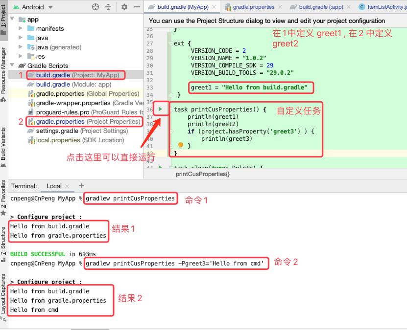

#### 2.3.4.2 属性覆盖

我们可以同时在顶层构建文件和模块的构建文件中定义属性，但是，**如果属性重复，则模块中的属性会覆盖顶层中的属性。**

先在顶层构建文件中定义如下属性：

```java
ext {
     VERSION_NAME = "1.0.2"
 }
```

然后在模块构建文件中定义重名属性：

```java
ext{
    VERSION_NAME = "2.0.1"
}
```

然后我们在模块构建文件中引用 `VERSION_NAME `

```java
android {
    // 其他内容省略
    defaultConfig {
        versionName VERSION_NAME
        // 其他内容省略
    }
}    
```

然后在 Activity 的 `onCreate` 方法中添加如下日志：

```java
Log.d("ddd", BuildConfig.VERSION_NAME);
```

我们运行该 Activity 后，通过日志可以发现，使用的是模块中定义的 VERSION_NAME。

### 2.3.5 默认的任务

#### 2.3.5.1 默认的任务

如果没有指定任务而直接运行 Gradle 的话，默认会运行 help 任务，即：

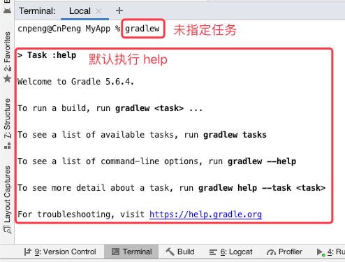

#### 2.3.5.2 自定义默认任务

我们可以在顶层构建文件中设置默认的 gradle 任务，具体代码如下：

```java
//指定默认任务，参数是可变数组，数组内容为任务名称
defaultTasks ('assembleDebug','assembleRelease')
```

此时我们再直接执行 `gradlew` 就会同时执行 `assembleDebug` 和 `assembleRelease` 两个任务。

我们也可以通过运行 tasks 任务和格式化输出命令来查看当前设置的默认任务：

命令：` gradlew tasks | grep "Default tasks"` 

运行示意图：

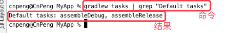
