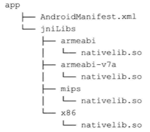
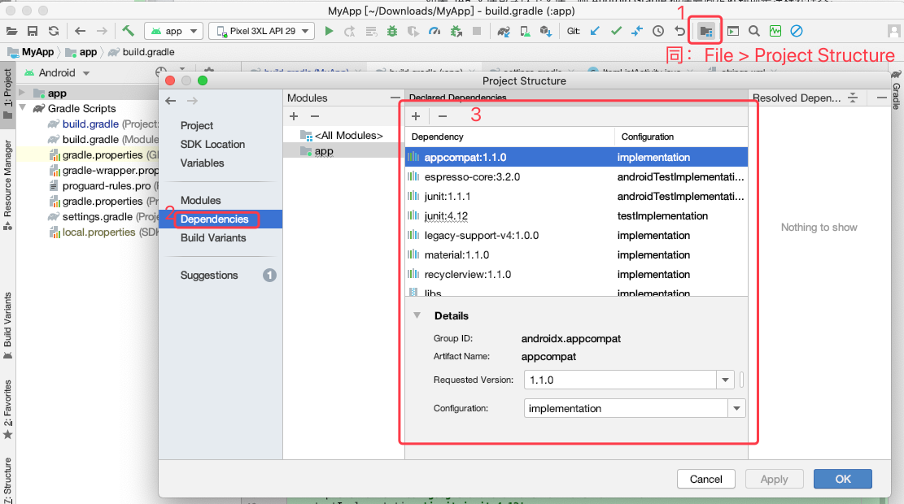

# 三、依赖管理

当我们在 gradle 文件中添加依赖代码之后，Gralde 会自动从远程仓库下载该依赖项，从而让我们的项目可以使用依赖中的类。

如果我们的项目对仓库 A  进行了依赖，而仓库 A 中又对仓库 B 进行了依赖，这种情况被称为**依赖传递**。Gradle 会帮我们处理其中的一些问题。

## 3.1 依赖仓库

在手动管理 jar 包依赖时，我们需要下载 jar 文件，拷贝到 libs 目录，引用它， 然后通常还需要修改其名称体现版本号，还要确保 jar 文件被加入了版本仓库，整体操作比较繁琐。

使用依赖仓库则可以解决上述的问题。

一个依赖仓库可以看做是文件的集合。

默认情况下，Gradle 并没有为我们的项目定义任何依赖仓库，所以需要手动在顶层构建文件的 `repositories` 代码块中进行添加。但是，在 AndroidStudio 的顶层构建文件中则默认为我们添加两个依赖仓库，即：

```java
buildscript {
    repositories {
        google()
        jcenter()  
    }
    dependencies {
        classpath 'com.android.tools.build:gradle:3.6.3'
    }
}

allprojects {
    repositories {
        google()
        jcenter()    
    }
}
```

Gradle 支持三种不同的依赖仓库：Maven、Ivy 和 静态文件或文件夹。在执行构建时，Gradle 会主动将我们声明的依赖项从依赖仓库中下载，并进行本地缓存。

一个依赖项通常由三部分元素组成： group 、name 和 version。

* `group` ：指定创建该依赖库的组织，通常是反向域名
* `name` : 是依赖库的唯一标识
* `version` : 指定了被依赖库的版本号

使用上述三个元素，即可在模块的构建文件中声明一个依赖：

```java
dependencies {
	implementation 'com.google.android.material:material:1.1.0'
}
```

上述依赖对应的 Groovy 映射标识为：

```java
dependencies {
	implementation  group: 'com.google.android.material' , name: 'material:1.1.0' , version : '1.1.0'
}
```

### 3.1.1 预定义依赖仓库

Gradle 预定义了三个 Maven 仓库： JCenter、Maven Central 和 本地 Maven 仓库。为了在构建脚本中包含他们，我们需要使用如下代码：

```java
repositories {
        jcenter()
        mavenCentral()
        mavenLocal()
    }
```

Maven Central 和 JCenter 都是远程仓库，通常不会同时使用。 JCenter 使用的比较多，而且是 AndroidStudio 的默认依赖仓库。

> * JCenter 是 Maven Central 的超集，所以当我们切换仓库时，不需要修改已经定义的依赖
> * JCenter 还支持 Https

本地 Maven 仓库时我们已经使用了的所有依赖的本地缓存，我们衣蛾可以自己添加依赖。默认情况下，我们可以在名为 `.m2` 的本地目录下找到依赖仓库。 Linux 和 Mac 中该路径为 `~/.m2` , Windows 中该路径为 `%UserProfile%.m2`。

### 3.1.2 远程仓库

除了标准的 Maven Central 和 JCenter 之外，很多组织和个人喜欢将插件或依赖库放在自有的 Maven 或 Ivy 服务器上，为了在构建中使用这些依赖，我们就需要在 maven 代码块中添加对应的服务器 URL 。

如果该服务器是基于 Maven 的，则参考如下代码块：

```java
allprojects {
    repositories {
        maven {
            url "服务器地址"
        }
    }
}
```

如果服务器是基于 Ivy 的，则参考如下代码：

```java
allprojects {
    repositories {
        ivy {
            url "服务器地址"
        }
    }
}
```

如果我们的团队自己搭建了一套 maven 仓库，我们除了添加服务器地址，还需要添加凭证信息（Ivy 的凭证添加方式相同）：

```java
allprojects {
    repositories {
        maven {
            url "服务器地址"
            credentials{
                username '用户名'
                password '密码'
            }
        }
    }
}
```

> 凭证信息尽量不要直接用明文定义在构建文件中，推荐在 gradle.properties 中定义对应的属性，然后在构建文件中引用。

### 3.1.3 本地仓库

我们可以在自己的硬盘驱动器或者网络驱动器上运行 Maven 和 Ivy 仓库。

要想在构建中添加本地仓库，只需配置一个相对或绝对路径的 URL 即可：

```java
repositories {
        maven {
            url "../repo"
        }
    }
```

## 3.2 本地依赖

某些情况下我们仍然需要手动下载 jar 或原生库；而且，有时我们可能也会创建自己的依赖库，这样我们也可以在多个项目中复用。

对于上述的情况，我们就必须使用本地依赖。

### 3.2.1 文件依赖

我们可以使用 Gradle 提供的 `files` 方法将 JAR 文件添加为依赖：

```java
dependencies {
    implementation files('libs/umeng-common-2.2.5.jar')
}    
```

如果 JAR 文件比较多时，我们可以把他们统一方法 `libs` 目录下，然后使用 `fileTree` 方法添加依赖：

```java
dependencies {
     // 新建的 Android 项目中，默认就会有目录依赖方式
    implementation fileTree( 'libs')
}
```

而在 AndroidStudio 项目中，还加了一层过滤，保证仅依赖 `libs` 目录中的 `jar` 文件：

```java
dependencies {
     // 新建的 Android 项目中，默认就会有目录依赖方式
    implementation fileTree(dir: 'libs', include: ['*.jar'])
}
```

### 3.2.2 原生依赖库

用 C 或 C++ 编写的依赖库可以被编译为特定平台的原生代码，这些原生库通常包含多个 `.so` 文件，可以用于不同的平台。

Android 插件默认支持原生依赖库，我们所需要做的就是在模块层建一个 `jniLibs` 文件夹，然后为我们 App 支持的平台创建对应的子文件夹，然后把对应的 `.so` 文件放置在子文件夹中。如下图：



另外，如果我们没有建立 `jniLibs` , 而是把子文件夹和 `.so` 文件放在了 `libs` 目录下，则需要在模块的构建文件中指定该目录：

```java
android{
 	sourceSets {
 	       main {
            		jniLibs.srcDir 'src/mian/libs'
      	  	}
    }
}    
```

在 Android 项目中，则使用如下方式指定 `jniLibs` 目录：

```java
android{
 	sourceSets {
 	       main {
 	       	 // 这样指定了一个目录数组
            		 jniLibs.srcDirs = ['libs']
      	  	}
    }
}    
```

### 3.2.3 依赖项目

如果想分享一个使用 Android APIs 或 Android 资源的依赖库，就需要创建一个依赖项目。依赖项目将生成 `.aar` 文件，该文件可以被 Android 应用项目用作依赖库。

#### 3.2.3.1 创建和使用依赖项目模块

在该依赖模块的构建文件中需要声明依赖库插件：

```java
apply plugin: 'com.android.library'
```

在应用中使用这种依赖项目时，一种是以模块依赖的方式实现，一种是创建一个可在多个应用中复用的 `.aar` 文件。

当我们在项目中创建了或导入了一个库模块时，首先要在 `setting.gradle` 中声明：

```java
include ':app', ':库模块名称'
```

在 AndroidStudio 中，还需要在应用模块的构建文件中添加依赖：

```java
dependencies {
	implementation project( ':库模块名称')
}	
```

#### 3.2.3.2 使用 `.aar` 文件

如果我们创建了一个依赖库，并且想在不同的 Android 应用中复用，就需要导出 `.aar` 文件，然后将其作为依赖添加到项目中。

在构建依赖库时，生成的 `.aar` 文件会放在 `build/output/aar` 文件中。

为了添加 `.aar` 文件为依赖，需要在用用模块中创建一个文件夹命名为 `aars` ，然后将 `.aar` 文件放在该文件夹中，然后将该文件夹设置为模块的依赖仓库：

```java
repositories {           
     //添加一个本地仓库,指定aar路径，也可以在顶层构建文件中设置
    flatDir {
        dirs 'aars'
    }
}
```

然后在模块构建文件中，添加对 `aar` 文件的依赖：

```java
dependencies {
	//添加一个aar依赖
      implementation (name:'aar文件名称', ext:'aar')  
}
``` 

## 3.3 依赖概念

### 3.3.1 配置

有时我们需要使用只在特定设备上工作的 SDK ，比如特定厂商的蓝牙 SDK。为了编译该代码，我们需要将 SDK 添加到编译类路径。但由于该 SDK 已经在设备上存在，所以我们不需要将它集成到 Apk 中。这就是依赖配置。

> 以下内容参考 [依赖项配置](https://developer.android.google.cn/studio/build/dependencies?hl=zh_cn)

Gradle 将多个依赖添加到配置，并将其命名为集文件。下面时一个 Android 应用或依赖库的标准配置：

* `implementation` : 将依赖项添加到编译类路径，并将依赖项打包到构建输出。当依赖项的 API 变更时，Gradle 仅重新编译该依赖项和直接依赖它的模块。其他模块仅在运行时使用依赖项中的内容。
* `api` ： 将依赖项添加到编译类路径和构建输出，并且会以传递方式将该依赖项导出到其他模块，以便这些模块在运行时和编译时都可以使用该依赖项。如果依赖项中的 api 内容改变了，编译时会重新编译所有有权访问该依赖项的模块
* `runtimeOnly` : 只会将依赖项添加到构建输出，以便在运行时使用
* `compileOnly`: 只会将依赖项添加到编译类路径（也就是说，不会将其添加到构建输出）

以下为 [依赖项配置](https://developer.android.google.cn/studio/build/dependencies?hl=zh_cn) 中的完整摘录：
 
新配置 | 已弃用配置| 行为
---|---|---
implementation |	compile | Gradle 会将依赖项添加到编译类路径，并将依赖项打包到构建输出。不过，当您的模块配置 implementation 依赖项时，会让 Gradle 了解您不希望该模块在编译时将该依赖项泄露给其他模块。也就是说，其他模块只有在运行时才能使用该依赖项。使用此依赖项配置代替 api 或 compile（已弃用）可以显著缩短构建时间，因为这样可以减少构建系统需要重新编译的模块数。例如，如果 implementation 依赖项更改了其 API，Gradle 只会重新编译该依赖项以及直接依赖于它的模块。大多数应用和测试模块都应使用此配置。
api	| compile  | Gradle 会将依赖项添加到编译类路径和构建输出。当一个模块包含 api 依赖项时，会让 Gradle 了解该模块要以传递方式将该依赖项导出到其他模块，以便这些模块在运行时和编译时都可以使用该依赖项。此配置的行为类似于 compile（现已弃用），但使用它时应格外小心，只能对您需要以传递方式导出到其他上游消费者的依赖项使用它。 这是因为，如果 api 依赖项更改了其外部 API，Gradle 会在编译时重新编译所有有权访问该依赖项的模块。 因此，拥有大量的 api 依赖项会显著增加构建时间。除非要将依赖项的 API 公开给单独的模块，否则库模块应改用 implementation 依赖项。
compileOnly  | provided |	Gradle 只会将依赖项添加到编译类路径（也就是说，不会将其添加到构建输出）。如果您创建 Android 模块时在编译期间需要相应依赖项，但它在运行时可有可无，此配置会很有用。如果您使用此配置，那么您的库模块必须包含一个运行时条件，用于检查是否提供了相应依赖项，然后适当地改变该模块的行为，以使该模块在未提供相应依赖项的情况下仍可正常运行。这样做不会添加不重要的瞬时依赖项，因而有助于减小最终 APK 的大小。 此配置的行为类似于 provided（现已弃用）。
runtimeOnly | apk | Gradle 只会将依赖项添加到构建输出，以便在运行时使用。也就是说，不会将其添加到编译类路径。 此配置的行为类似于 apk（现已弃用）。
annotationProcessor	| compile | 要添加对作为注释处理器的库的依赖关系，您必须使用 annotationProcessor 配置将其添加到注释处理器类路径。这是因为，使用此配置可以将编译类路径与注释处理器类路径分开，从而提高构建性能。如果 Gradle 在编译类路径上找到注释处理器，则会禁用避免编译功能，这样会对构建时间产生负面影响（Gradle 5.0 及更高版本会忽略在编译类路径上找到的注释处理器）。<br>如果 JAR 文件包含以下文件，则 Android Gradle 插件会假定依赖项是注释处理器：`META-INF/services/javax.annotation.processing.Processor`。 如果插件检测到编译类路径上包含注释处理器，则会生成构建错误。
lintChecks| | 使用此配置可以添加您希望 Gradle 在构建项目时执行的 lint 检查。注意：使用 Android Gradle 插件 3.4.0 及更高版本时，此依赖项配置不再将 lint 检查打包在 Android 库项目中。要将 lint 检查依赖项包含在 AAR 库中，请使用下面介绍的 lintPublish 配置。
lintPublish | | 在 Android 库项目中使用此配置可以添加您希望 Gradle 编译成 lint.jar 文件并打包在 AAR 中的 lint 检查。这会使得使用 AAR 的项目也应用这些 lint 检查。如果您之前使用 lintChecks 依赖项配置将 lint 检查包含在已发布的 AAR 中，则需要迁移这些依赖项以改用 lintPublish 配置。示例代码如下：
```java
    dependencies {
      // Executes lint checks from the ':checks' project
      // at build time.
      lintChecks project(':checks')
      // Compiles lint checks from the ':checks-to-publish'
      // into a lint.jar file and publishes it to your
      // Android library.
      lintPublish project(':checks-to-publish')
    }
```

此外，还包括 `testImplementation`、`debugImplementation` 等

### 3.3.2 语义化版本

版本化是依赖管理的重要部分。

将依赖添加到 JCenter 等依赖仓库时，约定遵循了一套版本化规则，我们称之为语义化版本。

在语义化版本中，版本数字的格式一般为 ：`major.minor.patch`, 对应的数据按如下规则依次增加：

* 当做不兼容的 Api 变更时，major 版本增加
* 当以向后兼容的方式添加功能时，minor 版本增加
* 当修复一些 Bug 时， patch 版本增加。

### 3.3.3 动态化版本

如果我我们希望在每次构建应用或者依赖包时，都能获取到最新版本，就需要使用动态化版本。

动态化版本的使用方式有多种，如：

```java
dependencies {
    // 获取最新的 patch 版本
    implementation 'androidx.appcompat:appcompat:1.1.+'
    
    // 获取最新的 minor 版本，且 minor 版本至少是 1
    implementation 'androidx.recyclerview:recyclerview:1.1+'
    
    // 获取最新版本
    implementation 'androidx.legacy:legacy-support-v4:+'
}
```

在使用动态版本时，需要格外小心，因为获取到的新版本不一定稳定。

## 3.4 AndroidStudio

在 AndroidStudio 中通过 Project Structure 可以很方便的添加和管理依赖。如下图：

