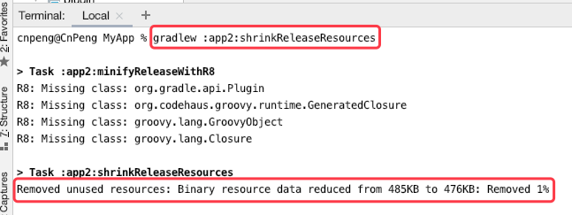
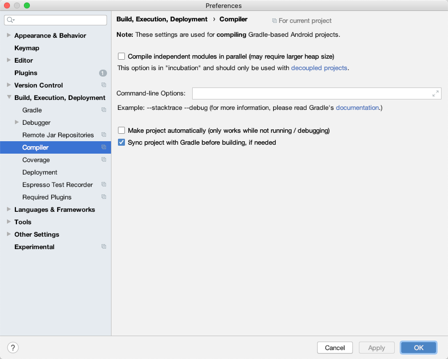
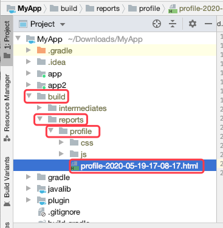
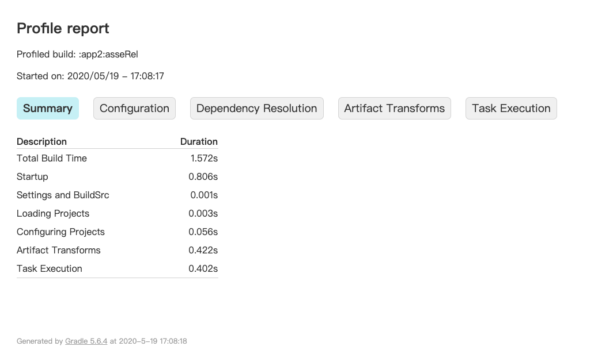

# 九、高级自定义构建

## 9.1 减少 Apk 文件大小

### 9.1.1 ProGuard

ProGuard 是一个 Java 工具，它可以减小 Apk 体积，可以在编译期优化、混淆和预校验代码，可以找到未被使用的代码并删除。

在 Android 项目中，在模块的 `build.gradle` 中可以通过如下代码启用 ProGuard : 

```groovy
android {
	buildTypes {
          release {
            		minifyEnabled true
            		proguardFiles getDefaultProguardFile('proguard-android-optimize.txt'), 'proguard-rules.pro'
        }
    }
}
```

当 `minifyEnabled ` 的值被设置为 true 之后，就表示启用了 ProGuard，在构建过程中就会触发 `proguardRelease` 任务。

`getDefaultProguardFile('proguard-android-optimize.txt')` 方法从 Android SDK  的 `tools/proguard` 目录下查找并读取 `proguard-android-optimize.txt` 文件中的 ProGuard 设置。该文件是默认的 ProGuard 设置文件。

在 AndroidStudio 中创建模块时默认就会添加一个 `proguard-rules.pro` 文件，我们通常会在该文件中定义应用到该模块的一些 ProGuard 设置。

启用 ProGuard 之后，最好做一次 App 的全量测试，因为 ProGuard 可能会移除一些被间接调用的代码。为了解决该问题，我们也可以定义 ProGuad 规则，指定不需要被删除或者混淆的类。如：

```groovy
-keep public class MyClass
```

[点击查看官方对 Proguard 的更多介绍](https://developer.android.com/studio/build/shrink-code)

### 9.1.2 缩减资源

进行 App 打包时，Gradle 和 Gradle 的 Android 插件可以在构建期间删除所有未使用的资源。也就是说，如果我们有旧的未使用的代码忘记删除，Gradle 会主动帮我们删除。另外，当我们引入了一个拥有很多资源的依赖库但我们仅使用用其中一小部分时，资源缩减也可以帮助我们删除未使用的内容。

资源缩减分为手动缩减和自动缩减。

#### 9.1.2.1 自动缩减

开启自动缩减时，设置 `shrinkResources true` 后，必须也要设置  `minifyEnabled true ` , 如下：

```groovy
android {
	buildTypes {
        release {
            shrinkResources true
            minifyEnabled true
            proguardFiles getDefaultProguardFile('proguard-android-optimize.txt'), 'proguard-rules.pro'
        }
}
```

如果 `shrinkResources` 和 `minifyEnabled true ` 的值不一致，就会报错：`Removing unused resources requires unused code shrinking to be turned on`

* 通过 `shrinkReleaseResources` 任务可以查看启用资源压缩之后的压缩效果，如下图：



* `clean assembleRelease -info` 可以查看 Apk 资源缩减的概览。Gradle 会打印出许多关于构建过程的额外信息，包括最终构建不会输出的每个资源。

自动缩减资源存在一个问题：可能会移除过多的资源，特别是那些被动态调用的资源可能会被移除。为了避免该情况，我们就需要在 `res/raw/` 目录下的 `keep.xml` 文件中定义这些不需要被移除的内容，如：

```xml
<?xml version="1.0" encoding="utf-8"?>
<resources xmlns:tools="http://schemas.android.com/tools"
    tools:keep="@layout/keep_me , @layout/also_used_*" />
```

`keep.xml` 文件本身也将从最终的结果中被剥离出来。

#### 9.1.2.2 手动缩减

当删除某种语言文件或某个密度的图片时，通常就需要手动缩减。

比如，我们引入某个三方库，其中包含了多种语言，但是我们的应用仅支持其中的一两种语言，如果我们不过滤掉多余的内容就会浪费很多资源。此时，我们就可以使用  `resConfigs` 属性来配置想保留的资源.

假如我们想仅想保留英语、丹麦语、荷兰语的字符串，可以使用如下代码实现：

```groovy
android {
	defaultConfig {
        resConfigs "en","da","nl"
      }  
}
```

>注意：原书中说假如我们仅想保留指定密度的图片资源，可以使用如下代码实现，

>```groovy
android {
	defaultConfig {
        resConfigs "hdpi","xhdpi"
      }  
}
```
>
但实际运行时会报如下错误：Cannot filter assets for multiple densities using SDK build tools 21 or later. Consider using apk splits instead.

>也就是说，`buildToolsVersion` 大于 21 时，不能再使用 resconfigs 来过滤图片资源，而应该使用 apk splits，即 9.5 中的内容。


## 9.2 加速构建

相对于 Ant 来说，Gradle 的构建时间比较长，因为每执行一个任务时，Gradle 都要执行构建声明周期中的三个阶段。

### 9.2.1 Gradle 参数

通过修改 Gradle 的一些默认参数，可以提升 Gradle 构建速度。

#### 9.2.1.1 并行构建

在项目根目录的 `gradle.properties` 中增加如下代码可开启并行构建：

```groovy
# 开启 gradle 并行构建，提升多模块项目的构建速度
org.gradle.parallel = true
```

#### 9.2.1.2 启用守护进程

在项目根目录的 `gradle.properties` 中增加如下代码可启用守护进程：

```groovy
# 启用守护线程，AS 中默认开启
org.gradle.daemon = true
```

增加上述代码之后，首次构建时就可以开启一个守护进程，下一次在执行构建时会复用该进程从而缩短启动时间，该进程空闲三小时后会被终止。

AndroidStudio 中默认开启守护进程。

#### 9.2.1.3 调整 Java 虚拟机参数

Gradle 中有一个叫作 `jvmargs` 的属性可以让我们为 JVM 的内存分配池设置不同的值。对构建速度有直接影响的两个参数是：`Xms（设置初始内存大小）` 和 `Xmx（设置最大内存）`，其单位为：`k (千字节)、m (兆字节)、g (千兆字节)`

我们可以在项目根目录的 `gradle.properties` 文件中进行设置，如：

```groovy
org.gradle.jvmargs = -Xms1024m  -Xmx1536m
```

Xms (初始分配内存) 默认情况下没有被设置。

我们可以根据计算机的配置动态调整上述设置。

#### 9.2.1.4 `configureondemand`

当项目中有多个模块时，还可以通过 `org.gradle.configureondemand` 提升构建速度。其作用是：忽略正在执行的 task 不需要的模块，从而缩减在配置阶段的时间。该属性设置为 true 之后，Gradle 将在进入配置阶段之前判断哪些模块的配置改变了，哪些没有改变。

如果项目中仅有一个 Android 应用和一个依赖库时，该属性没有效用；如果项目中有很多松散耦合的模块，则该属性可以节省大量构建时间。

该属性也是配置在根目录的 `gradle.properties` 文件中，如下：

```groovy
# 构建时忽略没有改变的内容，从而提升构建速度
org.gradle.configureondemand = true
```

#### 9.2.1.5 将修改后的 Gradle 属性应用到所有项目

如果我们想将上面修改的这些属性应用到所有基于 Gradle 的项目，则可以在 home 目录的 `.gradle` 文件夹下创建一个 `gradle.properties` 文件，然后在其中编辑上述属性。

在 Windows 系统中，该目录的完整路径是：`%UserProfile%\.gradle` ；Linux 和 Mac OS 系统中，该目录的路径为：`~/.gradle`

### 9.2.2 AndroidStudio 

在 AndroidStudio 中可以通过 `Proferences -> Buidd,Excution,Deployment -> Compiler` 提供的界面设置 Gradle 的一些参数信息。如下：

 

### 9.2.3 Profiling

执行构建任务时在命令末尾添加 `--profile`，这样任务执行完成后就可以得到一份分析报告，通过该报告我们可以分析出哪一部分的构建最为费时，从而确定修改方案。

分析报告文件默认放置在项目根目录的 `build/reports/profile` 目录下，如图：



报告的详细内容如下：



### 9.2.4 Jack 和 Jill

根据 [Future of Java 8 Language Feature Support on Android](https://android-developers.googleblog.com/2017/03/future-of-java-8-language-feature.html) 中的描述，Jack 和 Jill 应该已经被废弃了，所以，不再研究。

## 9.3 忽略 Lint

当我们通过 Gradle 执行 release 构建时，会自动执行 Lint 检查。Lint 是一种静态代码分析工具，会标记布局文件及 Java 代码中潜在的 Bug 。默认情况下， 如果检测到异常，就会阻塞构建进程，所以需要忽略 Lint 过程中的错误信息，直到构建过程执行完毕。

在模块的 `build.gradle` 文件中作如下设置：

```groovy
android {
    lintOptions {
              abortOnError false
    }
}
```

## 9.4 在 Gradle 中使用 Ant

> 该内容在开发中暂时没有接触到，暂时不做总结，后续用到时再看书

### 9.4.1 在 Gradle 中运行 Ant 任务

### 9.4.2 导入整个 Ant 脚本

### 9.4.3 属性

## 9.5 高级应用部署

> 该内容在开发中暂时没有接触到，暂时不做总结，后续用到时再看书

### 9.5.1 分割 APK