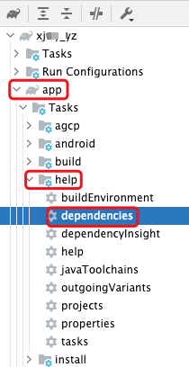
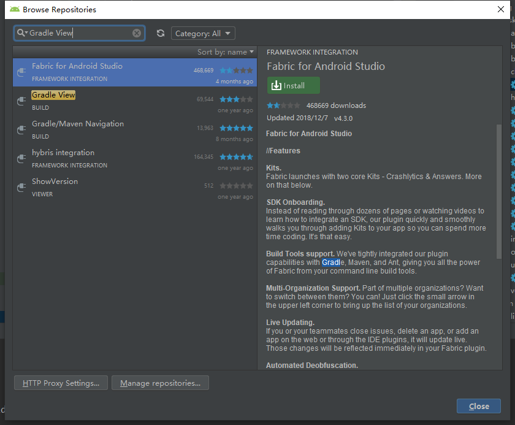
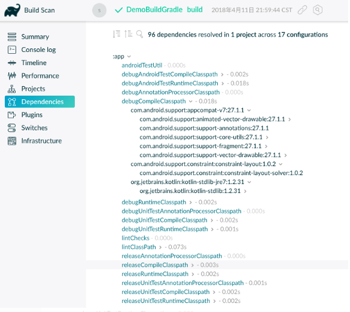
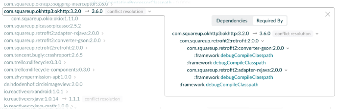

## 1. 查看Android Gradle 依赖树

### 1.1. 方式一:使用命令

命令格式：`./gradlew :模块名:dependencies` //查看单独模块的依赖

命令格式2：`./gradlew :模块名字:dependencies > 文件名字.txt` //将依赖信息导出到文本


#### 1.1.1. 查看全部依赖

* `./gradlew :app:dependencies`

#### 1.1.2. 仅查看 implementation

这个命令会将 gradle 执行的各个步骤全打印出来，包括引用的库，和库中引用的库文件

* `./gradlew :app:dependencies --configuration implementation`

可以配置 configuration 参数只查看 implementation 的依赖树。

```bash
------------------------------------------------------------
Project :app
------------------------------------------------------------

implementation - Implementation only dependencies for 'main' sources. (n)
+--- org.jetbrains.kotlin:kotlin-android-extensions-runtime:1.4.20 (n)
+--- unspecified (n)
+--- androidx.appcompat:appcompat:1.1.0 (n)
+--- com.google.android.material:material:1.2.1 (n)
+--- androidx.constraintlayout:constraintlayout:2.0.4 (n)
+--- org.jetbrains.kotlin:kotlin-stdlib:1.4.20 (n)
+--- androidx.core:core-ktx:1.3.2 (n)
+--- org.jetbrains.kotlinx:kotlinx-coroutines-core:1.4.1 (n)
+--- org.jetbrains.kotlinx:kotlinx-coroutines-android:1.4.1 (n)
+--- com.android.volley:volley:1.1.1 (n)
+--- com.google.code.gson:gson:2.8.6 (n)
\--- com.github.bumptech.glide:glide:4.8.0 (n)

(n) - Not resolved (configuration is not meant to be resolved)
```

#### 1.1.3. 仅查看 compile

* 查看某个依赖库中的依赖 compile

`./gradlew :app:dependencyInsight --dependency <依赖名> --configuration compile`

[参考使用Gradle查看Android项目中库的依赖关系](https://blog.csdn.net/weixin_33851604/article/details/87997721)

```bash
$ ./gradlew :app:dependencyInsight --dependency fastjson --configuration compile

:app:dependencyInsight
com.android.support:support-annotations:25.3.1
+--- com.afollestad.material-dialogs:core:0.9.4.5
|    \--- compile
+--- com.android.support:appcompat-v7:25.3.1
|    +--- compile
|    +--- com.android.support:design:25.3.1
|    |    \--- compile
|    +--- com.afollestad.material-dialogs:core:0.9.4.5 (*)
|    \--- me.zhanghai.android.materialprogressbar:library:1.4.1
|         \--- com.afollestad.material-dialogs:core:0.9.4.5 (*)
+--- com.android.support:recyclerview-v7:25.3.1
|    +--- compile
|    +--- com.android.support:design:25.3.1 (*)
|    \--- com.afollestad.material-dialogs:core:0.9.4.5 (*)
+--- com.android.support:support-compat:25.3.1
|    +--- com.android.support:support-v4:25.3.1
|    |    +--- compile
|    |    +--- com.android.support:appcompat-v7:25.3.1 (*)
|    |    +--- com.android.support:design:25.3.1 (*)
|    |    +--- com.alibaba:arouter-api:1.2.1.1
|    |    |    \--- compile
|    |    +--- com.android.support:transition:25.3.1
|    |    |    \--- com.android.support:design:25.3.1 (*)
|    |    \--- com.android.support:support-v13:25.3.1
|    |         \--- com.afollestad.material-dialogs:core:0.9.4.5 (*)
|    +--- com.android.support:recyclerview-v7:25.3.1 (*)
|    +--- com.android.support:support-vector-drawable:25.3.1
|    |    +--- com.android.support:appcompat-v7:25.3.1 (*)
|    |    \--- com.android.support:animated-vector-drawable:25.3.1
|    |         \--- com.android.support:appcompat-v7:25.3.1 (*)
|    +--- com.android.support:support-media-compat:25.3.1
|    |    +--- com.android.support:support-v4:25.3.1 (*)
|    |    \--- com.android.support:support-fragment:25.3.1
|    |         \--- com.android.support:support-v4:25.3.1 (*)
|    +--- com.android.support:support-core-utils:25.3.1
|    |    +--- com.android.support:support-v4:25.3.1 (*)
|    |    \--- com.android.support:support-fragment:25.3.1 (*)
|    +--- com.android.support:support-core-ui:25.3.1
|    |    +--- com.android.support:support-v4:25.3.1 (*)
|    |    +--- com.android.support:recyclerview-v7:25.3.1 (*)
|    |    \--- com.android.support:support-fragment:25.3.1 (*)
|    \--- com.android.support:support-fragment:25.3.1 (*)
+--- com.android.support:support-core-ui:25.3.1 (*)
+--- com.android.support:support-core-utils:25.3.1 (*)
+--- com.android.support:support-media-compat:25.3.1 (*)
+--- com.android.support:support-v13:25.3.1 (*)
+--- com.android.support:support-vector-drawable:25.3.1 (*)
+--- com.android.support:transition:25.3.1 (*)
\--- me.zhanghai.android.materialprogressbar:library:1.4.1 (*)

(*) - dependencies omitted (listed previously)

BUILD SUCCESSFUL
```

#### 1.1.4. 查看某个依赖库中的implamation

`./gradlew :app:dependencyInsight --configuration debugCompileClasspath --dependency <依赖名>`

[参考 Gradle 理解：configuration、dependency](https://juejin.cn/post/6844904088446959623)

```bash
$ ./gradlew :app:dependencyInsight --configuration debugCompileClasspath --dependency gson


> Task :app:dependencyInsight

com.google.code.gson:gson:2.8.6
   variant "compile" [
      org.gradle.status                              = release (not requested)
      org.gradle.usage                               = java-api
      org.gradle.libraryelements                     = jar (not requested)
      org.gradle.category                            = library (not requested)

      Requested attributes not found in the selected variant:
         com.android.build.api.attributes.BuildTypeAttr = debug
         org.jetbrains.kotlin.platform.type             = androidJvm
   ]
   Selection reasons:
      - By constraint : debugRuntimeClasspath uses version 2.8.6

com.google.code.gson:gson:2.8.6
\--- debugCompileClasspath

com.google.code.gson:gson:{strictly 2.8.6} -> 2.8.6
\--- debugCompileClasspath

A web-based, searchable dependency report is available by adding the --scan option.
```

### 1.2. 方式二:使用 Gradle Project 面板




### 1.3. 方式三: 安装Android Studio插件

[gradle view](https://github.com/rholder/gradle-view)



### 1.4. 方式四:`./gradlew build --scan`

执行 `./gradlew build --scan` 后，在终端的末尾会看到如下文本提示：

```
Publishing a build scan to scans.gradle.com requires accepting the Terms of Service defined at https://scans.gradle.com/terms-of-service. Do you accept these terms? [yes, no]
```

输入 yes 同意，将会出现一个网页地址，登录该网址：



该网页还提供冲突提示，列出了引用了此类库的类库，效果如下:




## 2. 补充

### 2.1. 权限不足的修复

```
gradlew -q moudle名称:dependencies
```

如果提示：

```
./gradlew: Permission denied
```

则先执行：

```
//修改 gradlew的读取权限为可读可写可执行
chmod +x gradlew
```


## 3. 参考

* [参考：Android 查看项目依赖树的四种方式](https://links.jianshu.com/go?to=https%3A%2F%2Fwww.cnblogs.com%2Fsongjianzaina%2Fp%2F11286926.html)
* [参考：使用Gradle查看Android项目中库的依赖关系](https://www.jianshu.com/p/61333820126d)
* [参考：使用Gradle查看Android项目中库的依赖关系](https://blog.csdn.net/weixin_33851604/article/details/87997721)
* [参考：Gradle 理解：configuration、dependency](https://juejin.cn/post/6844904088446959623)