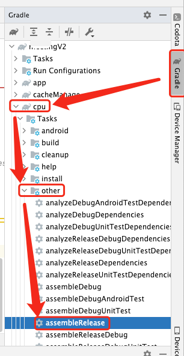

# 1. 007-Android打包AAR，并输出到指定目录

[原文链接：](https://juejin.cn/post/6844903849434546190)

在模块化开发中，有时需要将独立功能模块打包输出。

> 注意：本例子在 Android 插件 3.2.0 上运行，在 3.3+ 需要修改为 `Provider` 方式获取 `variant`

## 1.1. 定义 common.gradle

编写打包脚本，放在 `common.gradle` 文件中

```groovy
// common.gradle

gradle.ext.dependencieInfo = []

/**
 * 获取时间 yyyyMMdd
 * @return 时间字符串
 */
static String releaseTime() {
    return new Date().format("yyyyMMdd", TimeZone.getDefault())
}

/**
 * 获取时间 yyyyMMdd
 * @return 时间字符串
 */
static String getFormatDate() {
    return new Date().format("yyyyMMdd_HHmmss", TimeZone.getDefault())
}

static def getGitHeadRefsSuffix() {
    try {
        // .git/HEAD描述当前目录所指向的分支信息，内容示例："ref: refs/heads/master\n"
        def headFile = new File('.git/HEAD')
        if (headFile.exists()) {
            String[] strings = headFile.getText('UTF-8').split(" ")
            if (strings.size() > 1) {
                String refFilePath = '.git/' + strings[1]
                // 根据HEAD读取当前指向的hash值，路径示例为：".git/refs/heads/master"
                def refFile = new File(refFilePath.replace("\n", ""))
                // 索引文件内容为hash值+"\n"，
                // 示例："90312cd9157587d11779ed7be776e3220050b308\n"
                return refFile.getText('UTF-8').substring(0, 7)
            }
        }
    } catch (Exception e) {
        e.printStackTrace()
    }
    return ""
}

// 打包aar
void packagingAAR(project, android) {
    android.libraryVariants.all { variant ->
        if (variant.buildType.name == "release") {
            // 修改aar名称
            variant.outputs.all { output ->
                outputFileName = "${project.name}-V${android.defaultConfig.versionName}_${android.defaultConfig.versionCode}-${getGitHeadRefsSuffix}-${getFormatDate()}${isEmpty(variant.flavorName) ? "" : "-${variant.flavorName}"}-${variant.buildType.name}.aar"
            }
            // 复制aar到指定目录
            variant.assemble.doLast {
                variant.outputs.all { output ->
                    // 输出目录在：项目目录/build/outputs/aar/日期-gitCommit/
                    def outputPath = [project.rootDir.absolutePath, "build", "outputs", "aar", releaseTime() + "-" + getGitHeadRefsSuffix()].join(File.separator)
                    copy {
                        from output.outputFile
                        into outputPath
                    }
                    // 输入依赖语句
                    gradle.dependencieInfo.add("api(name: '${output.outputFile.name.replace('.aar', '')}', ext: 'aar')")
                    println("${gradle.dependencieInfo.join("\n")}")
                }
            }
        }
    }
}

ext {
    // yyyyMMdd 时间
    releaseTime = this.&releaseTime
    // yyyyMMdd_HHmmss 时间
    getFormatDate = this.&getFormatDate
    // 获取当前git commit点
    getGitHeadRefsSuffix = this.&getGitHeadRefsSuffix
    // 打包AAR
    packagingAAR = this.&packagingAAR
}
```

## 1.2. 引用 common.gradle

* 在项目 `build.gradle` 引入 `common.gradle`。引入后可以在其他模块中使用 `common.gradle` 中的方法。

```groovy
// 根目录 build.gradle
apply from: "common.gradle"

buildscript {
    repositories {
        jcenter()
        mavenCentral()
        google()
    }
    dependencies {
        classpath 'com.android.tools.build:gradle:3.2.0'
        // NOTE: Do not place your application dependencies here; they belong
        // in the individual module build.gradle files
    }
}

allprojects {
    repositories {
        jcenter()
        google()
    }
}
```

* 在 lib 模块 `build.gradle` 使用

```groovy
apply plugin: 'com.android.library'

android {
    compileSdkVersion rootProject.ext.android.compileSdkVersion

    defaultConfig {
        minSdkVersion rootProject.ext.android.lowMinSdkVersion
        targetSdkVersion rootProject.ext.android.targetSdkVersion
        versionCode 1
        versionName "1.0"
    }

    buildTypes {
        release {
            minifyEnabled false
            proguardFiles getDefaultProguardFile('proguard-android-optimize.txt'), 'proguard-rules.pro'
        }
    }

    // 调用定义在 common.gradle 中的 aar 打包配置
    packagingAAR(project, android)
}

dependencies {

}
```

## 1.3. 打包aar

### 1.3.1. 使用命令打包

在 Terminal 中使用命令打包输出 aar:

```groovy
gradlew :xxxa:assembleRelease :xxxb:assembleRelease
```

上述命令中，`xxxa` 和 `xxxb` 都是需要打包的 `library` 名称。


### 1.3.2. 使用 gradle 面板打包

基于 AndroidStudio 右侧的 gradle 面板打包，示例如下：


